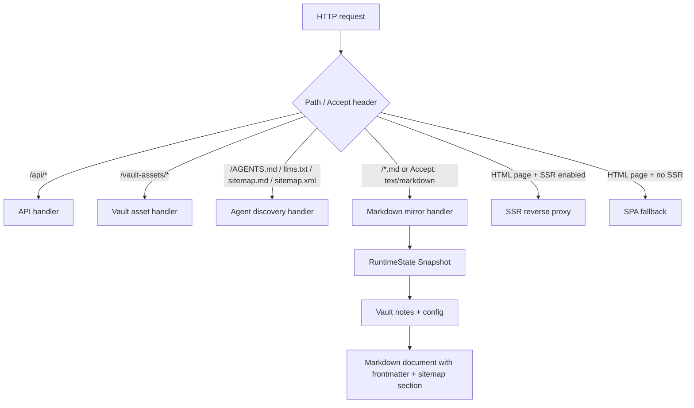

# Markdown Mirror and a14y Implementation Guide

## Executive summary

The first a14y run against the SSR-enabled local site (`http://localhost:8081/`) scored **62/100** on scorecard **v0.2.0**. SSR fixed the most important human-visible problem — pages now contain real HTML before JavaScript runs — but the site is still missing the machine-facing discovery layer that agents expect: `AGENTS.md`, `llms.txt`, `sitemap.md`, `sitemap.xml`, and markdown mirrors for HTML pages.

This guide specifies the next implementation pass: add markdown endpoints and complete markdown mirror support. The intent is to make every note available in both HTML and Markdown forms, advertise those mirrors from SSR HTML, and provide structured site indexes that let an agent discover all pages without executing JavaScript.

## Scope

Implement the approved a14y fixes:

1. Add discovery endpoints:
   - `/AGENTS.md`
   - `/llms.txt`
   - `/sitemap.md`
   - `/sitemap.xml`
2. Add markdown mirror endpoints:
   - `/index.md`
   - `/note/{slug}.md`
3. Add content negotiation:
   - `Accept: text/markdown` on `/`
   - `Accept: text/markdown` on `/note/{slug}`
4. Add SSR HTML alternate links:
   - `<link rel="alternate" type="text/markdown" href="...">`
   - `Link: <...>; rel="alternate"; type="text/markdown"`
5. Ensure markdown mirrors have required frontmatter and a `## Sitemap` section.
6. Keep a diary entry and commit in coherent intervals.

## Current baseline

Command:

```bash
npx -y a14y check http://localhost:8081/ --mode site --output agent-prompt --max-pages 200
```

Baseline:

- Score: **62/100**
- Scorecard: **0.2.0**
- Pages crawled: **7**
- Failed checks: **13 unique checks**, **63 instances**

Relevant failing checks for this guide:

| Check | Pages | Root cause |
|---|---:|---|
| `discovery.indexed` | 7 | No sitemap/llms index announces pages |
| `markdown.alternate-link` | 7 | HTML does not advertise Markdown mirrors |
| `markdown.canonical-header` | 7 | Markdown mirrors do not exist, so no canonical `Link` header |
| `markdown.content-negotiation` | 7 | `Accept: text/markdown` returns HTML |
| `markdown.frontmatter` | 7 | Markdown mirrors do not expose required metadata |
| `markdown.sitemap-section` | 7 | Markdown mirrors lack `## Sitemap` |
| `agents-md.has-min-sections` | site | `/AGENTS.md` missing install/config/usage sections |
| `sitemap-md.has-structure` | site | `/sitemap.md` missing |
| `sitemap-xml.valid` | site | `/sitemap.xml` missing/invalid |

## Proposed architecture

The Go server already owns the vault model and the authoritative list of notes. Markdown mirror support therefore belongs in the Go server, not in the Node SSR sidecar. The sidecar only renders HTML pages; it should advertise the markdown mirrors but should not generate them.



## Endpoint contracts

### `/AGENTS.md`

Purpose: tell coding agents what this published site is, how to use it, and where to find indexes.

Required sections for a14y:

- `## Installation` or equivalent — for a site, explain there is no installation needed for readers; include local project commands for operators.
- `## Configuration` — describe URL scheme, content negotiation, and available indexes.
- `## Usage` — describe how to fetch HTML, Markdown, sitemap, and API data.

### `/llms.txt`

Purpose: small top-level LLM index.

Recommended shape:

```markdown
# Retro Obsidian Publish

> A read-only published Obsidian vault.

## Key resources
- [Agent guide](/AGENTS.md)
- [Markdown sitemap](/sitemap.md)
- [XML sitemap](/sitemap.xml)
- [Home markdown mirror](/index.md)
```

### `/sitemap.md`

Purpose: human/agent-readable index of note pages.

Required a14y shape: headings + links.

```markdown
# Sitemap

## Notes

- [Index](/note/index)
- [Index.md](/note/index.md)
```

### `/sitemap.xml`

Purpose: machine sitemap.

Use standard `urlset` namespace:

```xml
<?xml version="1.0" encoding="UTF-8"?>
<urlset xmlns="http://www.sitemaps.org/schemas/sitemap/0.9">
  <url>
    <loc>http://localhost:8081/note/index</loc>
    <lastmod>2026-06-04</lastmod>
  </url>
</urlset>
```

### `/index.md`

Purpose: markdown mirror for home page.

Required frontmatter fields:

```yaml
---
title: vault-example
description: Markdown index for vault-example, listing 5 published notes.
doc_version: 1
last_updated: 2026-06-07
canonical_url: http://localhost:8081/
---
```

Body should include:

- `# <vault name>`
- summary paragraph
- `## Notes`
- `## Sitemap`

### `/note/{slug}.md`

Purpose: markdown mirror for a note page.

Frontmatter:

```yaml
---
title: Zettelkasten Method
description: The note excerpt...
doc_version: 1
last_updated: 2026-06-04
canonical_url: http://localhost:8081/note/zettelkasten-method
---
```

Body:

- `# <note title>`
- Original/derived note content. If raw Markdown is unavailable from the current `vault.Note`, use an agent-friendly mirror containing title, excerpt, tags, backlinks, and HTML-as-context.
- `## Sitemap`

## Implementation plan

### Phase A: Go markdown rendering helpers

Add helpers in `backend/internal/server/server.go` or a new `markdown.go` file in the same package.

Suggested functions:

```go
func wantsMarkdown(r *http.Request) bool
func deriveBaseURL(r *http.Request) string
func markdownMirrorURL(path string) string
func writeMarkdown(w http.ResponseWriter, r *http.Request, canonicalPath string, body string)
func renderHomeMarkdown(state *RuntimeState, cfg api.PublicConfig, baseURL string) string
func renderNoteMarkdown(state *RuntimeState, slug string, baseURL string) (string, bool)
func renderSitemapMarkdown(state *RuntimeState, baseURL string) string
func renderSitemapXML(state *RuntimeState, baseURL string) string
func renderAgentsMarkdown(state *RuntimeState, baseURL string) string
func renderLLMSTxt(state *RuntimeState, baseURL string) string
```

### Phase B: Route ordering

Register discovery and markdown mirror routes before the SSR catch-all.

```go
r.HandleFunc("/AGENTS.md", agentsHandler(state, publicConfig)).Methods("GET", "HEAD")
r.HandleFunc("/llms.txt", llmsHandler(state, publicConfig)).Methods("GET", "HEAD")
r.HandleFunc("/sitemap.md", sitemapMarkdownHandler(state, publicConfig)).Methods("GET", "HEAD")
r.HandleFunc("/sitemap.xml", sitemapXMLHandler(state, publicConfig)).Methods("GET", "HEAD")
r.HandleFunc("/index.md", homeMarkdownHandler(state, publicConfig)).Methods("GET", "HEAD")
r.HandleFunc("/note/{slug:.*}.md", noteMarkdownHandler(state, publicConfig)).Methods("GET", "HEAD")
```

Then, before SSR proxying, intercept content negotiation:

```go
r.HandleFunc("/", maybeHomeHandler(...)).Methods("GET", "HEAD")
r.HandleFunc("/note/{slug:.*}", maybeNoteHandler(...)).Methods("GET", "HEAD")
```

The exact mux shape must avoid breaking the existing catch-all SPA/SSR behavior. The simplest safe design is to add a small wrapper handler before `newSSRProxy` that checks `Accept: text/markdown` and known static paths; otherwise delegates to SSR proxy.

### Phase C: SSR HTML alternate links

Update `web/server.mjs` to inject alternate links and Link headers.

Rules:

- `/` → `/index.md`
- `/note/{slug}` → `/note/{slug}.md`
- `/search` may omit alternate link or point to `/sitemap.md`; search is not a stable content page.

```js
const mdPath = route.type === 'note' ? `/note/${route.slug}.md` : '/index.md';
htmlPage = htmlPage.replace('</head>', `<link rel="alternate" type="text/markdown" href="${BASE_URL}${mdPath}" />\n</head>`);
res.set('Link', `<${BASE_URL}${canonicalPath}>; rel="canonical", <${BASE_URL}${mdPath}>; rel="alternate"; type="text/markdown"`);
```

### Phase D: Tests and validation

Add Go tests for:

- `Accept: text/markdown` on `/` returns markdown content type.
- `Accept: text/markdown` on `/note/index` returns required frontmatter.
- `/note/index.md` returns required frontmatter and canonical `Link` header.
- `/sitemap.xml` parses as XML and contains note URLs.
- `/sitemap.md` has headings and links.
- `/AGENTS.md` has at least install/config/usage sections.

Re-run:

```bash
GOWORK=off go test ./internal/server -count=1
pnpm --dir web build:all
npx -y a14y check http://localhost:8081/ --mode site --output agent-prompt --max-pages 200
```

## Risks and review notes

1. **Raw Markdown availability:** `vault.Note` currently stores parsed HTML, not raw Markdown. A high-quality mirror would preserve the original Markdown. If adding raw Markdown to `Note` is too invasive, use an agent-friendly derived mirror now and record raw Markdown preservation as a follow-up.
2. **Route ordering:** The markdown endpoints must be registered before the SSR catch-all. Otherwise the SSR proxy will return HTML and the a14y markdown checks will keep failing.
3. **Canonical URLs:** The markdown mirror must point back to the HTML URL with a canonical `Link` header.
4. **Base URL in local vs production:** Use `deriveBaseURL(r)` from request headers for Go markdown endpoints, and `BASE_URL` env var for the SSR sidecar.
5. **HEAD requests:** a14y may use HEAD/GET. Handlers should set headers correctly for both, and avoid writing bodies for HEAD if practical.
