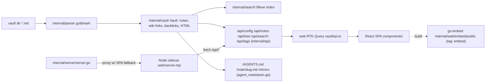
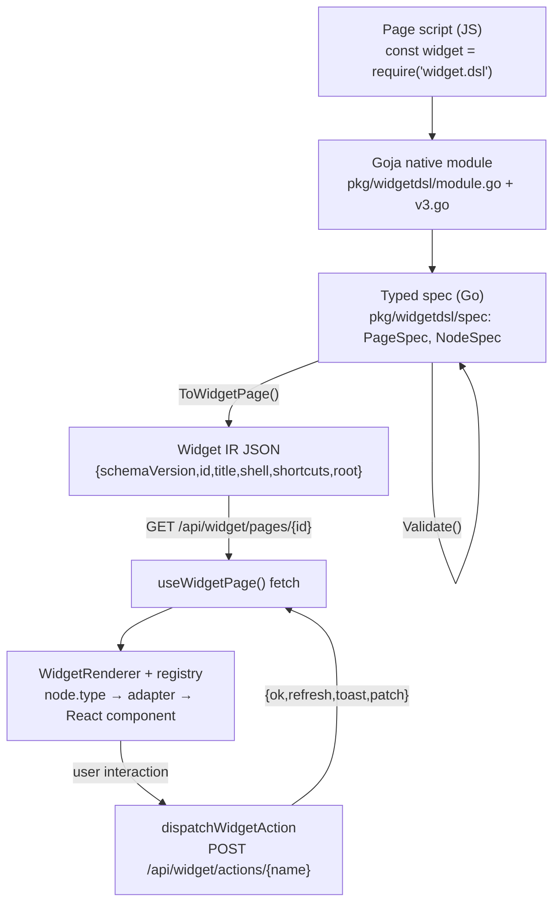
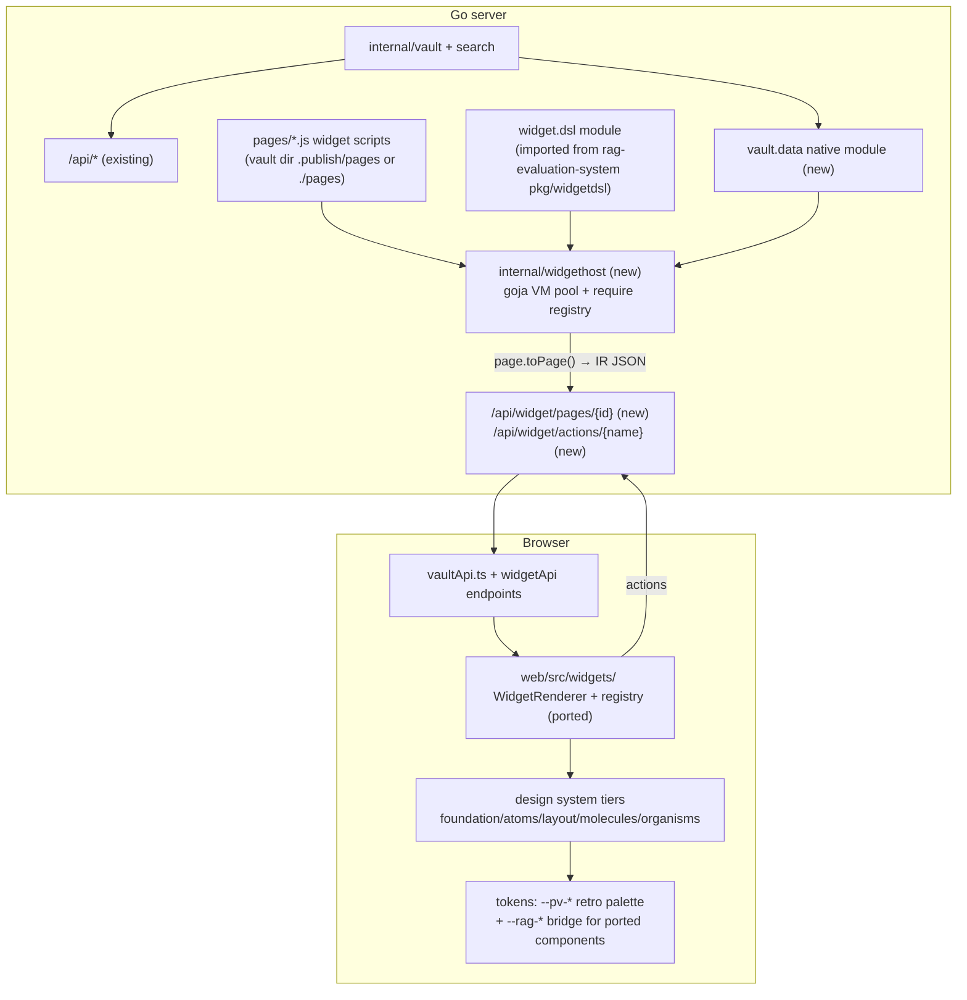
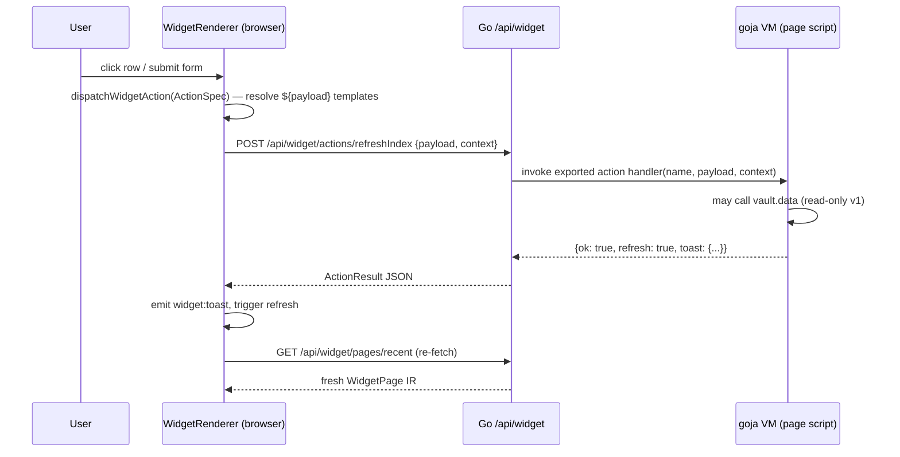

# Widget DSL and design-system reorganization: analysis, design, and implementation guide

## 1. Executive summary

publish-vault today is a Go server that renders an Obsidian vault into a retro-styled React SPA with an optional Node SSR sidecar. Its frontend already uses atomic-design folders (`atoms/`, `molecules/`, `organisms/`, `pages/`) with Storybook stories, but it also drags along a large amount of dead starter-template scaffold (~52 unused shadcn primitives, a Google Maps component, an unused theme context), a 988-line monolithic stylesheet, and a 431-line `NoteRenderer` that mixes HTML injection, imperative DOM surgery, and ad-hoc network calls. The Go backend contains **no** JavaScript runtime; the only dynamic pages story so far is the (unimplemented) PV-BACKEND-API-001 design.

Meanwhile, `rag-evaluation-system` has matured a complete, hard-cutover **widget DSL v3** stack: a single goja native module `widget.dsl` whose fluent builders produce a typed spec (`pkg/widgetdsl/spec`), validated and lowered into a serializable **Widget IR** (`WidgetPage`/`WidgetNode` JSON), served over `GET /api/widget/pages/{id}`, rendered in the browser by a generic `WidgetRenderer` against a **widget registry** of per-component adapters, with **actions** POSTing back to `POST /api/widget/actions/{name}` in a server-driven UI loop. The design system there is organized in five tiers (`foundation/`, `atoms/`, `layout/`, `molecules/`, `organisms/`), each component shipping a 6-file bundle (`Component.tsx`, `Component.widget.tsx`, `Component.widget.yaml`, `Component.module.css`, `Component.stories.tsx`, `index.ts`).

This ticket brings publish-vault up to that standard in two coupled tracks:

1. **Track A — finish the design system.** Delete the scaffold, split the style monolith into token/base/skin layers, add `foundation/` and `layout/` tiers, decompose `NoteRenderer`, and adopt the per-component file convention — without changing the visible product.
2. **Track B — widget DSL host.** Embed goja in the Go server, reuse rag-evaluation-system's `widget.dsl` module (import first, extract to a shared library later), add a publish-vault-specific `vault.data` native module exposing notes/tree/search/tags to page scripts, serve widget IR at `/api/widget/pages/{id}`, and port the `widgets/` renderer subsystem (IR types, registry, `WidgetRenderer`, action dispatcher) into `web/src/widgets/`.

The result: dynamic publish-vault pages are authored as small JavaScript files using the same `widget.dsl` grammar proven in rag-evaluation-system, rendered by the same IR pipeline, styled with publish-vault's retro tokens via a token bridge — and the whole thing slots into PV-BACKEND-API-001's `Page.kind: "dynamic"` model instead of inventing a parallel architecture.

## 2. Problem statement and scope

The user-level goal: *reorganize the web/ part of publish-vault and create a widget.dsl-styled go-go-goja JS API for it, aligned with the current (heavily modified) widget DSL v3 and the react design-system organization (atoms/molecules/organisms, IR renderer).*

In scope:

- Evidence-based map of publish-vault's current frontend and serving path.
- Evidence-based map of rag-evaluation-system's widget DSL v3 (the alignment target).
- A target architecture for `web/` reorganization and the widget DSL host.
- Decision records for the contested choices (reuse vs reimplement, API shape, styling strategy, SSR treatment).
- A phased, file-level implementation plan an intern can execute, with tests.

Out of scope (deliberately):

- Implementing the PV-BACKEND-API-001 `/api/v1` contract (that ticket stands on its own; this design only *aligns* with it).
- Migrating existing note-rendering routes to widget IR (notes stay on the existing pipeline; widgets are for *new* dynamic pages first).
- xgoja standalone binary packaging of publish-vault (Phase 6+ / PV-BACKEND-API-001 Mode A).

## 3. Orientation for the new intern: concepts and vocabulary

Read this section first; every later section assumes these terms.

**publish-vault / retro-obsidian-publish.** A Go binary (`cmd/retro-obsidian-publish`) that loads a directory of Obsidian Markdown notes into memory (`internal/vault`), renders them to HTML with goldmark (`internal/parser`), indexes them with Bleve (`internal/search`), and serves a JSON API plus a React SPA (`web/`). Optionally a Node SSR sidecar (`web/server.mjs`) pre-renders pages for SEO. Agent-readable markdown mirrors (`/AGENTS.md`, `/note/{slug}.md`, …) are served by `internal/server/agent_markdown.go`.

**goja / go-go-goja.** goja is a pure-Go JavaScript engine. go-go-goja (repo: `/home/manuel/code/wesen/go-go-golems/go-go-goja`) wraps it with a Node-style `require()` registry and a catalog of native modules (`fs`, `database`, `express`, `uidsl`, …). A *native module* is Go code registered under a module name; JS scripts call `require("name")` and get Go-implemented functions. Modules implement a `Registrar` (see `go-go-goja/modules/uidsl/module.go:11-19`):

```go
type Registrar struct{}
func (r *Registrar) ID() string { return "ui-dsl" }
func (r *Registrar) RegisterRuntimeModule(ctx *engine.RuntimeModuleRegistrationContext, reg *require.Registry) error {
    reg.RegisterNativeModule("ui.dsl", Loader)
    return nil
}
```

**xgoja.** A generator in go-go-goja that builds custom Go binaries from a YAML spec (`schema: xgoja/v2`), wiring providers (HTTP server, module bundles) and JS sources into a standalone CLI. Relevant here only as the eventual packaging target (PV-BACKEND-API-001 Modes A–C).

**Widget DSL (v3).** An *intent-level* UI authoring layer: page scripts describe semantic widgets ("a collection with this field schema, rendered as a table, with these actions"), not HTML or CSS. Three layers (from the Widget DSL MOC, `go-go-parc/Research/KB/Projects/widget-dsl.md`):

- **Intent layer** — the JS fluent builders (`widget.page(...)`, `widget.data.collection(...)`).
- **IR layer** — typed, serializable widget instances: `WidgetPage` → tree of `WidgetNode`s, with slots, actions, and data contracts *in* the IR, not hidden in callbacks.
- **Target layer** — a React renderer + registry that maps IR node types to components; styling and design-system policy live here.

**Server-driven UI loop.** The browser never runs page scripts. The Go server executes JS (goja) to produce IR JSON; the browser fetches `GET /api/widget/pages/{id}`, renders it generically, and POSTs user actions to `POST /api/widget/actions/{name}`; the response (`{ok, refresh, toast, patch, ...}`) tells the client to re-fetch, toast, or patch.

**Atomic design tiers (rag-eval flavor).** Five tiers rather than the classic three:

| Tier | Contents | Examples (rag-eval) |
|---|---|---|
| `foundation/` | text primitives, invisible helpers | Text, Caption, CodeText, Divider, VisuallyHidden |
| `atoms/` | single interactive/visual elements | Button, Tag, TextInput, MeterBar, DateTile |
| `layout/` | structural containers, no domain semantics | AppShell, Stack, Inline, Panel, SectionBlock, SplitPane |
| `molecules/` | composed, domain-agnostic units | DataTable, FieldRenderer, Pagination, ActivityFeed |
| `organisms/` | app-level assemblies | RecordShell, MediaLibraryPanel, FormDialog |

**Widget adapter / registry.** Each component that can appear in IR ships a `Component.widget.tsx` calling `defineWidget({type, module: "widget.dsl", render(props, children, ctx, node)})`. `defaultRegistry.ts` collects all adapters; `WidgetRenderer` looks up `node.type` in the registry and renders `<UnknownWidget>` for misses.

## 4. Current-state architecture: publish-vault (evidence)

### 4.1 Serving path



Key files and facts (line-anchored):

- Route wiring and SSR proxy: `internal/server/server.go:102-135`; proxy falls back to the embedded SPA on 5xx (`server.go:327`).
- API handlers: `internal/api/api.go:59-67` (`/api/config`, `/api/notes`, `/api/notes/{slug}`, `/api/notes/{slug}/raw`, `/api/tree`, `/api/search`, `/api/tags`).
- SPA embedding: `internal/web/embed.go:12` (`//go:embed embed/public` behind build tag `embed`), disk fallback `internal/web/embed_none.go`, SPA handler `internal/web/static.go:18`, build command `cmd/retro-obsidian-publish/commands/build/web.go` (Dagger pnpm build, `copyDistToEmbed:159`).
- **No goja anywhere**: `grep -rn "goja\|xgoja"` over `*.go` and `go.mod` returns zero code hits. The JS runtime today is the Node sidecar only.

### 4.2 Frontend structure

`web/src` totals ≈ 12,368 lines of TS/CSS. The *real* app is small and well-shaped; the bulk is scaffold.

```
web/src/
  App.tsx (221)            routes + chooseHomeSlug heuristic (App.tsx:120)
  entry-client.tsx (77)    hydrateRoot + preloaded state
  entry-server.tsx (118)   renderApp() + RTK upsertQueryData preload
  index.css (988)          EVERYTHING: tailwind import + shadcn tokens + retro tokens + 104 bespoke classes
  components/
    atoms/      (9)  Badge Button Checkbox Divider Icon Input LightboxModal ScrollArea Tag  [+ stories]
    molecules/  (7)  BacklinkItem BreadcrumbBar FileTreeItem FrontmatterPanel NoteCard SearchBar TagCloud
    organisms/  (3)  BacklinksPanel NoteRenderer Sidebar
    pages/      (4)  NotePage SearchPage VaultLayout  ← the real route components
    ui/        (55)  shadcn "new-york" primitives — ~52 UNUSED (only resizable, dialog used)
    ErrorBoundary.tsx / ManusDialog.tsx / Map.tsx   ← dead Manus scaffold
  pages/           Home.tsx NotFound.tsx            ← dead Manus scaffold (NOT the app pages)
  contexts/        ThemeContext.tsx                 ← dead (only referenced by dead Home.tsx)
  store/           store.ts vaultApi.ts uiSlice.ts  (RTK + RTK Query; SSR store factory)
  vault/           staticVault.ts (462)             in-browser static backend (VITE_STATIC_VAULT)
  lib/             wikiLinks.ts highlightLanguages*.ts utils.ts
  vendor/          highlight-languages/ re-exports
```

Load-bearing observations:

1. **Atomic design already exists.** `atoms/molecules/organisms/pages` with co-located `.stories.tsx` and Storybook 10 in `web/.storybook`. The reorganization is a *completion*, not an introduction.
2. **NoteRenderer is the concern-mixing hotspot** (`web/src/components/organisms/NoteRenderer/NoteRenderer.tsx`, 431 lines): injects server HTML via `dangerouslySetInnerHTML` (`:416`), then runs six imperative DOM effects (mermaid `:158`, highlight+copy buttons `:217`, embeds `:257`, heading anchors `:290`), and issues raw `fetch('/api/notes/...')` calls (`:269`, `:333`) bypassing RTK Query.
3. **Two token systems coexist** in `index.css`: shadcn's `--background/--foreground/...` (`:41-67`, feeding mostly-dead `ui/` components) and the retro palette `--color-ink/--color-paper/--color-link/...` (`:70-81`, used by the real app via Tailwind arbitrary values like `text-[var(--color-ink)]`).
4. **SSR duplication**: `web/server.mjs:105` duplicates `chooseHomeSlug` from `App.tsx:120` with a "keep in sync" comment — a known fragility PV-BACKEND-API-001 proposes to fix with `POST /api/v1/render`.
5. **The data layer is already swappable.** `store/vaultApi.ts:26-27` switches every endpoint to the in-browser `staticVault.ts` when `VITE_STATIC_VAULT=true`. This precedent matters: widget endpoints should join this same RTK Query surface.
6. **Dead weight**: `components/ui/sidebar.tsx` is 734 lines and unused (the real sidebar is the 71-line organism); heavy deps (recharts, embla-carousel, react-hook-form, react-day-picker, framer-motion, cmdk, vaul, input-otp, sonner, axios, zod, react-markdown stack) exist only for scaffold.

## 5. Reference architecture: rag-evaluation-system widget DSL v3 (evidence)

This is the system we align with. Repo: `/home/manuel/code/wesen/go-go-golems/rag-evaluation-system`.

### 5.1 The five-layer pipeline



### 5.2 Authoring grammar (what page authors write)

Single module, hard cutover (`pkg/widgetdsl/module.go:15-21`: `WidgetV3ModuleName = "widget.dsl"`; production hosts can require only this — `module.go:204-206` panics otherwise; legacy `ui.dsl`/`data.dsl`/etc. are registered for tests only). Top-level namespaces (`module.go:299-314`): `page`, `raw`, `act`, `bind`, `app`, `ui`, `data`, `crm`, `cms`, `course`, `context`, `schedule`, `time`, `style`.

Canonical minimal example (`pkg/widgetdsl/testdata/v3/examples/01-simple-table.js`):

```js
const widget = require("widget.dsl");
const rows = [{ id: "sess-intro", title: "Intro to context windows", turns: 12, status: "ready" }];

const schema = widget.data.fields("sessions", (f) =>
  f.key("id", { label: "ID" })
   .primary("title", { label: "Title" })
   .count("turns", { label: "Turns" })
   .status("status", { label: "Status" })
).build();

const table = widget.data.collection("sessions", rows, (c) => c.schema(schema).table()).toNode();

const page = widget.page("Simple table", (p) =>
  p.section("Sessions", (s) => s.caption("A data.collection table").view(table)));
```

The host wraps the script and calls `page.toPage()` to lower it (`cmd/widgetdsl-v3-preview/main.go:143-176`):

```go
vm := goja.New()
reg := require.NewRegistry()
widgetdsl.Register(reg)                    // registers "widget.dsl"
reg.Enable(vm)
value, _ := vm.RunString(`(function(){ ` + source + `
  return page && typeof page.toPage === "function" ? page.toPage() : page; })()`)
irJSON, _ := json.Marshal(value.Export())  // → WidgetPage JSON
```

Builder inventory is descriptor-generated (`pkg/widgetdsl/v3_descriptors.go` → `pkg/xgoja/providers/widgetsite/doc/05-widget-dsl-v3-api-reference.md`), e.g. PageBuilder: `id title meta shell shortcuts root density breadcrumb section view validate toPage use`; CollectionBuilder: `id schema empty select search paginate table edit masterDetail validate toNode toIR use`. Every builder has `use(fragment)` for composition. There are **43 example scripts** paired with golden IR JSON (`pkg/widgetdsl/testdata/v3/{examples,golden}/`) — the executable spec of the grammar.

### 5.3 IR wire shape

`WidgetPage` = `{schemaVersion, id, title, meta?, shell?, shortcuts?, root, diagnostics?}` (`pkg/widgetdsl/spec/lower.go:8`). `WidgetNode` is a 3-kind union (TS mirror `packages/rag-evaluation-site/src/widgets/ir/core.ts:8-20`):

```ts
type WidgetNode =
  | { kind: "text"; text: string }
  | { kind: "element"; tag: string; attrs?: ...; children?: WidgetNode[] }
  | { kind: "component"; type: string; props?: JsonValue; children?: WidgetNode[] }
```

Everything dynamic is **defunctionalized** into data: cell renderers are `CellSpec` (`ir/cells.ts`), conditional styling is `StyleBySpec` (`ir/engines.ts`), actions are `ActionSpec` unions (`ir/actions.ts`: `navigate|download|server|event|copy|openOverlay|closeOverlay`) with `${path}` template interpolation and `bind` accessors. The legal component-type list is owned Go-side by `pkg/widgetschema/schema.go` (`Version = "0.1.0"`, `ComponentTypes []string`) and mirrored TS-side as the `RagWidgetType` union.

Each component also carries a `.widget.yaml` **manifest** (`schemaVersion: widget-manifest/v1`: type, module, props, adapter path, slots, actions, status) discovered/validated by `internal/widgetmanifest/` and `cmd/widget-codegen`.

### 5.4 Renderer and design system

`packages/rag-evaluation-site/src/`:

- `widgets/WidgetRenderer.tsx` (157 lines) — `WidgetRenderer({node, registry, onAction})`; `renderComponentNode` does `registry.get(node.type)` → `adapter.render(props, children, ctx, node)`; unknown types → `<UnknownWidget>` ErrorCallout; `createRenderContext` provides `renderNode/renderChildren/renderValue/bindAction/dispatchAction`.
- `widgets/registry.ts` — `WidgetRegistry`, `defineWidget`, `createWidgetRegistry` (duplicate-type guard), `mergeWidgetRegistries`.
- `widgets/defaultRegistry.ts` — imports ~90 `*.widget` adapters.
- `widgets/actions.ts` — `dispatchWidgetAction`: `server` kind → `POST /api/widget/actions/{name}` with `{payload, context}`; result `{ok, refresh, toast, patch, data, error, fieldErrors, undo}`; refresh triggers a page re-fetch; toasts via `window` CustomEvents.
- `hooks/useWidgetPage.ts` — `fetch(url)` + `refresh()` + AbortController; `app/App.tsx` resolves the page **shell** (`app`/`none`/`root-owned`) and wires `usePageShortcuts` from `page.shortcuts.bindings`.
- Components in 5 tiers (§3 table), each with the 6-file convention (`DataTable.tsx`, `.widget.tsx`, `.widget.yaml`, `.module.css`, `.stories.tsx`, `index.ts`), some with `*.logic.ts` for pure testable logic.
- Theming: `src/theme.css` defines `--rag-color-*` / `--rag-font-*` tokens **plus a compatibility bridge to legacy `--mac-*` tokens** — precedent for publish-vault's retro tokens; `PaletteProvider` + `StyleBySpec` handle runtime palettes.

### 5.5 xgoja delivery

`pkg/xgoja/providers/widgetsite/provider.go` packages the DSL as provider `rag-widget-site` exposing `providerapi.Module{Name: "widget.dsl", TypeScript: widgetdsl.TypeScriptModule(...)}` with embedded docs; example apps `examples/xgoja/widget-site/` (express + SQLite + per-request `page(req)` IR building in `verbs/sites.js`), `doodle-site/`, `workshop-crm-site/`.

### 5.6 Authoritative docs to read (priority order)

1. `ttmp/2026/07/12/WIDGETDSL-V3-FULL-FEATURE-CUTOVER--*/design-doc/01-*.md` — the v3 cutover intern guide.
2. `ttmp/2026/07/06/RAGEVAL-WIDGET-DECOMPOSITION--*/design-doc/02-redesigning-the-widget-dsl-a-composition-first-opinionated-javascript-api.md` (+ 01, 03).
3. `ttmp/2026/07/05/GOJA-DSL-PLAYBOOK--*/design-doc/04-goja-dsl-deep-dive-optional-lambdas-typed-ir-dts-parity-and-tag-operators.md`.
4. `pkg/xgoja/providers/widgetsite/doc/05-widget-dsl-v3-api-reference.md` — the generated grammar reference.

## 6. Gap analysis

| # | Gap | Evidence | Consequence |
|---|---|---|---|
| 1 | No JS runtime in the Go server | zero goja hits in publish-vault Go code | Widget DSL host must be added from scratch (engine wiring, script loading, endpoints) |
| 2 | No IR renderer subsystem in `web/` | no `widgets/` dir; all rendering is note-specific | Port `ir/`, `registry`, `WidgetRenderer`, `actions`, `useWidgetPage` from rag-eval |
| 3 | Missing `foundation/` and `layout/` tiers | only atoms/molecules/organisms/pages exist | Widget adapters need Stack/SectionBlock/Text-tier components to map IR onto |
| 4 | Style monolith + dual token systems | `index.css` 988 lines; shadcn tokens `:41-67` vs retro tokens `:70-81` | Ported widget components (CSS modules, `--rag-*` vars) have nothing to bind to without a token layer |
| 5 | Dead scaffold obscures the real system | ~52 unused `ui/*`, Manus files, dead `pages/`, `ThemeContext` | An intern cannot tell real code from scaffold; deletions must come first |
| 6 | `NoteRenderer` concern mixing | `NoteRenderer.tsx:158,217,257,269,290,333,416` | Blocks per-component convention; embeds/copy fetches bypass the data layer |
| 7 | No dynamic-page concept in routes/API | routes are `/`, `/note/*`, `/search` only (`App.tsx:55-73`) | Widget pages need a route (`/w/:pageId`) and API surface; must align with PV-BACKEND-API-001 `Page` model |
| 8 | Vault data not exposed to JS | n/a | Page scripts need `vault.data` (notes/tree/search/tags) to build vault-aware widgets |
| 9 | DSL lives in rag-evaluation-system's module | `pkg/widgetdsl` is `github.com/go-go-golems/rag-evaluation-system/pkg/widgetdsl` | Reuse requires a cross-repo Go dependency (or extraction) — see Decision D1 |

## 7. Proposed architecture

### 7.1 Target picture



### 7.2 Track A: `web/` reorganization (target layout)

```
web/src/
  styles/
    tokens.css        design tokens only: --pv-* (renamed retro --color-*), fonts, spacing
    bridge.css        --rag-* → --pv-* mapping for ported widget components (mirrors rag-eval's --mac-* bridge)
    base.css          tailwind import, resets, element defaults
    chrome.css        application shell skin: .retro-* window/menubar/tree/button classes, lightbox
    prose.css         .note-prose / .wiki-link / .callout* note-content skin
  components/
    foundation/       NEW: Text, Caption, CodeText, Divider (move atoms/Divider), VisuallyHidden
    atoms/            keep 9; add any ported widget atoms (MeterBar, DateTile) as needed
    layout/           NEW: Stack, Inline, Panel, SectionBlock, SplitPane (wraps ui/resizable), ScrollRegion
    molecules/        keep 7; + ported DataTable, FieldRenderer, RecordFieldList, Pagination as widget work needs them
    organisms/        Sidebar, BacklinksPanel, NoteView/* (decomposed NoteRenderer, see below)
    pages/            NotePage, SearchPage, WidgetPage (new route component), VaultLayout
    ui/               ONLY resizable.tsx, dialog.tsx (+ their transitive shadcn deps); rest deleted
  widgets/            NEW: ported IR renderer subsystem
    ir/               core.ts actions.ts cells.ts props.ts engines.ts index.ts
    registry.ts  WidgetRenderer.tsx  defaultRegistry.ts  actions.ts
  hooks/              redux.ts useMobile useComposition usePersistFn useWidgetPage.ts (new)
  lib/  store/  vault/  vendor/   (unchanged, minus dead const.ts)
```

Deletions (Phase 0): `components/Map.tsx`, `components/ManusDialog.tsx`, `components/ErrorBoundary.tsx` (or wire it around routes — decide at PR time; default delete), `src/pages/Home.tsx`, `src/pages/NotFound.tsx`, `contexts/ThemeContext.tsx`, `src/const.ts`, ~52 unused `components/ui/*`, and the unused dependencies they drag (verify each with `pnpm why` before removal).

`NoteRenderer` decomposition (Phase 2):

```
organisms/NoteView/
  NoteView.tsx            composition root (was NoteRenderer)
  NoteBody.tsx            dangerouslySetInnerHTML host, nothing else
  noteEnhancements.ts     pure DOM enhancement pipeline: [enhanceMermaid, enhanceHighlight, enhanceEmbeds, enhanceHeadingAnchors]
  NoteActions.tsx         copy-markdown buttons (uses RTK Query, not fetch)
  useNoteEmbeds.ts        embed resolution via vaultApi endpoint (replaces raw fetch at NoteRenderer.tsx:269)
```

Adopt the per-component file convention incrementally: every *new or ported* component ships `Component.tsx`, `Component.module.css` (tokens only, no hex values), `Component.stories.tsx`, `index.ts`, and — when widget-renderable — `Component.widget.tsx` + `Component.widget.yaml`. Existing Tailwind-styled vault components are *not* force-migrated to CSS modules (see Decision D3).

### 7.3 Track B: the publish-vault widget DSL host

**Go side — new package `internal/widgethost`:**

```go
// internal/widgethost/host.go (sketch)
type Host struct {
    registry *require.Registry     // widget.dsl + vault.data registered
    pages    map[string]PageSource // id → script (from pagesDir, watched like the vault)
    state    *server.RuntimeState  // read access to vault + search snapshot
}

func New(state *server.RuntimeState, pagesDir string) (*Host, error) {
    reg := require.NewRegistry()
    widgetdsl.Register(reg)                  // rag-evaluation-system/pkg/widgetdsl
    vaultdata.Register(reg, state)           // new publish-vault module (below)
    ...
}

// RenderPage executes the page script in a fresh goja VM and returns IR JSON.
func (h *Host) RenderPage(ctx context.Context, id string, query url.Values) (json.RawMessage, error) {
    vm := goja.New()
    h.registry.Enable(vm)
    injectRequestContext(vm, query)          // e.g. globalThis.request = {query: {...}}
    v, err := vm.RunString(wrap(h.pages[id].Source))  // same wrapper as widgetdsl-v3-preview
    if err != nil { return nil, err }
    return json.Marshal(v.Export())
}

// HandleAction executes a named action handler exported by the page script.
func (h *Host) HandleAction(ctx context.Context, name string, payload, actx json.RawMessage) (ActionResult, error)
```

**Go side — new package `internal/vaultdata` (the `vault.data` native module):**

```go
// JS view: const vault = require("vault.data")
// vault.notes()            → [{slug,title,path,tags,excerpt,modTime}]      (NoteListItem shape)
// vault.note(slug)         → full note {slug,title,frontmatter,tags,html,backlinks,...} or null
// vault.search(q, {limit}) → [{slug,title,fragment,score}]
// vault.tree()             → FileNode
// vault.tags()             → [{tag,count}]
// vault.config()           → {vaultName,pageTitle,notes}
func Register(reg *require.Registry, state StateReader) {
    reg.RegisterNativeModule("vault.data", func(vm *goja.Runtime, moduleObj *goja.Object) {
        exports := moduleObj.Get("exports").(*goja.Object)
        _ = exports.Set("notes", func() any { return state.Snapshot().NoteList() })
        _ = exports.Set("note", func(slug string) any { ... })
        _ = exports.Set("search", func(q string, opts ...map[string]any) any { ... })
        ...
    })
}
```

Design rules for `vault.data` (following the go-go-goja module authoring conventions and the uidsl precedent, `go-go-goja/modules/uidsl/module.go`):

- Read-only in v1. No write/action verbs until the action story is proven.
- Return plain JSON-able values (maps/slices), never goja object handles that leak Go state — the same "reduce to `JSONValue` before crossing the boundary" rule as `widgetdsl/spec/types.go`.
- Take the vault **snapshot** once per call against `RuntimeState` (RW-mutex read), so page renders are consistent under reload.
- Ship a `TypeScriptDeclarer` (`go-go-goja/modules/typing.go`) so `.d.ts` generation covers it.

**HTTP surface (mounted in `internal/server/server.go` next to the existing `/api` routes):**

| Endpoint | Behavior |
|---|---|
| `GET /api/widget/pages` | list `{id, title, path}` of discovered page scripts |
| `GET /api/widget/pages/{id}` | execute script → `WidgetPage` IR JSON (with `?query` params passed through) |
| `POST /api/widget/actions/{name}` | body `{payload, context}` → run page-exported handler → `{ok, refresh, toast, patch, data, error, fieldErrors}` |

These paths deliberately match rag-evaluation-system's contract byte-for-byte so the ported renderer/`actions.ts` work unmodified (Decision D2). Under PV-BACKEND-API-001, a widget page is later exposed as `Page{kind: "dynamic", data: <WidgetPage IR>}` from `/api/v1/page` — the widget endpoints are the transport-level detail beneath that model, not a competitor to it.

**Page scripts.** A directory of JS files (default `<vault>/.publish/pages/*.js`, overridable with `--pages-dir`), watched like the vault. Example publish-vault-native page:

```js
// .publish/pages/recent.js — "Recently updated notes" dynamic page
const widget = require("widget.dsl");
const vault = require("vault.data");

const rows = vault.notes()
  .sort((a, b) => (a.modTime < b.modTime ? 1 : -1))
  .slice(0, 25)
  .map((n) => ({ slug: n.slug, title: n.title, modTime: n.modTime, tags: n.tags.join(", ") }));

const schema = widget.data.fields("recent", (f) =>
  f.key("slug", { label: "Slug" })
   .primary("title", { label: "Title" })
   .date("modTime", { label: "Updated" })
   .short("tags", { label: "Tags" })
).build();

const table = widget.data.collection("recent", rows, (c) =>
  c.schema(schema)
   .search()
   .table((t) => t.rowSelect(widget.act.navigate("/note/${slug}")))
).toNode();

const page = widget.page("Recently updated", (p) =>
  p.id("recent").section("Last 25 notes", (s) => s.view(table)));
```

**Frontend route.** `App.tsx` gains `/w/:pageId` → `pages/WidgetPage`, which calls `useWidgetPage('/api/widget/pages/' + pageId)` and renders `<WidgetRenderer node={page.root} registry={defaultWidgetRegistry} onAction={handleAction}/>` inside `VaultLayout` (publish-vault's shell substitutes for rag-eval's `resolvePageShell` app-shell logic in v1; `page.shell` support can follow).

### 7.4 Action round-trip (sequence)



### 7.5 Initial widget component set (publish-vault v1 registry)

Port only what the first pages need; the registry grows with use. Minimum viable set, mapped to rag-eval sources:

| IR `type` | Port from (rag-eval `packages/rag-evaluation-site/src/components/`) | publish-vault tier |
|---|---|---|
| `Stack`, `Inline`, `Panel`, `SectionBlock` | `layout/` | `layout/` |
| `Text`, `Caption`, `CodeText`, `Divider` | `foundation/` | `foundation/` |
| `DataTable` | `molecules/DataTable/` | `molecules/` |
| `Tag`/badge, `Button` | adapt existing publish-vault atoms (write `.widget.tsx` adapters over them) | `atoms/` |
| `FieldRenderer`, `RecordFieldList` | `molecules/` | `molecules/` (Phase 5) |

Adapters over *existing* publish-vault atoms (Tag, Button, Badge) demonstrate the key property: the registry decouples IR types from any one component library, so publish-vault keeps its retro look while speaking the same IR.

## 8. Decision records

### Decision D1: Import rag-evaluation-system's `pkg/widgetdsl` instead of reimplementing or extracting first

- **Context:** The v3 DSL is ~4,300 lines of mature Go (module.go 1339 + v3.go 2417 + spec/ ~1,500) with 43 golden-tested examples, living in module `github.com/go-go-golems/rag-evaluation-system`. publish-vault needs the identical grammar ("align with widget.dsl v3").
- **Options considered:** (a) reimplement a subset in publish-vault; (b) extract `widgetdsl` + `spec` into go-go-goja (or a new `widget-dsl` repo) first, then depend on it; (c) add a Go dependency on `rag-evaluation-system/pkg/widgetdsl` now and extract later.
- **Decision:** (c) — depend on the existing package now; treat extraction as a follow-up compatibility event.
- **Rationale:** Reimplementation guarantees drift from the 43-example spec and doubles maintenance. Extraction-first blocks this ticket on a cross-repo refactor with its own migration checker implications. A direct dependency gives byte-identical grammar and golden compatibility today; both repos are in the same GitHub org, so the module path is importable (add `replace` directive for local dev if needed).
- **Consequences:** publish-vault's `go.mod` grows a sibling-repo dependency (and its transitive deps — audit size). The extraction, when it happens, is a mechanical import-path change. Must validate: `go mod tidy` impact, and that `widgetdsl.Register` has no rag-eval-specific side effects (it doesn't — it only registers `widget.dsl`).
- **Status:** proposed

### Decision D2: Adopt rag-eval's `/api/widget/*` HTTP contract verbatim (not a bespoke `/api/v1` shape first)

- **Context:** PV-BACKEND-API-001 proposes `/api/v1` with a `Page` model; rag-eval's renderer stack (`useWidgetPage.ts`, `actions.ts`) is hardcoded to `GET /api/widget/pages/{id}` and `POST /api/widget/actions/{name}`.
- **Options considered:** (a) invent `/api/v1/widgets/...` now and patch the ported frontend; (b) use `/api/widget/*` verbatim and layer `/api/v1/page` (`kind:"dynamic"`) on top later; (c) block on PV-BACKEND-API-001 Phase 1.
- **Decision:** (b).
- **Rationale:** Verbatim paths mean the ported `useWidgetPage`/`actions.ts` run unmodified, story parity with rag-eval is testable, and future xgoja `widget-site` examples transfer directly. PV-BACKEND-API-001 explicitly plans compatibility aliases; widget endpoints become another aliased surface.
- **Consequences:** Two API prefixes coexist (`/api/*`, `/api/widget/*`) until v1 lands; document that `/api/widget` is the widget transport, `/api/v1/page` the eventual page-level abstraction.
- **Status:** proposed

### Decision D3: Token bridge instead of restyling — keep Tailwind for vault UI, CSS modules for ported widget components

- **Context:** publish-vault styles with Tailwind arbitrary values over retro tokens (`--color-ink` etc.) in one 988-line file; rag-eval widget components use per-component CSS modules over `--rag-*` tokens.
- **Options considered:** (a) restyle ported components with Tailwind; (b) migrate publish-vault to CSS modules wholesale; (c) split tokens into `styles/tokens.css` (renamed `--pv-*`, with `--color-*` kept as aliases during migration), add `styles/bridge.css` mapping `--rag-*` → `--pv-*`, and keep each component in its native styling idiom.
- **Decision:** (c).
- **Rationale:** rag-eval itself shipped exactly this pattern (`theme.css` bridges `--rag-*` to legacy `--mac-*`), proving ported components render correctly through a token bridge. Restyling ~15 ported components is pure churn; migrating the vault UI is out of scope and risks visual regressions on a live site.
- **Consequences:** Two styling idioms coexist by design; the rule is "tokens are the contract, idiom is per-component." Must validate token coverage (every `--rag-*` var a ported component consumes has a bridge entry) — a simple grep test can enforce this.
- **Status:** proposed

### Decision D4: New `vault.data` native module for vault access (not widget.dsl extension, not HTTP self-calls)

- **Context:** Page scripts need vault content. Options for exposure differ in coupling and safety.
- **Options considered:** (a) extend `widget.dsl` with a vault namespace (requires forking the DSL — contradicts D1); (b) let scripts `fetch()` the server's own HTTP API (no fetch in goja by default; adds loopback latency and auth complexity); (c) a separate read-only native module `vault.data` registered alongside `widget.dsl`, mirroring the existing JSON API shapes (`NoteListItem`, `Note`, `FileNode`, `SearchResult`, `TagCount`).
- **Decision:** (c).
- **Rationale:** Keeps `widget.dsl` pristine and upgradeable (D1); reuses the exact wire shapes the frontend already types (`web/src/types/index.ts:26-60`), so data flows from Go → JS → IR → React without shape translation; read-only snapshot access is trivially safe under `RuntimeState`'s RW mutex.
- **Consequences:** publish-vault owns a small module (~200 lines + tests); PV-BACKEND-API-001's future `Backend` interface becomes the natural implementation seam (`vault.data` calls the interface, not `vault.Vault` directly, once that lands).
- **Status:** proposed

### Decision D5: Widget pages are client-rendered in v1; SSR integration deferred to the render-contract work

- **Context:** publish-vault has SSR via the Node sidecar; rag-eval widget pages are client-fetch only. SSR of widget pages would require the sidecar to prefetch IR and the renderer to hydrate.
- **Options considered:** (a) SSR widget pages now via sidecar prefetch of `/api/widget/pages/{id}` + preloaded-state seeding; (b) client-render widget pages in v1, and fold widget IR into the PV-BACKEND-API-001 `POST /api/v1/render` response when that ships; (c) render IR → HTML in Go (no React SSR).
- **Decision:** (b).
- **Rationale:** Widget pages are new surfaces with no SEO baseline to preserve; the SSR proxy already falls back to the SPA for unknown routes, so `/w/*` works day one. Doing SSR before the render contract exists would add a third copy of prefetch logic to `server.mjs`, the exact duplication PV-BACKEND-API-001 is designed to remove.
- **Consequences:** Widget pages get no SSR/SEO/agent-markdown initially; the agent-markdown mirror question for dynamic pages (PV-BACKEND-API-001 §"markdown mirrors") stays open. Document `/w/*` as `noindex` until then.
- **Status:** proposed

### Decision D6: Reorganization is completion-in-place, not a packages/ split

- **Context:** rag-eval hosts its design system in a separate pnpm workspace package (`packages/rag-evaluation-site`); publish-vault has a single `web/` app.
- **Options considered:** (a) split `web/` into `packages/{design-system,app}`; (b) keep the single Vite app, reorganize `src/` in place with the tier layout of §7.2.
- **Decision:** (b).
- **Rationale:** One consumer, one app; a workspace split adds build-graph complexity (pnpm workspace, project refs, Storybook multi-package) with zero current payoff. The tier layout delivers the organizational alignment; a later extraction to a package is mechanical if a second consumer appears.
- **Consequences:** Import paths stay `@/components/...`; Storybook config untouched. Revisit only if publish-vault widgets need to be consumed outside this repo.
- **Status:** proposed

## 9. Implementation phases

Each phase is independently shippable and ends with the validation listed. File paths are relative to the repo root.

### Phase 0 — Scaffold removal (Track A, ~1 day)

1. Delete dead files: `web/src/components/{Map.tsx,ManusDialog.tsx,ErrorBoundary.tsx}`, `web/src/pages/{Home.tsx,NotFound.tsx}`, `web/src/contexts/ThemeContext.tsx`, `web/src/const.ts`.
2. Build an import graph (`npx knip` or `npx depcheck`, or grep imports) to confirm the unused `components/ui/*` list; delete all except `resizable.tsx`, `dialog.tsx` and their shadcn-internal deps (`lib/utils.ts` stays).
3. Remove now-unused dependencies from `web/package.json` one at a time, checking `pnpm why <dep>` before each; expect to drop recharts, embla-carousel, react-hook-form, react-day-picker, framer-motion, cmdk, vaul, input-otp, sonner, axios, zod, react-markdown/remark/rehype, next-themes, streamdown.
4. Validation: `pnpm check && pnpm build && pnpm build:ssr && pnpm smoke:ssr`; Storybook builds; `go test ./... -count=1`; click-through of `/`, `/note/*`, `/search`, resizable panels, lightbox.

### Phase 1 — Style layering and tokens (Track A, ~1–2 days)

1. Split `web/src/index.css` into `styles/tokens.css` (retro palette renamed `--pv-*`, with `--color-*` mappings kept in the Tailwind `@theme` block), `styles/base.css` (resets + container), `styles/chrome.css` (`.retro-*` shell skin + lightbox), and `styles/prose.css` (`.note-prose`, `.wiki-link`, `.callout*`, hljs/mermaid); trim the shadcn token block to the variables `resizable`/`dialog` and base styles actually consume. *(Implemented 2026-07-17 with `chrome.css` as its own layer.)*
2. Add `styles/bridge.css` with the `--rag-*` → `--pv-*` mapping (start with the token list consumed by the Phase 4 component set; grep rag-eval's `*.module.css` for `var(--rag-` to enumerate).
3. Validation: visual diff of the running site before/after (screenshot the three routes); `pnpm build` CSS size should drop.

### Phase 2 — NoteRenderer decomposition + tiers (Track A, ~2–3 days)

1. Create `components/foundation/` (Text, Caption, CodeText, Divider — move `atoms/Divider`) and `components/layout/` (Stack, Inline, Panel, SectionBlock; SplitPane wrapping `ui/resizable`). Port implementations from rag-eval where they exist; each gets the file convention + a story.
2. Decompose `organisms/NoteRenderer/` into `organisms/NoteView/` per §7.2: pure `NoteBody`, `noteEnhancements.ts` pipeline (each enhancement a `(root: HTMLElement, deps) => cleanup` function, unit-testable), `NoteActions`, `useNoteEmbeds` backed by a new `vaultApi` endpoint instead of raw `fetch`.
3. Add `getNoteBySlugs`-style batch or reuse `useGetNoteQuery` for embeds; delete the two raw `fetch()` call sites.
4. Validation: existing SSR test (`entry-server.test.tsx`) passes; mermaid/highlight/embed/anchor behaviors verified on a fixture vault note that exercises all four; stories for NoteView states.

### Phase 3 — Go widget host (Track B, ~3–4 days)

1. `go get github.com/go-go-golems/rag-evaluation-system` (D1); add `replace` in `go.work`/`go.mod` for local dev if the module isn't published at the needed version.
2. Implement `internal/vaultdata/` (module `vault.data`, §7.3): `Register(reg, state)`, six read-only functions returning the existing JSON shapes; table-driven tests running scripts through `goja.New()` + registry (pattern: `go-go-goja` runtime integration tests / `uidsl` `renderJS` helper).
3. Implement `internal/widgethost/`: page-script discovery from `--pages-dir` (default `<vault>/.publish/pages`), the run-wrapper from `cmd/widgetdsl-v3-preview/main.go:143-176`, per-request fresh VM (no VM reuse in v1 — correctness over throughput), request-context injection, and action handler invocation (convention: scripts export `actions = { name: (payload, context) => result }`; the wrapper returns `{page, actions}`).
4. Mount routes in `internal/server/server.go`: `/api/widget/pages`, `/api/widget/pages/{id}`, `/api/widget/actions/{name}`; wire `--pages-dir` flag in `cmd/retro-obsidian-publish/commands/serve/serve.go`. Feature-gate: widget routes 404 cleanly when no pages dir exists.
5. Add `examples/widget-pages/recent.js` (the §7.3 script) + a tags-overview page as living fixtures.
6. Validation:
   ```bash
   go test ./internal/vaultdata/... ./internal/widgethost/... -count=1
   go run ./cmd/retro-obsidian-publish serve --vault ./examples/vault --pages-dir ./examples/widget-pages &
   curl -fsS localhost:8080/api/widget/pages | jq .
   curl -fsS localhost:8080/api/widget/pages/recent | jq .root.kind   # "component"
   ```

### Phase 4 — Frontend widget subsystem (Track B, ~3–4 days)

1. Port `web/src/widgets/` from `packages/rag-evaluation-site/src/widgets/`: `ir/` (core, actions, cells, engines, props — trim prop interfaces to the v1 component set), `registry.ts`, `WidgetRenderer.tsx`, `actions.ts`; port `hooks/useWidgetPage.ts`.
2. Build the v1 registry (§7.5): port DataTable + layout/foundation adapters; write fresh `.widget.tsx` adapters over publish-vault's own `Tag`, `Badge`, `Button` atoms. Each ported component keeps its `.module.css` (bridge tokens) and gets a story.
3. Add `pages/WidgetPage/` + route `/w/:pageId` in `App.tsx`; `handleAction` wired to `dispatchWidgetAction` with refresh.
4. Add `WidgetRenderer.stories.tsx` fed by a checked-in golden IR JSON (copy the shape of rag-eval's `01-simple-table` golden) so the renderer is reviewable without a server.
5. Validation: `pnpm check && pnpm build`; Storybook shows the golden page; end-to-end: `serve --pages-dir` + open `/w/recent`, click a row → navigates to the note.

### Phase 5 — Hardening and alignment (both tracks, ongoing)

1. Golden tests Go-side: for each `examples/widget-pages/*.js`, assert `RenderPage` output matches a checked-in golden JSON (mirror rag-eval's `testdata/v3` layout).
2. Registry completeness test: every IR `type` emitted by the goldens has an adapter in `defaultRegistry` (TS test), mirroring rag-eval's registry stories.
3. Optional: adopt `.widget.yaml` manifests + a validation step once the component set stabilizes (port `internal/widgetmanifest` patterns).
4. Revisit D5: when PV-BACKEND-API-001's `/api/v1/render` ships, embed widget IR in SSR preloads and add agent-markdown treatment for widget pages.
5. Extraction follow-up for D1: move `widgetdsl` + `spec` to a shared module; both repos flip import paths.

## 10. Test strategy

- **Go module tests** (`internal/vaultdata`): script-driven — run JS snippets against a registry-enabled VM, assert exported JSON (pattern from `go-go-goja/modules/uidsl/*_test.go`).
- **Go host golden tests** (`internal/widgethost`): page script → IR JSON goldens; error cases (script throws, missing `page`, unknown page id → 404, action handler missing → `{ok:false}`).
- **Contract parity**: run one rag-eval v3 example (e.g. `01-simple-table.js`, which uses no vault data) through the publish-vault host and diff against rag-eval's golden — proves D1 delivered grammar identity.
- **TS unit tests** (vitest): `noteEnhancements` pipeline functions; `dispatchWidgetAction` template resolution; registry duplicate-type guard.
- **Storybook**: stories are the visual spec for every ported/new component + a full-page `WidgetRenderer` story from golden IR.
- **SSR regression**: existing `entry-server.test.tsx` must stay green through Phases 0–2 (the reorganization must not change SSR output); add a smoke assert that `/w/*` falls back to the SPA shell.
- **Security checks**: page scripts are trusted (vault-adjacent, author-owned) but still: action payloads are JSON-decoded with size limits; `vault.data` never exposes paths outside the vault (it reuses the sanitized in-memory model, not the filesystem); widget IR is rendered through React (no `dangerouslySetInnerHTML` in adapters — `raw.element` IR nodes render via React elements, and any future raw-HTML widget must sanitize).

## 11. Risks, alternatives, open questions

Risks:

- **Dependency weight (D1).** `rag-evaluation-system` may drag large transitive deps into publish-vault's `go.mod`. Mitigation: audit `go mod graph` in Phase 3 step 1; if heavy, accelerate the extraction follow-up.
- **DSL evolution skew.** rag-eval's v3 keeps moving ("we modified widget.dsl v3 quite a bit" — this will happen again). Mitigation: the contract-parity golden test (§10) pins the grammar version publish-vault tracks; upgrades become explicit diffs.
- **Renderer prop drift.** Trimming `ir/props.ts` to a v1 subset risks silent divergence from rag-eval's full set. Mitigation: keep trimmed files structurally identical (same names/fields, fewer entries) and comment the source revision.
- **Scaffold deletion breakage.** An "unused" shadcn file might be imported dynamically. Mitigation: Phase 0's import-graph check + full build/SSR/storybook validation before merging.
- **Per-request VM cost.** Fresh goja VM per render is simple but slow for large pages. Acceptable for v1 (pages are small, personal-site traffic); revisit with a VM pool if p95 render >50ms.

Alternatives set aside:

- Rendering widget pages with the existing `uidsl` element DSL (`go-go-goja/modules/uidsl`) — element-level, not semantic; contradicts the intent/IR separation this ticket exists to adopt.
- DMETA-style design-system compilation — a neighbor pattern (see the widget-dsl MOC), out of scope here.

Open questions:

1. Should `--pages-dir` default to `<vault>/.publish/pages` (content-adjacent, git-synced with the vault in the k3s deployment) or a separate flag-only directory? Content-adjacent interacts with RETRO-IGNORE-013's `.vault-ignore` work.
2. Do action handlers get write access to anything in v1 (e.g. trigger `/api/admin/reload`), or is v1 strictly read-only + navigate?
3. When rag-eval's `widgetdsl` is extracted (D1 follow-up), does it land in go-go-goja (next to `uidsl`) or a standalone `widget-dsl` repo? go-go-goja seems natural given the provider already lives at `pkg/xgoja/providers/widgetsite`.
4. Should publish-vault adopt rag-eval's `page.shell` model (app/none/root-owned) or always render widget pages inside `VaultLayout`? v1 assumes the latter.
5. Keyboard shortcuts (`page.shortcuts` + `usePageShortcuts`) — port in Phase 4 or defer?

## 12. References

publish-vault (this repo):

- `web/src/App.tsx` — routes, `chooseHomeSlug` (`:120`).
- `web/src/components/organisms/NoteRenderer/NoteRenderer.tsx` — decomposition target (`:158,217,257,269,290,333,416`).
- `web/src/store/vaultApi.ts` — RTK Query layer, static mode (`:26-27`).
- `web/src/index.css` — token systems (`:41-67` shadcn, `:70-81` retro).
- `web/server.mjs` — SSR sidecar, duplicated home-slug logic (`:105`).
- `internal/server/server.go` — route wiring (`:102-135`), SSR proxy (`:304,327`).
- `internal/api/api.go` — current JSON API (`:59-67`).
- `internal/web/embed.go`, `internal/web/static.go`, `cmd/retro-obsidian-publish/commands/build/web.go` — SPA embedding/build.
- `ttmp/2026/06/22/PV-BACKEND-API-001--*/design-doc/01-backend-api-design-for-dynamic-publish-vault-pages.md` — backend contract this design layers on.

rag-evaluation-system (`/home/manuel/code/wesen/go-go-golems/rag-evaluation-system`):

- `pkg/widgetdsl/module.go`, `pkg/widgetdsl/v3.go`, `pkg/widgetdsl/spec/{types,validate,lower}.go`, `pkg/widgetdsl/typescript.go`, `pkg/widgetdsl/v3_descriptors.go` — the DSL.
- `pkg/widgetdsl/testdata/v3/{examples,golden}/` — 43 executable grammar specs.
- `pkg/widgetschema/schema.go` — component-type authority.
- `cmd/widgetdsl-v3-preview/main.go` — minimal host (`:143-176` run wrapper).
- `pkg/xgoja/providers/widgetsite/provider.go` + `doc/05-widget-dsl-v3-api-reference.md` — provider packaging + grammar reference.
- `packages/rag-evaluation-site/src/widgets/{WidgetRenderer.tsx,registry.ts,defaultRegistry.ts,actions.ts}`, `src/widgets/ir/*`, `src/hooks/useWidgetPage.ts`, `src/theme.css`, `src/app/App.tsx` — renderer stack.
- `ttmp/2026/07/12/WIDGETDSL-V3-FULL-FEATURE-CUTOVER--*/`, `ttmp/2026/07/06/RAGEVAL-WIDGET-DECOMPOSITION--*/`, `ttmp/2026/07/05/GOJA-DSL-PLAYBOOK--*/`, `ttmp/2026/07/04/RAGEVAL-UI-GRAMMAR--*/` — design lineage.

go-go-goja (`/home/manuel/code/wesen/go-go-golems/go-go-goja`):

- `modules/uidsl/module.go` — Registrar + loader precedent; `modules/typing.go` — `TypeScriptDeclarer`.
- `cmd/xgoja/doc/11-provider-runtime-config-and-host-services.md`, `doc/22-http-serve-command-reference.md` — xgoja host modes (via PV-BACKEND-API-001).

Knowledge base:

- `/home/manuel/code/wesen/go-go-golems/go-go-parc/Research/KB/Projects/widget-dsl.md` — Widget DSL MOC (layered architecture, working rules, article index).
