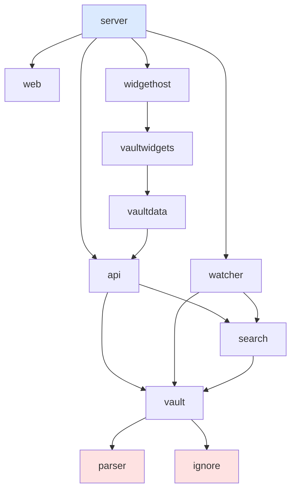
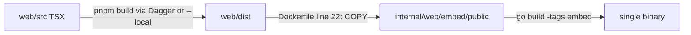

# Framework-ification analysis and implementation guide

## 1. Executive summary

publish-vault today is a standalone application: a Go server that loads a directory
of markdown notes ("a vault"), indexes it, and serves a React single-page app plus a
JSON API plus a server-driven widget-page system (JavaScript files executed in an
embedded goja runtime). It works well, but nothing outside this repository can reuse
it, for two concrete reasons:

- The Go module is named `retro-obsidian-publish` — a name that does not match any
  fetchable URL, so `go get` cannot resolve it from another repository.
- Every reusable package lives under `internal/`, which the Go toolchain forbids
  importing from outside this module.

This ticket makes publish-vault importable as
`github.com/go-go-golems/publish-vault` so that a new application repository
(golem-docs, the go-go-golems documentation server) can depend on it like any other
library, wire its own content pipeline in front of it, and reuse the entire server,
search, widget-host, and embedded frontend without forking anything.

The work has three parts, in dependency order:

1. **Module rename** — `retro-obsidian-publish` → `github.com/go-go-golems/publish-vault`
   in `go.mod` and every import statement, plus every non-Go file that hardcodes the
   module path (Makefile logcopter flags, generated logcopter files).
2. **Package promotion** — move the reusable packages from `internal/` to `pkg/`,
   keeping true implementation details (`ignore`, `parser`) internal.
3. **Frontend delivery** — decide and implement how a downstream module gets the
   built React bundle, since `go:embed` can only embed files that exist inside the
   published module version.

## 2. Problem statement and scope

### 2.1 The concrete downstream consumer

golem-docs (new repository, created alongside this ticket) wants to write roughly
this `main.go`:

```go
import (
    "github.com/go-go-golems/publish-vault/pkg/server"
)

func main() {
    // 1. collector: materialize doc markdown from Go dependencies into a vault dir
    vaultDir := collector.Materialize(...)

    // 2. run the full publish-vault server against it
    err := server.Run(ctx, server.Config{
        VaultDir:  vaultDir,
        Port:      8080,
        VaultName: "go-go-golems docs",
        ServeWeb:  true,
        PagesDir:  "./pages", // JS widget pages for the docs UI
    })
}
```

Everything in that sketch already exists in this repository except the ability to
import it. `server.Run(ctx, server.Config{...})` is already the single entrypoint
used by our own CLI (`cmd/retro-obsidian-publish/commands/serve/serve.go:142`).

### 2.2 In scope

- Rename the module and fix every reference (Go and non-Go).
- Promote packages to `pkg/` with a curated public surface.
- Make `go build` work for a downstream module in both frontend modes
  (`-tags embed` with the bundled SPA; no tag with `ServeWeb` disabled or
  a caller-provided filesystem).
- A release flow that produces tags whose module zip contains the built frontend.
- Keep the existing binary, Docker image, CI, GitOps deployment, and devctl
  workflows working unchanged.

### 2.3 Out of scope

- The golem-docs application itself (its own ticket, in its own repository).
- Publishing any npm package. The extension surface for downstream apps is
  server-side JavaScript (widget pages) plus Go configuration; a frontend library
  extraction is deliberately deferred until a second frontend consumer exists
  (see rag-evaluation-system issue #28 for the parallel widget.dsl extraction).
- Renaming the binary/cmd directory (decision D3 keeps it).

## 3. Current-state architecture (evidence-based)

### 3.1 Package inventory

All application code lives in `internal/` (line counts from 2026-07-18):

| Package | Lines | Role |
|---|---|---|
| `internal/server` | 2139 | HTTP server: routes, SPA serving, SSR proxy, reload, markdown mirrors. Exposes `Config` + `Run` |
| `internal/vault` | 1111 | Vault model: `Note`, `FileNode`, `WikiLinkRef`; loads a directory into memory (`vault.New(rootDir)`) |
| `internal/parser` | 950 | Markdown → HTML (goldmark), frontmatter, wiki-links. Only imported by `vault` |
| `internal/widgethost` | 734 | goja page host: page discovery, `evalPage`, `HandleAction`, HTTP handlers for `/api/widget/*` |
| `internal/search` | 636 | Bleve index: `search.New(v)`, `NewPersistent`, `SearchResult` |
| `internal/ignore` | 525 | `.gitignore`-style filtering for vault loading. Only imported by `vault` |
| `internal/api` | 426 | JSON API handler + shared types: `SnapshotProvider`, `PublicConfig`, `NoteListItem`, `NoteList`, `TagCounts` |
| `internal/vaultwidgets` | 419 | goja module `vault.widgets`: note-domain IR builders (noteHtml, frontmatter, backlinks, …) |
| `internal/vaultdata` | 290 | goja module `vault.data`: read-only vault queries for page scripts |
| `internal/watcher` | 273 | fsnotify-based vault reload |
| `internal/web` | 192 | Frontend delivery: `go:embed` of the built SPA behind the `embed` build tag |

### 3.2 Dependency graph

The internal graph is a clean DAG — no cycles, one sink (`server`), two leaves that
are pure implementation detail (`ignore`, `parser`):



Red nodes stay `internal/` after promotion; everything else moves to `pkg/`.

### 3.3 Key public surfaces (what downstream code will call)

- `server.Config` (`internal/server/server.go:29`) — `VaultDir`, `Port`, `VaultName`,
  `PageTitle`, `ServeWeb`, `Watch`, `ReloadToken`, `SSRURL`, `FaviconPath`,
  `SearchIndexPath`, `PagesDir`. `server.Run(ctx, cfg)` blocks until ctx cancel.
- `vault.New(rootDir string) (*Vault, error)` (`internal/vault/vault.go:81`).
- `search.New(v *vault.Vault) (*Index, error)` (`internal/search/search.go:46`).
- `api.SnapshotProvider` (`internal/api/api.go:26`) — `Snapshot() (*vault.Vault,
  *search.Index)`; the seam that lets the watcher atomically swap vaults under the
  API, widget host, and goja modules.
- `widgethost.New(provider, config, pagesDir) *Host` (`internal/widgethost/widgethost.go:61`).
- `vaultdata.Register(reg, provider, config)` / `vaultwidgets.Register(...)` — attach
  the goja modules to a `require.Registry` (`internal/vaultdata/vaultdata.go:38`).
- `web.PublicFS fs.FS` (`internal/web/embed.go:16`) — the built SPA, present only
  under `-tags embed`; `embed_none.go` provides the no-op variant.

### 3.4 How the frontend reaches the binary today



- `Dockerfile:22-23`: copies `web/dist` → `internal/web/embed/public`, then
  `go build -tags embed`.
- `internal/web/generate.go:3` has `//go:generate go run ../../cmd/retro-obsidian-publish build web`
  (the Dagger-based build verb) — this is why `make logcopter-generate` invokes
  logcopter-gen directly instead of `go generate ./...`.
- `internal/web/embed/public` is **not committed**; it exists only inside Docker
  builds and CI. This is the crux of the downstream-delivery problem (§5.3).

### 3.5 Everything that hardcodes the module name

`grep -rl "retro-obsidian-publish"` (excluding `.git`, `node_modules`, `ttmp`, `.history`):

- **Go**: `go.mod:1` plus every import statement; all 15 generated
  `logcopter.go` files (`-strip-prefix retro-obsidian-publish` is baked into them).
- **Makefile**: `LOGCOPTER_FLAGS` strip-prefix; `backend` target output path
  `bin/retro-obsidian-publish`; `backend-dev` / `build-web` run `./cmd/retro-obsidian-publish`.
- **CI/deploy**: `.github/workflows/ci.yml`, `.github/workflows/publish-image.yaml`,
  `Dockerfile`, `deploy/gitops-targets.json` — these reference *filesystem paths*
  (`./cmd/retro-obsidian-publish`) and *image names*, not the module path, so the
  module rename does not break them (verified per-file in Phase 1).
- **Cosmetic**: `README.md`, `web/package.json` `"name"` field,
  `plugins/retro-obsidian-publish.py` + `plugins/test_retro_plugin.py` (devctl
  plugin, references the binary path), `scripts/smoke-ssr-hydration.mjs`,
  `.devctl.yaml`, `.gitignore` (`bin/` entry), `docs/github-app-gitops-pr-automation-guide.md`.

## 4. Gap analysis

| Requirement (golem-docs) | Today | Gap |
|---|---|---|
| `go get github.com/go-go-golems/publish-vault` | module `retro-obsidian-publish` | rename module; path must equal repo URL for the Go proxy to resolve it |
| `import .../pkg/server` | `internal/server` | promote to `pkg/`; Go forbids importing another module's `internal/` |
| Serve the SPA from a downstream binary | `go:embed` of files that are not in git | tagged versions must contain built assets, or caller must supply an `fs.FS` |
| Custom pages | `PagesDir` config + goja host | none — already works |
| Custom data modules (`docs.data`) | `vaultdata.Register` pattern | export the registration seam (comes free with promotion) |
| Versioned releases | no tags exist | `tag-patch` + release workflow (this ticket adds the flow) |

## 5. Proposed design

### 5.1 D1 — Module path `github.com/go-go-golems/publish-vault` (accepted)

- **Context**: `go get` resolves module paths as URLs. The repository already lives
  at `github.com/go-go-golems/publish-vault`.
- **Options**: (a) rename module in place; (b) create a separate library repo and
  extract packages into it.
- **Decision**: (a). One repository, one module, the binary stays as the reference
  application of its own framework.
- **Consequences**: one mechanical sweep over all import statements; logcopter
  areas and generated files must be regenerated because `-strip-prefix` changes;
  any local `go.work` that lists this module keeps working (path on disk unchanged).

### 5.2 D2 — Curated promotion: nine packages to `pkg/`, two stay internal (accepted)

- **Context**: `internal/` is invisible to downstream; but exporting *everything*
  maximizes the API surface we must keep stable.
- **Decision**: move `server`, `vault`, `search`, `api`, `watcher`, `web`,
  `widgethost`, `vaultdata`, `vaultwidgets` to `pkg/<name>`. Keep `ignore` and
  `parser` under `internal/` — they are only imported by `vault`, and Go permits a
  `pkg/` package to import its own module's `internal/` packages; downstream simply
  cannot reach them directly.
- **Check during implementation**: no *exported* symbol of a promoted package may
  reference an `internal` type in its signature (compiles, but downstream cannot
  name the type). As of today `vault.Note` etc. are defined in `vault` itself, so
  this should hold; verify with `go doc` over the promoted packages.
- **Consequences**: import rewrite `internal/x` → `pkg/x` for the nine packages;
  `cmd/` updated; `LOGCOPTER_PACKAGES` gains `./pkg/...`.

### 5.3 D3 — Keep `cmd/retro-obsidian-publish` and the binary name (accepted)

- **Context**: Dockerfile, CI, GitOps image, devctl plugin, and the k3s deployment
  all reference the binary path/name. Renaming them is pure churn with deployment
  risk and zero framework value.
- **Decision**: keep the cmd path and binary name. Optionally alias later.

### 5.4 D4 — Frontend delivery: tagged assets + caller override (accepted)

The `go:embed` constraint: a downstream build embeds files *from the publish-vault
module zip of the version it depends on*. If the assets are not committed at the
tag, `-tags embed` fails downstream with "pattern embed/public: no matching files".

- **Options considered**:
  - (a) Commit `web/dist` to `main` permanently — works, but every frontend PR
    carries megabytes of generated-diff noise.
  - (b) Release workflow: on dispatch, build the frontend, commit
    `pkg/web/embed/public` in a single release commit, tag it, push tag. `main`
    stays clean; tags are self-contained.
  - (c) Make downstream responsible: export a `server.Config.WebFS fs.FS` field so
    the caller passes its own built bundle (which it obtains however it wants).
- **Decision**: (b) as the primary path, plus (c) as a cheap, explicit escape hatch
  (it also enables downstream apps that *fork* the frontend later without touching
  this module). Non-embed builds keep today's behavior (`embed_none.go` no-op; the
  server serves API-only or proxies a dev server).
- **Release flow pseudocode** (`.github/workflows/release-assets.yml`,
  workflow_dispatch with a `bump` input):

```text
checkout main
pnpm --dir web install && make web            # build web/dist
cp -r web/dist pkg/web/embed/public
git commit -m "release: embed web assets"     # single commit, not pushed to main
tag=$(svu $bump)                              # reuses the validated tag logic
git tag $tag; git push origin $tag            # tag only; main unchanged
```

  The tag's commit is reachable from the tag ref, which is all `go get` needs.

### 5.5 D5 — Versioning starts at v0.x (accepted)

v0 semantics: the API may still move. First tag `v0.1.0` after this ticket lands.
golem-docs can also track `@main` pseudo-versions during co-development.

### 5.6 Resulting layout

```text
publish-vault/
├── cmd/retro-obsidian-publish/     # unchanged reference app
├── pkg/                            # NEW: public framework surface
│   ├── server/  vault/  search/  api/  watcher/
│   ├── web/                        # embed.go, embed_none.go, static.go (+ embed/public at tags)
│   ├── widgethost/  vaultdata/  vaultwidgets/
├── internal/
│   ├── ignore/                     # stays: vault-loading detail
│   └── parser/                     # stays: markdown pipeline detail
├── web/                            # SPA sources (unchanged)
└── examples/widget-pages/          # JS page examples (unchanged)
```

## 6. Phased implementation plan

### Phase 1 — Module rename

1. `go.mod`: `module github.com/go-go-golems/publish-vault`.
2. Rewrite imports: `grep -rl '"retro-obsidian-publish' --include='*.go' | xargs sed -i 's|"retro-obsidian-publish|"github.com/go-go-golems/publish-vault|g'`.
3. Makefile: `LOGCOPTER_FLAGS` strip-prefix → new module path; then
   `make logcopter-generate` (regenerates all 15 files; areas are unchanged because
   `-area-prefix go-go-golems.publish-vault` already used the new name).
4. Cosmetic sweep: README title/commands, `web/package.json` name → `publish-vault-web`.
5. Verify: `GOWORK=off go build ./... && make test lint logcopter-check`.
6. Commit.

### Phase 2 — Package promotion

1. `git mv internal/{server,vault,search,api,watcher,web,widgethost,vaultdata,vaultwidgets} pkg/`.
2. Import rewrite `publish-vault/internal/<p>` → `publish-vault/pkg/<p>` for the nine.
3. `Makefile`: `LOGCOPTER_PACKAGES ?= ./cmd/... ./internal/... ./pkg/...`;
   `make logcopter-generate` (regenerates: areas change `internal.vault` → `pkg.vault`).
4. `Dockerfile:22`: embed copy path → `pkg/web/embed/public`; same in
   `.gitignore` and anything referencing `internal/web/embed` (`make clean`,
   `build web` verb output path in `cmd/.../commands/build/web.go`).
5. API-surface check: `go doc ./pkg/...` — no exported signature may name an
   internal type.
6. Verify: build, tests, lint, `docker build` (or at minimum the CI embed steps:
   `go run ./cmd/retro-obsidian-publish build web --local && go build -tags embed ./cmd/...`).
7. Commit.

### Phase 3 — Downstream consumption proof

1. Scratch module outside the repo:

```go
// go.mod: require github.com/go-go-golems/publish-vault v0.0.0
//         replace github.com/go-go-golems/publish-vault => <local path>
package main
import "github.com/go-go-golems/publish-vault/pkg/server"
func main() { _ = server.Run(context.Background(), server.Config{VaultDir: "…", Port: 8081}) }
```

2. Build it without tags (API-only) and with `-tags embed` after materializing
   assets — document the failure mode when assets are absent (this is the error
   message golem-docs developers will hit; make sure it is understandable).
3. Commit any fixes; record results in the diary.

### Phase 4 — Release flow

1. Add `.github/workflows/release-assets.yml` per §5.4 (workflow_dispatch,
   bump input, svu-validated tag).
2. Extend `pkg/web/embed_none.go` doc comment to explain the two delivery modes.
3. Optional (small): `server.Config.WebFS fs.FS` override wired through to the
   static handler; skip if it grows beyond ~30 lines of plumbing.

### Phase 5 — Documentation and PR

README section "Using publish-vault as a library"; changelog/tasks/diary; PR.

## 7. Testing and validation strategy

| Layer | Command | What silent failure it prevents |
|---|---|---|
| Compile sweep | `GOWORK=off go build ./...` | missed import rewrite |
| Unit/goldens | `make test` | behavior drift in promoted packages (widgethost goldens, vaultwidgets VM tests) |
| Lint + logcopter | `make lint logcopter-check` | stale generated loggers after strip-prefix change |
| Embed build | `build web --local && go build -tags embed` | broken embed path after `pkg/web` move |
| Downstream proof | scratch module with `replace` | `internal/` leakage, unnameable types, missing assets UX |
| Runtime smoke | serve go-go-parc vault, hit `/`, `/note/...`, `/w/reader`, `/api/search` | wiring regressions invisible to compile/tests |

## 8. Risks, alternatives, open questions

- **Risk: import-rewrite misses** — mitigated by grep-verify (`grep -rn '"retro-obsidian-publish' --include='*.go'` must return empty) and the compile sweep.
- **Risk: GitOps image regression** — Dockerfile touched in Phase 2; validate via CI `test-build` job (builds the Docker image) before merge.
- **Risk: proxy caching of `@main`** — during golem-docs co-development, `GOPROXY=direct go get ...@main` avoids stale proxy pseudo-versions.
- **Open: `Config.WebFS`** — decided "yes if cheap" (Phase 4.3); revisit when golem-docs needs frontend divergence.
- **Open: goreleaser** — this repo ships as a Docker image via GitOps, not tagged
  binaries; goreleaser stays out of scope until someone wants `brew install`.

## 9. References

- `internal/server/server.go` — Config/Run entrypoint (promotes to `pkg/server`)
- `internal/api/api.go:26` — `SnapshotProvider`, the concurrency seam
- `internal/web/embed.go`, `embed_none.go` — dual-mode frontend delivery
- `cmd/retro-obsidian-publish/commands/serve/serve.go:142` — reference wiring
- `Dockerfile:22-23` — embed copy + tagged build
- `Makefile` — `LOGCOPTER_FLAGS`/`LOGCOPTER_PACKAGES`, `tag-*`, `bump-go-go-golems`
- `ttmp/2026/07/17/PV-WIDGET-DSL-015…/design-doc/` — widget system design (D1–D6)
- `ttmp/2026/07/17/PV-VAULT-WIDGETS-016…/design-doc/` — vault.widgets grammar
- rag-evaluation-system issue #28 — parallel widget.dsl library extraction
