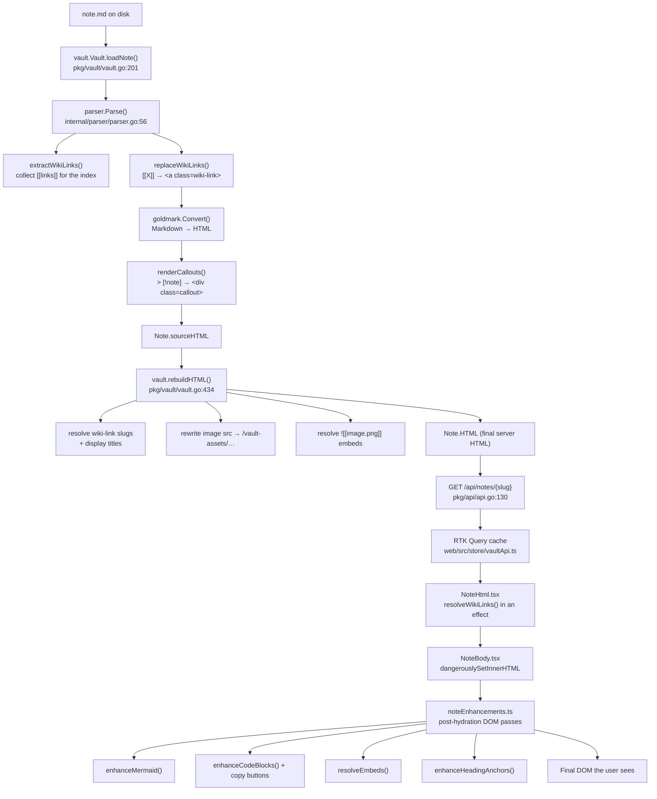

# MathJax Support: Analysis, Design, and Implementation Guide

> **Who this is for.** You have just joined the project and have been handed the
> task "make `$E = mc^2$` render as real math on the published site". You know
> Go and TypeScript but you have never seen this codebase. This document is
> meant to be the only thing you need to read. It explains the system first, the
> problem second, the design third, and the step-by-step implementation last.
>
> **How to read it.** Sections 1–3 are background: read them once, carefully.
> Section 4 is the problem statement. Sections 5–8 are the design and the
> decisions behind it. Section 9 is the actual implementation plan; you will
> live in that section. Sections 10–13 are testing, risks, references, and a
> glossary you can skim and come back to.

---

## Table of Contents

1. [What this application is](#1-what-this-application-is)
2. [The note rendering pipeline, end to end](#2-the-note-rendering-pipeline-end-to-end)
3. [The two halves of rendering: Go and the browser](#3-the-two-halves-of-rendering-go-and-the-browser)
4. [The problem: why math does not "just work"](#4-the-problem-why-math-does-not-just-work)
5. [What MathJax actually is](#5-what-mathjax-actually-is)
6. [Design decisions and the alternatives we rejected](#6-design-decisions-and-the-alternatives-we-rejected)
7. [The design in detail: Go side](#7-the-design-in-detail-go-side)
8. [The design in detail: browser side](#8-the-design-in-detail-browser-side)
9. [Implementation plan, phase by phase](#9-implementation-plan-phase-by-phase)
10. [Testing strategy](#10-testing-strategy)
11. [Risks, sharp edges, and how they bite](#11-risks-sharp-edges-and-how-they-bite)
12. [API and file reference](#12-api-and-file-reference)
13. [Glossary](#13-glossary)

---

## 1. What this application is

`publish-vault` (the binary is called `retro-obsidian-publish`) is a small
static-site-ish publishing server for an **Obsidian vault**. An Obsidian vault
is just a directory tree of Markdown files, plus images and other attachments,
plus some Obsidian-specific syntax that plain Markdown does not have —
`[[wiki links]]`, `![[embeds]]`, `> [!note]` callouts, and YAML frontmatter at
the top of each file.

The program does three things:

- It **reads the whole vault into memory** at startup and re-reads it when the
  files on disk change. Each Markdown file becomes a `Note` struct with a slug,
  a title, tags, frontmatter, and — importantly for us — a **pre-rendered HTML
  string**.
- It **serves a JSON API** (`/api/notes`, `/api/notes/{slug}`, `/api/search`,
  …) plus the vault's image assets under `/vault-assets/`.
- It **serves a React single-page application** that consumes that API. In
  production the React app is also server-side rendered by a small Node.js
  sidecar process so the first paint has real content in it, and so crawlers
  and LLM agents see a populated page.

The overall shape is therefore: *Go owns Markdown → HTML; React owns
HTML → pixels.* That split is the single most important thing to internalise,
because math sits exactly on the seam between the two.

A few structural facts that will matter later:

- The repository is a Go module `github.com/go-go-golems/publish-vault`. It
  lives inside a Go workspace (`go.work`) alongside a vendored checkout of
  `glazed`, the CLI framework used for the commands.
- The frontend lives in `web/` and is a Vite + React 19 + Redux Toolkit app,
  built with `pnpm`. It is compiled and then **embedded into the Go binary**
  via `go:embed` (`pkg/web/embed/public`), so a production deployment is a
  single binary plus the vault directory.
- There is a second, SSR-only Vite build (`web/dist/ssr/entry-server.js`) that
  the Node sidecar (`web/server.mjs`) imports. The Go server reverse-proxies
  page requests to that sidecar when it is configured.

### 1.1 Directory map

```
publish-vault/
├── cmd/retro-obsidian-publish/     CLI entry point (glazed + cobra commands)
│   └── commands/
│       ├── build/web.go            builds web/ via Dagger or local pnpm
│       └── serve/serve.go          the `serve` command
├── internal/
│   ├── parser/parser.go            ★ Markdown → HTML. Where math parsing goes.
│   └── ignore/                     .vault-ignore matching
├── pkg/
│   ├── vault/vault.go              ★ the in-memory Note model + link resolution
│   ├── api/api.go                  the JSON HTTP API
│   ├── server/server.go            HTTP router, asset handler, SSR proxy
│   ├── server/agent_markdown.go    /AGENTS.md, /llms.txt, /note/x.md mirrors
│   ├── search/search.go            full-text index
│   ├── watcher/                    fsnotify-driven live reload
│   ├── web/                        go:embed of the built frontend
│   ├── widgethost/                 goja JS runtime host for widget pages
│   └── vaultwidgets/vaultwidgets.go  the `vault.widgets` JS API
└── web/
    ├── src/components/organisms/
    │   ├── NoteView/               page furniture around a note
    │   │   ├── NoteBody.tsx        ★ the dangerouslySetInnerHTML host
    │   │   └── noteEnhancements.ts ★ post-render DOM enhancement pipeline
    │   └── NoteHtml/NoteHtml.tsx   ★ owns the enhancement effects
    ├── src/lib/highlightLanguages.ts        lazy syntax-highlighting loader
    ├── src/lib/highlightLanguages.server.ts SSR no-op stub for the above
    ├── src/widgets/ir/props.ts     widget IR prop types
    ├── src/styles/prose.css        styling for rendered note content
    ├── src/entry-server.tsx        SSR render entry
    ├── server.mjs                  Node SSR sidecar
    └── vite.config.ts              build config, aliases, SSR externals
```

The files marked ★ are the ones you will edit.

---

## 2. The note rendering pipeline, end to end

Here is the full journey of a single Markdown file, from bytes on disk to
pixels in a browser. Follow the numbers; each one is a real function you can
open.



### 2.1 Step by step, in prose

**Loading.** `vault.New(rootDir)` walks the vault directory. For each `.md`
file that is not excluded by `.vault-ignore` or `publish: false` frontmatter,
`loadNote` reads the bytes and calls `parser.Parse`.

**Parsing.** `parser.Parse` (`internal/parser/parser.go:56`) is the heart of the
Go side. It does four things, in this exact order:

1. `extractWikiLinks(src)` — runs a regex over the *raw* source to collect every
   `[[target]]` and `![[embed]]` into a `[]WikiLink`. This feeds the wiki-link
   index and the backlink graph. It does not modify the source.
2. `replaceWikiLinks(src)` — **rewrites the source before goldmark ever sees
   it**, turning `[[Foo|bar]]` into a literal `<a class="wiki-link" …>bar</a>`
   string. This is a *pre-processing pass*, and it is the exact pattern we will
   copy for math. Note that it carefully splits off the frontmatter first
   (`splitFrontmatter`, line 179) so it never injects HTML into YAML.
3. `md.Convert(processed, &buf, …)` — goldmark converts the (already
   partially-HTML) Markdown into HTML. The renderer is configured with
   `html.WithUnsafe()` (line 79), which is what allows the injected raw HTML to
   pass through instead of being escaped. It also uses `html.WithHardWraps()`
   and `html.WithXHTML()`, and the GFM, Table, Strikethrough, TaskList and
   Footnote extensions.
4. `renderCallouts(htmlOut)` — a **post-processing pass** that runs a regex over
   the *rendered HTML* to turn goldmark's blockquote output into styled callout
   divs.

So the parser already has both a pre-pass and a post-pass. Math will use the
pre-pass slot.

**Vault-level resolution.** `Parse` gives back HTML that still contains
unresolved placeholders — a wiki link knows its short target but not the full
vault slug, an image embed knows its filename but not its URL. Once *all* notes
are loaded, `buildWikiLinkIndex()` and `RefreshAssetIndex()` build the lookup
tables, and `rebuildHTML()` (`pkg/vault/vault.go:434`) runs four string passes
over every note to fill them in. The result is stored in `Note.HTML`. The
pre-resolution output is kept in the unexported `Note.sourceHTML` so a rebuild
always re-renders from the parser output rather than compounding on top of a
previous rebuild.

**Serving.** `GET /api/notes/{slug}` (`pkg/api/api.go:130`) simply JSON-encodes
the `Note`, `HTML` field and all.

**Rendering in React.** `NoteHtml` (`web/src/components/organisms/NoteHtml/NoteHtml.tsx`)
receives that HTML string. It does a second, client-side wiki-link resolution
pass in an effect, then hands the string to `NoteBody`, which is a single
`<div class="note-prose" dangerouslySetInnerHTML={{__html: html}} />`.

**Enhancing.** Because the HTML is injected raw, anything that needs JavaScript
has to happen *after* the DOM exists. That is what `noteEnhancements.ts` is:
a set of idempotent functions that take the container element and mutate it.
`NoteHtml` wires each one into its own `useEffect`, keyed on the resolved HTML
string.

---

## 3. The two halves of rendering: Go and the browser

### 3.1 Why the split exists

Go produces HTML because that HTML has to be usable by things that are not a
browser: the search index, the `/note/{slug}.md` agent mirror, SEO meta tags,
and the SSR sidecar. The browser handles the rest because some things genuinely
require a JavaScript runtime — Mermaid needs to lay out a graph, highlight.js
needs a tokenizer, and MathJax needs a full TeX engine.

### 3.2 The enhancement pattern, studied

Read `enhanceMermaid` (`noteEnhancements.ts:24`) closely — it is the template
you will follow:

```ts
export function enhanceMermaid(root: HTMLElement): () => void {
  const blocks = root.querySelectorAll<HTMLElement>("code.language-mermaid");
  if (blocks.length === 0) return () => {};      // ① cheap bail-out

  let cancelled = false;

  const render = async () => {
    const { default: mermaid } = await import("mermaid");   // ② dynamic import
    if (cancelled) return;                                   // ③ cancel check

    if (!mermaidInitialized) { mermaid.initialize({...}); mermaidInitialized = true; }  // ④ module-level init guard

    await Promise.all(Array.from(blocks).map(async block => {
      const pre = block.parentElement;
      if (!pre || pre.tagName !== "PRE") return;
      try {
        const { svg } = await mermaid.render(id, block.textContent ?? "");
        if (cancelled || !pre.isConnected) return;           // ⑤ re-check after await
        const container = document.createElement("div");
        container.className = "mermaid-svg retro-inset my-2 overflow-x-auto";
        container.innerHTML = svg;
        pre.replaceWith(container);
      } catch {
        // ⑥ leave the raw <pre> as a visible fallback
      }
    }));
  };

  void render();
  return () => { cancelled = true; };            // ⑦ effect cleanup
}
```

Every one of those seven numbered points is load-bearing, and every one of them
applies verbatim to math:

1. **Cheap bail-out.** A note with no math must not pay for MathJax at all. The
   `querySelectorAll` returning empty means the dynamic `import()` never fires,
   so the chunk is never fetched.
2. **Dynamic import.** This is what makes Vite emit a separate chunk. MathJax is
   large; it must never land in the main bundle.
3. **Cancel check immediately after the await.** React effects can be torn down
   while a promise is in flight (React 19 strict mode double-invokes effects in
   development, and navigation can unmount the component). Without this, a
   stale render writes into a DOM that no longer belongs to it.
4. **Module-level init guard.** MathJax, like Mermaid, is a singleton with
   expensive one-time setup. Initialise once per page lifetime, not per note.
5. **Re-check `isConnected` after every await.** `NoteBody` is `memo()`d
   precisely because React re-applies `dangerouslySetInnerHTML` on every render
   and would wipe out injected DOM; but navigation still legitimately replaces
   the container, and the node you captured before the await may be detached.
6. **Graceful failure.** A TeX syntax error must leave the source visible, not
   blank the paragraph.
7. **Return a cleanup function** so `useEffect` can call it.

### 3.3 The ordering constraint

The file header of `noteEnhancements.ts` documents an ordering rule: Mermaid
must run before syntax highlighting, because Mermaid *consumes* its
`code.language-mermaid` blocks and replaces them with SVG containers, and if
hljs got there first it would have already tokenised the diagram source as if
it were code.

Math introduces a second ordering constraint, in the opposite direction: math
placeholders live in ordinary paragraph text and inside code blocks must be
left alone. We will handle that on the **Go** side by never emitting a math
placeholder inside a code span or fence, which means the browser-side ordering
of `enhanceMath` relative to the others is genuinely free. Put it first anyway,
so that `enhanceCodeBlocks`'s `addCopyButtons` never sees a half-typeset DOM.

### 3.4 SSR and hydration

`web/server.mjs` imports `renderApp` from the SSR bundle and calls
`renderToString`. That happens in Node, where there is no `window`, no
`document`, and no layout engine. Two consequences:

- Enhancement functions never run on the server, because they are invoked from
  `useEffect`, which React does not run during `renderToString`. So the
  server-rendered HTML contains the *placeholder*, and the client upgrades it
  after hydration. This is exactly what already happens for Mermaid.
- Any module that would explode if imported in Node must be kept out of the SSR
  module graph. The project already solves this for highlight.js with a
  build-conditional alias in `vite.config.ts`:

  ```ts
  "@highlight-languages": path.resolve(
    WEB_ROOT,
    isSsrBuild ? "src/lib/highlightLanguages.server.ts"
               : "src/lib/highlightLanguages.ts"
  ),
  ```

  Since our MathJax import is inside a dynamic `import()` that only executes in
  an effect, we do **not** strictly need this. But a dynamic import still
  produces an SSR chunk, and MathJax's ESM entry points touch globals at module
  scope in some configurations. Mirroring the alias pattern is cheap insurance
  and is consistent with how the codebase already handles this class of
  problem.

---

## 4. The problem: why math does not "just work"

You might reasonably ask: Markdown passes unknown text straight through, so why
can't we just leave `$x^2$` in the source, let goldmark emit it as ordinary
text, and have MathJax scan the page like it does on a plain HTML site?

Because Markdown is not a passthrough. By the time goldmark is done, the TeX
has been mangled. Here are the concrete failure modes, each of which you should
be able to reproduce in a scratch test:

### 4.1 Underscores become emphasis

TeX uses `_` for subscripts. Markdown uses `_` for italics.

| Source | What goldmark emits | What you wanted |
|---|---|---|
| `$a_1 + b_2 = c_3$` | `$a<em>1 + b</em>2 = c_3$` | `$a_1 + b_2 = c_3$` |
| `$x_i^2$` | usually survives (one `_`) | — |

One underscore is usually fine; two in the same "word run" pair up into `<em>`.
This is the single most common real-world breakage, because subscripted
sequences like `x_1, x_2` are everywhere in real notes.

### 4.2 Asterisks become bold/italic

`$a * b * c$` → `$a <em> b </em> c$`. Convolution operators, and the `*` in
`\times`-free notation, both hit this.

### 4.3 Backslashes get eaten

Markdown treats `\` as an escape character before ASCII punctuation. `\{` in
TeX means "a literal brace"; Markdown consumes the backslash and emits `{`.
Worse, `\\` (TeX's newline inside `align`) becomes a single literal backslash —
or, with `html.WithHardWraps()` enabled as it is here, interacts with line-break
handling in ways that are hard to predict.

### 4.4 Hard wraps insert `<br/>` into multi-line math

The renderer is configured with `html.WithHardWraps()` (parser.go:77). A display
math block written across several lines:

```
$$
\begin{align}
a &= b \\
c &= d
\end{align}
$$
```

comes out with `<br/>` tags interleaved between the TeX lines. MathJax will
then either choke or typeset garbage.

### 4.5 Ampersands and angle brackets get escaped

`&` is the alignment character in `align`/`matrix` environments. goldmark
escapes it to `&amp;`. Similarly `a < b` becomes `a &lt; b`. If you feed
`&amp;` to MathJax you get a literal ampersand entity in the output.

Note the asymmetry: escaping is *correct* for HTML, and if we later read the
TeX back out of the DOM via `textContent`, the browser will have already
un-escaped it. The problem is only that goldmark's escaping and Markdown's
inline parsing are interleaved, so we cannot reason about the result.

### 4.6 Currency false positives

The opposite failure. A note that says

> The book costs $10 and the ebook costs $5.

must **not** be interpreted as inline math containing `10 and the ebook costs `.
Any delimiter scanner has to have rules that make this case safe.

### 4.7 Math inside code must stay literal

A note documenting this very feature will contain:

````
```markdown
Inline math is written `$e^{i\pi}$`.
```
````

None of that may be converted. The scanner must respect code spans, fenced code
blocks, and indented code blocks.

### 4.8 Frontmatter must be untouched

`splitFrontmatter` already exists for exactly this reason in the wiki-link path.
A frontmatter value like `formula: "$x^2$"` is YAML, not prose.

### 4.9 Summary of the requirement

> We need to identify math regions in the **raw Markdown source**, before
> goldmark runs, and replace them with an inert HTML placeholder that carries
> the original TeX through the rest of the pipeline byte-for-byte.

That is exactly the `replaceWikiLinks` trick, applied to a harder scanning
problem.

---

## 5. What MathJax actually is

MathJax is a JavaScript library that takes math written in TeX (or MathML, or
AsciiMath) and produces rendered output. Three things you need to know:

### 5.1 Input and output jaxes

MathJax is built as a pipeline of interchangeable **input processors** and
**output processors**:

```
   TeX string  ──► [TeX input jax] ──► internal MathML tree ──► [output jax] ──► DOM
   MathML      ──► [MathML input]  ──┘                          ├─ SVG
   AsciiMath   ──► [AsciiMath in]  ──┘                          ├─ CHTML (CSS + HTML + webfonts)
                                                                └─ (MathML passthrough)
```

The choice of output jax is a real architectural decision for us:

| Output | What it emits | Fonts | Pros | Cons |
|---|---|---|---|---|
| **SVG** | inline `<svg>` with `<path>` glyphs | glyph outlines are compiled into the JS bundle | fully self-contained; no font files to serve; pixel-identical everywhere; trivially embeddable in the existing lightbox | larger JS chunk; text is not selectable/copyable as text; each glyph is a path |
| **CHTML** | `<mjx-container>` with CSS-positioned spans | needs `.woff` font files served from a URL | selectable text; smaller JS; better for accessibility tooling | requires serving font assets through the Go embed and `/static/`; FOUT while fonts load; needs `output.fontURL` config |
| **MathML** | native `<math>` elements | browser's own math fonts | tiny; native accessibility | rendering quality varies a lot across browsers; still the weakest link |

### 5.2 Versions and packaging

As of this writing the current release is **MathJax 4.1.3**. The npm landscape:

- `mathjax@4.1.3` — the *distribution* package: pre-built component bundles
  (`tex-svg.js`, `tex-chtml.js`, …) meant for `<script src>` loading.
- `@mathjax/src@4.1.3` — the *source* package with ESM modules under `mjs/`.
  This is what a bundler-based app should depend on, because it lets Vite
  tree-shake and code-split rather than shipping a monolithic component file.
  (In MathJax 3 this package was called `mathjax-full`; that name is frozen at
  3.2.2 and should not be used for new work.)
- `@mathjax/mathjax-newcm-font@4.1.3`, `@mathjax/mathjax-tex-font@4.1.3`,
  `@mathjax/mathjax-modern-font@4.1.3` — in v4 the fonts were split out of the
  core package. You only need these for CHTML output; the SVG output jax ships
  its own path data.

### 5.3 The two ways to drive it

**Component/global style** (the classic one you see in tutorials): set
`window.MathJax = {...}` then load a `<script>`; the library scans the document
on load and exposes `MathJax.typesetPromise()`. This is convenient for static
sites and terrible for a bundled SPA — it is a global, it fights with the
bundler, and it re-scans the entire document rather than a subtree.

**Direct API style** (what we want): construct the document handler yourself.

```ts
import { mathjax }        from "@mathjax/src/mjs/mathjax.js";
import { TeX }            from "@mathjax/src/mjs/input/tex.js";
import { SVG }            from "@mathjax/src/mjs/output/svg.js";
import { browserAdaptor } from "@mathjax/src/mjs/adaptors/browserAdaptor.js";
import { RegisterHTMLHandler } from "@mathjax/src/mjs/handlers/html.js";
import { AllPackages }    from "@mathjax/src/mjs/input/tex/AllPackages.js";

RegisterHTMLHandler(browserAdaptor());

const tex = new TeX({ packages: AllPackages });
const svg = new SVG({ fontCache: "local" });
const doc = mathjax.document(document, { InputJax: tex, OutputJax: svg });

// Convert one TeX string to a DOM node:
const node = doc.convert("x^2 + y^2 = z^2", { display: false });
```

This gives us exactly what the placeholder design needs: a function from a TeX
*string* to a DOM *node*, with no document scanning at all. We know precisely
which elements contain math because we put the markers there ourselves.

`fontCache: "local"` is worth calling out. SVG output normally emits a shared
`<defs>` block of glyph paths per document and references them with `<use>`;
`"local"` scopes that cache to each individual `<svg>`. Because our math nodes
get moved around (into the lightbox, into embedded notes) and because
`dangerouslySetInnerHTML` can replace whole subtrees, a global cache would leave
`<use>` references dangling. Use `"local"`.

---

## 6. Design decisions and the alternatives we rejected

### 6.1 Decision record

| # | Decision | Choice | Rejected alternatives |
|---|---|---|---|
| D1 | Where is math *detected*? | In Go, in `internal/parser`, as a pre-goldmark pass | Client-side regex on rendered HTML (too late — already mangled); a goldmark AST extension (see D2) |
| D2 | Pre-pass or goldmark extension? | Hand-written pre-pass, mirroring `replaceWikiLinks` | A third-party goldmark math extension; writing our own `parser.InlineParser` |
| D3 | Where is math *typeset*? | In the browser, in `noteEnhancements.ts`, mirroring Mermaid | Server-side pre-render via the Node SSR sidecar; server-side MathML in Go |
| D4 | Which MathJax package? | `@mathjax/src` (ESM, bundler-friendly) | `mathjax` component bundles; a CDN `<script>` tag |
| D5 | Which output jax? | SVG with `fontCache: "local"` | CHTML (needs font assets plumbed through go:embed); native MathML |
| D6 | How is TeX carried through the HTML? | As the placeholder element's **text content**, HTML-escaped | A `data-tex` attribute; a `<script type="math/tex">` tag |
| D7 | KaTeX instead? | No | KaTeX is faster and smaller but supports a strict subset of TeX; the ticket asks for MathJax and vault notes use `align`, `\begin{cases}`, and macro definitions |

### 6.2 The reasoning behind D2: why not a goldmark extension

goldmark is extensible: you can register an `InlineParser` for `$` and a
`BlockParser` for `$$`, add an AST node kind, and add a renderer for it. That is
the "proper" way and it is what a general-purpose library would do.

We are not doing it, for three reasons:

1. **The codebase already has the pre-pass idiom, and consistency wins.**
   `replaceWikiLinks` and `renderCallouts` establish that this project handles
   Obsidian-flavoured syntax with targeted string passes around goldmark, not by
   extending it. A new engineer reading the file should find one pattern, not
   two.
2. **A pre-pass is strictly easier to get right for our escaping problem.** The
   whole point is to remove math from goldmark's view. An inline parser still
   has to cooperate with goldmark's own escaping and its text segmentation; the
   pre-pass hands us the raw bytes with no interference.
3. **Testability.** A pure `func scanMath([]byte) []mathSpan` is trivial to
   table-test, including all the currency and code-fence edge cases, without
   spinning up a goldmark instance.

The cost is that we must implement code-span and code-fence skipping ourselves.
That is real work, but it is bounded, well-specified work — see §7.2.

### 6.3 The reasoning behind D3: why client-side typesetting

The tempting alternative is to typeset on the server. The SSR sidecar is already
a Node process, so it *could* import MathJax and pre-render. Benefits would be
real: no flash of raw TeX, math visible without JavaScript, math present in the
HTML that crawlers and LLM agents see.

We are not doing it in v1, because of where the HTML comes from. `Note.HTML` is
produced by **Go** and served over the API. The SSR sidecar renders the React
tree, but the note HTML inside it is an opaque string it received from Go. To
pre-render math, the sidecar would have to transform that string — and then the
client, hydrating the same tree, must produce a byte-identical string or React
logs a hydration mismatch and (for `dangerouslySetInnerHTML`) can blow away the
server DOM. Making a MathJax SVG render deterministic and identical across two
processes is possible but fragile: it depends on matching versions, matching
font metrics, and matching id-generation.

There is also a plain-old-caching problem: the sidecar would re-typeset the same
note on every request unless we add a cache, and the cache would need
invalidation on vault reload.

So: **v1 is client-side**, matching Mermaid exactly. Server-side pre-rendering
is written up as Phase 5 / future work in §9.6, where the right move is
probably to render math *in Go's pipeline once per note* (by shelling out to a
Node helper at load time and caching in `Note.HTML`), not in the request path.

### 6.4 The reasoning behind D6: text content, not attributes

Three ways to carry the TeX from Go to the browser:

**(a) `data-tex` attribute.**
`<span class="math" data-tex="a &amp; b"></span>`. Read back with
`el.dataset.tex`. Works, but: attribute values need `"` and `&` escaping;
newlines inside attributes are legal but get normalised by the HTML parser
(CR and CRLF both become LF), which is *probably* fine for TeX but is one more
thing to reason about; and the element has no text content, so a no-JS visitor
sees nothing at all.

**(b) `<script type="math/tex">`.** The MathJax v2 convention. Script contents
are a raw-text element, so nothing inside is HTML-parsed — perfect fidelity.
But: any TeX containing the literal `</script` breaks it and must be escaped
specially; a `<script>` tag inside note HTML is exactly the kind of thing a
future Content-Security-Policy or HTML sanitiser will strip; and React's
`dangerouslySetInnerHTML` gives it inconsistent treatment.

**(c) Text content of a `<span>`/`<div>` — chosen.**

```html
<span class="math math-inline">a \amp; b</span>
<div class="math math-display">\begin{align} …\end{align}</div>
```

with only `&`, `<`, `>` escaped (i.e. `html.EscapeString` on the Go side is
fine; it additionally escapes quotes, which is harmless because the browser
un-escapes them). Read back with `el.textContent`, which the DOM gives us fully
un-escaped and with newlines intact.

The decisive advantage is the **no-JavaScript fallback**: the raw TeX is
visible. A reader without JS, an LLM agent scraping the HTML, and the "view
source" case all get something meaningful instead of an empty element. It also
means a MathJax failure degrades to showing the source rather than showing
nothing — the same graceful-degradation property `enhanceMermaid` has.

One consequence to design around: between first paint and typesetting there is
a brief moment where raw TeX is visible. §8.4 covers styling that so it reads as
intentional rather than broken.

---

## 7. The design in detail: Go side

### 7.1 What we are building

A new file `internal/parser/math.go` exposing:

```go
// MathSpan describes one math region found in Markdown source.
type MathSpan struct {
    Start   int   // byte offset of the opening delimiter
    End     int   // byte offset just past the closing delimiter
    TeX     string // the content between the delimiters, verbatim
    Display bool   // true for $$…$$ / \[…\]; false for $…$ / \(…\)
}

// ScanMath finds every math region in body (which must NOT include
// frontmatter). Regions inside code spans, fenced code blocks, and indented
// code blocks are skipped.
func ScanMath(body []byte) []MathSpan

// ReplaceMath rewrites body, substituting each math span with an inert HTML
// placeholder that goldmark passes through unchanged.
func ReplaceMath(body []byte) []byte
```

and a small change in `Parse` to call `ReplaceMath` in the pre-pass chain.

### 7.2 The scanner, precisely specified

This is the part that needs to be right. Write it as a single left-to-right
byte scan with an explicit state machine — **not** as a regex. Regexes cannot
express "skip fenced code blocks" without becoming unreadable, and the currency
rule needs lookahead/lookbehind that Go's RE2 engine does not support.

#### 7.2.1 Delimiters we recognise

| Syntax | Mode | Notes |
|---|---|---|
| `$$ … $$` | display | may span lines; the most common Obsidian form |
| `$ … $` | inline | subject to the anti-currency rules below |
| `\[ … \]` | display | LaTeX-native; Pandoc and Obsidian both accept it |
| `\( … \)` | inline | LaTeX-native |

`\[`/`\(` support is cheap once the scanner exists and makes pasted LaTeX work.
Include it.

#### 7.2.2 Skip regions

The scanner maintains a mode. Before testing for a math delimiter at position
`i`, it first checks whether `i` is inside a skip region:

- **Fenced code block.** A line whose first non-space run (≤3 spaces of indent)
  is ``` ``` ``` or `~~~` opens a fence of that character and length. The fence
  closes at the next line whose fence run is the same character and at least as
  long. Everything between, inclusive of the fence lines, is skipped.
- **Indented code block.** A line indented by ≥4 spaces (or one tab) that is not
  a continuation of a paragraph. *Simplification:* treating any ≥4-space-indented
  line outside a list as code is close enough; note the imprecision in a comment
  and cover it with a test.
- **Code span.** A run of *n* backticks opens a code span that closes at the
  next run of exactly *n* backticks on the same... actually, per CommonMark, in
  the same block. Track the opening run length and skip to the matching run.
- **HTML comment.** `<!-- … -->` — cheap to add, prevents surprises in notes
  that comment out draft math.

#### 7.2.3 The `$` rules

Adopted from Pandoc, which has the most battle-tested version of these rules:

An opening `$` starts inline math if and only if:

- it is not preceded by an odd number of backslashes (i.e. `\$` is a literal
  dollar sign, `\\$` is a literal backslash followed by an opener);
- the character immediately after it is **not** whitespace;
- the character immediately after it is **not** another `$` (that is a `$$`
  display opener, handled first).

A closing `$` ends inline math if and only if:

- it is not backslash-escaped;
- the character immediately **before** it is not whitespace;
- the character immediately **after** it is not an ASCII digit.

That last rule is the anti-currency rule. Walk through `costs $10 and $5.`:

- The `$` before `10` is followed by `1`, not whitespace → it is a candidate
  opener. Scan forward for a closer.
- The `$` before `5` is preceded by ` ` (whitespace) → **not** a valid closer.
- No other `$` on the line → no closer found → the candidate opener is emitted
  as a literal `$` and scanning resumes after it. Correct.

And `$x$ and $y$`:

- `$` before `x`: next char `x` is not whitespace → opener.
- `$` after `x`: previous char `x` is not whitespace, next char is ` ` (not a
  digit) → valid closer. Span = `x`. Correct.

Additional constraint for inline math: **it may not contain a blank line.** If
the scan for a closer crosses `\n\n`, abandon the candidate. This bounds the
damage of an unmatched `$` to a single paragraph instead of swallowing the rest
of the document.

Display `$$` has no whitespace rules (it is unambiguous) but should still be
abandoned if no closer is found before end of input.

#### 7.2.4 Pseudocode

```
func ScanMath(body []byte) []MathSpan:
    spans   = []
    i       = 0
    atLineStart = true

    while i < len(body):
        if atLineStart and fenceOpensAt(body, i):
            i = skipFencedBlock(body, i)      # past the closing fence line
            atLineStart = true
            continue

        if atLineStart and indentedCodeAt(body, i):
            i = skipToNextLine(body, i)
            continue

        c = body[i]

        if c == '\\':
            # \[ and \( open math; any other \x is an escape — skip both bytes
            if i+1 < len(body) and body[i+1] == '[':
                if end, tex, ok = scanUntil(body, i+2, "\\]"); ok:
                    spans.append(MathSpan{i, end, tex, display:true}); i = end; continue
            if i+1 < len(body) and body[i+1] == '(':
                if end, tex, ok = scanUntil(body, i+2, "\\)"); ok:
                    spans.append(MathSpan{i, end, tex, display:false}); i = end; continue
            i += 2                            # ← this is what makes \$ literal
            atLineStart = false
            continue

        if c == '`':
            i = skipCodeSpan(body, i)         # past the matching closing run
            atLineStart = false
            continue

        if c == '$':
            if hasPrefixAt(body, i, "$$"):
                if end, tex, ok = scanUntil(body, i+2, "$$"); ok:
                    spans.append(MathSpan{i, end, tex, display:true}); i = end; continue
                i += 2; continue
            if validInlineOpener(body, i):
                if end, tex, ok = scanInlineClose(body, i+1); ok:
                    spans.append(MathSpan{i, end, tex, display:false}); i = end; continue
            i += 1; atLineStart = false; continue

        atLineStart = (c == '\n')
        i += 1

    return spans


func validInlineOpener(b, i) bool:
    return i+1 < len(b) && !isSpace(b[i+1]) && b[i+1] != '$'

func scanInlineClose(b, from) (end int, tex string, ok bool):
    j = from
    while j < len(b):
        if b[j] == '\\': j += 2; continue          # skip escaped anything
        if b[j] == '\n' && j+1 < len(b) && b[j+1] == '\n': return 0,"",false   # blank line
        if b[j] == '$':
            prevOK = j > from && !isSpace(b[j-1])
            nextOK = j+1 >= len(b) || !isASCIIDigit(b[j+1])
            if prevOK && nextOK: return j+1, string(b[from:j]), true
        j += 1
    return 0, "", false
```

Note the `i += 2` in the backslash branch: that one line is what makes `\$`
work, and it also means TeX-internal escapes inside a span never confuse the
outer scan.

### 7.3 The placeholder

```go
func ReplaceMath(body []byte) []byte {
    spans := ScanMath(body)
    if len(spans) == 0 {
        return body
    }
    var out bytes.Buffer
    out.Grow(len(body) + 32*len(spans))
    prev := 0
    for _, s := range spans {
        out.Write(body[prev:s.Start])
        if s.Display {
            // Blank lines around the div keep goldmark treating it as an HTML
            // block rather than folding it into a surrounding paragraph.
            out.WriteString("\n\n<div class=\"math math-display\">")
            out.WriteString(stdhtml.EscapeString(s.TeX))
            out.WriteString("</div>\n\n")
        } else {
            out.WriteString("<span class=\"math math-inline\">")
            out.WriteString(stdhtml.EscapeString(s.TeX))
            out.WriteString("</span>")
        }
        prev = s.End
    }
    out.Write(body[prev:])
    return out.Bytes()
}
```

Two subtleties worth internalising:

**The blank lines around display math.** goldmark decides "HTML block" versus
"inline HTML inside a paragraph" based on block structure. If a `<div>` starts
mid-paragraph it becomes inline HTML and the surrounding `<p>` wraps it —
invalid HTML (`<div>` inside `<p>`) that browsers will "fix" by splitting the
paragraph, moving your div somewhere you did not expect. Surrounding it with
blank lines forces the HTML-block path, where goldmark passes the whole thing
through verbatim. **This also neutralises `WithHardWraps()`**: inside an HTML
block, goldmark inserts no `<br/>`, so multi-line `align` environments survive
byte-for-byte. That is the single most important line in this function.

**`stdhtml.EscapeString`** escapes `&`, `<`, `>`, `"`, and `'`. The quote
escaping is unnecessary for text content but harmless — the browser un-escapes
all five when we read `textContent`. What matters is that `&` and `<` are
escaped, because `\begin{align} a &= b \\ c &< d \end{align}` would otherwise
produce an invalid entity and a spurious tag.

### 7.4 Wiring it into `Parse`

The pre-pass order in `Parse` becomes:

```go
// --- Pre-process: extract wiki links before goldmark sees them ---
wikiLinks := extractWikiLinks(src)

// --- Protect math regions before any other rewriting ---
processed := replaceMathInBody(src)      // NEW: splits frontmatter, calls ReplaceMath

// --- Replace [[wiki links]] with placeholder HTML ---
processed = replaceWikiLinks(processed)
```

**Math must run before wiki links.** Reason: `replaceWikiLinks` injects raw HTML
containing `"` and `=` characters into the source. If math scanning ran
afterwards it would see that injected HTML as ordinary text and could, in
pathological cases, find a `$` inside an alias and swallow markup. Conversely,
`[[` inside TeX is not meaningful to TeX, so masking math first costs nothing.
There is one real interaction: a wiki link *inside* a math span (`$[[Foo]]$`)
will now be left as literal TeX. That is the correct behaviour — you cannot link
from inside a formula.

`replaceMathInBody` reuses the existing `splitFrontmatter` helper
(parser.go:179) exactly as `replaceWikiLinks` does:

```go
func replaceMathInBody(src []byte) []byte {
    fm, body := splitFrontmatter(src)
    replaced := ReplaceMath(body)
    if len(fm) == 0 { return replaced }
    return append(append(make([]byte, 0, len(fm)+len(replaced)), fm...), replaced...)
}
```

### 7.5 The search index

`parser.PlainText` (parser.go:559) builds the text that goes into the search
index, via `stripMarkdown`. Today it would leave `$\sigma^2$` in the index with
its delimiters and backslashes, which means searching for "sigma" fails and
searching for `\sigma` succeeds only by accident.

Add a math-stripping step to `stripMarkdown` that removes the delimiters and
keeps the TeX body:

```go
// Strip math delimiters but keep the TeX body: a note about `\sigma` should
// be findable by searching for "sigma", and the command names are the only
// searchable tokens a formula has.
s = stripMathDelimiters(s)   // $$…$$, $…$, \[…\], \(…\)  →  the inner text
```

A deliberate non-goal: we are **not** converting TeX to prose ("x squared").
That is a large problem with poor payoff. Document the limitation.

### 7.6 What does *not* change on the Go side

- `vault.rebuildHTML` (vault.go:434) runs four regex passes over the note HTML.
  None of them match our placeholder: `dataTargetRe` needs `data-target=`,
  `hrefNoteRe` needs `href="/note/`, `imgSrcRe` needs `\s*<p>\[!...`. Math
  inside a callout is already a `<span>` by then and passes through the
  `[\s\S]*?` body capture untouched.

---

## 8. The design in detail: browser side

### 8.1 The MathJax module wrapper

New file `web/src/lib/mathjax.ts`:

```ts
/**
 * Lazily-initialised MathJax (TeX → SVG) singleton.
 *
 * Uses the direct MathJax API rather than the global component bundle: we
 * already know exactly which elements hold TeX (the Go parser marked them),
 * so document scanning is pure waste. Everything here is browser-only and is
 * reached exclusively through a dynamic import() from an effect, so it never
 * enters the SSR module graph.
 */
import type { MathDocument } from "@mathjax/src/mjs/core/MathDocument.js";

let docPromise: Promise<MathDocument<HTMLElement, Text, Document>> | null = null;

async function getDocument() {
  if (docPromise) return docPromise;
  docPromise = (async () => {
    const [{ mathjax }, { TeX }, { SVG }, { browserAdaptor }, { RegisterHTMLHandler }, { AllPackages }] =
      await Promise.all([
        import("@mathjax/src/mjs/mathjax.js"),
        import("@mathjax/src/mjs/input/tex.js"),
        import("@mathjax/src/mjs/output/svg.js"),
        import("@mathjax/src/mjs/adaptors/browserAdaptor.js"),
        import("@mathjax/src/mjs/handlers/html.js"),
        import("@mathjax/src/mjs/input/tex/AllPackages.js"),
      ]);
    RegisterHTMLHandler(browserAdaptor());
    return mathjax.document(document, {
      InputJax: new TeX({ packages: AllPackages, inlineMath: [], displayMath: [] }),
      // "local" keeps each formula's glyph <defs> inside its own <svg> so the
      // node stays self-contained when it is cloned into the lightbox or moved
      // by a re-render.
      OutputJax: new SVG({ fontCache: "local" }),
    });
  })();
  return docPromise;
}

export interface TypesetResult { node: HTMLElement | null; error?: string }

/** Convert a single TeX string to a DOM node. Never throws. */
export async function typesetTeX(tex: string, display: boolean): Promise<TypesetResult> {
  try {
    const doc = await getDocument();
    const node = doc.convert(tex, { display }) as HTMLElement;
    return { node };
  } catch (err) {
    return { node: null, error: err instanceof Error ? err.message : String(err) };
  }
}

/** Emit the stylesheet MathJax needs once per page. Idempotent. */
export async function ensureMathStyles(): Promise<void> { /* see §8.3 */ }
```

Notes on this file:

- `inlineMath: []` and `displayMath: []` disable MathJax's own delimiter
  detection. We never let it scan; we always call `convert` with an explicit
  `display` flag. This removes an entire class of "MathJax found math where I
  didn't want it" bugs.
- `AllPackages` pulls in every TeX extension (`ams`, `physics`, `mhchem`, …).
  It is the largest option. If the bundle turns out too big, replace it with an
  explicit list — `["base", "ams", "newcommand", "configmacros", "noundefined"]`
  covers the overwhelming majority of vault notes. Measure before optimising.
- The parallel `Promise.all` of dynamic imports lets Vite emit them as one
  chunk group fetched concurrently.

### 8.2 The enhancement function

Added to `web/src/components/organisms/NoteView/noteEnhancements.ts`:

```ts
/**
 * Typeset `.math` placeholders emitted by the Go parser.
 *
 * The element's text content is the verbatim TeX source (the Go side escapes
 * only &, <, > so the DOM hands it back byte-identical). On success the TeX is
 * replaced by MathJax's SVG output; on failure the source stays visible and
 * the element is marked with data-math-state="error" so CSS can flag it.
 *
 * Idempotent via data-math-state: re-running on an already-typeset root is a
 * no-op, which matters because the effect re-runs whenever resolvedHtml
 * changes and embeds inject new subtrees asynchronously.
 */
export function enhanceMath(root: HTMLElement): () => void {
  const nodes = root.querySelectorAll<HTMLElement>(".math:not([data-math-state])");
  if (nodes.length === 0) return () => {};

  let cancelled = false;

  const run = async () => {
    const { typesetTeX, ensureMathStyles } = await import("../../../lib/mathjax");
    if (cancelled) return;
    await ensureMathStyles();
    if (cancelled) return;

    for (const el of Array.from(nodes)) {
      if (cancelled) return;
      if (el.dataset.mathState) continue;          // another pass claimed it
      el.dataset.mathState = "pending";            // claim before awaiting

      const tex = el.textContent ?? "";
      const display = el.classList.contains("math-display");
      const { node, error } = await typesetTeX(tex, display);

      if (cancelled || !el.isConnected) return;
      if (!node) {
        el.dataset.mathState = "error";
        el.title = error ?? "math error";
        continue;                                  // leave TeX visible
      }
      el.textContent = "";
      el.appendChild(node);
      el.dataset.mathState = "done";
    }
  };

  void run();
  return () => { cancelled = true; };
}
```

Design points, each of which is a bug you would otherwise hit:

- **Claim before awaiting.** `el.dataset.mathState = "pending"` is set
  *synchronously* before the `await`. Two overlapping effect invocations (React
  19 strict mode, or an embed resolving while the main pass runs) would
  otherwise both select the same element and typeset it twice.
- **Sequential, not `Promise.all`.** MathJax's document object is a singleton
  with internal state; hammering it with concurrent `convert` calls is not worth
  the risk, and typesetting is fast enough that a `for` loop over the handful of
  formulas in a note is imperceptible. If a note has hundreds of formulas,
  revisit with batching, not concurrency.
- **`isConnected` re-check after every await**, for the reason in §3.2.
- **Keeping the source on error.** `continue`, not `throw`.

### 8.3 Stylesheet handling

MathJax's SVG output needs a small stylesheet (mostly `mjx-container` display
rules). With the direct API you must insert it yourself:

```ts
let stylesInjected = false;
export async function ensureMathStyles(): Promise<void> {
  if (stylesInjected) return;
  const doc = await getDocument();
  const adaptor = (doc.outputJax as any).adaptor;
  const sheet = (doc.outputJax as any).styleSheet(doc);
  const css = adaptor.textContent(sheet);
  const style = document.createElement("style");
  style.id = "mathjax-styles";
  style.textContent = css;
  document.head.appendChild(style);
  stylesInjected = true;
}
```

Guard on `document.getElementById("mathjax-styles")` as well as the module flag,
so a hot-module-reload in dev does not stack duplicates.

### 8.4 Project styling

Add to `web/src/styles/prose.css`, next to the existing `.mermaid-svg` rules
(around line 341):

```css
/* Math (PV-MATHJAX-018).
   Before typesetting, the element holds raw TeX. Style it so the pre-render
   state reads as "source, about to become math" rather than "broken page".
   After typesetting, MathJax owns the interior. */
.note-prose .math {
  font-family: var(--font-mono, ui-monospace, monospace);
  color: color-mix(in srgb, var(--color-ink) 65%, transparent);
}
.note-prose .math[data-math-state="done"] {
  font-family: inherit;
  color: inherit;                 /* SVG paths use currentColor → theme-aware */
}
.note-prose .math[data-math-state="error"] {
  color: var(--color-danger, #a33);
  border-bottom: 1px dotted currentColor;
  cursor: help;                   /* the title attribute holds the TeX error */
}
.note-prose .math-display {
  display: block;
  margin: 1rem 0;
  overflow-x: auto;               /* long equations scroll, never break layout */
  text-align: center;
}
.note-prose .math-display mjx-container[display="true"] { margin: 0; }
```

The `overflow-x: auto` is not optional. A wide `\begin{align}` will otherwise
force a horizontal scrollbar on the whole page — the same problem the codebase
already solved for Mermaid with `overflow-x-auto` on the container class.

Because SVG glyphs render with `currentColor`, math automatically follows the
retro theme's `--color-ink` in both light and dark. Verify this rather than
assuming it; some MathJax versions set an explicit `fill`.

### 8.5 Wiring into `NoteHtml`

In `web/src/components/organisms/NoteHtml/NoteHtml.tsx`:

```tsx
export interface NoteHtmlProps {
  html: string;
  slug?: string;
  mermaid?: boolean;
  highlight?: boolean;
  embeds?: boolean;
  anchors?: boolean;
  math?: boolean;          // NEW
  onWikiLinkNavigate?: (slug: string) => void;
}
```

```tsx
// Math first: it only touches .math placeholders (never code blocks, because
// the Go parser does not emit placeholders inside code), so it is independent
// of the mermaid→highlight ordering constraint. Running it first means
// addCopyButtons never measures a half-typeset <pre>.
useEffect(() => {
  const el = contentRef.current;
  if (!el || !math) return;
  return enhanceMath(el);
}, [resolvedHtml, math]);
```

Place it immediately above the existing `enhanceMermaid` effect (currently
lines 155–159), with `math = true` in the destructured defaults.

**Embedded notes need a second pass.** `resolveEmbeds` injects another note's
HTML into `.wiki-embed` asynchronously, *after* the enhancement effects have
run. Look at how the existing code handles this for mermaid — it does not, which
is a pre-existing gap. For math, either:

- (a) accept the same gap in v1 and file a follow-up, or
- (b) call `enhanceMath(container)` from inside `resolveEmbeds`'s `.then()`.

Prefer (b): it is three lines, `enhanceMath` is already idempotent and
subtree-scoped, and math inside embeds is common in a notes vault. Do it by
passing an optional `onEmbedRendered?: (el: HTMLElement) => void` callback into
`resolveEmbeds` so the enhancement module keeps no cross-dependencies.

### 8.6 The widget layer

The project has a JS-authored widget system (`vault.widgets` in goja, rendered
through a widget IR). `NoteHtml` is exposed there with per-stage toggles, so
math needs three more one-line changes:

1. `web/src/widgets/ir/props.ts:82` — add `math?: boolean;` to
   `NoteHtmlWidgetProps`.
2. `web/src/components/organisms/NoteHtml/NoteHtml.widget.tsx` — pass
   `math={props.math}`.
3. `pkg/vaultwidgets/vaultwidgets.go:76` — add
   `"math": boolOpt(o, "math", true),` alongside the existing
   `embeds`/`anchors`/`highlight`/`mermaid` entries, and update the doc comment
   at line 8 to `vw.noteHtml(note, {embeds, anchors, highlight, mermaid, math})`.

### 8.7 The lightbox (optional polish)

`NoteHtml`'s click handler opens a lightbox for images and for `.mermaid-svg`
containers. Display math benefits from the same treatment — a dense equation is
exactly the thing a reader wants to enlarge. The hook is already there:

```tsx
const mathEl = target.closest(".math-display[data-math-state='done']");
if (mathEl && contentRef.current?.contains(mathEl)) {
  e.preventDefault();
  setLightbox({ type: "mermaid", svgHtml: mathEl.innerHTML });  // reuse the svg path
  return;
}
```

Reusing the `"mermaid"` lightbox variant is a slight naming lie; if you do this,
rename the variant to `"svg"` in `LightboxState` and at the two existing call
sites. Treat this as optional; it is Phase 4.

---

## 9. Implementation plan, phase by phase

Each phase is independently committable and independently verifiable. Do not
start a phase before the previous one is green.

### 9.1 Phase 1 — Go scanner and placeholder emission

**Files:** `internal/parser/math.go` (new), `internal/parser/math_test.go` (new),
`internal/parser/parser.go` (edit `Parse`).

**Work:**

1. Write `MathSpan`, `ScanMath`, `ReplaceMath` per §7.2–§7.3.
2. Write `replaceMathInBody` and insert the call into `Parse` **before**
   `replaceWikiLinks`.
3. Write the table test first if you can — the edge cases in §10.1 are the
   specification.

**Validate:**

```bash
cd /home/manuel/workspaces/2026-08-09/publish-vault-mathjax
gofmt -w publish-vault/internal/parser/math.go
go test ./publish-vault/internal/parser/... -count=1 -v -run Math
go test ./publish-vault/... -count=1          # nothing else may regress
golangci-lint run ./publish-vault/internal/parser/...
```

**Done when:** `Parse([]byte("$$x^2$$"))` returns HTML containing
`<div class="math math-display">x^2</div>` and `Parse` of a fenced code block
containing `$x$` returns it untouched.

### 9.2 Phase 2 — search index and pipeline invariants

**Files:** `internal/parser/parser.go` (`stripMarkdown`),
`internal/parser/parser_test.go`, `pkg/vault/vault_test.go`.

**Work:**

1. Add `stripMathDelimiters` and call it from `stripMarkdown`.
2. Add a `vault` test asserting that a note containing math survives
   `rebuildHTML` byte-identically in its `.math` regions (the invariant from
   §7.6).
3. Manually check `/note/{slug}.md` still serves raw TeX.

**Validate:** `go test ./publish-vault/... -count=1`

### 9.3 Phase 3 — frontend typesetting

**Files:** `web/package.json`, `web/src/lib/mathjax.ts` (new),
`web/src/lib/mathjax.server.ts` (new stub), `web/vite.config.ts` (alias),
`web/src/components/organisms/NoteView/noteEnhancements.ts`,
`web/src/components/organisms/NoteHtml/NoteHtml.tsx`,
`web/src/styles/prose.css`.

**Work:**

1. `cd web && pnpm add @mathjax/src`
2. Write `mathjax.ts` per §8.1 and the SSR stub per §3.4; add the
   `@mathjax` alias to `vite.config.ts` mirroring `@highlight-languages`.
3. Write `enhanceMath` per §8.2 and wire the effect in `NoteHtml` per §8.5.
4. Add the CSS from §8.4.
5. Hook `enhanceMath` into `resolveEmbeds`' completion callback.

**Validate:**

```bash
cd web
pnpm check                      # tsc --noEmit
pnpm build && pnpm build:ssr
pnpm smoke:ssr                  # SSR/hydration smoke test must stay green
ls -la dist/assets | sort -k5 -n | tail   # confirm MathJax is its OWN chunk
```

The last command is the important one: if MathJax's bytes show up in the entry
chunk rather than a lazily-fetched one, the dynamic import got hoisted and you
have regressed every math-free page. PERF-BUNDLE-014 is the prior ticket that
fought this battle; read it.

Then run the app against the example vault and look at it:

```bash
tmux new -s pv -d
tmux send-keys -t pv 'go run ./publish-vault/cmd/retro-obsidian-publish serve --vault ./publish-vault/vault-example --log-level debug' Enter
tmux capture-pane -t pv -p | tail -20
```

### 9.4 Phase 4 — widget layer, lightbox, and content

**Files:** `web/src/widgets/ir/props.ts`,
`web/src/components/organisms/NoteHtml/NoteHtml.widget.tsx`,
`pkg/vaultwidgets/vaultwidgets.go`,
`web/src/components/organisms/NoteHtml/NoteHtml.stories.tsx`,
`vault-example/` (a new note), `README.md`.

**Work:**

1. The three `math?: boolean` plumbing changes from §8.6.
2. Optional lightbox support from §8.7.
3. Add `vault-example/Mathematics/Math Showcase.md` exercising inline math,
   display math, `align`, `cases`, a matrix, currency text, and math inside a
   code fence. This doubles as manual-test fixture and as documentation.
4. Add a Storybook story with math content.
5. Document the feature in `README.md` next to the callout/mermaid docs.

**Validate:** `pnpm build-storybook`, `go test ./publish-vault/pkg/vaultwidgets/...`

### 9.5 Phase 5 — measurement and polish

1. Measure the math chunk size; if `AllPackages` is unreasonable, switch to an
   explicit package list and re-measure.
2. Check first-paint behaviour on a math-heavy note — how long is raw TeX
   visible? If it is jarring, consider a `content-visibility` or opacity
   transition, but do **not** hide the source entirely (that breaks the no-JS
   fallback).
3. Verify dark mode, mobile (equations must scroll, not overflow), and print.

### 9.6 Explicitly out of scope for this ticket

- **Server-side pre-rendering.** The right long-term shape is: at note-load
  time in Go, pipe TeX through a Node helper (or a WASM MathJax) once, cache the
  SVG in `Note.HTML`, and have the client skip any `.math` that already has
  `data-math-state="done"` baked in. That removes the flash, gives crawlers real
  math, and works without JS. It also introduces a Node build dependency into
  the Go load path, which is a significant architectural change. File it as a
  follow-up ticket.
- **Chemistry (`mhchem`) and diagrams (`xypic`)** beyond whatever `AllPackages`
  gives for free.
- **User-defined macros from vault config** (`\newcommand` in a global preamble).
  Easy to add later via the `TeX` constructor's `macros` option; not now.
- **Accessibility (MathJax's speech/assistive-MML output).** Worth a dedicated
  ticket; it changes the output shape.

---

## 10. Testing strategy

### 10.1 Go table test — the real specification

`internal/parser/math_test.go`. These cases *are* the spec; write them first.

| # | Input | Expected |
|---|---|---|
| 1 | `$x$` | one inline span, TeX `x` |
| 2 | `$$x$$` | one display span, TeX `x` |
| 3 | `a_1 + b_2` inside `$…$` | span TeX contains both underscores, **no `<em>` in output** |
| 4 | `It costs $10 and $5.` | zero spans |
| 5 | `$5 and $10` | zero spans |
| 6 | `\$100` | zero spans, output contains a literal `$` |
| 7 | `` `$x$` `` | zero spans (code span) |
| 8 | fenced block containing `$x$` | zero spans |
| 9 | 4-space-indented `$x$` | zero spans |
| 10 | `$$\begin{align} a &= b \\ c &= d \end{align}$$` | one display span; **output contains no `<br/>` and no `&amp;amp;`** |
| 11 | `\(x\)` and `\[x\]` | inline and display spans |
| 12 | `$x` with no closer | zero spans, `$` survives as text |
| 13 | `$x\n\ny$` | zero spans (blank line kills the candidate) |
| 14 | frontmatter `formula: "$x$"` | zero spans; frontmatter parses as YAML |
| 15 | `$a$ and $b$` | two spans |
| 16 | `$\text{cost} = \$5$` | one span whose TeX contains `\$` |
| 17 | `$[[Note]]$` | one span; **no `wiki-link` anchor** inside it |
| 18 | math inside a `> [!note]` callout | span survives; callout still renders |
| 19 | `$x < y$` | span TeX has `<` escaped in HTML, un-escaped via `textContent` |
| 20 | note with no math | `ReplaceMath` returns the input slice unchanged (identity fast path) |

Add a round-trip helper that asserts `textContent`-equivalence: take the TeX in,
run `Parse`, extract the placeholder's inner text, HTML-unescape it, and compare
to the original byte-for-byte. That single helper catches most escaping bugs.

### 10.2 Frontend tests

- **Vitest unit test for `enhanceMath`** with the `../../../lib/mathjax` module
  mocked (`vi.mock`) so no real MathJax is loaded. Assert: `data-math-state`
  transitions; a second call is a no-op; the cancel function prevents DOM
  mutation; an error result leaves `textContent` unchanged.
- **SSR smoke** — `pnpm smoke:ssr` must stay green, proving no MathJax import
  leaked into the server graph.
- **Storybook** — visual check in light and dark.

### 10.3 Manual checklist

```
[ ] Inline math renders mid-sentence with correct baseline alignment
[ ] Display math is centred with vertical margin
[ ] A very wide equation scrolls inside its own box; the page does not
[ ] "$10 and $5" renders as text
[ ] Math inside a code fence renders as code
[ ] A TeX syntax error shows the red source with a tooltip, page still works
[ ] Dark mode: glyphs follow --color-ink
[ ] JS disabled: raw TeX is visible and legible
[ ] Math inside an ![[embedded note]] typesets
[ ] Navigating between two math notes typesets both, no stale SVG
[ ] Network tab: the MathJax chunk is fetched only on math-bearing notes
[ ] /note/{slug}.md still returns the original $…$ source
[ ] /api/search finds a word from a formula
```

---

## 11. Risks, sharp edges, and how they bite

| Risk | How it shows up | Mitigation |
|---|---|---|
| **Bundle bloat** | Every page slows down, not just math pages | Dynamic import only; verify chunk separation in `dist/assets`; consider an explicit TeX package list instead of `AllPackages` |
| **Placeholder inside `<p>`** | Display math visually escapes its paragraph, or nests illegally | The blank lines in `ReplaceMath` (§7.3); test #10 |
| **`WithHardWraps` inserting `<br/>`** | Multi-line `align` breaks | Same fix — HTML blocks are passed through verbatim; test #10 asserts no `<br/>` |
| **Double-escaping** | `&amp;amp;` appears in output | Escape exactly once, in `ReplaceMath`; the round-trip helper in §10.1 catches it |
| **Currency false positives** | Prose about prices turns into math | Pandoc's whitespace + digit rules (§7.2.3); tests #4–#6 |
| **Effect re-entrancy** | Formula typeset twice, or SVG written into a detached node | Synchronous `data-math-state` claim; `cancelled` flag; `isConnected` re-check |
| **`NoteBody` memo invalidation** | All injected SVG wiped on an unrelated re-render | Do not touch `NoteBody`'s `memo()`; read its comment (NoteBody.tsx:1–14) before changing anything there |
| **SSR import leak** | `pnpm build:ssr` or the sidecar crashes on a browser global | Server stub + conditional alias, mirroring `highlightLanguages.server.ts` |
| **Hydration mismatch** | React warning, DOM replaced | Never typeset during render; only in effects. The server HTML and the first client HTML are both the untouched placeholder |
| **Regex passes in `rebuildHTML`** | A future edit to `dataTargetRe` et al. starts matching inside math | Test asserting `rebuildHTML` leaves math byte-identical (Phase 2) |
| **`fontCache: "global"`** | Math renders as blank boxes after being moved/cloned | Use `"local"` |

### 11.1 Things a reviewer should specifically check

- Every `await` in `enhanceMath` is followed by a `cancelled`/`isConnected`
  re-check.
- `ReplaceMath` returns the input unchanged when there is no math (no allocation
  on the common path — most notes have no math, and this runs for every note on
  every reload).
- The scanner cannot loop forever. Every branch must advance `i`. Add a fuzz
  test (`go test -fuzz=FuzzScanMath`) if you want certainty; a scanner over
  untrusted-ish input is exactly the right place for one.
- The scanner is O(n). No nested rescans of the same bytes.

---

## 12. API and file reference

### 12.1 Files you will create

| Path | Purpose |
|---|---|
| `internal/parser/math.go` | `MathSpan`, `ScanMath`, `ReplaceMath`, `stripMathDelimiters` |
| `internal/parser/math_test.go` | The table test from §10.1 |
| `web/src/lib/mathjax.ts` | MathJax singleton + `typesetTeX` + `ensureMathStyles` |
| `web/src/lib/mathjax.server.ts` | SSR no-op stub |
| `web/src/components/organisms/NoteView/noteEnhancements.math.test.ts` | Vitest unit test |
| `vault-example/Mathematics/Math Showcase.md` | Fixture + docs |

### 12.2 Files you will modify

| Path | Change |
|---|---|
| `internal/parser/parser.go` | Call `replaceMathInBody` in `Parse` before `replaceWikiLinks`; add math stripping to `stripMarkdown` |
| `web/src/components/organisms/NoteView/noteEnhancements.ts` | Add `enhanceMath`; optional embed callback |
| `web/src/components/organisms/NoteHtml/NoteHtml.tsx` | `math?: boolean` prop + effect |
| `web/src/components/organisms/NoteHtml/NoteHtml.widget.tsx` | Pass `math` through |
| `web/src/widgets/ir/props.ts` | `math?: boolean` on `NoteHtmlWidgetProps` |
| `web/src/styles/prose.css` | `.math`, `.math-display`, state styles |
| `web/vite.config.ts` | `@mathjax` conditional SSR alias |
| `web/package.json` | `@mathjax/src` dependency |
| `pkg/vaultwidgets/vaultwidgets.go` | `math` option on `vw.noteHtml` |
| `README.md` | Document the syntax |

### 12.3 Existing Go symbols you must understand

| Symbol | Location | Why it matters |
|---|---|---|
| `parser.Parse` | `internal/parser/parser.go:56` | The pipeline you are inserting into |
| `parser.splitFrontmatter` | `internal/parser/parser.go:179` | Reuse it; never scan frontmatter |
| `parser.replaceWikiLinks` | `internal/parser/parser.go:163` | The pattern you are copying |
| `parser.renderCallouts` | `internal/parser/parser.go:359` | Post-pass; must not eat your placeholders |
| `parser.stripMarkdown` | `internal/parser/parser.go:635` | Search-index text; add math stripping |
| `parser.PlainText` | `internal/parser/parser.go:559` | Public entry to the above |
| `vault.Note` | `pkg/vault/vault.go:37` | `HTML` (public) vs `sourceHTML` (pre-resolution) |
| `vault.Vault.rebuildHTML` | `pkg/vault/vault.go:434` | Four regex passes that must not touch math |
| `vault.Vault.loadNote` | `pkg/vault/vault.go:201` | Calls `parser.Parse` |
| `api.Handler.getNote` | `pkg/api/api.go:130` | Serves `Note` as JSON, `HTML` included |
| `api.Handler.getNoteRaw` | `pkg/api/api.go:143` | Serves original Markdown — math untouched |
| `vaultwidgets` `noteHtml` | `pkg/vaultwidgets/vaultwidgets.go:60` | JS API; add the `math` option |

### 12.4 Existing TypeScript symbols you must understand

| Symbol | Location | Why |
|---|---|---|
| `enhanceMermaid` | `noteEnhancements.ts:24` | Your template |
| `enhanceCodeBlocks` | `noteEnhancements.ts:82` | Ordering neighbour |
| `resolveEmbeds` | `noteEnhancements.ts:151` | Injects HTML after your effect ran |
| `NoteBody` | `NoteView/NoteBody.tsx:21` | `memo()` is load-bearing — read the comment |
| `NoteHtml` | `NoteHtml/NoteHtml.tsx:43` | Owns the effects and the click delegation |
| `highlightCodeBlocks` | `lib/highlightLanguages.ts` | The lazy-loading pattern to copy |
| `NoteHtmlWidgetProps` | `widgets/ir/props.ts:79` | Widget IR contract |

### 12.5 MathJax API surface used

| API | Purpose |
|---|---|
| `mathjax.document(document, {InputJax, OutputJax})` | Create the handler |
| `doc.convert(tex, {display})` | TeX string → DOM node. The one call that matters |
| `new TeX({packages, inlineMath: [], displayMath: []})` | Input jax with scanning disabled |
| `new SVG({fontCache: "local"})` | Output jax, self-contained SVG |
| `RegisterHTMLHandler(browserAdaptor())` | One-time global registration |
| `doc.outputJax.styleSheet(doc)` | Get the CSS to inject |
| `AllPackages` | Every TeX extension; the bundle-size lever |

Docs: <https://docs.mathjax.org/en/latest/web/typeset.html> and
<https://docs.mathjax.org/en/latest/web/components/combined.html>.

---

## 13. Glossary

- **Jax** — MathJax's word for a pluggable processor. *Input jax* parses a
  notation (TeX, MathML, AsciiMath); *output jax* renders it (SVG, CHTML).
- **CHTML** — "Common HTML", MathJax's HTML+CSS output using web fonts.
- **Display math vs inline math** — display math is centred on its own line
  (`$$…$$`); inline math flows with the sentence (`$…$`). MathJax lays them out
  differently (e.g. `\sum` limits go above/below in display, beside in inline).
- **goldmark** — the Go Markdown library this project uses.
- **Hydration** — React attaching event handlers to server-rendered DOM instead
  of recreating it. A *mismatch* is when client and server disagree.
- **Enhancement pipeline** — this project's term for the idempotent DOM passes
  that run after note HTML is injected.
- **Placeholder** — an inert HTML element the Go parser emits to carry data
  through goldmark untouched, resolved later. Used for wiki links, image
  embeds, note embeds, and now math.
- **Wiki link** — Obsidian's `[[Note]]` syntax.
- **Slug** — the URL-safe identifier for a note, derived from its path.
- **Frontmatter** — the YAML block at the top of a Markdown file between `---`
  lines.

---

## 14. Implementation addendum — what the design got wrong

This section was written after the feature shipped. Sections 1–13 are left as
originally written so the delta is visible; **where the two disagree, this
section is correct.**

### 14.1 Inline placeholders had to become sentinels (contradicts §6.1 D6, §7.3)

The design said to emit the final `<span class="math math-inline">TeX</span>`
directly in the pre-pass, on the theory that `html.WithUnsafe()` makes goldmark
pass it through. That is only half true. goldmark treats an inline `<span>` as
raw inline HTML **but still parses the text between the tags as Markdown**. The
test suite caught it on the first run:

```
--- FAIL: TestParseMathRoundTrip/braces
    placeholder 0 TeX = "{1, 2}", want "\{1, 2\}"
```

`\{` lost its backslash to Markdown's escape rules. `$f *g* h$` would likewise
have come back carrying an `<em>`. Display math was fine, because the blank-line
trick genuinely does produce an HTML block, and HTML blocks *are* opaque.

The fix is a two-phase substitution:

- `ReplaceMath(body) ([]byte, []MathSpan)` replaces each region with a sentinel —
  `U+E000` + decimal index + `U+E001`, Private Use Area code points that
  goldmark's text renderer passes through and that carry no Markdown meaning.
- `RestoreMath(html, spans)` runs **after** `renderCallouts`, swapping sentinels
  for the real markup so no other HTML pass ever sees it. A display sentinel
  alone in a paragraph is matched as `<p>…</p>` and unwrapped into the `<div>`.

Everything else about D6 stands: the TeX still lives in text content, still needs
only `&`/`<`/`>` escaping, and still gives a no-JS fallback.

### 14.2 The scanner needs code-span skipping *inside* a candidate span (new)

`ScanMath` skipped code spans at the top level, but `scanInlineClose` did not.
The showcase note exposed it — this prose:

```
The hardback costs $30 and the paperback costs
$25; neither dollar sign opens math, because a closing `$` may not be preceded
```

opened math at `$30` and closed it at the backticked `` `$` `` two lines later,
which satisfies both the preceding-character and the following-character rule. A
sentence and a half of prose became a formula. Both `scanInlineClose` and
`scanUntil` now skip code spans; `TestInlineMathDoesNotCloseInsideCodeSpan` pins
it.

### 14.3 Indented code blocks are deliberately NOT skipped (contradicts §7.2.2)

Detecting them correctly requires tracking list context: a 4-space indent inside
a list is a continuation line, not code. Treating such a line as code would
silently drop math from nested list items — common in a notes vault, and a worse
failure than typesetting a stray `$` inside an indented code block. Fenced blocks
and code spans cover essentially all real code in Obsidian. Documented on
`ScanMath`.

### 14.4 MathJax 4 has no `AllPackages` (contradicts §8.1)

`AllPackages` was a v3 export. In v4 each TeX package module calls
`Configuration.create(<name>)` at module scope, so you import the ones you want
for side effects and list their names in `packages`. `mathjax.ts` imports 15.

The import specifier is `@mathjax/src/js/…`, not `/mjs/…` — the package's
`exports` map is `"./js/*": { "import": "./mjs/*" }`.

### 14.5 Fonts load dynamically and need an `asyncLoad` bridge (new; biggest gap)

The design assumed SVG output compiles its glyph outlines into the JS chunk.
MathJax 4 does not: it splits the newcm font into ~40 glyph-range files fetched
on demand through `mathjax.asyncLoad`, which no bundler provides. The first
`\mathbb{E}` failed with:

```
Can't load '@mathjax/mathjax-newcm-font/js/svg/dynamic/double-struck.js':
No mathjax.asyncLoad method specified
```

Two changes were needed:

1. An explicit `range → () => import(…)` map (`FONT_RANGES` in `mathjax.ts`) —
   the same shape `highlightLanguages.ts` uses for languages, so each range
   becomes its own lazy chunk. `@mathjax/mathjax-newcm-font` is now a direct
   dependency.
2. `convert()` is synchronous, so when it needs a range that is not resident it
   throws a retry signal. It must be wrapped:
   `await mathjax.handleRetriesFor(() => doc.convert(tex, { display }))`.
   Calling `convert()` bare surfaces as `dynamic file 'x' failed to load`.

### 14.6 Inline line-breaking must be disabled (new)

MathJax 4 breaks inline math to fit its container and measures that container
from the DOM. `convert()` builds a **detached** node, so the width comes back ~0
and every formula breaks at every operator — `e^{i\pi}` / `+ 1` / `= 0` on three
lines. Fixed with `linebreaks: { inline: false }` on the SVG output jax; CSS
handles overflow instead.

### 14.7 Tailwind preflight breaks MathJax SVG layout (new)

Tailwind v4's preflight applies the cssremedy rule for replaced elements:

```css
img, svg, video, canvas, audio, iframe, embed, object {
  display: block;
  vertical-align: middle;
}
```

A block SVG becomes its own line box and stretches to the paragraph width — the
measured symptom was a formula 700px wide sitting alone between two lines of
prose. `prose.css` restores `display: inline-block` for `.math mjx-container >
svg` only. MathJax sets `vertical-align` inline on the element itself, so the
baseline survives preflight without help.

### 14.8 Measured bundle cost (fills the §9.5 placeholder)

Client build, gzipped:

| Chunk | Raw | Gzip | Fetched when |
|---|---:|---:|---|
| `mathjax-*.js` (our wrapper) | 9 KB | 3 KB | a note contains any math |
| `svg-*.js` (SVG output jax + TeX input) | 965 KB | 354 KB | first formula on the page |
| `greek-*.js` (glyph range) | 1041 KB | 281 KB | any Greek letter |
| `cyrillic-*.js` | 681 KB | 232 KB | Cyrillic in math |
| `double-struck-*.js` | 41 KB | 16 KB | `\mathbb` |

`main` is **468 KB** and references MathJax only through
`import("./mathjax-*.js")` — verified by grepping the built chunk for a static
`from"./mathjax-*"`, which does not appear. Math-free notes pay nothing.

A note using `\sigma` costs roughly **640 KB gzip** on first view (output jax +
greek range). That is the honest number and it is high. Two follow-ups worth
measuring, neither done here:

- The `greek` range at 281 KB gzip is disproportionate for what is usually a
  handful of letters. `@mathjax/mathjax-tex-font` (the v3 TeX font) may be
  smaller; it is a one-line change to the `#default-font` mapping.
- CHTML output would cut the output-jax chunk substantially, at the cost of
  serving `.woff` files through `pkg/web/embed`.

### 14.9 Verification actually performed

Against `vault-example/Mathematics/Math Showcase.md` in a real browser:

- 64/64 `.math` elements reached `data-math-state="done"`; zero errors.
- Inline math shares a line box with the surrounding text — measured by comparing
  the bounding rect of the math element against a `Range` over the preceding text
  node, not by eye.
- Display math centres; the deliberately wide `\underbrace` equation scrolls
  inside its own box at 390px (`scrollWidth` 639 vs `clientWidth` 352) with
  `document.scrollWidth - clientWidth === 0` at both 1200px and 390px.
- The glyph `<g>` carries `fill="currentColor" stroke="currentColor"`, so math
  tracks `--color-ink`.
- Currency prose, `\$100`, code spans and fenced blocks all render as text.
- `pnpm smoke:ssr` passes with 0 hydration warnings; only the 0.2 kB
  `mathjax.server` stub enters the SSR graph.

### 14.10 Loose ends found but not chased

- In dev mode the page holds **four** `.note-prose` containers, three of them
  zero-sized, each with its own copy of the note. Enhancement passes therefore
  run four times. This is pre-existing (it reproduces without math) and looks
  like a dev-mode/HMR artefact, but it deserves its own look.
- The repo's `pre-commit` hook runs `glazed-lint ./...`, which applies Glazed CLI
  flag conventions to throwaway `main.go` programs under `ttmp/**/scripts`. All
  three tickets open on this branch had to commit with `--no-verify` for that
  reason alone. Excluding `ttmp/` from `glazed-lint` in the Makefile would fix it
  for everyone.

---

## Appendix A — Worked example, end to end

Source note:

```markdown
---
title: Gaussian
tags: [stats]
---

# Gaussian

The density is $f(x) = \frac{1}{\sigma\sqrt{2\pi}} e^{-\frac{1}{2}(\frac{x-\mu}{\sigma})^2}$,
where $\mu$ and $\sigma$ are the mean and standard deviation.

The book costs $30 and $25 used.

$$
\begin{align}
\mathbb{E}[X] &= \mu \\
\mathrm{Var}(X) &= \sigma^2
\end{align}
$$

See [[Central Limit Theorem]].
```

After `splitFrontmatter` + `ReplaceMath` (frontmatter untouched, body shown):

```markdown
# Gaussian

The density is <span class="math math-inline">f(x) = \frac{1}{\sigma\sqrt{2\pi}} e^{-\frac{1}{2}(\frac{x-\mu}{\sigma})^2}</span>,
where <span class="math math-inline">\mu</span> and <span class="math math-inline">\sigma</span> are the mean and standard deviation.

The book costs $30 and $25 used.

<div class="math math-display">
\begin{align}
\mathbb{E}[X] &amp;= \mu \\
\mathrm{Var}(X) &amp;= \sigma^2
\end{align}
</div>

See [[Central Limit Theorem]].
```

Note: the currency line is untouched; the `&` became `&amp;`; the `\\` survived
because nothing rewrote it.

After `replaceWikiLinks` + goldmark + `renderCallouts`, `Note.sourceHTML` is:

```html
<h1 id="gaussian">Gaussian</h1>
<p>The density is <span class="math math-inline">f(x) = \frac{1}{\sigma\sqrt{2\pi}} e^{-\frac{1}{2}(\frac{x-\mu}{\sigma})^2}</span>,<br />
where <span class="math math-inline">\mu</span> and <span class="math math-inline">\sigma</span> are the mean and standard deviation.</p>
<p>The book costs $30 and $25 used.</p>
<div class="math math-display">
\begin{align}
\mathbb{E}[X] &amp;= \mu \\
\mathrm{Var}(X) &amp;= \sigma^2
\end{align}
</div>
<p>See <a href="/note/central-limit-theorem" class="wiki-link" ...>Central Limit Theorem</a>.</p>
```

The `<br />` from `WithHardWraps` landed in the paragraph (as it always has) but
**not** inside the display div, because that div is an HTML block.

After `rebuildHTML` the wiki-link href is resolved to the full slug; the math is
byte-identical.

In the browser, `enhanceMath` finds three `.math-inline` and one `.math-display`,
reads `textContent` (the DOM un-escapes `&amp;` back to `&`), calls
`doc.convert(tex, {display})`, and swaps in `<mjx-container><svg>…</svg></mjx-container>`.

---

## Appendix B — Quick command reference

```bash
# Workspace root
cd /home/manuel/workspaces/2026-08-09/publish-vault-mathjax

# Go
go build ./publish-vault/...
go test  ./publish-vault/... -count=1
go test  ./publish-vault/internal/parser/... -run Math -v
gofmt -w publish-vault/internal/parser/math.go
golangci-lint run ./publish-vault/...

# Frontend (from publish-vault/web)
pnpm install
pnpm check          # tsc --noEmit
pnpm build          # client bundle → dist/
pnpm build:ssr      # SSR bundle   → dist/ssr/
pnpm smoke:ssr      # SSR/hydration smoke test
pnpm storybook

# Run the server against the example vault (use tmux so it is easy to kill)
tmux new -s pv -d
tmux send-keys -t pv 'go run ./publish-vault/cmd/retro-obsidian-publish serve --vault ./publish-vault/vault-example --log-level debug' Enter
tmux capture-pane -t pv -p | tail -30
tmux kill-session -t pv

# Ticket bookkeeping
docmgr task list  --ticket PV-MATHJAX-018
docmgr task check --ticket PV-MATHJAX-018 --id 1
docmgr changelog update --ticket PV-MATHJAX-018 --entry "..." --file-note "/abs/path:why"
```
