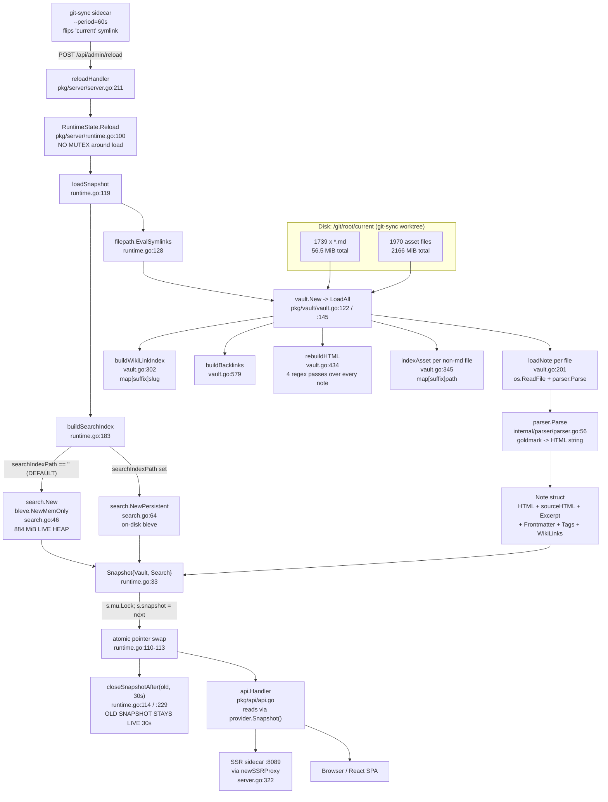

# Memory Usage Analysis and Remediation Design

**Ticket:** PV-MEMORY-019
**Application:** `publish-vault` (Go module `github.com/go-go-golems/publish-vault`, binary `retro-obsidian-publish`)
**Date of analysis:** 2026-08-09
**Audience:** a new engineer who has never seen this codebase before.

---

## 0. How to read this document

This document is written for somebody who has just been handed a production
incident and has never opened this repository. It is deliberately long. You do
not have to read it top to bottom.

- If you have five minutes and need to stop the bleeding, read
  [§1 TL;DR](#1-tldr-the-answer-in-one-page) and
  [§11 Remediation options](#11-remediation-options).
- If you need to understand *why* the process is big, read
  [§4 System map](#4-system-map-how-a-note-becomes-bytes-in-ram) and
  [§7 The measurements](#7-the-measurements).
- If you are about to write the fix, read
  [§10 Pseudocode](#10-pseudocode-current-vs-proposed) and
  [§12 Phased implementation plan](#12-phased-implementation-plan).
- If you want to reproduce the numbers yourself, jump to
  [§14 How to reproduce and measure locally](#14-how-to-reproduce-and-measure-locally).

Every claim about the code in this document carries a `file.go:line` citation
so you can verify it. Every number carries the command that produced it. Where
I could not verify something, it is listed in
[§15 Open questions](#15-open-questions-and-what-i-could-not-verify) rather
than guessed at.

---

## 1. TL;DR — the answer in one page

The user's hypothesis was *"I suspect there's an in-memory index?"*. That is
correct, and it is worse than expected: **there are two in-memory structures,
and the smaller one is not the problem.**

I loaded the real production vault (`go-go-parc`: 1739 Markdown files,
59,267,905 bytes = 56.5 MiB of Markdown) through the exact code path the server
uses, and measured:

| Phase | Live heap (`HeapAlloc` after forced GC) | `HeapSys` | Peak RSS (`VmHWM`) |
|---|---:|---:|---:|
| Baseline (empty process) | 0.6 MiB | 7.4 MiB | 19.9 MiB |
| After `vault.New()` (parse + render + index links) | **150.9 MiB** | 279.5 MiB | 299.7 MiB |
| After `search.New()` (in-memory bleve) | **984.9 MiB** | **1823.4 MiB** | **1897.1 MiB** |

**A single, freshly started process — no reload, no overlap, no traffic —
already peaks at 1897 MiB RSS against a 1536 MiB container limit.**

That is the entire incident. The app cannot complete its *first* load inside
the limit. The Kubernetes evidence (`exit 137`, "Go reported ~1.93 GiB
heap-system", CrashLoopBackOff) matches this measurement almost exactly: I
measured `HeapSys` at 1.78–1.82 GiB and `Sys` at 1.85–1.89 GiB against the
reported ~1.93 GiB.

Breaking the 985 MiB live heap down (via `go tool pprof -sample_index=inuse_space`):

| Component | Live bytes | Share |
|---|---:|---:|
| bleve in-memory index (`upsidedown` + `gtreap`) | 884.7 MB | **84.5 %** |
| Vault note HTML, rendered (`rebuildHTML`) | 78.1 MB | 7.5 % |
| Vault note HTML, parser output (`parser.Parse` → `Note.sourceHTML`) | 77.7 MB | 7.4 % |
| Everything else (frontmatter maps, link indexes, slices) | ~6 MB | 0.6 % |

So: **the search index is 6× the size of everything else in the process, and
15.6× the size of the Markdown it indexes.** The vault model itself keeps two
full copies of every note's rendered HTML, which is real waste but only ~136 MiB
of it.

On top of that structural problem sit three amplifiers:

1. **No `GOMEMLIMIT` anywhere in the repository.** Confirmed by
   `grep -rn "GOMEMLIMIT\|GOGC\|SetMemoryLimit" .` → zero hits outside `ttmp/`.
   With default `GOGC=100`, Go targets a next-GC heap of **2× the live heap**.
   My run shows `NextGC = 1970.1 MiB` for a 985 MiB live heap. The Go runtime
   has no idea a 1536 MiB cgroup limit exists and cheerfully grows past it.
2. **`RuntimeState.Reload()` has no mutual exclusion around the expensive part**
   (`pkg/server/runtime.go:100`). Two concurrent `POST /api/admin/reload`
   requests build two complete snapshots simultaneously.
3. **The previous snapshot is deliberately retained for 30 seconds after every
   swap** (`oldSnapshotCloseDelay = 30 * time.Second`,
   `pkg/server/runtime.go:18`). A full load takes 82–135 seconds on an 8-core
   dev box. git-sync is configured with `--period=60s`. Reload N+1 therefore
   starts before reload N finishes, *by design of the current configuration*.

### The fix, ranked — and the good news

**I measured the top fix rather than estimating it, and it resolves the incident
outright with no application-code change.**

1. **Set `--search-index-path` to a disk-backed volume.** The flag already exists
   (`serve.go:101`) and the atomic build/rename/reopen path is already
   implemented and tested (`pkg/server/runtime.go:183-227`). It routes bleve
   through `search.NewPersistent` instead of `bleve.NewMemOnly`. Measured on the
   real vault (§7.6):

   | | In-memory (today) | On-disk (this fix) | Change |
   |---|---:|---:|---:|
   | Search index live heap | 834.0 MiB | **15.7 MiB** | **−98.1 %** |
   | Total live heap | 984.3 MiB | **166.2 MiB** | **−83.1 %** |
   | **Peak RSS** | **1897.1 MiB** | **800.3 MiB** | **−57.8 %** |
   | Fits the existing 1536 MiB limit? | No | **Yes, 48 % headroom** | — |

   Costs: 155 MB of disk and +49 % index build time. Requires a *disk-backed*
   `emptyDir` — not `medium: Memory` (tmpfs is charged to the same cgroup and
   would gain nothing) and not `/git` (473 MiB, owned by git-sync).

2. **Make `Reload()` non-overlapping and idempotent** (mutex/singleflight around
   `loadSnapshot`, plus a no-op guard when the resolved vault root is unchanged,
   plus an async `reloadHandler` so no caller can time out and retry). This
   removes the measured ×2 multiplier (3848.9 MiB peak RSS for two coexisting
   snapshots) and, thanks to the no-op guard, skips the great majority of reloads
   entirely — git-sync's symlink only advances when the revision changes.

3. **Stop retaining two copies of every note's HTML** (`Note.HTML` and
   `Note.sourceHTML`, `pkg/vault/vault.go:45` and `:56`), worth a further
   68–136 MiB, and shorten `oldSnapshotCloseDelay`.

**Immediate mitigation if you cannot add a volume today:** raise the container
limit to 3 Gi *and* set `GOMEMLIMIT=2600MiB`. This stops the crash loop but fixes
nothing — and note that setting `GOMEMLIMIT` at the *current* 1536 MiB limit,
without fix 1, would trade the OOMKill for a GC death spiral (see §8).

---

## 2. The incident

### 2.1 Production evidence (verbatim, as reported)

> - App container: CrashLoopBackOff
> - Last termination: exit 137 — killed for exceeding memory (OOMKilled)
> - Memory limit: 1536 MiB
> - Before failure, Go reported ~1.93 GiB heap-system memory
> - Node disk: 75/150 GiB used (52%)
> - /git volume: only 473 MiB
> - Kubernetes reports DiskPressure=False
> - Repeated ~50-second reloads are causing overlapping reloads and memory growth
> - The site may intermittently respond through the SSR sidecar, but the main app is unhealthy

The reporter's own hypothesis: *"I suspect there's an in-memory index?"*

### 2.2 What "exit 137" actually means

If you have not debugged a container OOM before, here is the whole chain.

A Linux process that terminates because of a signal reports an exit status of
`128 + signal_number`. Signal 9 is `SIGKILL`. `128 + 9 = 137`. So **exit 137
means "this process was SIGKILLed"** — it did not choose to exit, it was not
given a chance to clean up, no `defer` ran, no log line was written on the way
out. That last point matters: you will never find a Go panic or a graceful
shutdown message explaining an exit 137, because the process was executed
mid-instruction.

Kubernetes additionally sets `reason: OOMKilled` on the container status when
the kill came from the kernel's out-of-memory killer rather than from, say,
`kubectl delete`. The kernel OOM killer fires when a **cgroup** exceeds its
`memory.max` (cgroup v2) / `memory.limit_in_bytes` (cgroup v1). That value is
exactly what you wrote in the Pod spec:

```yaml
resources:
  limits:
    memory: 1536Mi
```

The number the kernel compares against that limit is **not** the Go heap. It is
the cgroup's total charged memory: anonymous pages (the Go heap and stacks),
page-cache pages the cgroup faulted in, kernel memory, and so on. In practice,
for a Go server with no big file cache, the dominant term is the process
**RSS** (resident set size).

This is why my measurement harness reports `VmHWM` from `/proc/self/status`
alongside `runtime.MemStats`. `VmHWM` is the process's peak RSS — the
high-water mark. **`VmHWM` is the number that gets you killed.**

### 2.3 Why "HeapSys 1.93 GiB against a 1536 MiB limit" is the smoking gun

`runtime.MemStats` has several similar-sounding fields. The three that matter:

| Field | Meaning | Analogy |
|---|---|---|
| `HeapAlloc` | Bytes of **live** heap objects (plus unswept garbage). | How much stuff is actually in the warehouse. |
| `HeapInuse` | Bytes in heap spans that contain at least one live object. | How much shelf space those goods occupy, including gaps. |
| `HeapSys` | Bytes of **virtual address space obtained from the OS for the heap**, including memory returned to the OS but not yet unmapped. | How big the warehouse building is. |
| `Sys` | Everything the runtime got from the OS: heap + stacks + GC metadata + spans. | The whole site including the parking lot. |

`HeapSys` ≈ 1.93 GiB means **the Go runtime asked the operating system for
1.93 GiB of heap arena**. Once the runtime has faulted those pages in, the
kernel has charged them to the cgroup. The cgroup limit is 1536 MiB = 1.5 GiB.
1.93 > 1.5. The kernel kills the process. There is no ambiguity here and no
need to look for a leak: the process legitimately needed more memory than it
was allowed to have.

The follow-up question is *why* `HeapSys` was 1.93 GiB when the live heap was
under 1 GiB, and that is a GC-tuning answer, covered in §8.

### 2.4 Ruling out the disk theory

The evidence includes disk figures because a full disk is a common cause of
crash loops (a container that cannot write dies too). They rule it out:

- Node disk 75/150 GiB (52 %) — comfortable.
- `/git` volume 473 MiB — small, but the vault Markdown is only 56.5 MiB, so it
  fits. (This *will* matter in §11(e): an on-disk search index cannot live on
  `/git`.)
- `DiskPressure=False` — the kubelet is not evicting for disk.

Disk is not the problem. Memory is.

### 2.5 Why the SSR sidecar sometimes answers

The Pod runs two containers: the Go app and a Node.js SSR sidecar
(`web/ssr.Dockerfile`, `docker-compose.yml:31-38`). The Go app reverse-proxies
page requests to the sidecar (`newSSRProxy`, `pkg/server/server.go:322`). When
the Go app is dead, nothing proxies — but if the Service/Ingress or a cached
response path reaches the sidecar, or if the Go app is briefly alive between
restarts, you get intermittent successful page loads while `/api/healthz`
(`pkg/server/server.go:197`) is unreachable. This is a *symptom* of the app
flapping, not an independent fault.

---

## 3. Orientation: what this application is

`retro-obsidian-publish` turns an Obsidian vault (a directory of Markdown files
plus attachments) into a small self-hosted website. From the README:

> It reads Markdown files from a vault directory, builds an in-memory note
> index, resolves wiki links, computes backlinks, builds a search index, and
> serves both a JSON API and a retro monochrome React frontend from one Go
> process.

The design is *eager*: all the expensive work happens once, at load time, and
request handlers just read prepared state. That is a perfectly reasonable
design — for a small vault. The whole incident is the consequence of applying
it to a 1739-note, 56.5 MiB vault inside a 1.5 GiB box.

### 3.1 The deployment shape

```
┌─────────────────────── Pod ────────────────────────────┐
│                                                        │
│  ┌────────────────┐         ┌──────────────────────┐   │
│  │ container: app │         │ container: git-sync  │   │
│  │ retro-obsidian │◄────────│ registry.k8s.io/     │   │
│  │ -publish serve │ POST    │   git-sync:v4.4.0    │   │
│  │ :8080          │ /api/   │ --period=60s         │   │
│  │                │ admin/  │ --webhook-url=       │   │
│  │  MEM LIMIT     │ reload  │   127.0.0.1:8080/    │   │
│  │  1536Mi  ◄─────┼─────────┤   api/admin/reload   │   │
│  └───────┬────────┘         └──────────┬───────────┘   │
│          │ proxy /                     │ writes        │
│          ▼                             ▼               │
│  ┌────────────────┐         ┌──────────────────────┐   │
│  │ container: ssr │         │ emptyDir: /git       │   │
│  │ node server.mjs│         │  root/<sha>/  (work) │   │
│  │ :8089          │         │  root/current -> sha │   │
│  └────────────────┘         └──────────────────────┘   │
└────────────────────────────────────────────────────────┘
```

The app is started with `--vault /git/root/current`. git-sync creates a new
worktree directory per revision and atomically flips the `current` symlink,
then calls the webhook. The app resolves the symlink on every load
(`filepath.EvalSymlinks`, `pkg/server/runtime.go:128`) so it always walks a
concrete directory.

The reference manifest lives in this repo's ticket history at
`ttmp/2026/05/14/RETRO-DEPLOY-003--.../design-doc/01-k3s-deployment-and-git-synced-vault-design-guide.md:340-410`.
The **live** manifest is in a different repository
(`wesen/2026-03-27--hetzner-k3s`, path
`gitops/kustomize/retro-obsidian-publish/deployment.yaml`, per
`deploy/gitops-targets.json`), which I do not have access to — see §15.

---

## 4. System map: how a note becomes bytes in RAM

### 4.1 The pipeline, end to end



### 4.2 The same thing in plain ASCII, with sizes

```
  /git/root/<sha>/**.md          56.5 MiB on disk (1739 files)
        |
        | os.ReadFile            [transient: one file at a time]
        v
  parser.Parse (goldmark)
        |
        +--> HTML string ------------------> Note.sourceHTML   67.9 MiB TOTAL
        +--> HTML string (same, aliased) --> Note.HTML
        +--> Excerpt (first 200 chars)       0.33 MiB
        +--> Frontmatter map[string]any      (per note, small)
        +--> Tags []string                   8295 entries
        +--> WikiLinks []WikiLinkRef         4394 entries
        v
  vault.rebuildHTML()  -- 4 regexp.ReplaceAll* passes --
        |
        +--> Note.HTML REPLACED with a NEW string ---> 67.9 MiB MORE
             (sourceHTML is kept, so now 2 copies live)
        v
  Vault total live heap                        150.9 MiB   (2.67x markdown)
        |
        | ForEachSearchDocument (vault.go:765)
        | -> re-reads each .md from disk (ReadRaw, vault.go:861)
        | -> parser.PlainText(raw)   [transient plaintext]
        v
  bleve.NewMemOnly index (upsidedown + gtreap)
        |
        +--> term dictionary + postings + stored fields --> 884.7 MiB LIVE
        v
  Process live heap                            984.9 MiB  (17.4x markdown)
  Process HeapSys (GOGC=100 -> 2x live)       1823.4 MiB
  Process peak RSS (VmHWM)                    1897.1 MiB  <-- OOMKill at 1536
```

### 4.3 Request path (cheap, not the problem)

```
Browser -> GET /note/foo
        -> SSR sidecar renders (or SPA)
        -> GET /api/notes/{slug}       api.go:130  -> v.GetNote(slug) -> json encode Note (HTML included)
        -> GET /api/notes              api.go:124  -> NoteList(v)     -> lightweight items, NO HTML
        -> GET /api/tree               api.go:164  -> v.FileTree()    -> rebuilt per request, allocates
        -> GET /api/search?q=          api.go:170  -> si.Search(q,30)
        -> GET /api/tags               api.go:213  -> TagCounts(v)    -> rebuilt per request
```

Two observations. First, `/api/notes` (`api.go:103`) is correctly lightweight:
it copies only slug/title/tags/excerpt/modTime/path, **not** HTML. Good. Second,
`FileTree()` (`vault.go:792`) and `TagCounts()` (`api.go:195`) rebuild their
whole output on every request; that is transient garbage, not resident memory,
and at these sizes it is not the incident. I mention them only so you do not
chase them.

---

## 5. Subsystem walkthrough

Each subsection starts with prose, because you need the *why* before the
bullet list means anything.

### 5.1 `pkg/vault` — the in-memory note model

The vault package is the heart of the application. A `Vault`
(`pkg/vault/vault.go:87`) is a `map[string]*Note` keyed by slug, plus three
auxiliary maps and a pair of path matchers, all behind one `sync.RWMutex`.
`vault.New()` (`:122`) constructs it and immediately calls `LoadAll()` (`:145`),
which does a single `filepath.Walk` of the vault root. Every `.md` file becomes
a `Note`; every non-`.md` file gets registered into the asset index so that
Obsidian's `![[picture.png]]` embeds can be resolved later.

The important design decision, and the one that costs memory, is what a `Note`
retains. Here is the struct verbatim (`pkg/vault/vault.go:38-57`):

```go
type Note struct {
	Slug        string                 `json:"slug"`
	Title       string                 `json:"title"`
	Path        string                 `json:"path"` // relative path inside vault
	Frontmatter map[string]interface{} `json:"frontmatter"`
	Tags        []string               `json:"tags"`
	Excerpt     string                 `json:"excerpt"`
	HTML        string                 `json:"html"`
	WikiLinks   []WikiLinkRef          `json:"wikiLinks"`
	Backlinks   []string               `json:"backlinks"` // slugs that link to this note
	ModTime     time.Time              `json:"modTime"`
	Publish     bool                   `json:"-"` // false => excluded from publication

	// sourceHTML is the parser output before vault-level link, asset, and embed
	// resolution. rebuildHTML always renders HTML from it rather than from the
	// previously rendered HTML, so a resolution that depended on vault state
	// (e.g. an embed target hidden by publish: false) is re-evaluated instead of
	// being baked into the note forever.
	sourceHTML string
}
```

Read the comment on `sourceHTML` carefully, because it is the reason a naive
"just delete that field" patch will break things. `rebuildHTML()` (`:434`) runs
five rewriting passes over the HTML:

1. `parser.ReplaceWikiLinksString` — rewrite `[[Target]]` placeholders to real slugs.
2. `parser.ReplaceWikiLinkDisplay` — substitute the target note's *title* as link text.
3. `parser.RewriteImageSources` — rewrite Markdown image `src` to `/vault-assets/...`.
4. `parser.ReplaceWikiEmbedImages` — resolve `![[pic.png]]` to an asset URL.
5. `replaceUnresolvedNoteEmbeds` (`:487`) — replace note-embed placeholders whose
   target is not published with a visible "⚠ Note not published" marker.

Pass 5 is destructive: once a placeholder `<div class="wiki-embed" ...></div>`
has been replaced by the warning `<span>`, the placeholder is gone, so a later
rebuild could never restore it if the target became publishable. Keeping
`sourceHTML` around makes every rebuild idempotent with respect to vault state.

**Cost of that decision:** every note holds two full HTML strings. Measured:
71,148,615 bytes of `Note.HTML` across 1712 notes; `sourceHTML` is unexported so
I could not measure it directly, but the heap profile attributes 77.69 MB to
`parser.Parse` (which produces `sourceHTML`) and 78.07 MB to `rebuildHTML`
(which produces the replacement `Note.HTML`) — two distinct ~78 MB allocations,
exactly as the design implies.

Note also that **raw Markdown is not retained.** `loadNote` (`:201`) reads the
file into `src`, hands it to the parser, and lets it go. `SearchDocument`
(`:749`) re-reads the file from disk via `ReadRaw` (`:861`) when the search
index needs it. That is a good decision and it is why the vault is "only" 2.67×
the Markdown size instead of 3.67×.

Three auxiliary maps:

- `wikiLinkIndex map[string]string` (`:90`) — built by `buildWikiLinkIndex` (`:302`).
  For each note it registers the full slug, *every path suffix* ("tribal/foo",
  "kb/tribal/foo", …), and the title slug. For 1712 notes at ~4 path components
  each this is on the order of 8–10 k entries.
- `assetIndex map[string]string` (`:91`) — built by `indexAsset` (`:345`) /
  `indexAssetInto` (`:349`), same suffix-registration trick, for 1970 asset
  files. Also on the order of 10 k entries.
- `Note.Backlinks` — populated by `buildBacklinks` (`:579`), which is O(notes ×
  wikilinks) and uses `appendUnique` (`:899`), an O(n) linear scan per append.
  With 3450 total backlink entries this is fine today; it is quadratic in the
  worst case and worth knowing about.

Together these maps are a few MiB — real, but not the incident. The heap
profile's "everything else" bucket is ~6 MB.

### 5.2 `internal/parser` — Markdown to HTML

`parser.Parse` (`internal/parser/parser.go:56`) is a goldmark pipeline with GFM,
tables, strikethrough, task lists, footnotes, and frontmatter, plus two
custom pre/post passes: `[[wiki links]]` are extracted and replaced with HTML
placeholders *before* goldmark sees them (`replaceWikiLinks`, `:163`), and
Obsidian callouts are rendered *after* (`renderCallouts`, `:359`).

Measured output ratio: **1.20× the Markdown source** (71,148,615 HTML bytes from
59,267,905 Markdown bytes). That is unremarkable for Markdown→HTML.

One small inefficiency worth noting, because an intern will see it in the
profile: `extractExcerpt` (`:565`) calls `PlainText(src)` — which strips
frontmatter and Markdown syntax from the **entire** note — and then keeps only
the first 200 characters. So loading the vault plaintext-strips 56.5 MiB of
Markdown purely to produce 0.33 MiB of excerpts. This is transient garbage, not
resident memory, but it contributes to allocation rate and therefore to GC
pressure during load.

### 5.3 `pkg/search` — the bleve index (this is the problem)

`search.Index` (`pkg/search/search.go:32`) is a thin wrapper around a
`bleve.Index`. There are three constructors:

| Constructor | Line | Storage | Used when |
|---|---:|---|---|
| `search.New(v)` | `search.go:46` | `bleve.NewMemOnly(...)` — **entirely in RAM** | `--search-index-path` empty (**the default**) |
| `search.NewPersistent(v, path)` | `search.go:64` | `bleve.New(path, ...)` — on-disk | `--search-index-path` set |
| `search.OpenPersistent(path)` | `search.go:87` | `bleve.Open(path)` — on-disk | reopening a built index |

The document shape is four fields (`noteDoc`, `:38`): `title`, `body`, `tags`,
`excerpt`. The mapping (`buildMapping`, `:311`) stores `title`, `tags`, and
`excerpt` but explicitly does **not** store `body` (`bodyField.Store = false`,
`:323`) — a sensible choice, since the body is only needed for term matching.

Documents are fed in by `vault.ForEachSearchDocument` (`vault.go:765`), which
streams one `SearchDocument` at a time rather than materialising a slice — the
docstring even says "without materializing a full-vault plaintext slice". That
streaming is genuinely good and it is *not* the source of the problem. The
problem is what bleve keeps afterwards.

`bleve.NewMemOnly` selects the **upsidedown** index type backed by the
**gtreap** in-memory KV store. The heap profile is unambiguous:

```
      flat  flat%   sum%        cum   cum%
  544.16MB 51.97% 51.97%   544.16MB 51.97%  upsidedown_store_api.(*EmulatedBatch).Set
  153.51MB 14.66% 66.64%   340.52MB 32.52%  .../store/gtreap.(*Writer).ExecuteBatch
   96.50MB  9.22% 90.25%    96.50MB  9.22%  gtreap.(*Treap).split
      83MB  7.93% 98.18%   179.51MB 17.15%  gtreap.(*Treap).union
         0     0% 98.84%   884.68MB 84.50%  bleve/v2.(*indexImpl).Index
```

`EmulatedBatch.Set` allocates the key/value byte slices for every index row;
the persistent treap retains references to exactly those slices, which is why
544 MB shows up as *in-use* long after indexing finished. `Treap.split` and
`Treap.union` are the immutable-treap node churn — a persistent (copy-on-write)
tree keeps old nodes reachable until they are dropped, and its node overhead is
paid per key.

**Measured cost: 884.7 MB of live heap to index 56.5 MiB of Markdown — a 15.6×
blowup.** Upsidedown stores one KV row per (term, document) posting plus
dictionary rows plus stored-field rows; with a treap wrapper around every row,
per-row overhead dominates.

Two further things a reviewer should know:

- `Index.Search` (`:153`) takes `si.mu.Lock()` — an *exclusive* mutex, not an
  RWMutex — so all searches serialise. Not a memory issue, but it means a slow
  search blocks all others, which matters when the process is already GC-thrashing.
- `Index.Close()` (`:134`) sets `si.idx = nil`, which is what actually makes the
  in-memory treap collectable. If a caller forgets to `Close()` an old index,
  its 884 MB stay live forever. `closeSnapshotAfter` does call it — after 30 s.

### 5.4 `pkg/server/runtime.go` — snapshots and the reload path

`RuntimeState` (`runtime.go:45`) holds exactly one `*Snapshot` (`:33`) behind an
`RWMutex`. A `Snapshot` bundles a `*vault.Vault` and a `*search.Index` so that a
request handler can never see a vault from revision A with a search index from
revision B. Handlers call `state.Snapshot()` (`:74`), which takes an RLock and
returns the two pointers.

The reload is:

```go
// pkg/server/runtime.go:100
func (s *RuntimeState) Reload() error {
	started := time.Now()
	configured := s.ConfiguredRoot()
	logMemoryPhase("reload_start", "configuredRoot", configured)
	next, err := loadSnapshot(configured, s.searchIndexPath, s.vaultConfigPath)  // <-- EXPENSIVE, UNGUARDED
	if err != nil {
		logMemoryPhase("reload_failed", ...)
		return err
	}

	s.mu.Lock()
	old := s.snapshot
	s.snapshot = next
	s.mu.Unlock()
	closeSnapshotAfter(old, oldSnapshotCloseDelay)   // <-- 30 SECONDS
	logMemoryPhase("reload_swapped", ...)
	return nil
}
```

There are four separate memory hazards in those seventeen lines.

**Hazard 1 — no mutual exclusion around `loadSnapshot`.** `s.mu` is taken only
for the pointer swap. Two concurrent callers both run `loadSnapshot`
concurrently, each building a full 985 MiB snapshot. There is no
`golang.org/x/sync/singleflight`, no `sync.Mutex` guarding the load, and no
in-flight flag. Confirmed: `grep -rn "singleflight" --include='*.go' .` → zero
hits.

**Hazard 2 — the old snapshot is deliberately kept alive for 30 seconds.**
`oldSnapshotCloseDelay = 30 * time.Second` (`runtime.go:18`), consumed by
`closeSnapshotAfter` (`:229`):

```go
func closeSnapshotAfter(snap *Snapshot, delay time.Duration) {
	if snap == nil { return }
	go func() {
		if delay > 0 { time.Sleep(delay) }          // <-- snap (and snap.Vault!) stays reachable
		if snap.Search != nil { _ = snap.Search.Close() }
		if snap.IndexDir != "" { _ = os.RemoveAll(snap.IndexDir) }
	}()
}
```

The delay exists so in-flight requests holding the old `*vault.Vault` /
`*search.Index` are not yanked out from under them — a real concern, since
handlers grab the pointers and then do work. But note the closure captures
`snap`, which references `snap.Vault`. Even though `Vault` needs no explicit
close, **the goroutine keeps the entire old vault reachable for the full 30
seconds**, so the GC cannot reclaim its 150 MiB either. The steady-state
serial-reload footprint is therefore 2 snapshots for 30 seconds out of every
reload cycle.

**Hazard 3 — nothing checks whether a reload is necessary.** `loadSnapshot`
(`:119`) resolves the symlink (`:128`) and then unconditionally rebuilds
everything. It never compares the freshly resolved root against
`s.snapshot.ResolvedRoot`. If git-sync calls the webhook when the revision has
not changed — or if the webhook is retried — the app pays the full 985 MiB /
82 s price for a guaranteed no-op.

**Hazard 4 — reload failures are silent to the caller's memory accounting.** If
`loadSnapshot` fails partway (say, `search.New` errors after the vault is
loaded), the partial vault becomes garbage — fine — but there is no back-pressure
or cool-down, so a caller that retries in a tight loop retries the full build.

`buildSearchIndex` (`:183`) deserves credit: in the *persistent* path it builds
into `<base>/snapshots/<rev>.building/index`, closes, renames to
`<base>/snapshots/<rev>/index`, and reopens. That is a proper atomic-publish
pattern, and old index directories are removed by `closeSnapshotAfter`. The
plumbing for the on-disk fix is already there and already tested; only the flag
is unset.

Finally, credit where due: the code *already* has memory instrumentation.
`logMemoryPhase` (`:287`) emits `heapAllocBytes`, `heapSysBytes`,
`heapInuseBytes`, `nextGCBytes`, `numGC` at `reload_start`, `load_start`,
`load_resolved_root`, `load_vault_done`, `load_search_done`, `load_done`,
`reload_swapped`, and `reload_failed`. `/api/healthz` (`server.go:197`) embeds
the same `memoryStats` struct (`runtime.go:267`). **Those log lines from the
crashing pod are the highest-value artefact you can collect** — see §14.5.

### 5.5 `pkg/server/server.go` — wiring and the reload endpoint

`Run` (`server.go:49`) builds the `RuntimeState`, optionally starts the file
watcher, registers routes on a `gorilla/mux` router, and serves.

`reloadHandler` (`:211`) is:

```go
func reloadHandler(state *RuntimeState, token string, allowLoopback bool, beforeReload func()) http.HandlerFunc {
	return func(w http.ResponseWriter, r *http.Request) {
		if !validReloadRequest(r, token, allowLoopback) { ...401...; return }
		if beforeReload != nil { beforeReload() }   // stops the fsnotify watcher, once
		if err := state.Reload(); err != nil { ...500...; return }
		v, _ := state.Snapshot()
		log.Printf("reload: loaded %d notes from %s", len(v.AllNotes()), state.ResolvedRoot())
		w.WriteHeader(http.StatusNoContent)
	}
}
```

Points to note:

- **The handler is not serialised.** `net/http` serves each request in its own
  goroutine; two overlapping POSTs run `state.Reload()` concurrently. Combined
  with Hazard 1 above, that is two concurrent full builds.
- **The handler blocks for the whole build** (82–135 s measured). Any client
  with a shorter timeout — and git-sync's webhook timeout defaults to **1
  second** — will consider it failed and retry. See §9.3; this is the most
  likely mechanism behind "repeated ~50-second reloads … overlapping".
- `stopWatcherBeforeReload` (`server.go:84`) closes the fsnotify watcher the
  first time a reload arrives, because the watcher's watches point at the old
  worktree. Sensible, and it means the watcher is *not* a memory factor in the
  git-sync deployment.
- `/api/healthz` is used for **both** liveness and readiness in the reference
  manifest (`...RETRO-DEPLOY-003.../01-...md:375-383`) with no
  `initialDelaySeconds` / `failureThreshold` shown. A liveness probe that fires
  while the process is spending 80 seconds building a snapshot (and GC-thrashing)
  will restart the container, which restarts the whole expensive load. That is a
  self-reinforcing crash loop independent of the OOM.

There is **no `net/http/pprof` import anywhere in the repository**
(`grep -rn "pprof" --include='*.go' .` → zero hits). You cannot pull a live heap
profile from the crashing pod today. That is a gap worth closing.

### 5.6 `pkg/watcher` — the fsnotify path

`watcher.New` (`watcher.go:40`) walks the vault and adds an fsnotify watch to
every non-pruned directory, then runs `loop()` (`:89`) with a 500 ms debounce
ticker. On a Markdown change it calls `vault.ReloadNote` (`vault.go:605`), which
re-parses **one** file but then re-runs `buildWikiLinkIndex`, `buildBacklinks`,
**and `rebuildHTML` over the entire vault** (`vault.go:625-627`). `RemoveNote`
(`:648`) does the same.

So a single file save triggers 1712 notes' worth of regex rewriting and
allocates a fresh ~68 MiB of HTML strings. In `--watch` mode with an actively
edited vault this is a significant allocation-rate problem. In the production
git-sync deployment the watcher is disabled (`--watch=false` is the documented
pattern, `serve.go:58`) and is closed on first reload anyway, so it is not
implicated in *this* incident — but it is the same structural bug and a fix
should address both.

### 5.7 `pkg/web` and the SSR sidecar

`pkg/web/embed.go` embeds the built SPA under the `embed` build tag via
`//go:embed embed/public`. `go:embed` data lives in the binary's read-only data
section — it is mapped from the executable file, **not** allocated on the Go
heap. It counts toward RSS only for the pages actually touched, and those pages
are file-backed and reclaimable under pressure. The SPA bundle is therefore
**not** a meaningful contributor here. (I could not measure the bundle size:
`web/dist` in this checkout contains only a `.gitkeep`, so the frontend has not
been built locally.)

The SSR sidecar is a separate container running `node server.mjs`
(`web/ssr.Dockerfile`). It has its **own** memory accounting and its own limit
(if any). A Node process with React SSR typically sits at 80–200 MiB. It is not
charged against the Go app's 1536 MiB limit, but it *is* charged against the
Pod total and the node. It is not implicated in exit 137 of the `app` container.

---

## 6. What the code does NOT do (things you can stop suspecting)

Ruling things out is as useful as finding the culprit. Verified by reading the code:

| Suspicion | Verdict | Evidence |
|---|---|---|
| Raw Markdown is retained per note | **No** | `loadNote` (`vault.go:201`) drops `src`; `SearchDocument` (`:749`) re-reads via `ReadRaw` (`:861`). |
| Plain-text bodies are retained per note | **No** | `SearchDocument` builds `Body` transiently and hands it to bleve; nothing keeps the struct. |
| Assets (2.1 GiB of images) are loaded into RAM | **No** | Only the *paths* are indexed (`indexAssetInto`, `:349`); `assetHandler` (`server.go:231`) streams from disk with `http.ServeContent`. |
| `/api/notes` serialises all HTML | **No** | `NoteList` (`api.go:103`) copies only lightweight fields. |
| The embedded SPA sits on the Go heap | **No** | `go:embed` data is in the binary's rodata, file-backed. |
| There is a goroutine/handle leak | **Not found** | The only long-lived goroutines are the HTTP server, the watcher loop, and one 30 s timer per reload. |
| It is a disk problem | **No** | DiskPressure=False, node 52 % used, 56.5 MiB of Markdown on a 473 MiB volume. |

---

## 7. The measurements

### 7.1 Methodology

I wrote a standalone Go program, `scripts/vaultmem/main.go`, that calls the
**exact same exported APIs** the server calls — `vault.New()` and
`search.New()` / `search.NewPersistent()` — and reports `runtime.MemStats` plus
`/proc/self/status` `VmHWM` after each phase. It forces `runtime.GC()` before
reading `MemStats` so `HeapAlloc` reflects *live* data rather than uncollected
garbage. It can optionally build a second and third snapshot while holding the
first, which reproduces the overlapping-reload condition.

No application source was modified. The program lives under the ticket's
`scripts/` directory and is built from the Go workspace root so `go.work`
resolves the module.

```bash
cd /home/manuel/workspaces/2026-08-09/publish-vault-mathjax
go build -o /tmp/vaultmem './publish-vault/ttmp/2026/08/09/PV-MEMORY-019--*/scripts/vaultmem'
/tmp/vaultmem -vault /home/manuel/code/wesen/go-go-golems/go-go-parc -memprofile /tmp/snap1.heap
```

Machine: 8 logical CPUs, 64 GiB RAM, Linux 6.8.0-137, Go toolchain 1.26.5 (per
`go.work`). `GOGC` and `GOMEMLIMIT` unset, exactly as in production.

### 7.2 The vault, on disk

Measured with `scripts/01-measure-vault-on-disk.sh` and by the harness itself:

| Metric | Value |
|---|---:|
| Vault path | `/home/manuel/code/wesen/go-go-golems/go-go-parc` |
| Total size including `.git` | 2.6 GiB |
| Total size excluding `.git` | 2.3 GiB |
| Markdown files (`*.md`, excluding `.git`) | **1739** |
| Markdown bytes | **59,267,905 (56.5 MiB)** |
| Non-Markdown (asset) files | 1970 |
| Asset bytes | 2,271,422,933 (2166.2 MiB) |
| Notes actually loaded into the vault | **1712** (27 excluded by `.vault-ignore` / `publish: false`) |
| Largest note | 513,615 B — `Transcripts/2026/08/09/CHATGPT TRANSCRIPT - Branch Designing RAG Abstractions.md` |

Note the shape: **2.1 GiB of the vault is attachments**, which are never read
into memory, and only 56.5 MiB is Markdown. If you looked at `du -sh` and
assumed the vault "is 2.3 GiB", you would draw the wrong conclusion.

### 7.3 Single snapshot (production default: in-memory bleve)

Verbatim output of the harness (`scripts/results/run-single.txt`):

```
GOMAXPROCS=8 GOGC="" GOMEMLIMIT=""
vault=/home/manuel/code/wesen/go-go-golems/go-go-parc

on-disk: mdFiles=1739 mdBytes=59267905 (56.5 MiB)  assetFiles=1970 assetBytes=2271422933 (2166.2 MiB)  walk=12ms

00-baseline        elapsed=0s        heapAlloc=   0.6 MiB  heapInuse=   1.7 MiB  heapSys=   7.4 MiB  sys=  13.6 MiB  nextGC=   4.0 MiB  numGC=2    maxRSS=  19.9 MiB
01-vault1-loaded   elapsed=17.846s   heapAlloc= 150.9 MiB  heapInuse= 174.4 MiB  heapSys= 279.5 MiB  sys= 289.9 MiB  nextGC= 302.1 MiB  numGC=215  maxRSS= 299.7 MiB
02-search1-built   elapsed=1m4.52s   heapAlloc= 984.9 MiB  heapInuse=1566.0 MiB  heapSys=1823.4 MiB  sys=1890.1 MiB  nextGC=1970.1 MiB  numGC=274  maxRSS=1897.1 MiB

== per-note retained field totals (snapshot 1) ==
notes                 = 1712
HTML bytes            = 71148615 (67.9 MiB)
sourceHTML bytes (~)  = 71148615 (67.9 MiB)  [unexported, approximated as == HTML]
Excerpt bytes         = 346121 (338.0 KiB)
Title bytes           = 88641
Path bytes            = 151909
Slug bytes            = 142507
WikiLink refs         = 4394
Backlink entries      = 3450
Tag entries           = 8295
HTML / markdown ratio = 1.20x

== summary ==
vault only (live heap delta)   = 150.3 MiB
search only (live heap delta)  = 834.0 MiB
one snapshot (vault+search)    = 984.3 MiB
bytes per note (one snapshot)  = 602851
multiplier vs on-disk markdown = 17.41x
peak phase                     = 02-search1-built
peak heapAlloc (live)          = 984.9 MiB
peak heapSys                   = 1823.4 MiB
peak runtime Sys               = 1890.1 MiB
peak RSS (VmHWM)               = 1897.1 MiB
current RSS (VmRSS)            = 1855.7 MiB
```

**Read that peak-RSS line again: 1897.1 MiB, against a 1536 MiB limit, on a
cold start with zero traffic and zero reloads.**

Timing matters too: `vault.New` took **17.8 s** and `search.New` took **64.5 s**,
for **82.4 s total**, on a fast 8-core dev machine with warm page cache. In a
second run under light system load the same search build took **110.9 s**
(total 134.5 s). A k3s node with fewer/slower cores and a cold cache will be
slower still. Compare that to git-sync's `--period=60s`.

### 7.4 Heap profile: where the 985 MiB lives

```bash
go tool pprof -top -sample_index=inuse_space -nodecount=25 /tmp/vaultmem /tmp/snap1.heap
```

```
Showing nodes accounting for 1034.87MB, 98.84% of 1046.97MB total
      flat  flat%   sum%        cum   cum%
  544.16MB 51.97% 51.97%   544.16MB 51.97%  blevesearch/upsidedown_store_api.(*EmulatedBatch).Set
  153.51MB 14.66% 66.64%   340.52MB 32.52%  bleve/v2/index/upsidedown/store/gtreap.(*Writer).ExecuteBatch
  150.69MB 14.39% 81.03%   151.20MB 14.44%  regexp.(*Regexp).ReplaceAllStringFunc
   96.50MB  9.22% 90.25%    96.50MB  9.22%  blevesearch/gtreap.(*Treap).split
      83MB  7.93% 98.18%   179.51MB 17.15%  blevesearch/gtreap.(*Treap).union
       7MB  0.67% 98.84%        7MB  0.67%  bleve/v2/index/upsidedown.(*DictionaryRow).Value
         0     0% 98.84%   884.68MB 84.50%  bleve/v2.(*indexImpl).Index
         0     0% 98.84%   884.68MB 84.50%  publish-vault/pkg/search.New
         0     0% 98.84%   884.68MB 84.50%  publish-vault/pkg/vault.(*Vault).ForEachSearchDocument
         0     0% 98.84%   159.28MB 15.21%  publish-vault/pkg/vault.(*Vault).LoadAll
         0     0% 98.84%    78.07MB  7.46%  publish-vault/pkg/vault.(*Vault).rebuildHTML
         0     0% 98.84%    77.69MB  7.42%  publish-vault/pkg/vault.(*Vault).loadNote
         0     0% 98.84%    77.69MB  7.42%  publish-vault/internal/parser.Parse
         0     0% 98.84%    77.56MB  7.41%  publish-vault/pkg/vault.replaceUnresolvedNoteEmbeds
         0     0% 98.84%    73.13MB  6.99%  publish-vault/internal/parser.renderCallouts
```

Three readings from this:

1. **`search.New` accounts for 884.68 MB cumulative — 84.5 % of the live heap.**
2. **`LoadAll` accounts for 159.28 MB**, split almost exactly evenly between
   `parser.Parse` (77.69 MB → `sourceHTML`) and `rebuildHTML` (78.07 MB → the
   rewritten `HTML`). This is the direct, quantified confirmation that the vault
   holds **two** copies of every note's HTML.
3. `regexp.ReplaceAllStringFunc` at 150.69 MB *flat* is where both of those
   strings physically get allocated — `renderCallouts` inside the parser and
   `replaceUnresolvedNoteEmbeds` inside `rebuildHTML`.

### 7.5 Overlapping snapshots (the reload failure mode)

The harness was rerun with `-second`, which builds a complete second vault +
search index while the first is still referenced — exactly what
`RuntimeState.Reload` does when a second webhook arrives mid-build, or during
the 30 s `oldSnapshotCloseDelay` window.

```
GOMAXPROCS=8 GOGC="" GOMEMLIMIT=""
on-disk: mdFiles=1739 mdBytes=59267905 (56.5 MiB)  assetFiles=1970 assetBytes=2271422933 (2166.2 MiB)

00-baseline        elapsed=0s        heapAlloc=   0.6 MiB  heapInuse=   1.6 MiB  heapSys=  11.4 MiB  sys=  17.4 MiB  nextGC=   4.0 MiB  numGC=2    maxRSS=  20.0 MiB
01-vault1-loaded   elapsed=23.532s   heapAlloc= 151.0 MiB  heapInuse= 173.4 MiB  heapSys= 279.5 MiB  sys= 290.0 MiB  nextGC= 302.3 MiB  numGC=215  maxRSS= 298.6 MiB
02-search1-built   elapsed=1m50.937s heapAlloc= 984.4 MiB  heapInuse=1591.1 MiB  heapSys=1863.4 MiB  sys=1931.7 MiB  nextGC=1969.0 MiB  numGC=277  maxRSS=1929.7 MiB
03-vault2-loaded   elapsed=1m10.665s heapAlloc=1134.7 MiB  heapInuse=1798.5 MiB  heapSys=2715.5 MiB  sys=2792.0 MiB  nextGC=2269.6 MiB  numGC=283  maxRSS=2795.4 MiB
04-search2-built   elapsed=1m46.542s heapAlloc=1967.9 MiB  heapInuse=3195.9 MiB  heapSys=3731.4 MiB  sys=3860.2 MiB  nextGC=3936.1 MiB  numGC=303  maxRSS=3848.9 MiB

== summary ==
one snapshot (vault+search)    = 983.8 MiB
peak heapAlloc (live)          = 1967.9 MiB
peak heapSys                   = 3731.4 MiB
peak runtime Sys               = 3860.2 MiB
peak RSS (VmHWM)               = 3848.9 MiB
```

Summarised against the limit:

| Scenario | Live heap | `HeapSys` | Peak RSS | vs. 1536 MiB limit |
|---|---:|---:|---:|---|
| 1 snapshot (cold start, no reload) | 984.9 MiB | 1823.4 MiB | **1897.1 MiB** | **1.24× over** |
| 2 snapshots (one reload overlapping, or the 30 s close window) | 1967.9 MiB | 3731.4 MiB | **3848.9 MiB** | **2.51× over** |

The scaling is exactly linear — a second snapshot costs another 983.8 MiB of
live heap and another ~1919 MiB of peak RSS. There is nothing sublinear to hope
for: notes are not shared between snapshots, and neither are index rows.

Note also that the second `vault.New` took **70.7 s** versus the first one's
**23.5 s**, and the second search build **106.5 s** — the same work, ~3× and
~1.7× slower, because the GC now has a 1–2 GiB live heap to scan on every cycle.
**Overlapping reloads make each other slower, which makes them overlap more.**
That positive feedback loop is why the reporter saw "memory growth" rather than
a stable 2× plateau.

### 7.6 Persistent (on-disk) search index

The harness was rerun with `-persist`, which routes through
`search.NewPersistent` + `Close` + `OpenPersistent` — the exact sequence
`server.buildSearchIndex` (`runtime.go:183-227`) performs when
`--search-index-path` is set.

```
GOMAXPROCS=8 GOGC="" GOMEMLIMIT=""
on-disk: mdFiles=1739 mdBytes=59267905 (56.5 MiB)  assetFiles=1970 assetBytes=2271422933 (2166.2 MiB)

00-baseline        elapsed=0s         heapAlloc=  0.6 MiB  heapInuse=  1.6 MiB  heapSys=  7.4 MiB  sys=  13.3 MiB  nextGC=  4.0 MiB  numGC=2    maxRSS= 19.7 MiB
01-vault1-loaded   elapsed=26.106s    heapAlloc=151.1 MiB  heapInuse=174.0 MiB  heapSys=279.5 MiB  sys= 289.9 MiB  nextGC=302.4 MiB  numGC=213  maxRSS=301.2 MiB
02-search1-built   elapsed=1m36.447s  heapAlloc=166.8 MiB  heapInuse=195.0 MiB  heapSys=943.0 MiB  sys= 960.5 MiB  nextGC=331.7 MiB  numGC=404  maxRSS=800.3 MiB

== summary ==
vault only (live heap delta)   = 150.4 MiB
search only (live heap delta)  = 15.7 MiB
one snapshot (vault+search)    = 166.2 MiB
bytes per note (one snapshot)  = 101772
multiplier vs on-disk markdown = 2.94x
peak heapAlloc (live)          = 166.8 MiB
peak heapSys                   = 943.0 MiB
peak runtime Sys               = 960.5 MiB
peak RSS (VmHWM)               = 800.3 MiB
current RSS (VmRSS)            = 510.4 MiB
```

On-disk index size: **155 MB** (`du -sh` of the index directory).

**This is the headline result of the whole investigation.** Setting a flag that
already exists changes the picture completely:

| Metric | In-memory (`search.New`, **today's default**) | On-disk (`search.NewPersistent` via `--search-index-path`) | Change |
|---|---:|---:|---:|
| Search index live heap | 834.0 MiB | **15.7 MiB** | **−98.1 %** |
| One snapshot live heap | 984.3 MiB | **166.2 MiB** | **−83.1 %** |
| Live heap per note | 602,851 B | 101,772 B | −83.1 % |
| Multiplier vs on-disk Markdown | 17.41× | **2.94×** | −83 % |
| `HeapSys` | 1823.4 MiB | 943.0 MiB | −48 % |
| **Peak RSS (`VmHWM`)** | **1897.1 MiB** | **800.3 MiB** | **−57.8 %** |
| Fits in the existing 1536 MiB limit? | **No (1.24× over)** | **Yes, with 48 % headroom** | — |
| Index build time | 64.5 s | 96.4 s | +49 % |
| Disk used | 0 | 155 MB | +155 MB |

Two details worth understanding rather than just copying:

- **The residual 15.7 MiB of live heap** is bleve's in-memory working state for
  an open on-disk index (segment metadata, caches, buffers). The bulk of the
  index now lives in files that the kernel pages in on demand. Those pages *do*
  show up in RSS while hot, but they are **file-backed and reclaimable** — under
  memory pressure the kernel simply evicts them, whereas Go heap pages can never
  be evicted, only garbage-collected.
- **`HeapSys` (943.0 MiB) is larger than peak RSS (800.3 MiB)**, which looks
  contradictory until you remember what each measures. `HeapSys` counts arena
  the runtime obtained from the OS *including pages it has already handed back*
  via `MADV_FREE`/`MADV_DONTNEED`. Those pages are no longer resident. The build
  phase allocates heavily and transiently (`numGC` jumped from 213 to 404, versus
  274 for the in-memory build), the arena grows, and then the scavenger returns
  most of it. Final steady-state `VmRSS` settled at **510.4 MiB**.

---

## 7A. The memory budget

### 7A.1 Per-note budget

All figures are measured on go-go-parc: **1712 loaded notes**, **59,267,905
bytes of Markdown on disk**, i.e. an average of **34,619 bytes of Markdown per
loaded note**. "× md" is the multiplier against that per-note Markdown average.

| # | What is resident | Where in the code | Total bytes | Per note | × md | Measurement |
|---|---|---|---:|---:|---:|---|
| 1 | `Note.HTML` (rewritten) | `vault.go:45`, written by `rebuildHTML` `:434` | 71,148,615 | 41,559 | **1.20×** | summed directly by the harness |
| 2 | `Note.sourceHTML` (parser output) | `vault.go:56`, written by `loadNote` `:248` | ~77,690,000 | ~45,380 | **~1.31×** | heap profile: `parser.Parse` cum 77.69 MB |
| 3 | `Note.Excerpt` (≤200 chars + ellipsis) | `vault.go:44`, `parser.go:565` | 346,121 | 202 | 0.006× | summed directly |
| 4 | `Note.Title` | `vault.go:40` | 88,641 | 52 | 0.002× | summed directly |
| 5 | `Note.Path` | `vault.go:41` | 151,909 | 89 | 0.003× | summed directly |
| 6 | `Note.Slug` | `vault.go:39` | 142,507 | 83 | 0.002× | summed directly |
| 7 | `Note.Frontmatter map[string]any` | `vault.go:42` | not isolated | — | — | inside the ~6 MB residual |
| 8 | `Note.WikiLinks []WikiLinkRef` | `vault.go:46` | 4394 refs | 2.6 refs | — | counted; ~40 B/ref + strings |
| 9 | `Note.Backlinks []string` | `vault.go:47` | 3450 entries | 2.0 entries | — | counted; slug strings are shared |
| 10 | `Note.ModTime`, `Publish`, struct headers | `vault.go:48-49` | ~200 KB | ~120 | — | 11 fields ≈ 120 B/struct |
| 11 | `Vault.wikiLinkIndex map[string]string` | `vault.go:90`, built `:302` | not isolated | — | — | ~8–10 k entries, inside the residual |
| 12 | `Vault.assetIndex map[string]string` | `vault.go:91`, built `:345` | not isolated | — | — | ~10 k entries (1970 assets × suffixes) |
| — | **Vault subtotal (measured live heap)** | | **157,600,000** | **92,056** | **2.66×** | `heapAlloc` delta, forced GC |
| 13 | bleve in-memory index rows (`EmulatedBatch.Set`) | `search.go:46` → `bleve.NewMemOnly` | 544,160,000 | 317,850 | **9.18×** | pprof `inuse_space` flat |
| 14 | bleve gtreap nodes (`ExecuteBatch`/`split`/`union`) | same | 333,010,000 | 194,516 | **5.62×** | pprof flat: 153.51 + 96.50 + 83.00 MB |
| 15 | bleve dictionary rows | same | 7,000,000 | 4,089 | 0.12× | pprof flat |
| — | **Search subtotal (measured live heap)** | | **874,300,000** | **510,690** | **14.75×** | `heapAlloc` delta, forced GC |
| — | **ONE SNAPSHOT TOTAL** | | **1,032,000,000** | **602,851** | **17.41×** | 984.3 MiB |
| — | **…as `HeapSys` (GOGC=100 → 2× live)** | | **1,912,000,000** | — | **32.3×** | 1823.4 MiB |
| — | **…as peak RSS (`VmHWM`)** | | **1,989,000,000** | — | **33.6×** | 1897.1 MiB |
| — | **TWO SNAPSHOTS (one overlapping reload)** | | **4,035,000,000** | — | **68.1×** | 3848.9 MiB peak RSS |

**How to read this table.** Every byte of Markdown on disk costs about **17
bytes of live Go heap**, about **32 bytes of `HeapSys`**, and about **34 bytes of
resident memory** in this application — and **68 bytes** when a reload overlaps.
The 56.5 MiB vault therefore needs ~1.9 GiB of container memory to start, and
~3.8 GiB to survive one overlapping reload. It was given 1.5 GiB.

The two dominant rows are #13/#14 (the bleve index, 84.5 %) and #1+#2 (two
copies of the HTML, 13.9 %). Everything else together is under 2 %.

### 7A.2 Where the multipliers come from

- **1.20×** for HTML is just Markdown→HTML expansion (tags, wrappers,
  auto-heading IDs, callout markup). Unavoidable if you store HTML.
- **2.66×** for the vault is that 1.20× paid **twice** (`HTML` + `sourceHTML`)
  plus ~0.26× of metadata and index maps. Halving this is Fix C.
- **14.75×** for the search index is the interesting one. Upsidedown stores one
  KV row per (term, document) posting, plus term-dictionary rows, plus
  stored-field rows for `title`/`tags`/`excerpt`. Every row is a separate Go
  allocation wrapped in a persistent-treap node with its own pointers and
  priority. For prose text with a large vocabulary — and a vault of AI
  transcripts and research notes has an enormous vocabulary — postings dominate,
  and per-row overhead dominates postings. This is *why* an on-disk index (Fix E)
  is the right answer: the same rows become packed segment files that the kernel
  pages in on demand, not millions of individually-allocated Go objects.

### 7A.3 What the budget would look like after the fixes

Projected, not measured (except where §7.6 provides the number):

| Configuration | Vault heap | Search heap | Live total | Peak RSS | Fits 1536 MiB? |
|---|---:|---:|---:|---:|---|
| Today (default flags) | 150.4 MiB | 834.0 MiB | 984.3 MiB | **1897.1 MiB** (measured) | **No** |
| Today + one overlapping reload | 300.8 MiB | 1667.1 MiB | 1967.9 MiB | **3848.9 MiB** (measured) | **No** |
| **+ Fix E (`--search-index-path`)** | 150.4 MiB | **15.7 MiB** | **166.2 MiB** | **800.3 MiB** (measured) | **Yes, 48 % headroom** |
| + Fix E + Fix B (no overlap possible) | 150.4 MiB | 15.7 MiB | 166.2 MiB | ~800 MiB (projected) | Yes |
| + Fix E + Fix A (`GOMEMLIMIT`) | 150.4 MiB | 15.7 MiB | 166.2 MiB | capped at `GOMEMLIMIT` | Yes |
| + Fix E + Fix C2 (drop `sourceHTML`) | ~82 MiB (proj.) | 15.7 MiB | ~98 MiB (proj.) | ~730 MiB (proj.) | Yes |
| + Fix E + Fix C3 (lazy HTML) | ~15 MiB (proj.) | 15.7 MiB | ~31 MiB (proj.) | ~660 MiB (proj.) | Yes |

**Fix E alone brings a cold start inside the existing 1536 MiB limit with 48 %
headroom.** That is the whole incident resolved by one flag and one volume,
with zero application-code change. Everything else on this list is defence in
depth, and Fix B is still required so that overlapping reloads cannot re-inflate
the footprint.

---

## 8. Why `HeapSys` is 1.9 GiB when the live heap is 1.0 GiB

This is pure Go GC mechanics, and it is the single cheapest thing to fix.

Go's garbage collector is *pacing*-driven. With the default `GOGC=100`, the
runtime sets the next collection target at:

```
NextGC = live_heap_after_last_GC * (1 + GOGC/100)
       = live_heap * 2
```

My measurement shows exactly that: `heapAlloc=984.9 MiB`, `nextGC=1970.1 MiB`.
The runtime is deliberately allowing the heap to grow to ~1.97 GiB before it
collects, because trading memory for fewer GC cycles is the right default *on a
machine where memory is free*.

Inside a container it is not free. `HeapSys` climbed to 1823.4 MiB — the runtime
mapped and faulted in that much arena — and the cgroup accountant charged every
one of those pages. 1823 MiB > 1536 MiB → SIGKILL.

`GOMEMLIMIT` (Go 1.19+) fixes the ignorance. It is a **soft** limit on the total
memory the Go runtime manages (heap + stacks + GC metadata, excluding
non-runtime mappings). When the total approaches the limit, the GC runs more
aggressively and the scavenger returns pages to the OS, instead of pacing to
2× live heap. It can be set two ways:

```bash
GOMEMLIMIT=1300MiB            # environment variable, no code change
```
```go
import "runtime/debug"
debug.SetMemoryLimit(1300 << 20)   // programmatic, e.g. in main()
```

Two warnings an intern must internalise:

1. **`GOMEMLIMIT` is soft.** If the *live* heap genuinely exceeds it, Go will
   not kill your program; it will GC continuously (a "GC death spiral") and your
   throughput collapses while the process still gets OOMKilled. With a 985 MiB
   live heap and a 1300 MiB limit, we would have only ~32 % headroom — survivable
   but thrashy. `GOMEMLIMIT` alone is therefore **not** a sufficient fix here.
   It must be paired with reducing the live heap (§11c/§11e) or raising the
   container limit (§11f).
2. **`GOMEMLIMIT` must be *below* the container limit**, because the container
   limit also covers things the Go runtime does not manage: the binary's mapped
   pages, page cache from `os.ReadFile` on 56 MiB of Markdown, cgo/musl
   allocations (the image builds with `CGO_ENABLED=1`, see `Dockerfile:24`), and
   thread stacks. A common rule of thumb is `GOMEMLIMIT ≈ 0.8–0.9 × limit`.

For reference, the same reasoning applies to `GOGC`: setting `GOGC=50` would
target 1.5× live heap instead of 2×, but it does not adapt to the container
limit the way `GOMEMLIMIT` does. Prefer `GOMEMLIMIT`; optionally set
`GOGC=off` alongside it if you want the memory limit to be the *only* pacing
input (advanced; not recommended as a first move).

---

## 9. The reload failure model

### 9.1 Timeline: the well-behaved serial case

Even when nothing goes wrong, a reload doubles the footprint for the duration
of the build **plus 30 seconds**.

```
 memory
   ^
   |                        ┌───────────── new snapshot (985 MiB) ──────────────
   |                       ╱
2G |······················╱·····························  <-- 1536 MiB LIMIT breached here
   |                     ╱
   |  ┌─ old snapshot (985 MiB) ────────────────┐
1G |──┤                                         └──── freed at swap+30s
   |  │
   +--┴──────────┬──────────────────┬───────────┬────────────────> time
      t0         t0                 t0+82s      t0+112s
      steady     reload starts      swap        old snapshot released
                 (loadSnapshot)     (atomic)    (closeSnapshotAfter fires)

      |<------------- BOTH SNAPSHOTS RESIDENT: 112 seconds ------------>|
```

Peak during a serial reload = old snapshot + new snapshot ≈ **1970 MiB live
heap**, which with GOGC=100 pacing implies a `HeapSys` target near 3.9 GiB.

### 9.2 Timeline: the actual production case (overlapping reloads)

git-sync's `--period=60s` is *shorter* than the 82–135 s build time. Reload N+1
arrives while reload N is still inside `loadSnapshot`. Because `Reload()` takes
no lock around the load, both proceed.

```
 t=0    ┌──────────────── reload #1: loadSnapshot ────────────────┐ swap
        │ vault1 (150 MiB) ──► bleve1 (835 MiB)                   │
        └─────────────────────────────────────────────────────────┘
 t=60         ┌──────────────── reload #2: loadSnapshot ────────────────┐ swap
              │ vault2 (150 MiB) ──► bleve2 (835 MiB)                   │
              └─────────────────────────────────────────────────────────┘
 t=120              ┌──────────────── reload #3: loadSnapshot ─────────────┐
                    │ vault3 (150 MiB) ──► bleve3 (835 MiB)               │
                    └──────────────────────────────────────────────────────┘

 resident:  [snap0] + [build1] + [build2] + [build3] ...
            985     + 985      + 985      + 985       = 3.9 GiB and climbing

 Every 60 s adds another concurrent build. Nothing bounds this.
 The process dies long before reaching steady state.
```

This is what the reporter observed as "repeated ~50-second reloads … causing
overlapping reloads and memory growth". Note that the growth is **not a leak**:
every one of those snapshots is legitimately reachable. Adding more memory only
moves the cliff.

### 9.3 What makes the reloads repeat (hypothesis, needs confirmation)

`reloadHandler` blocks for the full build (82–135 s) before writing `204 No
Content`. git-sync's webhook is configured (reference manifest, lines 399-401) as:

```yaml
- --webhook-url=http://127.0.0.1:8080/api/admin/reload
- --webhook-method=POST
- --webhook-success-status=204
```

git-sync v4 retries a webhook until it observes the success status, with its own
timeout and backoff. If the app takes 82 s to answer and git-sync's timeout is
short, git-sync never sees the `204`, treats every attempt as failed, and
**retries** — each retry spawning another concurrent full build in the app.
That would produce exactly the observed "repeated reloads … overlapping".

I could not verify git-sync's configured `--webhook-timeout` /
`--webhook-backoff` because the live manifest is in another repository. This is
listed in §15 as the single highest-value thing to check. Regardless of the
answer, **the fix is the same**: the endpoint must return immediately and the
reload must be non-overlapping.

---

## 10. Pseudocode: current vs. proposed

### 10.1 Current reload path

```text
POST /api/admin/reload            (net/http: one goroutine PER REQUEST)
  |
  +-> validReloadRequest(token|loopback)          server.go:288
  +-> stopWatcherBeforeReload()  [sync.Once]      server.go:84
  +-> RuntimeState.Reload()                       runtime.go:100
        |
        |   *** NO LOCK HELD HERE ***
        +-> loadSnapshot(configuredRoot, ...)     runtime.go:119
        |     +-> filepath.EvalSymlinks(root)              # never compared to current
        |     +-> loadVaultConfig(root)
        |     +-> vault.New(root)                          # 150 MiB, 18-24 s
        |     |     +-> LoadAll(): walk, loadNote x1739, indexAsset x1970
        |     |     +-> buildWikiLinkIndex, buildBacklinks, rebuildHTML
        |     +-> buildSearchIndex(v, "")                  # 835 MiB, 65-111 s
        |           +-> search.New(v) -> bleve.NewMemOnly
        |                 +-> v.ForEachSearchDocument(fn)
        |                       +-> per note: ReadRaw + PlainText + idx.Index
        |
        +-> s.mu.Lock(); old = s.snapshot; s.snapshot = next; s.mu.Unlock()
        +-> go func(){ sleep 30s; old.Search.Close(); rm old.IndexDir }()
        |     *** old.Vault stays reachable for 30 s ***
        +-> return nil
  +-> 204 No Content        (after 82-135 seconds)
```

### 10.2 Fix A — `GOMEMLIMIT` wiring (cheapest, do first)

Option 1, no code change (preferred for the immediate mitigation):

```yaml
# deployment.yaml, container: app
env:
  - name: GOMEMLIMIT
    value: "2600MiB"          # ~0.85 x the new 3Gi limit
resources:
  limits:
    memory: 3Gi
  requests:
    memory: 2Gi
```

Option 2, derive it from the cgroup at startup so the two can never drift:

```go
// cmd/retro-obsidian-publish/main.go
func init() {
    // If GOMEMLIMIT is already set in the environment, the runtime has applied
    // it; do not override an explicit operator choice.
    if _, ok := os.LookupEnv("GOMEMLIMIT"); ok {
        return
    }
    limit, err := readCgroupMemoryMax()   // /sys/fs/cgroup/memory.max (v2)
    if err != nil || limit <= 0 {
        return                            // unlimited or unreadable: leave default
    }
    // Reserve headroom for non-heap RSS: binary pages, page cache, cgo, stacks.
    debug.SetMemoryLimit(int64(float64(limit) * 0.85))
}
```

(The library `github.com/KimMachineGun/automemlimit` implements exactly this,
including cgroup v1/v2 detection, if you would rather not hand-roll it.)

### 10.3 Fix B — non-overlapping, idempotent reload

```go
type RuntimeState struct {
    mu       sync.RWMutex
    snapshot *Snapshot

    reloadMu sync.Mutex        // NEW: serialises the expensive build
    // OR: reloadGroup singleflight.Group, to COALESCE rather than queue
}

func (s *RuntimeState) Reload() error {
    // 1. Serialise. A second caller waits instead of building a second snapshot.
    //    With singleflight it would instead share the in-flight result, which is
    //    better: N concurrent webhooks cost ONE build, not N sequential builds.
    s.reloadMu.Lock()
    defer s.reloadMu.Unlock()

    configured := s.ConfiguredRoot()

    // 2. Cheap no-op guard. git-sync only advances the symlink when the revision
    //    changes, so an unchanged target means there is nothing to rebuild.
    //    This turns most webhook calls into a ~1 ms stat.
    resolved, err := filepath.EvalSymlinks(configured)
    if err != nil {
        return fmt.Errorf("resolve vault path %q: %w", configured, err)
    }
    if cur := s.currentSnapshot(); cur != nil && cur.ResolvedRoot == resolved {
        logMemoryPhase("reload_skipped_unchanged", "resolvedRoot", resolved)
        return nil
    }

    next, err := loadSnapshotResolved(resolved, s.searchIndexPath, s.vaultConfigPath)
    if err != nil {
        return err
    }

    s.mu.Lock()
    old := s.snapshot
    s.snapshot = next
    s.mu.Unlock()

    closeSnapshotAfter(old, oldSnapshotCloseDelay)
    return nil
}
```

And make the HTTP endpoint non-blocking so no client can time out and retry:

```go
func reloadHandler(state *RuntimeState, ...) http.HandlerFunc {
    return func(w http.ResponseWriter, r *http.Request) {
        if !validReloadRequest(r, token, allowLoopback) { ...401...; return }
        if beforeReload != nil { beforeReload() }

        // Kick the reload off in the background and answer immediately.
        // state.Reload() is now serialised + coalescing, so a burst of webhooks
        // cannot start a burst of builds.
        go func() {
            if err := state.Reload(); err != nil {
                log.Printf("reload failed: %v", err)
            }
        }()
        w.WriteHeader(http.StatusNoContent)   // git-sync sees success in ~1 ms
    }
}
```

> Trade-off to discuss in review: making the endpoint async means the caller no
> longer learns whether the reload succeeded. If that matters, return `202
> Accepted` with a job id and expose the result on `/api/healthz` (which already
> reports note count and `resolvedRoot`). The git-sync manifest currently expects
> `204`, so changing the status code requires a manifest change in lockstep.

### 10.4 Fix C — stop keeping two copies of every note's HTML

The constraint (from the `sourceHTML` doc comment, `vault.go:50-56`) is that
`rebuildHTML` must always start from the *parser output*, never from the
previously rewritten HTML, so that vault-state-dependent resolutions are
re-evaluated. Three ways to satisfy that without keeping both strings resident:

```text
Option C1 — Re-parse on rebuild (simplest, costs CPU)
    Note keeps only HTML.
    rebuildHTML(note):
        src   := os.ReadFile(join(root, note.Path))   # markdown is on disk anyway
        fresh := parser.Parse(src).HTML               # regenerate sourceHTML
        note.HTML = applyAllRewrites(fresh)
    Saves: 67.9 MiB resident (45% of vault heap).
    Costs: a full re-parse on every rebuild. Today rebuildHTML runs on EVERY
           single-note watcher edit (vault.go:627), which would become a
           full-vault re-parse -- unacceptable until Fix D lands.

Option C2 — Make the last pass non-destructive (best correctness/perf balance)
    Keep the wiki-embed placeholder in the stored HTML and resolve it at RENDER
    time instead of at rebuild time:
        stored HTML keeps <div class="wiki-embed" data-target="x"></div>
        api.getNote()  -> resolve placeholders against the CURRENT vault, stream out
    Then rebuildHTML becomes idempotent over its own output and sourceHTML can go.
    Saves: 67.9 MiB resident.
    Costs: one regex pass per note-fetch request (small: one note, not 1712).

Option C3 — Lazy HTML entirely (biggest win, biggest change)
    Note keeps NO HTML at all; only slug/title/path/tags/excerpt/links/mtime.
    api.getNote(slug):
        src := ReadRaw(note.Path); html := parser.Parse(src).HTML
        html  = applyAllRewrites(html)          # ~1 ms for an average note
        cache in an LRU keyed by (slug, snapshot revision), bounded at N MiB
    Saves: ~136 MiB resident (both copies) -> vault heap drops from 150 MiB to ~15 MiB.
    Costs: per-request parse (bounded by an LRU); changes /api/notes/{slug} latency.
```

### 10.5 Fix D — incremental reload instead of full rebuild

```text
current:  reload => throw everything away, rebuild 1712 notes + 1712 index docs
proposed: reload => diff, rebuild only what changed

    func (s *RuntimeState) ReloadIncremental() error:
        newRoot := EvalSymlinks(configured)
        if newRoot == cur.ResolvedRoot: return nil            # Fix B guard

        # git gives us the diff for free -- both worktrees are checkouts of the
        # same repo, so `git diff --name-status <oldSHA> <newSHA>` lists exactly
        # the changed .md paths. Fall back to an mtime+size scan if git is absent.
        changed, removed := diffVaultRoots(cur.ResolvedRoot, newRoot)

        if len(changed) + len(removed) > fullRebuildThreshold:   # e.g. 25% of notes
            return s.ReloadFull()                                # cheaper than N updates

        next := cur.Vault.CloneShallow(newRoot)   # copy the map, share *Note pointers
        for p in removed: next.RemoveNote(p)
        for p in changed: next.ReloadNote(p)
        next.buildWikiLinkIndex(); next.buildBacklinks(); next.rebuildHTMLDirtyOnly()

        idx := cur.Search                          # REUSE the index, do not rebuild
        for p in removed: idx.Delete(slugFor(p))
        for p in changed: idx.Index(next.SearchDocument(...))

        swap in Snapshot{Vault: next, Search: idx}
        # NOTE: the index is now SHARED between old and new snapshots, so
        # closeSnapshotAfter must not Close() it. Refcount, or move index
        # ownership out of Snapshot.
    Saves: for a typical 1-5 note commit, ~985 MiB of transient+resident
           allocation and ~82 s of CPU per reload -> a few MiB and <1 s.
    Costs: real design work; the shared-index lifetime is the sharp edge.
```

### 10.6 Fix E — on-disk search index (the flag already exists)

```text
current (default):  buildSearchIndex(v, "")            runtime.go:184-187
                        search.New(v) -> bleve.NewMemOnly(mapping)
                        => 884 MiB of gtreap nodes on the Go heap, forever

proposed:           serve --search-index-path /var/lib/publish-vault/search
                    buildSearchIndex(v, path)          runtime.go:188-227
                        mkdir <base>/snapshots/<rev>.building/index
                        search.NewPersistent(v, buildDir)   # bleve.New -> on-disk
                        si.Close()                          # flush + release
                        rename(buildDir, finalDir)          # atomic publish
                        search.OpenPersistent(finalDir)     # mmap/page-cache backed
                    closeSnapshotAfter() already removes the old snapshot dir.

    Deployment requirement: a WRITABLE volume with room for the index.
    /git is only 473 MiB and is git-sync's; do NOT use it. Add:

        volumes:
          - name: search-index
            emptyDir:
              sizeLimit: 4Gi
        volumeMounts:
          - name: search-index
            mountPath: /var/lib/publish-vault

    Caution: emptyDir with `medium: Memory` is a tmpfs and is CHARGED TO THE
    CGROUP -- that would move the 884 MiB from the Go heap to page cache and
    change nothing. Use a disk-backed emptyDir (the default).
```

### 10.7 Fix F — observability so this is never guesswork again

```go
// cmd/retro-obsidian-publish/commands/serve/serve.go (new --pprof-addr flag)
if pprofAddr != "" {
    go func() {
        // net/http/pprof registers on DefaultServeMux via its init().
        // Bind to localhost or a separate port; never expose it publicly.
        log.Printf("pprof listening on %s", pprofAddr)
        _ = http.ListenAndServe(pprofAddr, nil)
    }()
}
```

Then, from a running pod:

```bash
kubectl port-forward pod/<pod> 6060:6060
go tool pprof -top -sample_index=inuse_space http://localhost:6060/debug/pprof/heap
curl -s localhost:6060/debug/pprof/heap > heap.out    # capture before it dies
```

---

## 11. Remediation options

Each option below lists **mechanism, expected saving (quantified from §7),
implementation cost, risk, and recommendation**.

### (a) `GOMEMLIMIT` + container-limit alignment — the cheap immediate fix

- **Mechanism.** Tell the Go runtime how much memory it is allowed to use, so
  GC pacing stops targeting 2× live heap. Set `GOMEMLIMIT` in the Pod env (or
  call `debug.SetMemoryLimit` at startup from the cgroup value).
- **Expected saving.** Closes the gap between live heap (984.9 MiB) and
  `HeapSys` (1823.4 MiB) — up to **~840 MiB of pure GC headroom waste**. It does
  *not* reduce live heap by a single byte.
- **Implementation cost.** Trivial: one `env:` entry. ~20 lines if you derive it
  from the cgroup.
- **Risk.** **Medium, and this is important.** With a 984.9 MiB live heap and a
  1536 MiB container, a correctly-sized `GOMEMLIMIT` (~1300 MiB) leaves ~32 %
  headroom. Go will survive but GC continuously — a "GC death spiral" where CPU
  goes to 100 % and the 82 s load becomes much slower, which in turn *worsens*
  reload overlap. **`GOMEMLIMIT` on its own, at the current 1536 MiB limit, is
  likely to trade an OOMKill for a liveness-probe failure.**
- **Recommendation.** **Do it, but only together with (f).** Raise the limit to
  3 Gi and set `GOMEMLIMIT=2600MiB`. That combination has ~2.6× headroom over
  the live heap and stops the crash loop within one deploy. Treat it explicitly
  as a mitigation with an expiry date, not a fix.

### (b) Serialise and debounce reloads so they cannot overlap

- **Mechanism.** A `sync.Mutex` (or better, `singleflight.Group`) around
  `loadSnapshot` in `RuntimeState.Reload` (`runtime.go:100`); a no-op guard when
  `EvalSymlinks(configuredRoot)` equals the active `Snapshot.ResolvedRoot`; and
  an async `reloadHandler` that answers `204` immediately so no client can time
  out and retry. Optionally shorten `oldSnapshotCloseDelay` from 30 s to ~5 s.
- **Expected saving.** Caps concurrent builds at 1. Removes the ×2/×3/×4
  multiplier: peak goes from *N* × 985 MiB back to 2 × 985 MiB (old + new), and
  the no-op guard removes even that for every reload where the revision has not
  changed — which, with a `--period=60s` poll against a repo that changes a few
  times a day, is **the overwhelming majority of reloads**.
- **Implementation cost.** Low: ~40 lines in `runtime.go` plus ~10 in
  `server.go`. Existing tests in `pkg/server/runtime_test.go` (15.7 KB) give you
  a harness to extend.
- **Risk.** Low. The sharp edge is the async handler changing the endpoint's
  contract with git-sync (`--webhook-success-status=204`); keep returning 204.
- **Recommendation.** **Do it. This is the highest value-per-line change in the
  ticket** and it is the direct answer to the reported "overlapping reloads".

### (c) Reduce per-note resident copies

- **Mechanism.** Options C1/C2/C3 in §10.4 — eliminate `Note.sourceHTML`
  (`vault.go:56`) by making the final rewrite pass non-destructive, or drop
  resident HTML entirely and render lazily behind a bounded LRU.
- **Expected saving.** Dropping `sourceHTML`: **67.9 MiB** (45 % of the 150.3 MiB
  vault heap, 6.9 % of the process). Full lazy rendering (C3): **~136 MiB**,
  taking the vault from 150 MiB to ~15 MiB.
- **Implementation cost.** Medium (C2) to high (C3). C2 touches
  `rebuildHTML` (`vault.go:434`), `replaceUnresolvedNoteEmbeds` (`:487`), and
  `api.getNote` (`api.go:130`). C3 additionally changes response latency
  characteristics and needs cache invalidation keyed on snapshot revision.
- **Risk.** Medium. The `sourceHTML` comment documents a real bug that this
  design already fixed once ("an embed whose target was hidden would keep its
  'Note not published' marker after the target became publishable"). A careless
  patch reintroduces it. `pkg/vault/vault_test.go` is 32 KB and covers this;
  read it first.
- **Recommendation.** **Do it, but after (b) and (e).** 68–136 MiB is real but it
  is 7–14 % of the problem; the search index is 84 %.

### (d) Incremental reload instead of full rebuild

- **Mechanism.** §10.5 — diff the old and new worktrees, update only changed
  notes, reuse the existing search index.
- **Expected saving.** For a typical commit touching 1–5 notes: **~985 MiB of
  peak allocation and ~82 s of CPU per reload → a few MiB and well under a
  second.** It also makes (b)'s overlap window essentially vanish.
- **Implementation cost.** High. Needs a diff source (git is available and
  authoritative — both roots are checkouts of the same repo), a shallow vault
  clone, dirty-only HTML rebuild, and — the hard part — shared ownership of the
  search index across snapshots, which breaks the current invariant that
  `closeSnapshotAfter` may `Close()` the old index.
- **Risk.** Medium-high. Correctness regressions here are subtle (stale
  backlinks, stale wiki-link resolution, index documents for deleted notes).
- **Recommendation.** **Defer to a follow-up ticket.** The cheap 80 % of it —
  "skip the reload entirely when the resolved root has not changed" — is part of
  (b) and should ship immediately. Full incremental reload is the right long-term
  architecture but is not needed to stop the bleeding.

### (e) On-disk / memory-mapped search index

- **Mechanism.** §10.6 — set the **already-implemented** `--search-index-path`
  flag (`serve.go:101`) so `buildSearchIndex` (`runtime.go:188-227`) takes the
  persistent branch: build → close → atomic rename → reopen.
- **MEASURED saving (§7.6), not estimated.** Search-index live heap
  **834.0 MiB → 15.7 MiB (−98.1 %)**. One snapshot **984.3 MiB → 166.2 MiB
  (−83.1 %)**. **Peak RSS 1897.1 MiB → 800.3 MiB (−57.8 %)**, i.e. a cold start
  now fits inside the *existing* 1536 MiB limit with 48 % headroom. Costs: 155 MB
  of disk and +49 % index build time (64.5 s → 96.4 s). `bleve.NewMemOnly`
  forces the `upsidedown`+`gtreap` combination we profiled; `bleve.New` on a path
  uses bleve v2's default persistent index type, whose resident footprint is
  page-cache-backed (reclaimable under pressure) rather than Go-heap-backed
  (not reclaimable).
- **Implementation cost.** **Zero application code.** It is a flag plus a
  writable volume in the Deployment.
- **Risk.** Low-medium, with two concrete gotchas:
  1. The volume must **not** be `emptyDir: {medium: Memory}` — tmpfs pages are
     charged to the cgroup and you would gain nothing.
  2. The volume must **not** be `/git` (473 MiB, owned by git-sync).
  3. Index build still allocates transiently; the peak during build is lower but
     not zero. Measure before assuming.
- **Recommendation.** **Do it first among the real fixes.** Best
  saving-per-unit-of-risk in the entire list, because the code already exists
  and is already exercised by `pkg/search/search_test.go`.

### (f) Raise the container memory limit

- **Mechanism.** `resources.limits.memory: 1536Mi` → `3Gi` (and set `requests`
  to match your scheduling policy).
- **Expected saving.** None — it buys headroom, it does not reduce usage. But it
  is the only option that makes the *current* code fit: measured peak RSS for a
  single cold load is 1897 MiB, which needs at least 2 Gi and realistically 3 Gi
  to also absorb one reload overlap.
- **Implementation cost.** One line in the Deployment.
- **Risk.** Low technically; the real risk is that it hides the problem. Also
  check the node has the capacity — the reporter gave disk figures but not node
  memory (§15).
- **Recommendation.** **Do it as part of the immediate mitigation, paired with
  (a).** Then treat the raised limit as temporary and drive it back down once
  (e) and (b) land.

### 11.1 Summary table

| # | Option | Targets | Quantified saving | Cost | Risk | When |
|---|---|---|---:|---|---|---|
| e | `--search-index-path` + emptyDir | bleve on the Go heap | **MEASURED: peak RSS 1897 → 800 MiB (−57.8 %); live heap 984 → 166 MiB (−83.1 %)** | **0 code**, 1 volume + 1 arg | Low-Med | **#1 — do this first** |
| b | Serialise + no-op-guard reload | overlap ×N | removes the measured ×2 (3849 MiB) multiplier | ~50 lines | Low | **#2 — same deploy** |
| f | Raise limit 1536Mi → 3Gi | headroom | 0 (buys 1.5 GiB) | 1 line | Low | **#3 — mitigation, or as belt-and-braces with (e)** |
| a | `GOMEMLIMIT` = 0.85 × limit | GC pacing waste | up to 840 MiB of `HeapSys` overshoot | 1 line | Med alone, Low with (e) or (f) | **#3 — with (f)** |
| c | Drop `sourceHTML` / lazy HTML | 2 HTML copies | 68–136 MiB | Medium | Medium | Then |
| d | Incremental reload | full rebuild cost | ~985 MiB + 82 s per reload | High | Med-High | Follow-up ticket |

### 11.2 Which is mitigation and which is the fix

The §7.6 measurement changes the ordering that was originally expected. Option
(e) turned out not to be a partial improvement but a **complete resolution of
the immediate incident**: 800.3 MiB peak RSS fits the existing 1536 MiB limit
with 48 % headroom, with zero application-code change.

- **Fastest safe path to a healthy pod (one PR to the gitops repo):** (e) + (f).
  Add a disk-backed `emptyDir` and `--search-index-path`, and — because the
  measurement is from a dev box, not the cluster — raise the limit to 2 Gi as a
  safety margin for the first deploy. Optionally add (a) `GOMEMLIMIT` at 85 % of
  whatever limit you settle on.
- **Immediate mitigation if you cannot add a volume today:** (f) + (a) alone.
  Raise to 3 Gi and set `GOMEMLIMIT=2600MiB`. The pod stops crash-looping, but
  the application is unchanged and one overlapping reload still costs 3849 MiB —
  so this is a stay of execution, not a fix.
  **Do not set `GOMEMLIMIT` at the current 1536 MiB limit without (e).** With a
  984.9 MiB live heap that leaves ~32 % headroom and will trade the OOMKill for a
  GC death spiral and liveness-probe failures.
- **The real fix (same week):** (e) + (b). Index off the heap, reloads
  non-overlapping and idempotent. Then take the limit back down and keep it there.
- **The right architecture (next ticket):** (c) + (d). Stop retaining redundant
  renderings, and stop rebuilding the world when three notes changed.

---

## 12. Phased implementation plan

The phase numbers match the `docmgr` tasks on this ticket.

### Phase 1 — Stop the crash loop (mitigation)

| Item | Detail |
|---|---|
| Files | `gitops/kustomize/retro-obsidian-publish/deployment.yaml` (external repo `wesen/2026-03-27--hetzner-k3s`) |
| Change | `resources.limits.memory: 3Gi`; `resources.requests.memory: 2Gi`; add `env: GOMEMLIMIT=2600MiB`; add `readinessProbe.initialDelaySeconds: 180` and `livenessProbe.initialDelaySeconds: 300`, `failureThreshold: 6` so a probe cannot kill a container that is mid-load. |
| Validate | `kubectl get pod -w` shows `Running`/`Ready` and no `OOMKilled`. `kubectl exec -- wget -qO- localhost:8080/api/healthz` returns `heapSysBytes` well under the limit. `kubectl logs` shows one `memory phase=load_done` per reload and no repeats. |
| Note | If you can land the Phase 3 volume in the same PR, do that instead and skip straight there — §7.6 shows Phase 3 alone fits inside the *existing* 1536 MiB limit. Phase 1 exists for the case where adding a volume needs a separate review. |

### Phase 2 — Capture ground truth from production

| Item | Detail |
|---|---|
| Files | none (operational) |
| Change | Collect `kubectl logs deploy/retro-obsidian-publish -c app --previous | grep "^memory phase="` and the full git-sync container args (`kubectl get deploy -o yaml`). |
| Validate | You can state the real reload cadence, the real build duration in-cluster, and git-sync's actual `--webhook-timeout` / `--webhook-backoff`. This confirms or refutes §9.3. |

### Phase 3 — Move the search index off the Go heap

| Item | Detail |
|---|---|
| Files | `deployment.yaml` (add `emptyDir` volume + `--search-index-path`); no application code |
| Change | Add a **disk-backed** `emptyDir` (`sizeLimit: 4Gi`, **not** `medium: Memory`, **not** `/git`) at `/var/lib/publish-vault`; append `--search-index-path /var/lib/publish-vault/search` to the `app` container args. |
| Expected | Measured locally (§7.6): live heap 984.3 → 166.2 MiB, peak RSS 1897.1 → 800.3 MiB, 155 MB of index on disk, build time 64.5 s → 96.4 s. |
| Validate | Locally first: `vaultmem -vault <vault> -persist /tmp/idx` and compare against §7.3 — expect `search only (live heap delta)` around 15 MiB. In-cluster: `/api/healthz` `heapAllocBytes` should be ~170 MiB rather than ~985 MiB; `/api/search?q=<term>` must still return the same hits as before (see §15 item 9 — the on-disk path uses a different bleve index type, so spot-check ranking). |

### Phase 4 — Make reloads non-overlapping and idempotent

| Item | Detail |
|---|---|
| Files | `pkg/server/runtime.go` (`Reload`, `loadSnapshot`, `oldSnapshotCloseDelay`), `pkg/server/server.go` (`reloadHandler`), `pkg/server/runtime_test.go` |
| Change | Add `reloadMu sync.Mutex` (or `singleflight.Group`); add the `resolvedRoot == current` no-op guard; make `reloadHandler` answer `204` immediately and run the reload in a goroutine; reduce `oldSnapshotCloseDelay` to 5 s. |
| Validate | New test: fire 5 concurrent `Reload()` calls and assert `loadSnapshot` ran once (count via a test hook). New test: two reloads against an unchanged root ⇒ the second returns without rebuilding. Manually: `for i in 1..5; do curl -XPOST .../api/admin/reload & done` and watch `memory phase=` lines — exactly one `load_start`. |

### Phase 5 — Remove the duplicate HTML copy

| Item | Detail |
|---|---|
| Files | `pkg/vault/vault.go` (`Note.sourceHTML`, `rebuildHTML`, `replaceUnresolvedNoteEmbeds`), `pkg/api/api.go` (`getNote`), `pkg/vault/vault_test.go` |
| Change | Implement option C2 from §10.4: keep the wiki-embed placeholder in stored HTML and resolve it at response time, making `rebuildHTML` idempotent so `sourceHTML` can be deleted. |
| Validate | Existing vault tests must pass unchanged, especially the publish-flag/embed round-trip cases. Re-run `vaultmem`; `vault only (live heap delta)` should fall from ~150 MiB to ~82 MiB. |

### Phase 6 — Observability

| Item | Detail |
|---|---|
| Files | `cmd/retro-obsidian-publish/commands/serve/serve.go`, `pkg/server/server.go` |
| Change | Add a `--pprof-addr` flag that starts `net/http/pprof` on a separate, non-public listener. Extend `/api/healthz` with `snapshotRevision`, `snapshotBuiltAt`, and `reloadInFlight`. |
| Validate | `curl localhost:6060/debug/pprof/heap` returns a profile; `go tool pprof -top` on it reproduces §7.4. |

### Phase 7 — Incremental reload (follow-up ticket)

Design and implement §10.5. Do not start before Phases 1–4 are deployed and
measured.

---

## 13. API reference

### 13.1 Application symbols (with citations)

| Symbol | Location | What it is / why it matters here |
|---|---|---|
| `vault.Note` | `pkg/vault/vault.go:38` | The per-note resident record. Holds `HTML` (`:45`) **and** unexported `sourceHTML` (`:56`) — two full copies. |
| `vault.Vault` | `pkg/vault/vault.go:87` | `notes map[string]*Note` + `wikiLinkIndex` + `assetIndex` + matchers, one `sync.RWMutex`. |
| `vault.New` | `pkg/vault/vault.go:122` | Constructor; calls `LoadAll` synchronously. |
| `vault.(*Vault).LoadAll` | `pkg/vault/vault.go:145` | Full walk + parse + index. **150.9 MiB, 17.8–23.5 s** on go-go-parc. |
| `vault.(*Vault).loadNote` | `pkg/vault/vault.go:201` | `os.ReadFile` + `parser.Parse`; raw bytes are dropped afterwards. |
| `vault.(*Vault).buildWikiLinkIndex` | `pkg/vault/vault.go:302` | Registers every path suffix + title slug per note. |
| `vault.(*Vault).buildBacklinks` | `pkg/vault/vault.go:579` | O(notes × links) with `appendUnique` linear scans. |
| `vault.(*Vault).rebuildHTML` | `pkg/vault/vault.go:434` | 5 rewrite passes over every note; allocates the second HTML copy (78.07 MB). |
| `vault.replaceUnresolvedNoteEmbeds` | `pkg/vault/vault.go:487` | The **destructive** pass that forces `sourceHTML` to exist. |
| `vault.(*Vault).RefreshAssetIndex` | `pkg/vault/vault.go:370` | Rebuilds `assetIndex` lock-free, swaps under lock. |
| `vault.(*Vault).ReloadNote` | `pkg/vault/vault.go:605` | Single-file reload that nevertheless re-runs `rebuildHTML` over the whole vault (`:627`). |
| `vault.(*Vault).SearchDocument` | `pkg/vault/vault.go:749` | Re-reads Markdown from disk and plain-texts it; nothing retained. |
| `vault.(*Vault).ForEachSearchDocument` | `pkg/vault/vault.go:765` | Streams documents to the indexer — correctly avoids materialising a slice. |
| `vault.(*Vault).ReadRaw` | `pkg/vault/vault.go:861` | On-demand Markdown read via `os.OpenRoot` (path-traversal safe). |
| `search.Index` | `pkg/search/search.go:32` | Wraps `bleve.Index` behind an exclusive `sync.Mutex`. |
| `search.New` | `pkg/search/search.go:46` | **`bleve.NewMemOnly` — 884.7 MB live heap. The single biggest consumer.** |
| `search.NewPersistent` | `pkg/search/search.go:64` | On-disk `bleve.New`; the existing escape hatch. |
| `search.OpenPersistent` | `pkg/search/search.go:87` | Reopens a built on-disk index. |
| `search.(*Index).Close` | `pkg/search/search.go:134` | Sets `si.idx = nil`; **this is what makes the in-memory treap collectable.** |
| `search.buildMapping` | `pkg/search/search.go:311` | `body` is analysed but `Store=false` (`:323`) — already the right choice. |
| `server.Snapshot` | `pkg/server/runtime.go:33` | `{Revision, ResolvedRoot, Vault, Search, IndexDir, BuiltAt}`. |
| `server.RuntimeState` | `pkg/server/runtime.go:45` | Holds exactly one snapshot behind an `RWMutex`. |
| `server.(*RuntimeState).Reload` | `pkg/server/runtime.go:100` | **No lock around `loadSnapshot`; no unchanged-root guard.** |
| `server.loadSnapshot` | `pkg/server/runtime.go:119` | `EvalSymlinks` → `vault.New` → `buildSearchIndex`. |
| `server.buildSearchIndex` | `pkg/server/runtime.go:183` | Mem-only when `searchIndexPath == ""`; atomic build/rename/reopen otherwise. |
| `server.closeSnapshotAfter` | `pkg/server/runtime.go:229` | Retains the old snapshot for `oldSnapshotCloseDelay`. |
| `oldSnapshotCloseDelay` | `pkg/server/runtime.go:18` | **30 s.** Guarantees two snapshots coexist after every swap. |
| `server.logMemoryPhase` | `pkg/server/runtime.go:287` | Existing instrumentation — the key production artefact. |
| `server.reloadHandler` | `pkg/server/server.go:211` | Synchronous; blocks 82–135 s; not serialised. |
| `server.healthHandler` | `pkg/server/server.go:197` | Embeds `memoryStats` in `/api/healthz`. |
| `server.newSSRProxy` | `pkg/server/server.go:322` | Reverse proxy to the Node sidecar with SPA fallback. |
| `watcher.New` | `pkg/watcher/watcher.go:40` | Adds an fsnotify watch per directory. |
| `watcher.(*VaultWatcher).loop` | `pkg/watcher/watcher.go:89` | 500 ms debounce ticker. |
| `parser.Parse` | `internal/parser/parser.go:56` | goldmark pipeline; produces the HTML that becomes `sourceHTML`. |
| `parser.PlainText` | `internal/parser/parser.go:559` | Strips frontmatter + Markdown; used for search bodies and excerpts. |
| `api.NoteList` | `pkg/api/api.go:103` | Lightweight listing — correctly excludes HTML. |

### 13.2 Go runtime / stdlib APIs you will need

| API | Purpose | Notes |
|---|---|---|
| `runtime/debug.SetMemoryLimit(int64) int64` | Set the soft memory limit programmatically | Go 1.19+. Returns the previous limit. `math.MaxInt64` = unlimited. **Soft**: exceeding it causes continuous GC, not a crash. |
| `GOMEMLIMIT` env var | Same, without code | Accepts suffixed values: `GOMEMLIMIT=2600MiB`. Applied before `main` runs. |
| `GOGC` env var / `debug.SetGCPercent(int)` | GC pacing target as a % of live heap | Default `100` ⇒ next GC at 2× live heap. `GOGC=off` disables pacing (use only with `GOMEMLIMIT`). |
| `runtime.MemStats` | Heap accounting snapshot | Fields used here: `HeapAlloc`, `HeapInuse`, `HeapSys`, `Sys`, `NextGC`, `NumGC`. Read with `runtime.ReadMemStats(&m)` — it **stops the world**, so do not call it per request. |
| `runtime.GC()` | Force a full collection | Call before `ReadMemStats` if you want `HeapAlloc` to mean "live". |
| `debug.FreeOSMemory()` | Force a GC *and* return free pages to the OS | Blunt instrument; useful right after a snapshot swap to shrink RSS promptly. |
| `net/http/pprof` | HTTP endpoints for live profiles | Importing it for side effects registers handlers on `http.DefaultServeMux`. **Never expose publicly.** Key endpoint: `/debug/pprof/heap`. |
| `runtime/pprof.WriteHeapProfile(io.Writer)` | Write a heap profile from inside the program | What `scripts/vaultmem` uses. |
| `golang.org/x/sync/singleflight` | Coalesce duplicate concurrent calls | The right primitive for Fix B: N concurrent reload requests share **one** build. Not currently a dependency. |
| `/proc/self/status` `VmRSS` / `VmHWM` | Current and peak resident set size | **The numbers a cgroup limit is enforced against.** `MemStats` alone will mislead you. |
| `GODEBUG=gctrace=1` | Per-GC-cycle log line on stderr | Format: `gc # @Ts N%: w+x+y ms clock, ... -> heap_before-MB->heap_after-MB (live-MB), goal-MB, P` — shows pacing directly. |
| `/sys/fs/cgroup/memory.max` (v2) | The container's memory limit, from inside | Read it to derive `GOMEMLIMIT` automatically. `max` means unlimited. |

---

## 14. How to reproduce and measure locally

### 14.1 Measure the vault on disk

```bash
cd /home/manuel/workspaces/2026-08-09/publish-vault-mathjax
./publish-vault/ttmp/2026/08/09/PV-MEMORY-019--*/scripts/01-measure-vault-on-disk.sh \
    /home/manuel/code/wesen/go-go-golems/go-go-parc
```

### 14.2 Measure a single snapshot (reproduces §7.3)

```bash
cd /home/manuel/workspaces/2026-08-09/publish-vault-mathjax
go build -o /tmp/vaultmem './publish-vault/ttmp/2026/08/09/PV-MEMORY-019--*/scripts/vaultmem'

/tmp/vaultmem \
  -vault /home/manuel/code/wesen/go-go-golems/go-go-parc \
  -memprofile /tmp/snap1.heap
```

Takes ~85 s and peaks around 1.9 GiB RSS — make sure your machine has room.

### 14.3 Reproduce the overlap (§7.5) and test the fixes

```bash
# two coexisting snapshots = one reload overlapping the previous one
/tmp/vaultmem -vault <vault> -second  -memprofile /tmp/snap2.heap

# three = two overlapping reloads (needs ~4 GiB free)
/tmp/vaultmem -vault <vault> -second -third

# with the on-disk index (Fix E)
/tmp/vaultmem -vault <vault> -persist /tmp/pv-index

# vault only, no search index at all (isolates the vault cost)
/tmp/vaultmem -vault <vault> -no-search

# simulate GOMEMLIMIT (Fix A) without touching the environment
/tmp/vaultmem -vault <vault> -memlimit $((1300*1024*1024))
```

### 14.4 Analyse a heap profile

```bash
go tool pprof -top  -sample_index=inuse_space -nodecount=25 /tmp/vaultmem /tmp/snap1.heap
go tool pprof -tree -sample_index=inuse_space -nodecount=40 /tmp/vaultmem /tmp/snap1.heap
go tool pprof -http=:8081                                   /tmp/vaultmem /tmp/snap1.heap
```

Always pass `-sample_index=inuse_space`. The default is `alloc_space`
(cumulative allocation since process start), which for this workload is
dominated by transient parser garbage and will send you chasing the wrong thing.

### 14.5 Watch the GC live

```bash
GODEBUG=gctrace=1 /tmp/vaultmem -vault <vault> 2>&1 | tail -40
```

Each line reports heap-before → heap-after (live), the goal, and the clock time
of each phase. Watch the goal climb toward 2× live heap; then rerun with
`GOMEMLIMIT=1300MiB` set and watch the goal stop climbing while GC frequency
rises. That contrast *is* the argument for Fix A, demonstrated in 30 seconds.

### 14.6 Run the real server locally with instrumentation

```bash
cd /home/manuel/workspaces/2026-08-09/publish-vault-mathjax
GODEBUG=gctrace=1 GOMEMLIMIT=1300MiB \
  go run ./publish-vault/cmd/retro-obsidian-publish serve \
    --vault /home/manuel/code/wesen/go-go-golems/go-go-parc \
    --watch=false \
    --reload-allow-loopback \
    --port 8080

# in another shell:
curl -s localhost:8080/api/healthz | jq .
curl -XPOST localhost:8080/api/admin/reload        # watch "memory phase=" lines

# reproduce the overlap that kills production:
for i in 1 2 3 4 5; do curl -sf -XPOST localhost:8080/api/admin/reload & done; wait
```

That last loop is the reproduction of the incident. On unfixed code you will see
five interleaved `memory phase=load_start` lines and `heapSysBytes` climbing
past 4 GiB. On fixed code you should see one.

### 14.7 Collect the same data from the crashing pod

```bash
NS=<namespace>; DEP=retro-obsidian-publish

# The memory instrumentation already in the code -- highest-value artefact.
kubectl -n $NS logs deploy/$DEP -c app --previous | grep '^memory phase=' | tail -50

# Was it really OOM, and what was the limit?
kubectl -n $NS get pod -l app.kubernetes.io/name=$DEP \
  -o jsonpath='{.items[0].status.containerStatuses[?(@.name=="app")].lastState.terminated}{"\n"}'
kubectl -n $NS get deploy $DEP -o jsonpath='{.spec.template.spec.containers[?(@.name=="app")].resources}{"\n"}'

# The git-sync configuration that drives the reload cadence.
kubectl -n $NS get deploy $DEP -o jsonpath='{.spec.template.spec.containers[?(@.name=="git-sync")].args}{"\n"}'

# Live health, including the embedded memoryStats, if it is up long enough.
kubectl -n $NS exec deploy/$DEP -c app -- wget -qO- localhost:8080/api/healthz
```

---

## 15. Open questions and what I could not verify

1. **The live Kubernetes manifest.** `deploy/gitops-targets.json` points at
   `wesen/2026-03-27--hetzner-k3s`, path
   `gitops/kustomize/retro-obsidian-publish/deployment.yaml`, which is not in
   this workspace. Everything I say about probes, `--period`, and the 1536Mi
   limit is taken from the reporter's message plus the **reference** manifest in
   `ttmp/2026/05/14/RETRO-DEPLOY-003--.../design-doc/01-...md:340-410`. The
   reference manifest contains **no `resources:` block at all**, so the 1536Mi
   limit was added later, outside this repo.
2. **git-sync's `--webhook-timeout` and `--webhook-backoff`.** This determines
   whether §9.3's retry-storm hypothesis is the actual reload driver. Get it
   with the `kubectl get deploy ... -c git-sync ... args` command in §14.7.
   **This is the highest-value unknown.**
3. **The reported "~50-second reloads".** The reference manifest says
   `--period=60s`. 50 s could be a different configured period, or the observed
   spacing of webhook *retries*. Cannot distinguish without (2).
4. **Node memory capacity.** The reporter gave disk figures (75/150 GiB) but not
   node RAM. Option (f) — raising the limit to 3 Gi — needs the node to have it.
5. **In-cluster load duration.** My 82–135 s figures are from an 8-core dev box
   with a warm page cache. The pod's `memory phase=load_done ... duration=` log
   lines give the real number; collect them.
6. **`Note.sourceHTML` exact size.** It is unexported, so `vaultmem` cannot sum
   it directly. I inferred ~78 MB from the heap profile's `parser.Parse`
   cumulative figure, which matches `Note.HTML`'s measured 67.9 MiB plus
   allocator rounding. A definitive number needs a temporary exported accessor
   or a `-tags` test in the `vault` package.
7. **Frontend bundle size.** `web/dist` in this checkout holds only a
   `.gitkeep`, so the SPA was never built here. I argued from `go:embed`
   semantics that it is not heap-resident, which is certainly true, but I could
   not put a number on the mapped size.
8. **SSR sidecar memory.** Not measured. It has its own container and its own
   limit and is not implicated in the `app` container's exit 137, but if the Pod
   as a whole is under pressure it is worth a `kubectl top pod --containers`.
9. **Whether the persistent bleve index changes search *results*.**
   `bleve.NewMemOnly` and `bleve.New` select different index implementations
   (`upsidedown` vs. the on-disk default). Scoring should be equivalent, but
   before shipping Fix E, run `pkg/search/search_test.go` against both and spot
   check `/api/search?q=` output on the real vault.
10. **`appendUnique` in `buildBacklinks`** (`vault.go:899`) is O(n) per append,
    making backlink construction worst-case quadratic in links-per-note. At 3450
    total backlink entries this is currently irrelevant, but a vault with a
    heavily-linked hub note would notice. Not investigated further.

---

## 16. File reference

| File | Lines | What it does | Relevance to this incident |
|---|---:|---|---|
| `pkg/vault/vault.go` | 907 | The in-memory vault model: `Note`, `Vault`, `LoadAll`, HTML rebuild, wiki-link/backlink/asset indexes. | **Primary.** 150.3 MiB live heap; holds two HTML copies per note. |
| `pkg/search/search.go` | ~378 | bleve wrapper: mem-only and persistent constructors, indexing, querying. | **Primary.** `search.New` → 884.7 MB = 84.5 % of live heap. |
| `pkg/server/runtime.go` | 296 | `Snapshot`, `RuntimeState`, `Reload`, `loadSnapshot`, `buildSearchIndex`, `closeSnapshotAfter`, `logMemoryPhase`. | **Primary.** Unguarded reload; 30 s old-snapshot retention; existing memory instrumentation. |
| `pkg/server/server.go` | 352 | Route wiring, `reloadHandler`, `healthHandler`, asset serving, SSR proxy. | **Primary.** Synchronous 82 s reload endpoint; `/api/healthz` used for both probes. |
| `internal/parser/parser.go` | ~667 | goldmark pipeline, wiki-link pre/post processing, callouts, `PlainText`, excerpts. | High. Produces the 1.20× HTML; `extractExcerpt` plain-texts whole notes for 200 chars. |
| `pkg/watcher/watcher.go` | 186 | fsnotify watcher with 500 ms debounce; per-file reload. | Medium. Disabled in the git-sync deployment, but `ReloadNote` triggers a full-vault `rebuildHTML`. |
| `pkg/api/api.go` | 232 | JSON handlers: `/api/notes`, `/api/notes/{slug}`, `/api/tree`, `/api/search`, `/api/tags`. | Low. Correctly lightweight; `FileTree`/`TagCounts` rebuilt per request (transient only). |
| `cmd/retro-obsidian-publish/commands/serve/serve.go` | 152 | The `serve` command and all its flags. | High. Home of `--search-index-path` (`:101`) and `--watch` (`:81`). |
| `pkg/web/embed.go`, `pkg/web/static.go` | small | `go:embed` of the SPA + SPA fallback handler. | Low. Binary rodata, not heap. |
| `Dockerfile` | 31 | Two-stage build (node → go), `CGO_ENABLED=1`, `-tags embed`, alpine runtime. | Medium. **No `GOMEMLIMIT`/`GOGC` env.** cgo means non-Go allocations count toward RSS. |
| `docker-compose.yml` | 38 | Local two-container setup (app + ssr). | Low. **No memory limits set**, so local runs never reproduce the OOM. |
| `deploy/gitops-targets.json` | 18 | Points at the external gitops repo and manifest path. | Medium. Tells you where the real limit lives. |
| `web/ssr.Dockerfile` | ~40 | Node 22 SSR sidecar image. | Low. Separate container, separate accounting. |
| `ttmp/.../RETRO-DEPLOY-003/design-doc/01-k3s-deployment-and-git-synced-vault-design-guide.md` | ~970 | The original deployment design, including a reference Deployment manifest. | High for context: `--period=60s`, webhook wiring, probe definitions, **no resources block**. |
| `scripts/01-measure-vault-on-disk.sh` (this ticket) | — | On-disk vault census. | Measurement tooling. |
| `scripts/vaultmem/main.go` (this ticket) | — | Heap measurement harness over the real APIs. | Measurement tooling. |

---

## 17. Closing summary

The application eagerly builds, in RAM, a complete rendered representation of
the vault *and* a complete in-memory full-text index of it, and it rebuilds both
from scratch on every reload while keeping the previous copy alive for 30
seconds — with no bound on concurrent rebuilds and no knowledge of its own
container memory limit.

For the real production vault that costs **984.9 MiB of live heap, 1823.4 MiB of
`HeapSys`, and 1897.1 MiB of peak RSS on a cold start with zero traffic**, inside
a 1536 MiB box — and **3848.9 MiB when one reload overlaps another**. The
reported `exit 137` is not a leak, not a bug, and not a mystery: it is the
arithmetic.

The best news in this document is that the arithmetic already has an exit. The
`--search-index-path` flag exists, is wired end to end, is covered by tests, and
was never switched on. Turning it on moves 84.5 % of the live heap from Go's
garbage collector onto the filesystem, and — measured, not estimated — takes peak
RSS from **1897.1 MiB to 800.3 MiB**, which fits the *current* 1536 MiB limit with
48 % to spare.

So: set the flag and give it a disk-backed volume; make reloads
non-overlapping and skip them when nothing changed; keep a modest limit and a
`GOMEMLIMIT` below it as a guardrail; and then, at leisure, stop keeping two
renderings of every note and stop rebuilding the world when three files changed.
