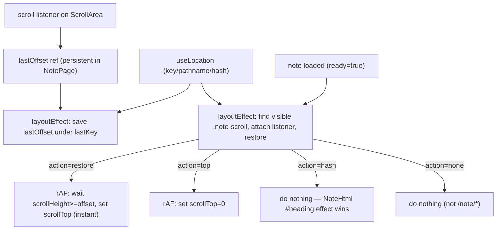

# Design: hand-rolled scroll restoration (Option A)

> **Parent.** `PV-SCROLL-023` holds the full analysis (why the browser can't do
> this, current-state evidence, the live probe that found the real scroller, and
> the Option A vs B decision). This ticket implements **Option A**: hand-rolled
> save/restore on the existing inner scroller, preserving the app-shell layout.

## 1. Goal

Press browser **back/forward** on a `/note/*` page and land at the previous
scroll offset, instantly. Forward to a brand-new note scrolls to top. A URL
with a `#heading` fragment defers to the existing scroll-to-heading behavior.

## 2. The correction that drives the design

The PV-SCROLL-023 design sketch assumed the scroller (`<main>`) was a stable DOM
node and put the logic in `VaultLayout`. Two facts overturned that:

1. **The scroller is `NotePage`'s `ScrollArea`** (`web/src/components/pages/NotePage/NotePage.tsx:140` desktop, `:163` no-backlinks, `:176` mobile), not `<main>`. `<main>` is a non-scrolling pass-through (`clientHeight == scrollHeight == 1717` on the live page; the `ScrollArea` has `scrollHeight 16495`).
2. **`NotePage` unmounts the `ScrollArea` during note loading.** The `isLoading` branch (`NotePage.tsx:88-95`) returns a loading spinner, so `NoteView`/`NoteHtml` and the `ScrollArea` are removed from the DOM while a note fetches. The scroller is therefore **not** stable across navigations to uncached notes.

Consequence: a hook that reads a ref to the scroller "on location change" will
find `null` on forward navigation to an uncached note (the scroller is gone by
the time the effect runs) and will fail to **save** the source note's offset.
Since the user's core complaint is "press Back and return to where I was," the
forward-then-back path must work, so the save must happen **before** the
scroller unmounts.

## 3. Architecture

The hook lives in **`NotePage`**, which is the persistent `/note/*` route element
(it stays mounted across slug changes and across the loading state). The
offsets map and the "last seen offset" ref therefore survive the loading
unmount. The scroller DOM node comes and goes, so the hook re-binds to it each
time it (re)mounts.



## 4. Pure policy (testable without a DOM)

`web/src/lib/scrollRestoration.ts` exports:

```ts
export type ScrollAction = "hash" | "restore" | "top" | "none";

export function pickScrollAction(
  location: { key: string; pathname: string; hash: string },
  savedOffsets: Map<string, number>
): ScrollAction {
  if (!location.pathname.startsWith("/note/")) return "none"; // not a note route
  if (location.hash) return "hash";                            // user asked for a heading
  if (savedOffsets.has(location.key)) return "restore";        // we have a saved offset
  return "top";                                                // fresh note → top
}
```

This is the only piece the node-env vitest runner can test (no DOM). It encodes
the precedence: **hash > restore > top**, with `none` for non-note routes. The
PV-WIKILINK-022 ticket used the same "extract the pure policy" pattern for the
same reason (the web test runner is `environment: "node"`).

## 5. The hook

```ts
export function useScrollRestoration(
  containerRef: RefObject<HTMLElement | null>,
  ready: boolean
): void
```

- `containerRef` — a ref on a wrapper div in `NotePage` that contains the
  desktop + mobile layouts. The hook finds the visible article scroller inside
  it via `findVisibleScroller`.
- `ready` — `!!note`; the scroller only exists when a note is loaded. The hook
  re-binds when `ready` flips false→true (after a loading period).

Internal state (all `useRef`, so they persist across the scroller's
mount/unmount):

- `saved: Map<string, number>` — offset per `location.key`.
- `lastOffset: number` — the most recent `scrollTop` from the scroll listener.
- `lastKey: string | null` — the `location.key` the current `lastOffset` belongs to.

Effects (all `useLayoutEffect` so save runs before restore in the same commit):

1. **Mount once:** `history.scrollRestoration = "manual"`. We own restoration.
2. **On `location.key` change:** if `lastKey != null`, `saved.set(lastKey, lastOffset)`. Then `lastKey = location.key; lastOffset = 0`. (Save happens here, reading the listener's last value — which survived even if the scroller already unmounted for a loading state.)
3. **On `location.*` change or `ready` change:** find the visible scroller; if none (still loading), return. Attach a passive `scroll` listener that writes `scroller.scrollTop` into `lastOffset`. Then `pickScrollAction(location, saved)`:
   - `restore` / `top` → `offset = saved.get(key) ?? 0`; rAF loop until `scrollHeight >= offset` (or 60 tries), then `scrollTop = offset` (instant). Cleanup cancels the rAF and removes the listener.
   - `hash` / `none` → no restore; just the listener (with cleanup).

`findVisibleScroller(root)` returns the `.note-scroll` element with
`clientHeight > 0` (the visible branch; desktop and mobile both render but one
is `display:none` via `md:` classes, so it has `clientHeight 0`).

## 6. Why a scroll listener (not "read scrollTop on location change")

On forward navigation to an **uncached** note, by the time the location effect
runs, `NotePage` has already re-rendered to the loading spinner and the old
`ScrollArea` is gone — its `scrollTop` is unreadable. A passive `scroll`
listener keeps `lastOffset` continuously updated **while** the note is viewed,
so the value is already captured before the unmount. This is the standard SPA
pattern for "capture state that dies with a subtree."

For **back/forward** (the target is cached), the `ScrollArea` does not unmount
(the same DOM node is reused, only `innerHTML` swaps), so a read-on-change would
also work — but the listener handles both cases uniformly and also captures
scrolling that happens after restore.

## 7. Why `useLayoutEffect` for both save and restore

On a single commit, layout effects run top-to-bottom before paint. Placing the
**save** effect above the **restore** effect guarantees the leaving offset is
persisted before the arriving offset is applied. (`useEffect` would run after
paint and in the same order, but layout effects additionally run before the
first paint, reducing the restore flash.)

## 8. Wiring in `NotePage` (file-level)

1. `import { useScrollRestoration } from "../../../lib/scrollRestoration"`.
2. Add `const layoutRef = useRef<HTMLDivElement>(null);` and call
   `useScrollRestoration(layoutRef, !!note);` **before** the early returns
   (`if (!slug)`, `if (isLoading)`, `if (isError)`). The hook's effects handle a
   null/unmounted container gracefully.
3. Wrap the final return's desktop+mobile layout divs in
   `<div ref={layoutRef} className="h-full">…</div>`.
4. Add the `note-scroll` class to the three article `ScrollArea` usages
   (`:140` `h-full p-6`, `:163` `flex-1 p-6`, `:176` `h-full p-4`) so the hook
   can find the visible article scroller unambiguously (backlinks and sidebar
   use other classes).
5. No change to `NoteHtml`'s `#heading` effect — hash precedence is enforced by
   `pickScrollAction` returning `"hash"`.

## 9. Precedence and edge cases

- **Hash wins:** a `/note/slug#heading` location returns `"hash"`, so the hook
  does not restore; `NoteHtml`'s existing `scrollIntoView` runs. This also covers
  the PV-WIKILINK-022 same-note anchor fix.
- **First load:** `lastKey` is `null` → skip save; no saved offset → `"top"`.
- **Short note (no overflow):** the `ScrollArea` still exists (`clientHeight>0`);
  restore sets `scrollTop = 0` (or the saved 0). Harmless.
- **Programmatic restore fires the scroll listener**, updating `lastOffset` to
  the restored value — so a subsequent navigation saves the right offset.
- **Flash risk:** between commit and the rAF restore, one frame may paint at
  `scrollTop = 0`. rAF usually runs before paint; if a flash appears, defer
  gating content visibility to a follow-up (out of scope).

## 10. Test strategy

**Unit (vitest, node env) — `web/src/lib/scrollRestoration.test.ts`:**

```ts
pickScrollAction({key:"k",pathname:"/note/a",hash:""},     new Map()) === "top"
pickScrollAction({key:"k",pathname:"/note/a",hash:""},     new Map([["k",300]])) === "restore"
pickScrollAction({key:"k",pathname:"/note/a",hash:"#h"},   new Map([["k",300]])) === "hash"
pickScrollAction({key:"k",pathname:"/search",hash:""},     new Map()) === "none"
pickScrollAction({key:"k",pathname:"/note/a",hash:"#h"},   new Map()) === "hash" // hash beats top
```

**Build gate:** `pnpm --dir web check` (tsc), `pnpm --dir web build` (vite).

**Manual (decisive) on the real vault:**

```bash
pnpm --dir web build
go run ./cmd/retro-obsidian-publish serve --vault <vault> --port 8080 --watch=false --serve-web
```

1. Open a long note; scroll to ~50%.
2. Click a cross-note link (uncached) → new note loads.
3. **Back** → assert previous note restores to ~50% (instant).
4. **Forward** → assert the second note is at top (or its saved offset if scrolled).
5. From a note, click a `#heading` link → assert it scrolls to the heading
   (hash wins); Back to it keeps the heading.
6. Reload (F5) → assert top (offsets are in-memory, not sessionStorage; by design).

## 11. Decision records

### Decision: hook in persistent NotePage, not NoteHtml

- **Context:** `NoteHtml` unmounts during note loading (`isLoading` early return in `NotePage`), so a hook there loses its local refs on every uncached navigation.
- **Options:** (1) hook in `NoteHtml` with a ref to the scroller; (2) hook in `NotePage` (persistent route element) with a scroll listener capturing offsets before unmount.
- **Decision:** Option 2.
- **Rationale:** The saved-offsets map and last-offset ref must outlive the scroller's mount/unmount. `NotePage` is the `/note/*` route element and stays mounted through loading. The scroller is a child that comes and goes; the hook re-binds via `findVisibleScroller` whenever `ready` flips true.
- **Consequences:** The hook needs `containerRef` + `ready`; slightly more coupling than a bare ref. The pure policy is still independently tested.
- **Status:** accepted

### Decision: scroll listener captures offset before unmount

- **Context:** Reading `scrollTop` at location-change time misses the source note's offset when navigating to an uncached note (scroller already unmounted).
- **Options:** (1) save in the click handler before `navigate()`; (2) passive scroll listener writing to a persistent ref.
- **Decision:** Option 2.
- **Rationale:** A listener handles all navigation triggers (link clicks, sidebar, back/forward) uniformly and captures the latest offset continuously. The click-handler approach would miss browser back/forward and sidebar navigation.
- **Consequences:** One passive listener per mounted scroller; negligible cost. The listener re-attaches when the scroller re-mounts.
- **Status:** accepted

### Decision: in-memory map, `history.scrollRestoration = "manual"`

- **Context:** Offsets need to persist across in-tab navigations, not reloads.
- **Decision:** In-memory `Map` keyed by `location.key`; declare `manual` so we fully own restoration (the browser's `auto` is a no-op here anyway — window never scrolls).
- **Consequences:** Reload (F5) starts at top. Matches the PV-SCROLL-023 decision; `sessionStorage` is a one-line follow-up if reload-restoration is later wanted.
- **Status:** accepted

## 12. References

| Concern | File | Key line |
|---|---|---|
| Pure policy + hook | `web/src/lib/scrollRestoration.ts` | `pickScrollAction`, `useScrollRestoration`, `findVisibleScroller` |
| Regression test | `web/src/lib/scrollRestoration.test.ts` | `pickScrollAction` cases |
| Hook wiring | `web/src/components/pages/NotePage/NotePage.tsx` | `useScrollRestoration(layoutRef, !!note)`; `note-scroll` classes; `layoutRef` |
| Loading unmount (the reason) | `web/src/components/pages/NotePage/NotePage.tsx` | `isLoading` early return :88-95 |
| Article scroller | `web/src/components/pages/NotePage/NotePage.tsx` | `ScrollArea` :140/:163/:176 |
| Hash precedence (unchanged) | `web/src/components/organisms/NoteHtml/NoteHtml.tsx` | `#heading` effect :199-214 |
| Parent analysis | `ttmp/2026/08/15/PV-SCROLL-023--…/design-doc/01-…md` | full analysis + Option A/B |
