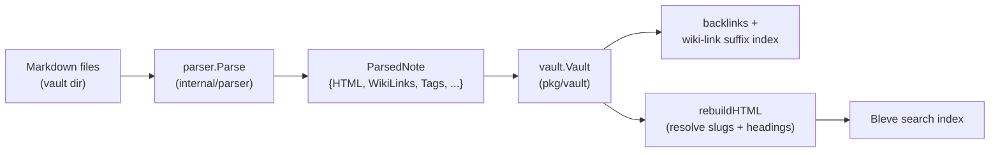
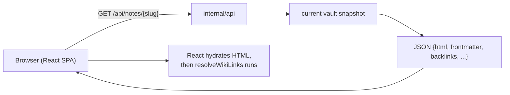
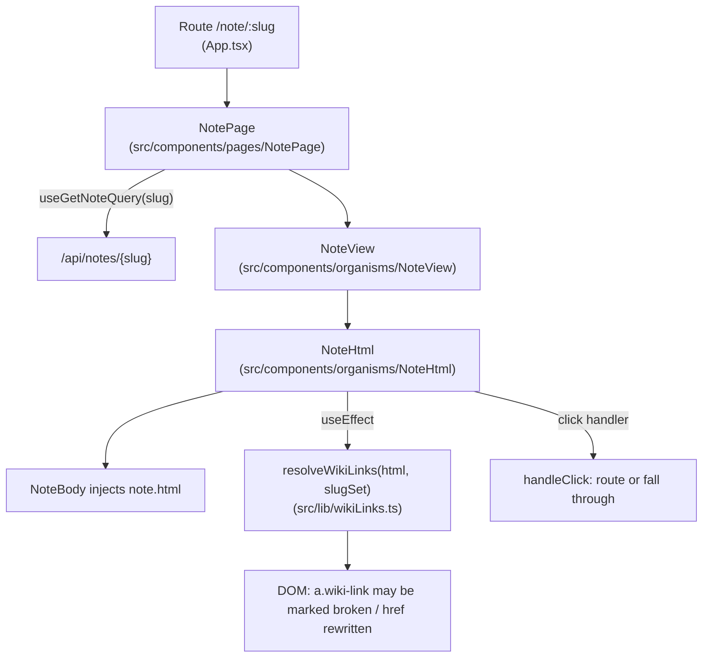

# Intern guide: same-note anchor links and the frontend resolver bug

> **Audience.** You are a new engineer who has never seen this codebase. This
> guide assumes you know Go, TypeScript, and React, but nothing about
> publish-vault, Obsidian, or how a Markdown note becomes a web page here. By
> the end you should be able to explain, to someone else, exactly why the
> "notation table" link on the CoinVault index page did nothing when clicked,
> and exactly how the fix works.
>
> **Scope.** One class of link — the Obsidian **same-note heading link**
> (`[[#Heading]]`) — and one bug. We will not redesign the wiki-link system; we
> will understand it just deeply enough to fix one regression and to avoid
> reintroducing it.

---

## 1. Executive summary

The published note "CoinVault — Index of Design Patterns" is a back-of-the-book
index: almost every entry ends with `See [[#Some Heading]]` or
`see also [[#Other Heading]]`. On the live site
(`parc.yolo.scapegoat.dev`) **all 952 of those same-note links were broken**:
they rendered red and dotted (the "broken" style), showed the hover tooltip
"Note not found:", and clicking them did nothing useful.

The cause is small and exactly located:

- The **Go backend** correctly resolves each `[[#Heading]]` to a real
  in-page anchor, e.g. `href="#identity-strings-schemas-and-budgets"`, and tags
  it with the class `wiki-link-self`. (This was fixed in the prior ticket
  `PV-WIKILINK-021`.)
- The **React frontend** has a post-hydration pass, `resolveWikiLinks`, that
  validates every `a.wiki-link` against the note index. It treated the
  `wiki-link-self` anchors as cross-note links, found their `data-target`
  empty, concluded the "target note" was missing, and **overwrote the
  server-resolved `href` with `"#"`** while adding the `broken` class.

The fix is one policy: `resolveWikiLinks` must skip anchors that are
`wiki-link-self`. We extract that decision into a pure, tested function,
`wikiLinkTargetForValidation`, so it is named and unit-testable. After the fix,
verified against the real vault in a browser: **952/952 broken → 0 broken**,
and clicking "notation table" scrolls to the heading.

---

## 2. Problem statement and scope

**Symptom (observed on the live page).** Open
`https://parc.yolo.scapegoat.dev/note/research/software-architecture-garden/coinvault/index-of-design-patterns`.
Every `[[#Heading]]` link is styled as broken and does not navigate. The
"notation table" link in the "How to read this index" section is the reported
example; it should jump to the "Identity strings, schemas, and budgets" heading
near the bottom.

**Evidence (live DOM, before fix).**

```html
<!-- What the React app rendered after hydration: -->
<a href="#" class="wiki-link wiki-link-self broken"
   data-heading="Identity strings, schemas, and budgets"
   data-alias="notation table"
   title="Note not found: ">notation table</a>
```

```text
Total a.wiki-link on the page: 1548
  wiki-link-self (same-note [[#Heading]]): 952  -> 952 broken, all href="#"
  cross-note ([[Note]] / [[Note#Heading]]): 596  ->   0 broken
```

The bug is **exactly** the same-note heading links. Cross-note links are
unaffected, which already tells us the failure is not "links are generally
broken" but "one specific kind of link is misclassified."

**Out of scope.**

- Cross-note `[[Note#Heading]]` fragments (already fixed in `PV-WIKILINK-021`).
- `![[Note]]` and `![[#Heading]]` embeds (known open follow-up from 021).
- Block references `[[#^blockid]]` (unsupported; same-note ones render visibly
  broken by design).
- Redesigning the resolver or adding a DOM test framework (discussed as open
  questions, not done here).

---

## 3. The system: what publish-vault is

`publish-vault` (binary `retro-obsidian-publish`, module
`github.com/go-go-golems/publish-vault`) turns a folder of Obsidian Markdown
files into a small self-hosted website. Your source of truth is a normal folder
of `.md` files; the app reads it (read-only) and derives the site.

It has **two phases**.

### 3.1 Load time — build an in-memory vault



1. **Parse.** Every `.md` file runs through `parser.Parse`
   (`internal/parser/parser.go:56`). This is where wiki links become HTML
   anchors and where heading ids are generated.
2. **Index.** `pkg/vault/vault.go` builds a suffix-based wiki-link index (so
   `[[App-Auth]]` can resolve to `research/kb/tribal/app-auth`), computes
   backlinks, and runs `rebuildHTML` (`pkg/vault/vault.go:508`) which resolves
   every cross-note link to its real slug and every cross-note `#Heading`
   fragment to the target note's real heading id.
3. **Search.** Notes are indexed with Bleve.

The expensive work happens **once**, at load. The result is a single immutable
in-memory snapshot that request handlers read from.

### 3.2 Request time — serve from the snapshot



- `GET /api/notes/{slug}` returns the pre-rendered `html` string (the output of
  parse + rebuildHTML) plus frontmatter, tags, backlinks, modtime.
- The React app injects that `html` into the page and then runs a **post-
  hydration** pass (`resolveWikiLinks`) to mark broken links. This pass is where
  the bug lives.

> **Why two rendering layers?** The backend renders once (cheap to serve, exact
> heading ids). The frontend re-validates once per view (cheap, and it knows the
> live note list). The bug is a contract mismatch between the two about what a
> `wiki-link` *is*.

**API reference (request time).**

| Method | Path | Returns |
|---|---|---|
| `GET` | `/api/healthz` | `{ok, notes, vaultRoot, ...}` |
| `GET` | `/api/notes` | Lightweight list of all notes |
| `GET` | `/api/notes/{slug}` | Full note: `html`, `frontmatter`, `tags`, `wikiLinks`, `backlinks`, `modTime` |
| `GET` | `/api/tree` | Folder tree for the sidebar |
| `GET` | `/api/search?q=` | Bleve search results |
| `GET` | `/api/tags` | Tag counts |

The `html` field of `/api/notes/{slug}` is the single source of truth for what
the page shows; the frontend only post-processes it.

---

## 4. The wiki-link grammar (the five forms you must know)

`parser.go` recognizes these inside `[[ … ]]` (see `wikiLinkRegex`,
`internal/parser/parser.go:40`, and `parseWikiLinkInner`,
`internal/parser/parser.go:180`):

| Syntax | Name | Target | Heading | Alias | Server emits |
|---|---|---|---|---|---|
| `[[Note]]` | cross-note | `Note` | — | — | `<a class="wiki-link" data-target="slug" href="/note/slug">Note</a>` |
| `[[Folder/Note]]` | cross-note, path | `Folder/Note` | — | — | as above, `data-target` is the suffix-resolved slug |
| `[[Note\|Alias]]` | cross-note, aliased | `Note` | — | `Alias` | as above, display text = `Alias` |
| `[[Note#Heading]]` | cross-note + fragment | `Note` | `Heading` | — | `data-target="slug" href="/note/slug#<provisional>" data-heading="Heading"`; fragment fixed later by `ResolveWikiLinkHeadings` |
| `[[#Heading]]` | **same-note** | — | `Heading` | — | `<a href="#" class="wiki-link wiki-link-self" data-heading="Heading">Heading</a>`; `href` fixed later by `resolveSelfHeadingLinks` |
| `[[#Heading\|Alias]]` | same-note, aliased | — | `Heading` | `Alias` | as above, display = `Alias` |
| `![[Note]]` | embed | `Note` | — | — | `<div class="wiki-embed" data-target="slug" …>` |

`parseWikiLinkInner` splits the inner text on `|` (alias) then `#` (heading),
then strips a trailing `.md` via `StripNoteExtension`
(`internal/parser/parser.go:216`). The crucial line for this ticket: when the
part before `#` is empty, **`target == ""`** — that is the same-note case.

```text
parseWikiLinkInner("#Identity strings, schemas, and budgets|notation table")
  -> alias   = "notation table"
  -> heading = "Identity strings, schemas, and budgets"
  -> target  = ""          // <-- this is what makes it a self link
```

---

## 5. The server-side link pipeline (where correct HTML comes from)

This section traces one `[[#Heading]]` from Markdown to the `html` field the
API serves. Follow the file references.

### 5.1 Parse: `wikiLinkHTML` emits a placeholder

`wikiLinkHTML` (`internal/parser/parser.go:265`) branches on `target == ""`
(`internal/parser/parser.go:294`):

```go
if target == "" {
    // [[#Heading]] — a link to a heading in *this* note, not to another note.
    // The real anchor id is only known once goldmark has rendered the
    // headings, so emit a placeholder for resolveSelfHeadingLinks to finish.
    if heading == "" {
        return match // degenerate [[#]] / [[|x]]: leave the source text alone
    }
    if display == "" {
        display = heading
    }
    return []byte(`<a href="#" class="wiki-link wiki-link-self" data-heading="` +
        stdhtml.EscapeString(attrHeading) + `" data-alias="` +
        stdhtml.EscapeString(attrAlias) + `">` + stdhtml.EscapeString(display) + `</a>`)
}
```

Three things to notice:

- It emits `href="#"` as a **placeholder**, not the final URL.
- It adds the class **`wiki-link-self`** and emits **no `data-target`** attribute.
- The real heading id is unknown here because headings are rendered by goldmark
  *after* this replacement, so the id does not exist yet.

For comparison, a cross-note link (`target != ""`) emits `data-target="slug"`
and `href="/note/slug#<provisional>"` (`internal/parser/parser.go:313`).

### 5.2 Parse: `resolveSelfHeadingLinks` rewrites the placeholder to the real id

Later in `Parse` (`internal/parser/parser.go:115`), after goldmark has rendered
all headings with ids, `resolveSelfHeadingLinks`
(`internal/parser/parser.go:386`) runs:

```go
func resolveSelfHeadingLinks(htmlIn string) string {
    if !strings.Contains(htmlIn, `class="wiki-link wiki-link-self"`) {
        return htmlIn
    }
    idx := BuildHeadingIndex(htmlIn)
    return selfHeadingLinkRe.ReplaceAllStringFunc(htmlIn, func(match string) string {
        sub := selfHeadingLinkRe.FindStringSubmatch(match)
        heading := stdhtml.UnescapeString(sub[1])
        id, ok := idx.Lookup(heading)
        if !ok {
            return `<a href="#unresolved-` + stdhtml.EscapeString(slugify(heading)) +
                `" class="wiki-link wiki-link-self broken" data-heading="` + sub[1] + `" data-alias="` + sub[2] + `">`
        }
        return `<a href="#` + stdhtml.EscapeString(id) +
            `" class="wiki-link wiki-link-self" data-heading="` + sub[1] + `" data-alias="` + sub[2] + `">`
    })
}
```

So after this pass, the "notation table" link leaves the parser as:

```html
<a href="#identity-strings-schemas-and-budgets"
   class="wiki-link wiki-link-self"
   data-heading="Identity strings, schemas, and budgets"
   data-alias="notation table">notation table</a>
```

If no heading matches, the server itself marks it `broken` and points at
`#unresolved-…`. **The server already decides whether a self link is broken.**

### 5.3 Why the id is *read back*, not computed (the goldmark/slugify divergence)

You might expect `href="#" + slugify(heading)` to just work. It does not, and
understanding why is the key to not regressing this area. Heading ids are
generated by goldmark's `parser.WithAutoHeadingID()`, and goldmark's algorithm
disagrees with the project's `slugify` (`internal/parser/parser.go:410`):

```go
func slugify(s string) string {
    s = strings.ToLower(strings.TrimSpace(s))
    s = regexp.MustCompile(`[^a-z0-9\-_/]`).ReplaceAllString(s, "-") // replace punctuation with -
    s = regexp.MustCompile(`-+`).ReplaceAllString(s, "-")            // collapse runs of -
    return strings.Trim(s, "-")
}
```

| Heading text | goldmark id | `slugify` |
|---|---|---|
| `Identity strings, schemas, and budgets` | `identity-strings-schemas-and-budgets` | `identity-strings-schemas-and-budgets` (happens to agree) |
| `9.2 Kernel K0: canonical identity` | `92-kernel-k0-canonical-identity` | `9-2-kernel-k0-…` |
| `7.3 Domain-separated hashes` | `73-domain-separated-hashes` | `7-3-domain-…` |
| `A/B experiment, proving the mutation fired` | `ab-experiment-proving-the-mutation-fired` | `a-b-experiment-…` |

Goldmark **deletes** punctuation it does not want; `slugify` **replaces** it
with `-`. They agree only for letters, digits, and spaces. Goldmark also
suffixes duplicate headings (`notes`, `notes-1`), which no stateless function
can reproduce. So the only exact source of a heading's id is the rendered HTML
itself, which is what `BuildHeadingIndex` (`internal/parser/parser.go:348`)
reads. `HeadingIndex.Lookup` (`internal/parser/parser.go:370`) matches on
heading text (case-insensitive, whitespace collapsed), falling back to trying
the id directly so a `[[#some-heading]]` written in slug form still lands.

### 5.4 The vault layer finishes cross-note links

Same-note links are fully resolved in `Parse` (they only need the note itself).
Cross-note `[[Note#Heading]]` links need the *target* note's headings, so they
are finished in `rebuildHTML` (`pkg/vault/vault.go:508`):

```text
rebuildHTML (per note):
  ReplaceWikiLinksString   -> resolve data-target slug via suffix index
  ResolveWikiLinkHeadings  -> replace provisional #fragment with target's real id
  ReplaceWikiEmbedImages   -> resolve ![[image]] to /vault-assets URLs
```

`ResolveWikiLinkHeadings` (`internal/parser/parser.go:498`) reads each
`data-heading` and looks it up in the target's `HeadingIndex`. This is why the
anchor carries `data-heading`: the fragment alone (`#9-2-kernel-k0`) has already
lost the original heading text.

**By the time the API serves `/api/notes/{slug}`, the `html` field is fully
correct for both same-note and cross-note links.** We confirmed this directly:

```text
$ curl -s .../api/notes/research/software-architecture-garden/coinvault/index-of-design-patterns \
  | python3 -c "import json,re;h=json.load(sys.stdin)['html'];\
print('href=# :',len(re.findall(r'href=\"#',h))); print('#unresolved:',len(re.findall(r'#unresolved',h)))"
href=# : 238
#unresolved: 0
```

So the bug is **not** in the server.

---

## 6. The frontend render chain (where the bug is)

### 6.1 The component path



- `App.tsx` routes `/note/...` → `NotePage`.
- `NotePage` (`src/components/pages/NotePage/NotePage.tsx`) fetches the note via
  RTK Query and passes `note.html` down.
- `NoteView` wraps `NoteHtml` (it adds title/frontmatter/backlinks furniture).
- `NoteHtml` (`src/components/organisms/NoteHtml/NoteHtml.tsx`) is the body
  owner. It sets the raw `html` as state first (hydration-safe), then in an
  effect re-runs `resolveWikiLinks`:

```ts
// NoteHtml.tsx
const [resolvedHtml, setResolvedHtml] = useState(html);
useEffect(() => {
  setResolvedHtml(resolveWikiLinks(html, slugSet));
}, [html, slugSet]);
```

### 6.2 `resolveWikiLinks` — the bug

`src/lib/wikiLinks.ts` (before the fix):

```ts
export function resolveWikiLinks(html: string, slugSet: SlugSet): string {
  if (typeof document === "undefined") return html;   // SSR guard
  const parser = new DOMParser();
  const doc = parser.parseFromString(html, "text/html");

  doc.querySelectorAll("a.wiki-link").forEach((el) => {     // <-- matches self links too
    const target = el.getAttribute("data-target") ?? "";   // <-- "" for wiki-link-self
    if (!slugSet.has(target)) {                             // <-- slugSet.has("") is false
      el.classList.add("broken");
      el.setAttribute("title", `Note not found: ${target}`);
      el.setAttribute("href", "#");                         // <-- clobbers the resolved href
    }
  });

  return doc.body.innerHTML;
}
```

Walk it for the "notation table" anchor:

1. `querySelectorAll("a.wiki-link")` matches it (it has class `wiki-link`).
2. `el.getAttribute("data-target")` returns `null` (the server emits **no**
   `data-target` for self links) → `?? ""` → `""`.
3. `slugSet.has("")` is `false` (the empty string is not a note slug).
4. So it adds `broken`, sets `title="Note not found: "`, and overwrites
   `href="#identity-strings-schemas-and-budgets"` with `href="#"`.

The server's carefully read-back id is destroyed. The CSS
`a.wiki-link.broken { color: var(--color-destructive-accent); text-decoration: underline dotted; }`
(`web/src/styles/prose.css:17`) paints it red/dotted — the visible symptom.

### 6.3 The click handler lets broken self links through (but they were already broken)

`NoteHtml.handleClick` (`src/components/organisms/NoteHtml/NoteHtml.tsx`,
around line 128):

```ts
const wikiTarget = anchor.getAttribute("data-target");
if (wikiTarget && anchor.classList.contains("wiki-link")) {
  e.preventDefault();
  if (!anchor.classList.contains("broken")) {
    const href = anchor.getAttribute("href") ?? "";
    const hash = href.indexOf("#") >= 0 ? href.slice(href.indexOf("#")) : "";
    onWikiLinkNavigate?.(`${wikiTarget}${hash}`);
  }
  return;
}
const href = anchor.getAttribute("href");
if (href?.startsWith("#")) return;   // self links fall through here -> native hash nav
```

A `wiki-link-self` anchor has no `data-target`, so the first `if` is skipped;
`href` starts with `#`, so the handler returns **without** `preventDefault`. That
means the browser's native anchor behavior would scroll to the id — **if the
href were still correct**. Before the fix, the href was `"#"`, so native
behavior jumped to the top of the page (or nowhere). The handler is fine; the
href it reads was already clobbered.

> **Insight.** The frontend has two separate concerns mashed into one selector:
> (a) *is this a cross-note link whose target note exists?* and (b) *is this a
> same-note heading link?* `resolveWikiLinks` answered (a) for everything,
> including the links that are actually (b). The fix separates them.

---

## 7. Root cause (one paragraph)

`resolveWikiLinks` iterates `a.wiki-link` and treats every one as a cross-note
link that must carry a resolvable `data-target`. Same-note heading links are
rendered with class `wiki-link-self` and **no** `data-target`, so they read as
`""`, fail `slugSet.has("")`, and get marked `broken` with `href="#"` —
clobbering the id the server already resolved. The `wiki-link-self` class is
the discriminator the backend already provides; the frontend resolver simply
wasn't told to honor it. (This is the gap left by `PV-WIKILINK-021`, which fixed
the backend `[[#Heading]]` path but never wired the frontend resolver.)

---

## 8. The fix

### 8.1 Policy (pseudocode)

```
for each a.wiki-link in the rendered HTML:
    if it is a same-note heading link (class "wiki-link-self"):
        skip                          # server already resolved href; do not touch
    else:
        target = its data-target      # cross-note link
        if target not in the note index:
            mark it broken, set title, set href="#"
```

### 8.2 Code: a pure, named, testable helper

`src/lib/wikiLinks.ts`:

```ts
export interface WikiLinkLike {
  classList: { contains: (c: string) => boolean };
  getAttribute: (n: string) => string | null;
}

/**
 * Returns the note slug a wiki-link anchor targets for validation, or null
 * when the anchor is not subject to the "target note not found" check.
 * Same-note heading links (class "wiki-link-self", no data-target) return null
 * so resolveWikiLinks neither marks them broken nor overwrites their href.
 */
export function wikiLinkTargetForValidation(el: WikiLinkLike): string | null {
  if (el.classList.contains("wiki-link-self")) return null;
  return el.getAttribute("data-target") ?? "";
}

export function resolveWikiLinks(html: string, slugSet: SlugSet): string {
  if (typeof document === "undefined") return html;
  const parser = new DOMParser();
  const doc = parser.parseFromString(html, "text/html");
  doc.querySelectorAll("a.wiki-link").forEach((el) => {
    const target = wikiLinkTargetForValidation(el);
    if (target === null) return;              // <-- the fix: leave self links alone
    if (!slugSet.has(target)) {
      el.classList.add("broken");
      el.setAttribute("title", `Note not found: ${target}`);
      el.setAttribute("href", "#");
    }
  });
  return doc.body.innerHTML;
}
```

### 8.3 Exact diff (essence)

```diff
   doc.querySelectorAll("a.wiki-link").forEach((el) => {
-    const target = el.getAttribute("data-target") ?? "";
-    if (!slugSet.has(target)) {
+    const target = wikiLinkTargetForValidation(el);
+    if (target === null) return;
+    if (!slugSet.has(target)) {
       el.classList.add("broken");
       el.setAttribute("title", `Note not found: ${target}`);
       el.setAttribute("href", "#");
     }
   });
```

### 8.4 Why this is the *whole* fix

- The server already produces correct `href` for self links and already marks
  unresolved ones `broken` with `#unresolved-…`. The frontend only needed to
  **stop destroying** that.
- The click handler already lets `href="#…"` through to native navigation; once
  the href is correct, clicking works.
- Cross-note links are unchanged: they still have `data-target`, still get
  validated, still get marked broken when their target is missing.

---

## 9. Decision records

### Decision: discriminate self links by class, not by empty `data-target`

- **Context:** `resolveWikiLinks` must skip same-note links but still validate
  cross-note links. A cross-note link can have an empty `data-target` in a
  degenerate case (e.g. `[[!!!]]` → `slugify` → `""`).
- **Options considered:**
  1. Skip when `data-target` is empty. Simple, but would also skip the degenerate
     cross-note link, silently hiding a genuinely broken link.
  2. Skip when the anchor has class `wiki-link-self`. The backend emits this
     class **exactly** for same-note links (`internal/parser/parser.go:307`), so
     it is a precise discriminator that leaves degenerate cross-note links
     subject to the check.
- **Decision:** Option 2 — skip by class.
- **Rationale:** The class is the backend's own statement of "this is a self
  link." It is precise and future-proof; an empty-target cross-note link still
  correctly renders broken.
- **Consequences:** The frontend must trust the `wiki-link-self` class as the
  contract. Any future code path that emits a self link without that class would
  regress. Documented here and in the parser.
- **Status:** accepted

### Decision: extract a pure helper instead of an inline `if`

- **Context:** The web test runner is node-only (`vitest.config.ts` sets
  `environment: "node"`); there is no `DOMParser`, and the project does not depend
  on `happy-dom`/`jsdom`. A DOM-level test would need a new dependency.
- **Options considered:**
  1. Inline `if (el.classList.contains("wiki-link-self")) return;`. Smallest
     diff, but the policy is anonymous and untestable without a DOM.
  2. Extract `wikiLinkTargetForValidation(el)` as a pure function over a small
     structural interface (`WikiLinkLike`), tested with a tiny stub.
- **Decision:** Option 2.
- **Rationale:** Names the policy, makes the regression testable in the existing
  node environment with zero new dependencies, and documents the contract in the
  function's doc comment.
- **Consequences:** Two functions instead of one; the test pins the policy, not
  the DOM wiring. A future DOM test (happy-dom) would close the wiring gap.
- **Status:** accepted

### Decision: leave click handling alone (native hash scroll)

- **Context:** After the fix, clicking a self link falls through to the
  browser's native `#id` scroll. The heading-permalink feature
  (`enhanceHeadingAnchors`, `src/components/organisms/NoteView/noteEnhancements.ts:185`)
  uses `heading.scrollIntoView({behavior:"smooth"})`.
- **Options considered:**
  1. Add a `wiki-link-self` branch to `handleClick` that does
     `preventDefault` + `scrollIntoView({smooth})` for consistency.
  2. Do nothing; rely on native hash navigation now that `href` is correct.
- **Decision:** Option 2 (for this ticket).
- **Rationale:** The bug is "links are broken"; the minimal fix is "stop
  clobbering the href." Verified end-to-end that native scroll lands on the
  heading inside the `ScrollArea` container. Smooth-scroll consistency is a
  polish item, not a correctness item, and adding click-handler logic expands the
  change surface.
- **Consequences:** Self-link clicks use native (instant) scroll; heading
  permalinks use smooth scroll. Minor inconsistency; tracked as an open
  question.
- **Status:** accepted (polish deferred)

### Decision: scope excludes adding a DOM test framework

- **Context:** A test asserting "the resolved `href` survives
  `resolveWikiLinks`" would need a DOM. `happy-dom` is in the pnpm lockfile
  transitively but not a direct dependency and not resolvable from `web/`.
- **Options considered:**
  1. Add `happy-dom` as a devDependency + a `// @vitest-environment happy-dom`
     DOM-level test.
  2. Test the pure policy only (this ticket); note the DOM test as a follow-up.
- **Decision:** Option 2.
- **Rationale:** Adding a dependency + lockfile change expands the PR and risks
  `--frozen-lockfile` CI. The pure-helper test captures the exact regression
  (self links must not be marked broken). The end-to-end browser check on the
  real note is the higher-value correctness proof for this ticket.
- **Consequences:** The DOM wiring (`querySelectorAll` + `setAttribute`) is not
  unit-covered. Follow-up: add `happy-dom` and a DOM test, and wire
  `pnpm --dir web test` into CI (today CI only runs `check` and `build`).
- **Status:** accepted (follow-up tracked)

---

## 10. Implementation plan (file-level)

1. **`web/src/lib/wikiLinks.ts`** — add `WikiLinkLike`, add
   `wikiLinkTargetForValidation`, rewrite the `resolveWikiLinks` loop to use it.
2. **`web/src/lib/wikiLinks.test.ts`** — new vitest file: 4 policy cases
   (self link skipped; self link with a stray data-target still skipped;
   cross-note link returns its target; cross-note link with no data-target
   returns `""` so it still marks broken) + 1 no-DOM guard case.
3. **No backend changes.** The server was already correct; do not touch
   `internal/parser/parser.go` or `pkg/vault/vault.go`.
4. **No CSS changes.** `a.wiki-link.broken` stays for genuinely broken links;
   self links simply no longer receive it.

Each step is independently reviewable. Step 1 is the fix; step 2 is the
regression guard; steps 3–4 are explicit non-changes (the two places a
well-meaning intern might "also fix" and break something).

---

## 11. Test strategy

**Unit (vitest, node env) — `web/src/lib/wikiLinks.test.ts`:**

```ts
function el(opts: { classes?: string[]; target?: string | null }): WikiLinkLike { /* tiny stub */ }

it("skips a same-note heading link (wiki-link-self, no data-target)", () => {
  expect(wikiLinkTargetForValidation(el({ classes: ["wiki-link", "wiki-link-self"] }))).toBeNull();
});
it("skips a same-note link even if it carries a data-target", () => {
  expect(wikiLinkTargetForValidation(el({ classes: ["wiki-link", "wiki-link-self"], target: "x" }))).toBeNull();
});
it("returns the data-target of a cross-note link for validation", () => {
  expect(wikiLinkTargetForValidation(el({ classes: ["wiki-link"], target: "research/notes/foo" }))).toBe("research/notes/foo");
});
it("returns '' for a cross-note link with no data-target (still subject to the check)", () => {
  expect(wikiLinkTargetForValidation(el({ classes: ["wiki-link"] }))).toBe("");
});
it("returns html unchanged when no DOM is available", () => {
  const html = '<a class="wiki-link wiki-link-self" href="#heading-id">x</a>';
  expect(resolveWikiLinks(html, new Set(["a"]))).toBe(html);
});
```

**Type/build gate (CI-relevant):**

```bash
pnpm --dir web check            # tsc --noEmit  (runs in CI via lefthook + web-check)
pnpm --dir web exec vitest run  # 26 tests pass (21 existing + 5 new)
pnpm --dir web build            # vite build (runs in CI)
```

**End-to-end (manual, on the real vault) — the decisive proof:**

```bash
pnpm --dir web build
go run ./cmd/retro-obsidian-publish serve \
  --vault /home/manuel/code/wesen/go-go-golems/go-go-parc \
  --port 8080 --watch=false --serve-web
```

Then in a browser open
`http://127.0.0.1:8080/note/research/software-architecture-garden/coinvault/index-of-design-patterns`
and verify (Playwright or DevTools):

```js
const self = [...document.querySelectorAll('a.wiki-link-self')];
self.length;                              // 952
self.filter(a => a.classList.contains('broken')).length;  // 0   (was 952)
const n = self.find(a => a.textContent.trim() === 'notation table');
n.getAttribute('href');                   // "#identity-strings-schemas-and-budgets"
!!document.getElementById(n.getAttribute('href').slice(1)); // true
n.click();                                // scrolls to the heading; hash updates
```

---

## 12. Verification results (this ticket)

| Check | Before | After |
|---|---|---|
| Server `html` field: `href="#…"` resolved | 238 | 238 (unchanged — server was never the bug) |
| Server `html` field: `#unresolved` | 0 | 0 |
| Live DOM: `wiki-link-self` broken | 952 / 952 | **0 / 952** |
| Live DOM: cross-note broken | 0 / 596 | 0 / 596 |
| Click "notation table" | href `#`, no scroll | hash `#identity-strings-schemas-and-budgets`, heading scrolls into view (`top: 14488 → 28`) |
| `pnpm --dir web check` | pass | pass |
| `pnpm --dir web exec vitest run` | 21 pass | 26 pass |
| Commit | — | `f25d167 fix(PV-WIKILINK-022): …` (lefthook `web-check` passed) |

Screenshot of the fixed behavior (scrolled to the heading after clicking
"notation table"): `sources/pv-wikilink-022-fixed-notation-table-jumps-to-heading.png`.

---

## 13. Risks, alternatives, open questions

**Risks.**

- *Trust the `wiki-link-self` contract.* If a future code path emits a same-note
  link without that class, the resolver would regress. Mitigation: the class is
  set in exactly one branch of `wikiLinkHTML`; keep it there.
- *Unresolved self links.* The server marks unresolved self links `broken` with
  `href="#unresolved-…"`. The frontend skip preserves that verdict (it does not
  re-validate). Confirm this is desired — it is, because the frontend has no
  heading context and would only make things worse.
- *Scroll-container behavior.* Native `#id` scroll works inside the
  `ScrollArea` here, but if the scroll container changes, native scroll could
  scroll the window instead of the panel. The smooth-scroll branch in
  `handleClick` (deferred) would harden this.

**Alternatives considered (not chosen).**

- *Validate self links against heading ids on the client.* Rejected: the
  frontend has no per-note heading index, and the server already did this
  exactly. Duplicating it invites drift.
- *Stop emitting `wiki-link-self` and fold self links into cross-note links
  with `data-target="<self-slug>"`.* Rejected: it would re-introduce the
  original 021 bug (self links going through `/note/<slug>`), and the class is
  the clean discriminator.

**Open questions.**

1. Add a DOM-level test with `happy-dom` and wire `pnpm --dir web test` into CI
   (currently CI runs only `check` and `build`, so vitest regressions do not
   gate merges).
2. Optional polish: give self links the same smooth scroll as heading permalinks
   via a `wiki-link-self` branch in `handleClick`.
3. Deploy: rebuild the bundle and redeploy the `parc.yolo.scapegoat.dev` image
   so the live site picks up the fix (out of scope for this ticket).

---

## 14. References (file:line)

| Concern | File | Key symbol / line |
|---|---|---|
| Wiki-link regex + inner parse | `internal/parser/parser.go` | `wikiLinkRegex` :40, `parseWikiLinkInner` :180 |
| Strip `.md` from targets | `internal/parser/parser.go` | `StripNoteExtension` :216 |
| Self-link placeholder branch | `internal/parser/parser.go` | `wikiLinkHTML`, `target == ""` :294–311 |
| Resolve self `[[#Heading]]` → real id | `internal/parser/parser.go` | `resolveSelfHeadingLinks` :386 (called at :115) |
| Heading index + lookup | `internal/parser/parser.go` | `BuildHeadingIndex` :348, `HeadingIndex.Lookup` :370 |
| Why ids can't be computed | `internal/parser/parser.go` | `slugify` :410 vs goldmark `WithAutoHeadingID` |
| Cross-note `#Heading` resolution | `internal/parser/parser.go` | `ResolveWikiLinkHeadings` :498 |
| Vault wiring of all resolution | `pkg/vault/vault.go` | `rebuildHTML` :508 (calls :520, :527, :536, :548) |
| **Frontend resolver (the bug + fix)** | `web/src/lib/wikiLinks.ts` | `resolveWikiLinks`, `wikiLinkTargetForValidation` |
| **Regression test** | `web/src/lib/wikiLinks.test.ts` | policy + no-DOM guard |
| Live render path | `web/src/components/organisms/NoteHtml/NoteHtml.tsx` | `resolveWikiLinks` effect :75, `handleClick` :128–141, scroll effect :199 |
| Routing | `src/App.tsx` | `/note/` route → `NotePage` |
| Note fetch + nav | `src/components/pages/NotePage/NotePage.tsx` | `useGetNoteQuery`, `handleNavigate` |
| Heading permalink behavior | `web/src/components/organisms/NoteView/noteEnhancements.ts` | `enhanceHeadingAnchors` :185 |
| Broken-link styling (symptom) | `web/src/styles/prose.css` | `a.wiki-link.broken` :17 |
| Prior, related fix | `ttmp/2026/08/10/PV-WIKILINK-021--…/design/02-same-note-heading-links-…md` | backend `[[#Heading]]` fix + open follow-ups |

---

## 15. Glossary

- **Same-note heading link** — `[[#Heading]]`; points at a heading in the same
  note. Rendered with class `wiki-link-self`, no `data-target`.
- **Cross-note link** — `[[Note]]` or `[[Note#Heading]]`; points at another
  note. Rendered with `data-target="<slug>"`.
- **`slug`** — the URL-safe form of a note's path, e.g.
  `research/notes/foo`. Built from the extension-less path.
- **`slugify`** — the project's slug function (`internal/parser/parser.go:410`):
  lowercase, replace non-`[a-z0-9\-_/]` with `-`, collapse, trim.
- **goldmark auto heading id** — the id goldmark assigns to a heading via
  `parser.WithAutoHeadingID()`. Deletes most punctuation; suffixes duplicates.
  The reason `slugify` cannot reproduce it.
- **`resolveSelfHeadingLinks`** — server pass that rewrites a `[[#Heading]]`
  placeholder's `href="#"` to the real `#<id>` by reading rendered headings.
- **`resolveWikiLinks`** — frontend pass that marks cross-note links broken if
  their `data-target` is not in the note index. The site of this bug.
- **`wiki-link-self`** — the CSS class that marks an anchor as a same-note
  heading link. The discriminator the fix keys on.
- **`broken`** — the CSS class + dotted-red style applied to links that do not
  resolve. Applied server-side for unresolved self links; applied client-side for
  missing cross-note targets.
