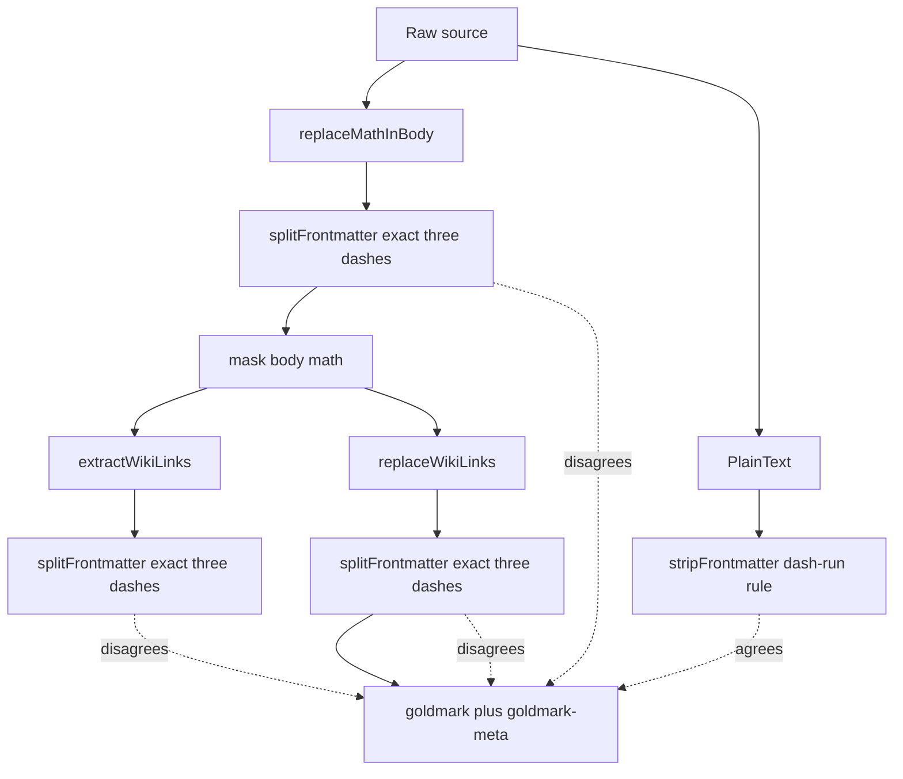

# Implementation Guide: Canonical Frontmatter and Body Splitting

## Executive summary

`publish-vault` currently uses two different definitions of YAML frontmatter:

- parse-time math/wiki protection calls `splitFrontmatter`, which accepts only an exact `---` opener and closer;
- `StripFrontmatter` and goldmark-meta accept any non-empty dash-only delimiter line after trimming surrounding whitespace.

For a valid document delimited by `----`, goldmark-meta parses the preamble as metadata while the pre-passes treat it as Markdown body. Wiki links and math are rewritten before goldmark sees them. The parsed frontmatter therefore contains generated anchor HTML and math sentinels instead of the author's YAML values.

The fix is one canonical, unexported source split used by every parser consumer. It must mirror goldmark-meta v1.1.0 exactly, preserve source bytes and body offsets, leave unterminated preambles untouched, and preserve the existing policy that wiki links in frontmatter enter `ParsedNote.WikiLinks` even though they do not render.

This is a focused Phase 0 correction. Do not combine it with the proposed goldmark wiki-link AST extension, ambiguity-aware resolver, occurrence model, or frontmatter-backlink policy decision.

## Handoff outcome

The colleague should produce:

1. failing regression tests demonstrating metadata mutation under goldmark-compatible delimiters;
2. one canonical `splitSource` implementation;
3. migrated math, wiki replacement/extraction, and `StripFrontmatter` consumers;
4. deletion of the duplicate splitter logic;
5. green parser, vault, and full repository tests;
6. a pull request whose behavioral scope is limited to frontmatter boundary agreement.

## Confirmed defect

### Minimal source

```markdown
----
title: Four Dashes
related: '[[Meta Link]]'
formula: '$x^2$'
----
Body [[Body Link]] with $y$.
```

### Current observed result

The PV-MARKDOWN-023 probe demonstrates that `title` parses normally while `related` is mutated into generated anchor HTML. The same path masks `formula` with a private-use math sentinel before metadata parsing.

Conceptually:

```text
author value:  [[Meta Link]]
parsed value:  <a href="/note/meta-link" class="wiki-link" ...>Meta Link</a>

author value:  $x^2$
parsed value:  <math sentinel index>
```

The rendered body may look correct. This is metadata corruption, not only rendering damage.

### Root cause

`internal/parser/parser.go:361–378`:

```go
func splitFrontmatter(src []byte) ([]byte, []byte) {
    if !bytes.HasPrefix(src, []byte("---\n")) &&
       !bytes.HasPrefix(src, []byte("---\r\n")) {
        return nil, src
    }
    // closing line must trim exactly to "---"
}
```

`internal/parser/parser.go:927–970`:

```go
func isFrontmatterDelimiter(line string) bool {
    trimmed := strings.TrimSpace(line)
    if trimmed == "" {
        return false
    }
    return strings.Trim(trimmed, "-") == ""
}
```

Goldmark-meta v1.1.0 `meta.go:95–101`:

```go
func isSeparator(line []byte) bool {
    line = util.TrimRightSpace(util.TrimLeftSpace(line))
    for i := 0; i < len(line); i++ {
        if line[i] != '-' {
            return false
        }
    }
    return true
}
```

Its opening parser is restricted to line zero, and its closing parser additionally rejects blank lines. Therefore the package contract relevant here is:

```text
first line, after trimming surrounding whitespace:
  one or more '-' bytes

closing line, after trimming surrounding whitespace:
  one or more '-' bytes
  and not blank
```

`isFrontmatterDelimiter` already captures the non-empty form. The duplicate `splitFrontmatter` does not.

## Current data flow



Call sites:

| Consumer | File | Why it splits |
|---|---|---|
| `replaceMathInBody` | `internal/parser/math.go:282` | Math in YAML must not be masked |
| `extractWikiLinks` | `internal/parser/parser.go:152` | Code-region offsets are body-relative; frontmatter matching remains separate |
| `replaceWikiLinks` | `internal/parser/parser.go:250` | HTML placeholders must not enter YAML |
| `StripFrontmatter` / `PlainText` | `internal/parser/parser.go:897–970` | Raw Markdown mirrors/search omit metadata |

## Scope and non-goals

### In scope

- one canonical boundary implementation;
- exact byte preservation;
- body base offset;
- LF and CRLF;
- closing delimiter at EOF;
- whitespace around dash-only delimiters consistent with goldmark-meta;
- unterminated preamble behavior;
- regression coverage for math and wiki links in metadata;
- unchanged frontmatter wiki-link indexing policy.

### Out of scope

- deciding whether frontmatter links should create backlinks;
- supporting TOML (`+++`) or JSON frontmatter;
- validating YAML independently of goldmark-meta;
- changing goldmark or goldmark-meta versions;
- changing wiki-link grammar;
- introducing exported parser APIs;
- changing note slugs, heading IDs, excerpts, or rendered HTML for ordinary `---` documents;
- implementing the larger typed AST/IR architecture.

## Proposed internal API

Use an unexported value rather than another tuple. The body offset is needed for source-span and regex-offset conversion, and naming it prevents repeated `len(frontmatter)` assumptions.

```go
type sourceParts struct {
    frontmatter []byte
    body        []byte
    bodyOffset  int
}

func (p sourceParts) hasFrontmatter() bool {
    return p.frontmatter != nil
}

func splitSource(src []byte) sourceParts
```

Contract:

```text
No recognized complete frontmatter:
  frontmatter = nil
  body        = src
  bodyOffset  = 0

Recognized complete frontmatter:
  frontmatter = src[:bodyOffset]  // includes opener, closer, and closing newline if present
  body        = src[bodyOffset:]
  bodyOffset  = len(frontmatter)
```

The slices must alias the original source. Do not normalize line endings, trim body whitespace, copy values, or parse YAML here.

### Why an unexported struct

- It fixes a package-internal disagreement without creating a premature public API.
- It names `bodyOffset`, which extraction already needs.
- It can later become the internal basis of the broader `SourceDocument` proposal.
- It keeps this pull request independent of public API review.

## Canonical split algorithm

Reuse `isFrontmatterDelimiter`; do not add a second predicate.

```text
function splitSource(src):
    lines = split src after each newline, preserving newline bytes

    if there is no complete first line:
        return no-frontmatter(src)

    if first line is not isFrontmatterDelimiter:
        return no-frontmatter(src)

    offset = length(first line)

    for each subsequent line:
        offset += length(line)
        if line is isFrontmatterDelimiter:
            return sourceParts(
                frontmatter = src[0:offset],
                body = src[offset:],
                bodyOffset = offset)

    return no-frontmatter(src)  // unterminated preamble remains ordinary source
```

Recommended Go shape:

```go
func splitSource(src []byte) sourceParts {
    noFrontmatter := func() sourceParts {
        return sourceParts{body: src}
    }

    lines := bytes.SplitAfter(src, []byte("\n"))
    if len(lines) == 0 || !bytes.HasSuffix(lines[0], []byte("\n")) {
        return noFrontmatter()
    }
    if !isFrontmatterDelimiter(string(lines[0])) {
        return noFrontmatter()
    }

    offset := len(lines[0])
    for i := 1; i < len(lines); i++ {
        offset += len(lines[i])
        if isFrontmatterDelimiter(string(lines[i])) {
            return sourceParts{
                frontmatter: src[:offset],
                body:        src[offset:],
                bodyOffset:  offset,
            }
        }
    }
    return noFrontmatter()
}
```

The colleague may avoid string conversion with a byte predicate, but there must still be one canonical delimiter rule. If changing the predicate to bytes, migrate `stripFrontmatter` to that predicate in the same commit and keep its tests.

### Opening line at EOF

A dash-only file with no newline has no closing delimiter. Treat it as ordinary source. This matches the current `StripFrontmatter` behavior and avoids deleting an unterminated document. Confirm goldmark behavior in a test if changing this policy.

### Closing delimiter at EOF

A closing delimiter need not have a trailing newline. `bytes.SplitAfter` retains the final line; the loop includes its bytes in `offset`, so the returned body is empty.

## Consumer migration

### 1. Math protection

Before:

```go
frontmatter, body := splitFrontmatter(src)
replaced, spans := ReplaceMath(body)
```

After:

```go
parts := splitSource(src)
replaced, spans := ReplaceMath(parts.body)
if !parts.hasFrontmatter() {
    return replaced, spans
}
out := make([]byte, 0, len(parts.frontmatter)+len(replaced))
out = append(out, parts.frontmatter...)
out = append(out, replaced...)
return out, spans
```

Invariant: `MathSpan.Start/End` remain body-relative. Do not add `bodyOffset` to spans; existing restoration uses sentinel index and body-relative spans.

### 2. Wiki-link replacement

Before:

```go
frontmatter, body := splitFrontmatter(src)
replacedBody := replaceWikiLinksOutsideCode(body, spans)
```

After:

```go
parts := splitSource(src)
replacedBody := replaceWikiLinksOutsideCode(parts.body, spans)
// reassemble exactly as math does
```

Invariant: no generated anchor/embed markup enters `parts.frontmatter`.

### 3. Wiki-link extraction

Current policy intentionally scans the whole source so frontmatter `[[X]]` enters `WikiLinks`. Preserve it.

```go
parts := splitSource(src)
matches := wikiLinkRegex.FindAllSubmatchIndex(src, -1)
code := newCodeCursor(parts.body)

for _, m := range matches {
    if m[0] >= parts.bodyOffset && code.contains(m[0]-parts.bodyOffset) {
        continue
    }
    // frontmatter matches have m[0] < bodyOffset and remain indexed
}
```

Important no-frontmatter case:

```text
parts.bodyOffset == 0
m[0] >= 0 is true
code offsets remain source offsets
```

Do not use `len(parts.frontmatter)` at call sites once `bodyOffset` exists.

### 4. `StripFrontmatter` and plain text

Replace the independent `stripFrontmatter` implementation:

```go
func stripFrontmatter(src []byte) []byte {
    return splitSource(src).body
}
```

If `splitSource` finds no complete block, `.body` is `src`, preserving current behavior.

After migration, delete:

- `splitFrontmatter`;
- duplicate line-walking logic in `stripFrontmatter`;
- `splitLine` if no callers remain.

Keep `isFrontmatterDelimiter` as the one package rule, or replace it once with an equivalent byte predicate used everywhere.

## Test-first implementation sequence

### Commit 1: failing regression matrix

Add tests before changing production code. The tests should fail on current code for four-dash/whitespace variants and pass for existing three-dash behavior.

Suggested test:

```go
func TestParseProtectsGoldmarkCompatibleFrontmatter(t *testing.T) {
    tests := []struct {
        name, open, close, newline string
    }{
        {"three dashes LF", "---", "---", "\n"},
        {"four dashes LF", "----", "----", "\n"},
        {"single dash LF", "-", "-", "\n"},
        {"whitespace wrapped", "  ----  ", " \t----\t ", "\n"},
        {"four dashes CRLF", "----", "----", "\r\n"},
    }

    for _, tt := range tests {
        t.Run(tt.name, func(t *testing.T) {
            src := tt.open + tt.newline +
                "title: Boundary" + tt.newline +
                "related: '[[Meta Link]]'" + tt.newline +
                "formula: '$x^2$'" + tt.newline +
                tt.close + tt.newline +
                "Body [[Body Link]] with $y$." + tt.newline

            note, err := Parse([]byte(src))
            if err != nil { t.Fatal(err) }

            if got := note.Frontmatter["related"]; got != "[[Meta Link]]" {
                t.Errorf("related = %#v, want literal wiki syntax", got)
            }
            if got := note.Frontmatter["formula"]; got != "$x^2$" {
                t.Errorf("formula = %#v, want literal math syntax", got)
            }
            if strings.Contains(fmt.Sprint(note.Frontmatter), "<a href=") {
                t.Errorf("wiki HTML leaked into metadata: %#v", note.Frontmatter)
            }
            if strings.Contains(fmt.Sprint(note.Frontmatter), mathSentinelOpen) {
                t.Errorf("math sentinel leaked into metadata: %#v", note.Frontmatter)
            }
            if !strings.Contains(note.HTML, `data-raw="Body Link"`) {
                t.Errorf("body wiki link not rendered: %s", note.HTML)
            }
            if !strings.Contains(note.HTML, `math math-inline`) {
                t.Errorf("body math not rendered: %s", note.HTML)
            }
        })
    }
}
```

### Confirmed goldmark contract (probe)

`scripts/01-goldmark-frontmatter-contract` runs the actual `Parse` pipeline against each delimiter form. All of these are parsed as frontmatter in the configured engine:

| Delimiter form | `marker` parsed as metadata? |
|---|---|
| one dash `-` | yes |
| two dashes `--` | yes |
| three dashes `---` | yes |
| four dashes `----` | yes |
| whitespace-wrapped `  ----  ` / ` \t----\t ` | yes |
| four dashes CRLF | yes |

The regression matrix can therefore include one- and two-dash variants without reservation: goldmark-meta wins parser priority over Markdown list/thematic-break parsing for these inputs. The contract is taken from observed `Parse` output, not copied source logic.

### Commit 2: splitter unit matrix

Test `splitSource` directly:

| Case | Expected |
|---|---|
| no frontmatter | body is original source, offset 0 |
| exact three dashes | complete split |
| four dashes | complete split |
| whitespace/CRLF | complete split if goldmark-meta accepts it |
| dashes inside quoted scalar | no premature close |
| dashes inside block scalar content (`  a --- b`) | no premature close |
| closing delimiter at EOF | empty body |
| body at EOF | exact body bytes |
| unterminated opener | entire source remains body |
| thematic break after heading | no frontmatter because opener is not line zero |
| opener with non-dash content (`---yaml`) | no frontmatter |

Assert byte identity and offsets:

```go
if !bytes.Equal(append(append([]byte{}, parts.frontmatter...), parts.body...), src) {
    t.Fatal("split does not reconstruct source byte-for-byte")
}
if parts.bodyOffset != len(parts.frontmatter) {
    t.Fatal("bodyOffset mismatch")
}
```

### Commit 3: migrate consumers and delete duplicates

Implement `sourceParts`/`splitSource`, migrate four consumers, and remove dead helpers. No behavior change beyond goldmark-compatible frontmatter protection should appear.

### Commit 4: integration and documentation

Run all validation, update comments to state the one-source-boundary invariant, and record any deliberate behavior differences.

## Policy that must remain unchanged

### Frontmatter links still enter `WikiLinks`

`TestFrontmatterWikiLinkStillIndexed` pins the current decision:

```text
frontmatter [[Frontmatter Note]]:
  rendered in HTML? no
  recorded in WikiLinks? yes
  can produce backlink? yes
```

Whether that policy is desirable remains an open architecture question. This fix only prevents frontmatter bytes from affecting Markdown structure and prevents their mutation. Do not silently remove graph edges while repairing the splitter.

Add a variant with four-dash frontmatter to prove the policy remains consistent across delimiter forms.

## Acceptance criteria

The implementation is ready for review when all are true:

- [ ] One delimiter predicate and one source-splitting algorithm remain.
- [ ] Parse-time pre-passes and `StripFrontmatter` use the same split.
- [ ] Goldmark-compatible four-dash metadata retains literal wiki-link and math values.
- [ ] Generated wiki HTML and math sentinels never enter parsed frontmatter.
- [ ] Body wiki links/math render normally for every delimiter fixture.
- [ ] Frontmatter `[[...]]` remains in `WikiLinks` per current policy.
- [ ] Unterminated frontmatter remains unchanged.
- [ ] Closing delimiter at EOF and CRLF remain supported.
- [ ] Returned slices reconstruct the original bytes exactly.
- [ ] No public API or URL behavior changes.
- [ ] Existing parser, math, vault, and full repository tests pass.
- [ ] The PV-MARKDOWN-023 edge probe no longer reports mutated four-dash metadata.

## Validation commands

Fast loop:

```bash
gofmt -w internal/parser/parser.go internal/parser/math.go internal/parser/*_test.go
go test ./internal/parser -count=1
```

Focused regressions:

```bash
go test ./internal/parser -count=1 \
  -run 'Frontmatter|ParseProtectsGoldmarkCompatibleFrontmatter|SplitSource'
```

Cross-package/full validation:

```bash
go test ./pkg/vault -count=1
go test ./... -count=1
.bin/golangci-lint run ./internal/parser/...
```

Probe:

```bash
go run ./ttmp/2026/08/16/PV-MARKDOWN-023--*/scripts/01-parser-edge-probe
```

Expected changed probe output for four-dash frontmatter:

```text
related="[[Meta Link]]"        # no generated <a>
formula="$x^2$"                # no sentinel
body link and math still render
```

## Review checklist

### Correctness

- Does the delimiter predicate actually match goldmark-meta v1.1.0 behavior?
- Does the split preserve exact bytes and offsets?
- Do all pre-passes use `parts.body`?
- Does extraction intentionally distinguish whole-source matching from body-relative code regions?
- Is the frontmatter-link policy unchanged and tested?

### Scope

- No wiki grammar, resolver, slug, heading-ID, or alias behavior is changed.
- No exported API is introduced.
- No AST refactor is bundled.
- No unrelated parser cleanup is included.

### Maintainability

- Function comments explain the invariant, not only mechanics.
- There is one splitter and one delimiter predicate.
- Tests describe goldmark compatibility rather than implementation details.
- A future contributor can find all consumers with `rg 'splitSource' internal/parser`.

## Risks and mitigations

| Risk | Mitigation |
|---|---|
| Single/two-dash opening interacts with Markdown list parsing | Confirmed by `01-goldmark-frontmatter-contract`: all dash forms parse as metadata in the configured engine |
| Whitespace-indented opening differs due block-parser priority | Confirmed by the same probe: whitespace-wrapped delimiters parse as metadata |
| New split changes frontmatter backlink behavior | Explicit four-dash indexing regression |
| Span offsets shift | Keep math spans body-relative; use `bodyOffset` only for whole-source match conversion |
| Unterminated source is accidentally removed | Direct no-split test and reconstruction invariant |
| Refactor expands into public `SourceDocument` API | Keep `sourceParts` unexported in this ticket |

## Suggested pull request description

```markdown
## Problem

Parser pre-passes recognized only exact `---` frontmatter while goldmark-meta
recognizes any non-empty dash-only separator line. Valid four-dash metadata was
therefore rewritten as Markdown before being parsed, injecting wiki-link HTML
and math sentinels into frontmatter values.

## Fix

Introduce one internal `splitSource` boundary shared by math masking, wiki-link
replacement/extraction, and `StripFrontmatter`. The delimiter predicate mirrors
goldmark-meta v1.1.0. Preserve the existing policy that frontmatter wiki links
are indexed but not rendered.

## Validation

- delimiter/body reconstruction matrix;
- metadata wiki/math preservation regressions;
- parser/vault/full tests;
- PV-MARKDOWN-023 edge probe.

## Non-goals

No wiki grammar, resolver, URL, heading ID, public API, or AST changes.
```

## File-by-file implementation map

| File | Expected change |
|---|---|
| `internal/parser/parser.go` | Add `sourceParts`/`splitSource`; migrate extraction/replacement/strip; delete duplicate helpers; add comments |
| `internal/parser/math.go` | Migrate `replaceMathInBody` to `splitSource` |
| `internal/parser/parser_test.go` | Split matrix, metadata mutation regression, frontmatter-link policy variant |
| `internal/parser/math_test.go` | Extend frontmatter math preservation across delimiter forms if kept separate |
| `ttmp/.../PV-FRONTMATTER-024` | Record implementation diary, commands, failures, and final evidence |

## Decision record

### Decision: one internal source split before a public document API

- **Context:** The immediate bug is conflicting boundary detection; the broader architecture proposes an exported/reusable parsed document.
- **Options considered:** Patch `splitFrontmatter`; expose `SourceDocument` now; introduce one unexported structured split.
- **Decision:** Introduce unexported `sourceParts`/`splitSource` and migrate all current consumers.
- **Rationale:** It removes the correctness defect and duplicate logic while keeping public API and AST design out of the patch.
- **Consequences:** A later parser refactor can promote or replace the internal type; current callers gain named offsets now.
- **Status:** proposed for this implementation ticket.

## References

- Parent review: `PV-MARKDOWN-023`
- Garden pattern: https://parc.yolo.scapegoat.dev/note/research/software-architecture-garden/publish-vault/05-parser-owned-structure-and-typed-reference-resolution
- Tracking architecture issue: https://github.com/go-go-golems/publish-vault/issues/22
- Goldmark-meta v1.1.0: `/home/manuel/go/pkg/mod/github.com/yuin/goldmark-meta@v1.1.0/meta.go:95–132`
- Current source:
  - `internal/parser/parser.go:56–190,250–378,897–970`
  - `internal/parser/math.go:282–295`
  - `internal/parser/parser_test.go:409–482,944–1005`
  - `internal/parser/math_test.go:190–203`
