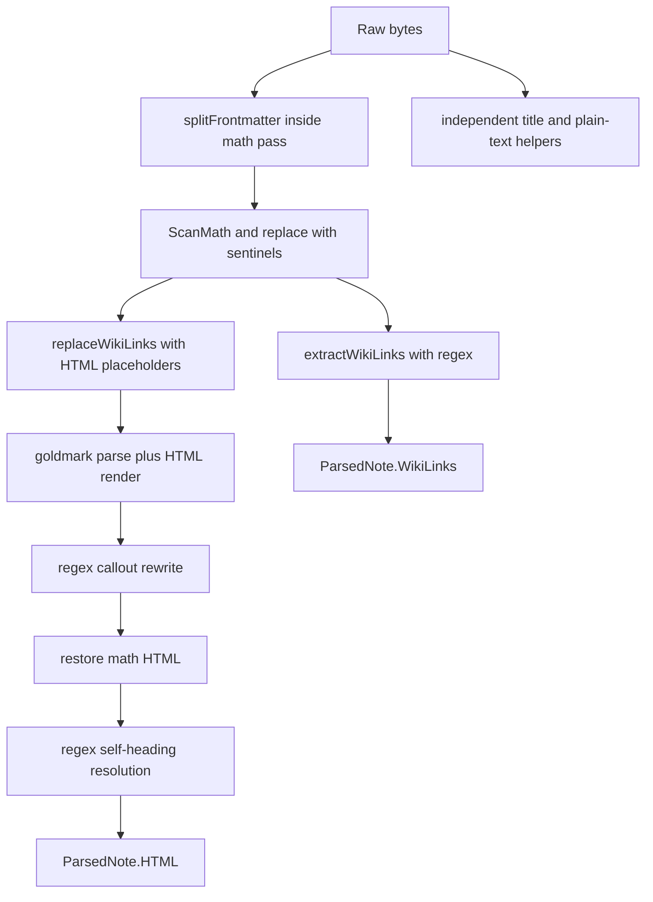
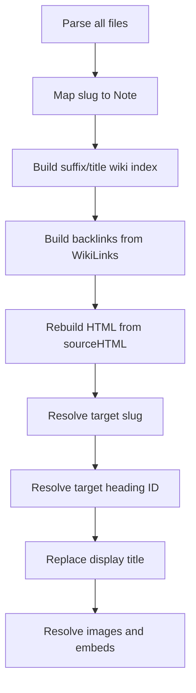
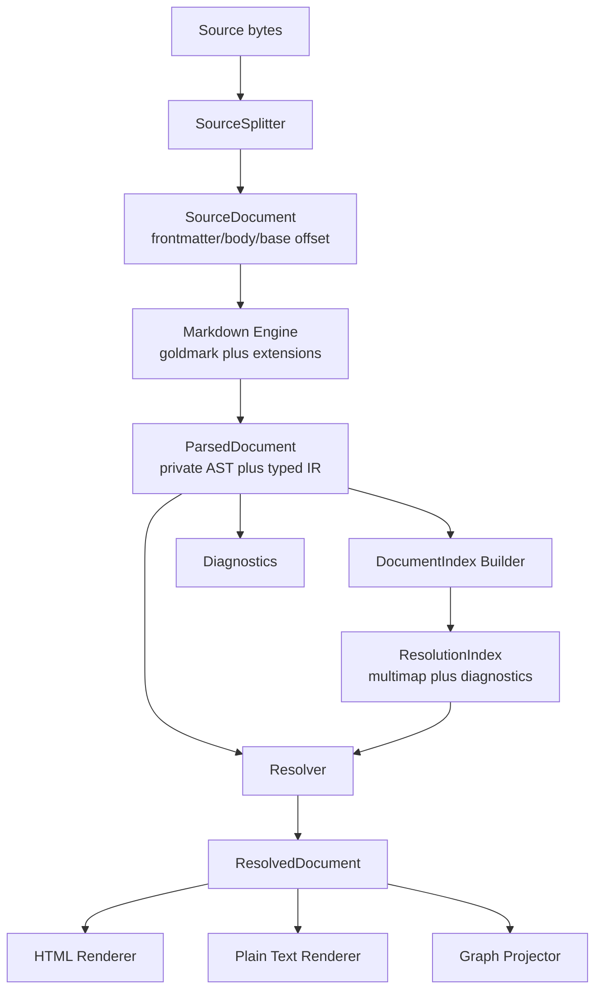

# Markdown and Wiki-Link Parsing: Algorithms, Architecture, and Robust Building Blocks

## Executive summary

`publish-vault` has a capable Markdown pipeline with unusually strong incident-driven regression coverage. It protects TeX from Markdown, preserves goldmark heading IDs, resolves Obsidian short links and embeds, recomputes vault-dependent HTML after reload, and keeps code samples out of the backlink graph. The recent fixes are correct local repairs.

The underlying architecture is still fragile because one document is interpreted several times by independent mechanisms. Frontmatter is split three ways. Wiki links are recognized once for graph data and again for rendering. Markdown structure is partially reconstructed before goldmark and rendered HTML is parsed again with regular expressions after goldmark. The Go server and TypeScript static build implement separate grammars and resolution rules. Correctness therefore depends on agreement among algorithms that do not share a typed representation.

The recommended direction is not a new Markdown parser. Keep goldmark and use its intended extension points:

1. Split frontmatter exactly once into a `SourceDocument`.
2. Parse wiki links as custom goldmark inline AST nodes, so goldmark itself decides whether `[[...]]` is prose, code, or another literal context.
3. Preserve every occurrence in a typed `LinkOccurrence` with source span, kind, target, heading, alias, and diagnostics.
4. Build a deterministic, ambiguity-aware `ResolutionIndex` after all documents are parsed.
5. Resolve typed occurrences before rendering rather than transporting link state through HTML attributes and recovering it with regex.
6. Render HTML and plain text from the same parsed document.
7. Keep the existing math masking initially, then migrate math and callouts to typed nodes in later phases.
8. Define one behavior corpus that both Go/goldmark and TypeScript/marked must pass.

The highest-priority correctness findings are independent of the larger refactor and should receive focused fixes first:

- valid goldmark frontmatter delimited by more than three dashes is mutated because parse-time masking uses a narrower splitter;
- ambiguous short wiki links resolve nondeterministically because a first-wins index is populated from Go map iteration;
- `ReplaceWikiLinksString` rewrites unrelated authored `data-target` attributes and ordinary `/note/...` anchors.

## Problem statement and scope

The system must turn a read-only Obsidian vault into four consistent products:

- rendered HTML;
- structured note metadata exposed through JSON;
- outgoing links and backlinks;
- plain text for excerpts and search.

Consistency is the primary requirement. If the rendered page contains a link, the structured graph should contain the same authored occurrence. If a source region is code, math, frontmatter, or raw HTML, every product should apply the same context rules. If a short target is ambiguous, every reload and every renderer should report the same result.

This review covers:

- YAML frontmatter boundaries and normalization;
- Markdown parsing through goldmark;
- math masking and code-region scanning;
- wiki-link grammar, occurrence extraction, rendering, heading fragments, embeds, and backlinks;
- rendered-HTML post-processing;
- plain-text extraction;
- vault-wide slug and link resolution;
- Go/static TypeScript parity;
- API shape, diagnostics, tests, and migration.

This review does not propose full Obsidian syntax compatibility. The supported subset should remain explicit and testable. It also does not change published heading IDs or note URLs without an explicit compatibility migration.

## Fundamentals: the concepts an intern needs first

### Syntax, identity, resolution, and rendering are different operations

A wiki link has source syntax, but its destination depends on vault state:

```text
source syntax:   [[Research/Note#Section|display]]
parsed target:   path=Research/Note, heading=Section, alias=display
resolved note:   research/note
resolved anchor: goldmark-generated-section-id
rendered HTML:   <a href="/note/research/note#...">display</a>
```

Parsing should answer what the author wrote. Resolution should answer what object that reference denotes in this vault. Rendering should answer how the resolved or unresolved reference is represented in one output format. Combining these questions produces provisional slugs, data attributes, and later string rewrites.

### An occurrence is not an edge

`[[Note#One]]` and `[[Note#Two]]` are two occurrences and usually one backlink edge. `[[Note]]` and `![[Note]]` are two occurrences with different rendering semantics and may still produce one graph edge. The current parser deduplicates before consumers can choose:

```go
key := target + "|" + alias // heading and IsEmbed omitted
```

The robust model preserves occurrences. The graph layer derives unique edges from them.

### Source context is semantic data

The bytes `[[Note]]` mean different things in prose, code, math, frontmatter, and raw HTML. A recognizer that receives only a byte slice must reconstruct context. A goldmark inline parser is invoked in a context already classified by the Markdown parser, so it does not need a second CommonMark implementation to avoid code spans and fences.

### Resolution can be ambiguous

A suffix index is a multimap. If both `Research/A/Index.md` and `Research/B/Index.md` exist, the key `index` has two candidates. Converting the multimap to `map[string]string` discards the ambiguity and makes insertion order a hidden resolution rule. In Go, insertion order from map iteration is nondeterministic.

A reusable resolver must return at least `resolved`, `unresolved`, or `ambiguous`, with candidates for diagnostics.

## Current-state architecture

### Per-document pipeline

`Parse` at `internal/parser/parser.go:56–136` performs source rewriting, goldmark parsing/rendering, and HTML rewriting in one function:



The function has valuable explicit ordering comments. Its structural weakness is that the AST exists only inside `md.Convert`; downstream stages receive HTML, not the parsed tree.

### Vault pipeline

`Vault.New` parses notes first, then builds indices and re-resolves HTML (`pkg/vault/vault.go:250–265`):



Starting every rebuild from `sourceHTML` is correct. It preserves reversibility when target notes appear, disappear, or change headings. The weakness is that `sourceHTML` is already a string encoding internal state in attributes; resolution operates by matching those strings.

### Static pipeline

The static build uses a `marked` inline extension for HTML, which correctly lets `marked` control code context. It separately uses a raw global regex for graph extraction. The rendered document and backlink graph can therefore disagree even though the rendering-side implementation has already adopted the right extension architecture.

## What is already strong

A refactor should preserve these properties:

- **Math protection is explicit.** TeX is removed before Markdown can consume underscores, backslashes, ampersands, and line structure.
- **Context restoration distinguishes HTML from text.** `RestoreMath` and `RestoreMathText` correctly recognize that element content and attributes require different substitutions.
- **Heading IDs are read from goldmark output.** `BuildHeadingIndex` does not reimplement a stateful ID generator.
- **Reload is reversible.** `rebuildHTML` starts from parser output, not prior resolved HTML.
- **Broken destinations remain visible.** Missing notes/images/headings produce explicit markers or honest fallback links.
- **Regression tests reproduce real failures.** Several tests were verified to fail before their fixes.
- **Code/fence scanners encode nontrivial CommonMark boundaries.** Closing-run lengths, info strings, blank lines, indentation, and escapes are documented.

These are design assets, not code to discard.

## Detailed code-review findings

### F1 — High: frontmatter boundary algorithms disagree

`splitFrontmatter` (`parser.go:361–378`) requires an exact `---` opener and closer. `stripFrontmatter` (`parser.go:927–970`) accepts any non-empty dash run because that matches goldmark-meta. Math and wiki replacement use the narrower function; metadata extraction uses goldmark-meta.

The ticket probe parses:

```markdown
----
title: Four Dashes
related: '[[Meta Link]]'
----
Body [[Body Link]] with $x$.
```

Goldmark treats the preamble as frontmatter, but the pre-passes treat it as body. The resulting metadata contains anchor HTML in `related`. This violates the basic invariant that parsing does not mutate metadata.

**Immediate correction:** replace both splitters with one `SplitSource` whose delimiter rule is tested against goldmark-meta. All consumers receive the same `SourceDocument`.

### F2 — High: ambiguous links resolve nondeterministically

`buildWikiLinkIndex` iterates `v.notes`, a Go map, and preserves the first value inserted for each suffix/title key (`vault.go:371–407`). Go randomizes map iteration. Two notes with the same basename can cause `[[Index]]` to resolve differently across process runs or reloads.

The README documents "first registered note wins," but there is no stable registration order. The asset resolver already chooses a lexicographically first path, proving deterministic resolution is an established requirement elsewhere.

**Immediate correction:** store all candidates, sort them by canonical path, and return an ambiguity result unless an explicit deterministic policy is accepted.

### F3 — High: HTML rewrite scope exceeds wiki nodes

`ReplaceWikiLinksString` matches every `data-target="..."` and every `/note/...` href (`parser.go:556–590`). The probe shows an unrelated `<div data-target="short">` and ordinary anchor are rewritten. Authored raw HTML is enabled by `html.WithUnsafe`, so these are legal document constructs.

**Immediate correction:** constrain transitional regexes to generated wiki-link/embed tags. **Architectural correction:** remove the pass by resolving typed nodes before rendering.

### F4 — Medium: occurrence data is discarded early

`extractWikiLinks` deduplicates by target and alias. Two headings collapse to the first heading; link/embed pairs collapse to the first kind. HTML still contains both, so graph/API data differs from rendering.

**Correction:** preserve `[]LinkOccurrence`; derive `UniqueTargets` or graph edges explicitly.

### F5 — Medium: static graph extraction bypasses its parser

`marked` renders custom wiki nodes contextually, but `extractWikiLinks` runs globally over raw content. Code examples can create static backlinks without rendering anchors. There are no conformance tests.

**Correction:** collect occurrences from marked tokens/AST or from a shared grammar fixture, never a second regex.

### F6 — Medium: the wiki grammar is accidental

The Go and TypeScript regexes accept newlines, do not define escapes, and disagree on bracket constraints. The current behavior is whatever the regular expression happens to match.

**Correction:** publish a grammar table and return diagnostics for unsupported/degenerate forms.

### F7 — Medium: generated HTML attributes are an internal wire protocol

Self links, cross-note headings, image embeds, and display replacement depend on exact tag and attribute order (`parser.go:429–690`). Adding an attribute can silently disable a pass. This coupling is documented in comments but not represented by types.

**Correction:** retain typed nodes through resolution and render once.

### F8 — Medium: trust and escaping are implicit

Regular wiki-link display uses unescaped alias content while self links escape it. With `html.WithUnsafe`, authored raw HTML is already trusted, but the parser should define whether wiki aliases are Markdown inline content, plain text, or raw HTML. Similar projects may process untrusted Markdown.

**Correction:** make `TrustMode` explicit and parse alias as either inline children or escaped text. Default reusable behavior should escape text; trusted raw HTML is an application option.

### F9 — Medium: callouts are reconstructed from rendered HTML

`renderCallouts` matches `<blockquote>` output with a non-nesting-aware regex (`parser.go:695–779`). Nested blockquotes, renderer changes, or structurally rich titles can break the pass.

**Correction:** implement callouts as a block/AST transformer while blockquote structure still exists.

### F10 — Medium: plain text is another parser

`PlainText` removes syntax with independent regexes (`parser.go:897–1000`). It can disagree with HTML and link extraction on code, nested emphasis, images, and malformed syntax.

**Correction:** add a plain-text node renderer over the same AST/IR.

### F11 — Low: per-call construction and regex compilation

`Parse` constructs the goldmark engine on every note, and some helper regexes are compiled in hot functions. This is secondary to correctness but material on 1800-note reloads.

**Correction:** construct an immutable `Engine` once; verify concurrency semantics with tests/benchmarks.

### F12 — Medium: diagnostics and source spans are absent

Invalid or ambiguous syntax silently degrades. `ParsedNote` cannot tell a caller where an unresolved or ambiguous link came from.

**Correction:** source spans and diagnostics are first-class output.

## Proposed architecture

### Components



Responsibilities:

- `SourceSplitter` is the only frontmatter boundary implementation.
- `Engine` owns one configured goldmark instance and syntax extensions.
- `WikiLinkInlineParser` creates typed AST nodes only where goldmark invokes inline parsing.
- `ParsedDocument` preserves occurrences, headings, metadata, source spans, and diagnostics.
- `ResolutionIndex` stores all candidates and never hides ambiguity.
- `Resolver` transforms parsed references into resolved/unresolved/ambiguous states.
- renderers consume typed state; no pass searches arbitrary HTML for internal attributes.
- graph projection deduplicates at the graph boundary, not parser boundary.

### Proposed API

```go
package markdown

type Engine struct { /* configured goldmark + options */ }

type Options struct {
    TrustMode       TrustMode
    WikiLinks       bool
    Math            MathOptions
    Callouts        bool
    PreserveHTML    bool
}

type SourceDocument struct {
    Source          []byte
    FrontmatterRaw  []byte
    Body            []byte
    BodyOffset      int
}

type ParsedDocument struct {
    Source       SourceDocument
    Frontmatter map[string]any
    Title        string
    Tags         []string
    Links        []LinkOccurrence
    Headings     []Heading
    Diagnostics  []Diagnostic
    // private root ast.Node and math state
}

func New(opts Options) *Engine
func (e *Engine) Parse(ctx context.Context, src []byte) (*ParsedDocument, error)
func (e *Engine) RenderHTML(ctx context.Context, doc *ResolvedDocument) ([]byte, error)
func (e *Engine) RenderText(ctx context.Context, doc *ParsedDocument) ([]byte, error)
```

Wiki-link model:

```go
type SourceSpan struct { Start, End int }
type LinkKind uint8 // NoteLink, NoteEmbed, ImageEmbed

type LinkRef struct {
    Path    string
    Heading string
    BlockID string
}

type LinkOccurrence struct {
    Span      SourceSpan
    Kind      LinkKind
    Ref       LinkRef
    Alias     string
    Raw       string
    Context   LinkContext // body/frontmatter if frontmatter refs remain supported
}

type ResolutionState uint8 // Resolved, Unresolved, Ambiguous, Local

type ResolvedLink struct {
    Occurrence LinkOccurrence
    State      ResolutionState
    NoteSlug   string
    HeadingID  string
    Candidates []string
}
```

Resolver API:

```go
type ResolutionIndex interface {
    ResolveNote(ref LinkRef) NoteResolution
    ResolveAsset(path string) AssetResolution
}

type NoteResolution struct {
    State      ResolutionState
    Slug       string
    Candidates []string
    Reason     string
}
```

The public API distinguishes document parsing from vault resolution. A similar project can reuse the parser and supply different resolution/index/render policies.

## Wiki-link grammar contract

The first implementation should document a conservative subset:

| Form | Result |
|---|---|
| `[[Note]]` | note link |
| `[[Folder/Note]]` | path-qualified note link |
| `[[Note|Alias]]` | note link with alias |
| `[[Note#Heading]]` | note link with heading ref |
| `[[Note#Heading|Alias]]` | heading link with alias |
| `[[#Heading]]` | local heading link |
| `![[Note]]` | note embed |
| `![[image.png]]` | image embed classified after parse |
| newline before `]]` | not a wiki link; emit diagnostic only if configured |
| `[[#^block]]` | parsed block reference, unsupported-resolution diagnostic |
| empty/degenerate fields | literal source plus diagnostic |

Escaping and alias markup must be explicitly decided. Recommended v1: alias is Markdown inline content parsed as node children; raw HTML follows the engine's trust policy.

## Deterministic resolution algorithm

Build a multimap from normalized keys to candidates:

```text
for document in documents sorted by canonical path:
    register full slug with rank ExactPath
    register every path suffix with rank Suffix
    register basename with rank Basename
    register title slug with rank Title
```

Resolve:

```text
candidates = index[key]
if candidates is empty:
    return Unresolved
bestRank = minimum rank present
best = candidates at bestRank
if len(best) == 1:
    return Resolved(best[0])
return Ambiguous(sorted(best))
```

Do not silently choose a candidate for an ambiguous key. If compatibility requires first-wins temporarily, implement it as a named policy (`AmbiguityPolicyLexicographicFirst`) and emit a diagnostic. The default reusable behavior should be ambiguity, not selection.

## Goldmark extension design

Goldmark v1.8.2 provides the required APIs:

- `parser.InlineParser.Trigger() []byte` and `Parse(parent, reader, context) ast.Node`;
- `renderer.NodeRenderer.RegisterFuncs` and `NodeRendererFunc`;
- extensions register prioritized parsers and renderers through `goldmark.Extender`.

A wiki parser triggered by `[` can recognize `[[` at the current reader position, stop at the same line's `]]`, parse target/heading/alias into a custom node, advance the reader, and record the occurrence. Goldmark's code-span and fenced-block parsers own those contexts, so the wiki parser is not invoked there.

```go
type WikiLinkNode struct {
    ast.BaseInline
    OccurrenceIndex int
}

func (*wikiParser) Trigger() []byte { return []byte{'['} }

func (p *wikiParser) Parse(parent ast.Node, r text.Reader, pc parser.Context) ast.Node {
    line, seg := r.PeekLine()
    parsed, consumed, ok := ParseWikiLinkLine(line)
    if !ok { return nil }
    idx := collectOccurrence(pc, parsed, absoluteSpan(seg, consumed))
    r.Advance(consumed)
    return NewWikiLinkNode(idx)
}
```

The renderer receives the resolved occurrence by index and emits escaped HTML once. No `data-*` field is required as a transport between internal passes; data attributes can remain only if the browser consumes them.

## Math and callout migration

Math masking is the highest-risk subsystem and should not be rewritten in the first phase. Wrap it behind `Engine` and reuse its tested scanner. Once wiki links are typed, evaluate custom inline/block math nodes. The acceptance condition is byte-for-byte TeX preservation across existing tests and the showcase vault note.

Callouts are lower risk to move structurally: an AST transformer can recognize a blockquote whose first inline text begins `[!type]`, retain nested blocks as children, and a node renderer can emit the callout container without parsing HTML.

## Decision records

### Decision: keep goldmark and extend its AST

- **Context:** Code/fence context is currently reconstructed before goldmark.
- **Options considered:** Maintain scanners; write a complete parser; use goldmark custom inline/block parsers.
- **Decision:** Use goldmark extension APIs for wiki links and callouts.
- **Rationale:** Goldmark already owns CommonMark context and is stable, tested, and extensible.
- **Consequences:** Custom nodes/renderers are required; math masking remains transitional.
- **Status:** proposed.

### Decision: preserve occurrences and derive graph edges

- **Context:** Current deduplication loses headings and link/embed kinds.
- **Options considered:** Expand dedupe key; preserve every occurrence.
- **Decision:** Preserve occurrences with source spans; graph projection deduplicates targets.
- **Rationale:** Consumers need different equivalence relations.
- **Consequences:** API payloads may grow; add derived unique-target helpers.
- **Status:** proposed.

### Decision: ambiguity is data, not insertion order

- **Context:** Short paths can map to multiple notes; map iteration is unstable.
- **Options considered:** First wins, lexicographic first, ambiguity result.
- **Decision:** Store candidates and return ambiguity; compatibility selection is an explicit policy with diagnostics.
- **Rationale:** Silent wrong-note resolution is worse than a visible unresolved link.
- **Consequences:** Existing ambiguous links may become visibly broken until qualified.
- **Status:** proposed.

### Decision: resolve typed nodes before rendering

- **Context:** HTML attributes currently transport parser state into vault resolution.
- **Options considered:** Tighter regexes, DOM parsing, typed pre-render resolution.
- **Decision:** Resolve `ParsedDocument` into `ResolvedDocument`, then render once.
- **Rationale:** Types constrain rewrite scope and remove fixed-order string protocols.
- **Consequences:** Vault loading becomes explicitly parse-all, index, resolve, render.
- **Status:** proposed.

### Decision: one conformance corpus, separate language implementations

- **Context:** Go and TypeScript use different parser libraries.
- **Options considered:** Generate one parser for both; call Go from static build; shared JSON fixtures.
- **Decision:** Define source fixtures and expected IR/render/graph results consumed by both suites.
- **Rationale:** It provides semantic parity without a cross-runtime build dependency.
- **Consequences:** Fixture schema is a compatibility contract and must be versioned.
- **Status:** proposed.

### Decision: preserve published note and heading URLs

- **Context:** Slugs and goldmark IDs are external URL surfaces.
- **Options considered:** Normalize everything during refactor; preserve current URL algorithms.
- **Decision:** Preserve `Slugify` and goldmark IDs until a redirect-capable migration exists.
- **Rationale:** Parser cleanup must not invalidate shared links.
- **Consequences:** Unicode slug limitations remain a separate ticket.
- **Status:** proposed.

## Phased implementation plan

### Phase 0 — correctness guards

1. Add regression tests for F1–F5 and ambiguity repetition.
2. Unify frontmatter splitting.
3. Constrain `ReplaceWikiLinksString` to generated wiki tags.
4. Replace single-value suffix index with deterministic candidate storage or an explicit compatibility policy.
5. Add static graph/code tests.

Files: `internal/parser/parser.go`, `parser_test.go`, `pkg/vault/vault.go`, `vault_test.go`, `web/src/vault/staticVault.ts`, new static tests.

### Phase 1 — canonical document and occurrence model

1. Introduce `SourceDocument`, `SourceSpan`, `LinkOccurrence`, `Diagnostic`.
2. Preserve all occurrences; add graph projection helper.
3. Keep existing HTML replacement behind compatibility adapters.
4. Migrate API consumers without changing rendered HTML.

### Phase 2 — goldmark wiki-link extension

1. Add custom node, inline parser, renderer.
2. Parse only same-line syntax and define degenerate behavior.
3. Collect occurrences from nodes, not regex.
4. Run existing parser/vault tests against both old and new engines in shadow mode.
5. Compare HTML and graph output over the real vault.

### Phase 3 — typed resolution and single render

1. Parse all notes into documents.
2. Build deterministic `ResolutionIndex`.
3. Resolve links/headings/assets into typed states.
4. Render HTML once from resolved nodes.
5. Delete wiki-link HTML regex passes and placeholder transport attributes not used by clients.

### Phase 4 — structural callouts and plain text

1. Move callouts to an AST transformer/renderer.
2. Add plain-text renderer over the same document.
3. Compare search corpus and excerpts before/after.

### Phase 5 — math node evaluation and reusable package

1. Encapsulate the current math scanner behind `Engine` first.
2. Prototype typed math inline/block nodes.
3. Require all existing math regression tests and vault showcase output to match.
4. Stabilize API and promote reusable pieces under `pkg/markdown`.

### Phase 6 — backend/static conformance

1. Add versioned YAML/JSON fixtures containing source, expected occurrences, diagnostics, resolution, graph edges, and essential HTML assertions.
2. Run fixtures in Go and TypeScript CI.
3. Delete dead `preprocessWikiLinks` and raw graph extraction after parity.

## Testing strategy

### Unit tests

- table-driven grammar tests for every supported/degenerate form;
- source-span tests including UTF-8 byte offsets;
- frontmatter delimiter parity with goldmark-meta;
- escaping tests for alias/target/heading and trust modes;
- deterministic ambiguity tests over shuffled document orders;
- occurrence-versus-edge projection tests.

### Fuzz and property tests

```text
Property: parser always advances or returns no match.
Property: no occurrence span crosses a line unless grammar explicitly permits it.
Property: render(parse(source)) never emits unescaped attribute delimiters from plain-text fields.
Property: shuffling document load order does not change resolution.
Property: links inside code/fences/math do not become occurrences.
Property: parse → resolve → render is deterministic.
Property: rebuild after target removal and restoration is reversible.
```

Use Go fuzz targets for `SplitSource`, `ParseWikiLinkLine`, math scanning, and resolve-index construction. Keep the current incident corpus as fixed seeds.

### Integration and differential tests

- Parse the real go-go-parc vault with old and new engines and compare note count, HTML classes/URLs, occurrences, graph edges, and diagnostics.
- Permit differences only through an reviewed allowlist tied to a ticket.
- Run backend/static fixtures in both languages.
- Benchmark cold parse, full reload, and incremental reload allocations/time.

## Risks and mitigations

| Risk | Mitigation |
|---|---|
| Goldmark parser priority changes syntax interactions | Pin priorities with focused tests and document them beside extension registration |
| Existing ambiguous links change destination | Inventory ambiguity first; compatibility policy plus warnings before strict mode |
| AST retention increases memory | Measure; retain compact IR and reparse for render if AST cost is excessive |
| Math behavior regresses during structural migration | Keep masking until a typed prototype passes all existing and vault differential tests |
| Public JSON changes | Version/add fields; keep `wikiLinks` compatibility projection during migration |
| Static implementation drifts again | Versioned cross-language conformance corpus in CI |
| Trusted HTML behavior changes | Explicit `TrustMode`; default application option preserves current trusted-vault behavior |

## Alternatives considered

**Continue patching regex/scanners.** Lowest immediate cost, but preserves duplicated grammar, HTML wire protocols, and no diagnostics. Suitable only for Phase 0 guards.

**Parse rendered HTML with a DOM library.** Safer than regex for HTML rewrites, but still discards source spans and performs resolution after rendering. It is a useful transitional option, not the target architecture.

**Replace goldmark with a custom parser.** Maximum control and maximum compatibility burden. The codebase already depends on goldmark's GFM, footnotes, IDs, and rendering; replacing it creates work unrelated to Obsidian extensions.

**Use only the TypeScript/marked parser.** Does not fit server-side Go loading and would add runtime/build coupling. Conformance fixtures capture shared semantics without forcing one runtime.

## Open questions

1. Should frontmatter `[[...]]` intentionally create backlinks? The current behavior does; 123 vault notes use it. The API should model frontmatter references explicitly if retained.
2. Should ambiguous short links be unresolved by default, or should compatibility mode select lexicographically and warn?
3. Are aliases plain text, Markdown inline content, or trusted raw HTML?
4. Is block-reference syntax in scope, and what ID source would resolve it?
5. Which `data-*` attributes are consumed by the browser and therefore public, versus internal transport that can be removed?
6. Can a configured goldmark `Engine` be safely reused concurrently in this workload? Verify before making it a singleton.
7. Should `ParsedDocument` retain goldmark AST nodes or copy a compact application IR and reparse for rendering?
8. What compatibility budget applies to excerpts and search text when moving from regex stripping to a plain-text renderer?

## Intern review path

Read in this order:

1. `README.md:250–445` for product behavior.
2. `internal/parser/parser.go:56–190` for the main pipeline and link extraction.
3. `internal/parser/math.go:31–115, 281–470` for protection/scanning.
4. `internal/parser/parser.go:252–690` for replacement and HTML protocols.
5. `pkg/vault/vault.go:250–420, 480–575, 675–691` for vault state and resolution.
6. `web/src/vault/staticVault.ts:20–175, 255–315` for the second implementation.
7. The tests named in the inventory, then run the edge probe.

## References

- `reference/02-parser-api-algorithm-and-test-inventory.md` — API, tests, findings, and probe results.
- `reference/01-investigation-diary.md` — chronological investigation and validation.
- Goldmark v1.8.2:
  - `parser/parser.go:556–569` — `InlineParser`.
  - `renderer/renderer.go:73–87` — `NodeRenderer`.
  - `extension/strikethrough.go` — complete custom inline parser/renderer/extension pattern.
- Previous tickets: `PV-MATHJAX-018`, `PV-WIKILINK-021`, `PV-WIKICODE-022`.
