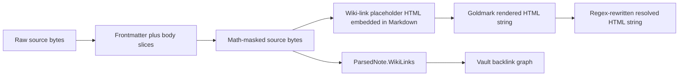

# Parser API, Algorithm, and Test Inventory

## Goal

This reference maps the current Markdown and wiki-link system as it exists on branch `task/wiki-links-in-code`. It separates observed contracts from implementation accidents and gives an intern concrete entry points: which file owns each stage, what representation crosses the stage boundary, which tests pin the behavior, and which edge cases currently fail.

The primary design document turns this evidence into a proposed reusable architecture. This inventory intentionally describes the current system first.

## Repository orientation

| Area | File | Role | Approximate size |
|---|---|---|---:|
| Source parsing and HTML rewrites | `internal/parser/parser.go` | Frontmatter metadata, wiki links, goldmark configuration, callouts, headings, images, excerpts | 1009 lines |
| Math protection | `internal/parser/math.go` | Math scanner, sentinels, code/fence scanners, restoration | 480 lines |
| Parser tests | `internal/parser/parser_test.go` | 39 example/regression tests | 1024 lines |
| Math tests | `internal/parser/math_test.go` | 10 scanner/round-trip regressions | 327 lines |
| Vault resolution | `pkg/vault/vault.go` | Note loading, slug index, backlinks, cross-note resolution, asset resolution | `loadNote` at 270; index at 371; resolution at 489–691 |
| Static implementation | `web/src/vault/staticVault.ts` | `marked` parser, separate frontmatter/slug/link graph implementation | wiki-link logic at 28–169; graph/render at 264–310 |
| Browser enhancement | `web/src/lib/wikiLinks.ts` | DOM-based broken-link marking and extraction from rendered HTML | frontend-only post-processing |

The parser package imports goldmark v1.8.2 and goldmark-meta v1.1.0. Goldmark already exposes `parser.InlineParser`, AST node types, and `renderer.NodeRenderer`; a typed wiki-link extension is implementable without replacing the Markdown engine.

## Representations and stage boundaries

The current system crosses six representations:



| Representation | Owner | Information retained | Information lost or implicit |
|---|---|---|---|
| Raw source | caller / vault file | Exact bytes | Nothing |
| Frontmatter/body slices | `splitFrontmatter`, `stripFrontmatter`, static regex | Byte boundary | Three implementations disagree on delimiters |
| Math-masked source | `replaceMathInBody` | Text plus numbered sentinels | Source-span relation is kept only in `MathSpan`; downstream APIs see indices |
| Placeholder-bearing Markdown | `replaceWikiLinks` | Link fields encoded in HTML attributes | Link is no longer typed; correctness depends on attribute spelling and order |
| Parser HTML | goldmark + parser post-passes | Rendered document | Source spans and AST ownership are gone |
| Resolved HTML | `Vault.rebuildHTML` | Final URLs and display | Resolution is performed by broad/fixed-order regexes over arbitrary HTML |
| `WikiLinks` | `extractWikiLinks` | Deduplicated target, alias, embed flag, one heading | Occurrence order, source span, duplicate headings, and link/embed distinctions can be lost |

The most important current split is between `ParsedNote.HTML` and `ParsedNote.WikiLinks`. HTML is generated by replacement; graph data is generated by extraction. The two algorithms must make identical structural decisions, or the rendered document and backlink graph disagree.

## Current public API

### Parse and source helpers

| API | Contract | Current caveat |
|---|---|---|
| `Parse(src []byte) (*ParsedNote, error)` | Render one Markdown document and extract metadata, links, tags, title, excerpt | Constructs a goldmark engine per call; returns no diagnostics or source spans |
| `PlainText(src []byte) string` | Produce text for search/excerpts | Uses a separate regex-based Markdown approximation, not the parse tree |
| `StripFrontmatter(src []byte) []byte` | Remove goldmark-meta-compatible leading frontmatter | Uses a different splitter than parse-time masking |
| `Slugify(string) string` | Produce published note URL keys | ASCII-only and part of the external URL contract |
| `StripNoteExtension(string) string` | Normalize `.md`/`.MD` target suffixes | Correct single choke point; should remain domain logic, not parser grammar |

### Math API

| API | Contract | Current caveat |
|---|---|---|
| `ScanMath(body []byte) []MathSpan` | Find math outside spans, fences, and comments | Handwritten partial Markdown lexer; indented code deliberately unsupported |
| `ReplaceMath` / `RestoreMath` | Protect TeX from Markdown and emit MathJax elements | Correctness depends on sentinel uniqueness and restoration order |
| `RestoreMathText` | Restore bare TeX in attributes/JSON | Context-specific companion to `RestoreMath` |
| `StripMathDelimiters` | Keep searchable TeX body | Re-scans source independently |

### Resolution and HTML APIs

| API | Contract | Current caveat |
|---|---|---|
| `BuildHeadingIndex(html)` | Map rendered heading text to goldmark IDs | Parses HTML with regex/tag stripping after the AST was discarded |
| `ReplaceWikiLinksString(html, resolver)` | Resolve note slugs in generated placeholders | Rewrites every `data-target` and `/note/` href in arbitrary HTML, not only wiki nodes |
| `ResolveWikiLinkHeadings` | Resolve cross-note fragments | Requires fixed generated attribute order |
| `ReplaceWikiLinkDisplay` | Replace target text with note title | Requires flat text content and fixed attribute relationships |
| `ReplaceWikiEmbedImages` | Resolve image embed placeholders | Requires exact placeholder spelling/order |
| `RewriteImageSources` | Resolve Markdown image paths | Regex HTML attribute parser; broader than wiki links |

## Current per-note algorithm

`Parse` (`internal/parser/parser.go:56–136`) executes:

```text
processed, mathSpans = replaceMathInBody(src)
links                = extractWikiLinks(processed, mathSpans)
processed            = replaceWikiLinks(processed, mathSpans)
html                  = goldmark.Convert(processed)
frontmatter           = goldmark-meta context
html                  = renderCallouts(html)
html                  = RestoreMath(html, mathSpans)
html                  = resolveSelfHeadingLinks(html)
title/tags/excerpt    = independent helpers over metadata or raw source
return ParsedNote
```

Ordering constraints:

1. Math runs before wiki replacement because wiki replacement injects quotes and HTML delimiters that the math scanner must not inspect.
2. Wiki extraction runs on math-masked source so `[[Target]]` inside TeX does not create a backlink.
3. Self-heading resolution runs after math restoration because a heading and its link can contain separate sentinels for the same TeX.
4. Vault-wide heading resolution runs only after all notes and their slugs exist.

## Current wiki-link grammar

The Go recognizer is one RE2 expression (`parser.go:39–40`):

```regex
(!?)\[\[([^\[\]]+)\]\]
```

`parseWikiLinkInner` then splits at the first `|`, followed by the first `#` in the target side.

Supported intent:

```text
[[Note]]
[[Folder/Note]]
[[Note|Alias]]
[[Note#Heading]]
[[Note#Heading|Alias]]
[[#Heading]]
![[Note]]
![[image.png]]
```

Observed grammar properties:

- Newlines are allowed because the inner class excludes brackets but not line breaks.
- Escaping of `[[` or `]]` is not represented.
- Nested brackets are rejected wholesale.
- Block references (`#^block-id`) are parsed as headings but deliberately unresolved.
- Occurrences are deduplicated by `target + "|" + alias` (`parser.go:186`), omitting heading and embed kind.
- The parser records frontmatter occurrences, although replacement does not render them.

A reusable grammar needs an explicit contract for line boundaries, escaping, empty fields, block references, embeds, and frontmatter context instead of inheriting these decisions from a character class.

## Current vault-wide algorithm

`Vault.New` loads every note, then executes (`pkg/vault/vault.go:263–265`):

```text
buildNormalizedIndex()
buildWikiLinkIndex()
buildBacklinks()
rebuildHTML()
```

`buildWikiLinkIndex` maps full slugs, progressive path suffixes, basenames, and title slugs to a single full slug. It iterates `v.notes`, a Go map, and keeps the first value for a key (`vault.go:371–407`). Therefore ambiguous short links are resolved by randomized map iteration, not a stable source-order rule. The asset index, by contrast, explicitly chooses the lexicographically first path (`vault.go:409–438`).

`rebuildHTML` starts from immutable `sourceHTML`, resolves note slugs, resolves target heading IDs, substitutes display titles, rewrites images, resolves image embeds, and marks unpublished note embeds (`vault.go:497–566`). Starting from `sourceHTML` is a strong invariant: resolution depends on mutable vault state and must be reversible on reload.

`buildBacklinks` iterates the deduplicated `WikiLinks` list and adds each source slug once to the resolved target (`vault.go:675–691`). Backlink existence only needs target identity; API consumers may need each occurrence's heading, kind, and source span. One deduplicated structure currently serves both needs.

## Static renderer divergence

`staticVault.ts` has improved rendering semantics: it registers a `marked` inline extension (`lines 28–55`), so `marked` decides whether the parser is in inline code or a fence before invoking the wiki-link tokenizer. HTML rendering therefore no longer needs the unused `preprocessWikiLinks` function at lines 162–171.

The graph still uses `extractWikiLinks`, a global regex over raw content (`lines 147–158`, called at 267–273). A wiki link in code is therefore absent from rendered anchors but present in `wikiLinkMap` and backlinks. The Go and static implementations disagree on frontmatter, slugs, self-heading links, image embeds, escaping, and diagnostics. There is no static-vault wiki-link test suite.

## Tests and their current strengths

The Go suite contains 49 parser/math tests plus vault integration tests. Strong areas include:

- malformed and currency-like math delimiters;
- fenced-code closing rules;
- math/wikilink interaction;
- frontmatter substring and EOF regressions;
- `.md`/`.MD` normalization;
- self and cross-note heading ID resolution;
- sourceHTML-based reload reversibility;
- code spans/fences and escaped backticks;
- image and note embed resolution.

The tests are incident-driven examples. There are no fuzz tests, grammar properties, backend/static conformance fixtures, ambiguity tests that repeat across map orders, or source-span assertions.

## Observed edge behavior

Ticket script `scripts/01-parser-edge-probe/main.go` records these current results:

| Probe | Observed behavior | Risk |
|---|---|---|
| Four-dash frontmatter | goldmark parses it as metadata, but wiki HTML is injected into `related` before parsing | Metadata mutation; frontmatter splitters disagree |
| `[[Note#One]] [[Note#Two]]` | HTML contains two anchors; `WikiLinks` contains only heading `One` | Occurrence data loss |
| `[[Note]] ![[Note]]` | HTML contains link and embed; `WikiLinks` contains only the link | Kind data loss |
| `[[Note\ncontinued]]` | One anchor with a newline in `data-raw` and `<br/>` in display | Grammar inherited accidentally from regex |
| HTML alias | Alias markup is emitted as raw element content | Trust boundary is implicit; display escaping differs by link type |
| Unrelated `data-target` and `/note/` href | `ReplaceWikiLinksString` rewrites both | Post-pass scope exceeds generated wiki nodes |

The four-dash case is especially direct:

```text
source frontmatter: related: '[[Meta Link]]'
parsed frontmatter: related: '<a href="/note/meta-link" ...>Meta Link</a>'
```

`stripFrontmatter` recognizes any non-empty run of dashes to match goldmark-meta (`parser.go:927–970`), while `splitFrontmatter` recognizes exactly `---` (`parser.go:361–378`). Parse-time masking uses the narrower function.

## Finding index

| ID | Severity | Finding | Primary evidence |
|---|---|---|---|
| F1 | High | Parse-time frontmatter splitting disagrees with goldmark-meta and mutates valid metadata | `splitFrontmatter` 361–378 vs `isFrontmatterDelimiter` 959–970; edge probe |
| F2 | High | Ambiguous short links resolve nondeterministically because a map is iterated into a first-wins single-value index | `vault.go:371–407` |
| F3 | High | HTML resolution rewrites unrelated authored attributes/anchors | `parser.go:556–590`; edge probe |
| F4 | Medium | Link occurrence deduplication loses heading and embed distinctions | `parser.go:186`; edge probe |
| F5 | Medium | Static rendering and graph extraction use different parsers | `staticVault.ts:28–55`, `147–158`, `267–291` |
| F6 | Medium | Regex grammar accepts cross-line links and has no source spans/diagnostics | `parser.go:39–40`; edge probe |
| F7 | Medium | Fixed-order HTML regexes make internal attributes an undocumented wire protocol | `parser.go:429–690` |
| F8 | Medium | Alias display is raw HTML under `html.WithUnsafe`; trust model is undocumented | `parser.go:380–445`; edge probe |
| F9 | Medium | Callouts are reconstructed from rendered HTML with a non-nesting-aware regex | `parser.go:695–779` |
| F10 | Low/Medium | Search/plain text uses another Markdown approximation | `parser.go:897–1000` |
| F11 | Low | Goldmark and several regexes are constructed per parse call | `parser.go:72–92`, `525–530`, `659–668`, `853–864` |
| F12 | Medium | No ambiguity/source diagnostics or fuzz/conformance test layer | public `ParsedNote`; test inventory |

## Reproduction and validation commands

```bash
go run ./ttmp/2026/08/16/PV-MARKDOWN-023--*/scripts/01-parser-edge-probe
go test ./internal/parser ./pkg/vault -count=1
rg -n '^func Fuzz' --glob '*_test.go' .
```

## Related

- Primary design: `design-doc/01-markdown-and-wiki-link-parsing-algorithms-architecture-and-robust-building-blocks.md`
- Investigation history: `reference/01-investigation-diary.md`
- Prior incidents: `PV-MATHJAX-018`, `PV-WIKILINK-021`, `PV-WIKICODE-022`
