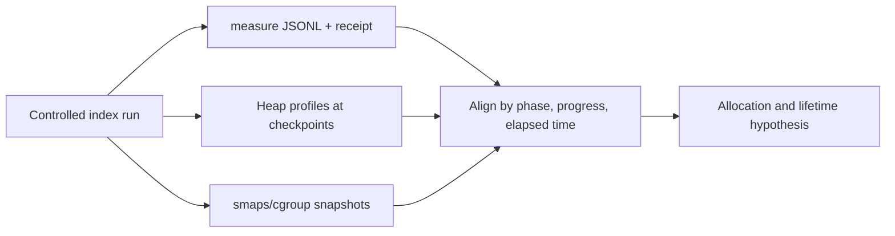

# Search Index Memory Analysis, Design, and Implementation Guide

## 1. Executive summary

publish-vault builds an immutable runtime snapshot from an Obsidian vault. The snapshot contains parsed and rendered notes plus a matching Bleve full-text index. A reload constructs a complete next snapshot before atomically replacing the active one. This preserves request correctness and rollback behavior, but it means index construction runs while the old snapshot may remain live.

MEASURE-001 added phase-aware memory instrumentation and captured the current personal-vault workload. The workload contains 3,396 eligible Markdown candidates, 3,395 published notes, and 20,938,723 source bytes. Three persistent-index runs produced a median peak of 391,219,024 bytes of Go heap and 482,586,624 bytes of process RSS. One in-memory run reached 830,169,376 bytes of heap and 924,225,536 bytes of RSS. Persistent Bleve is therefore the correct baseline, but `search_index` remains the dominant phase by a large margin.

This ticket does not begin by choosing a batch API or tuning a Kubernetes limit. It begins by attributing `search_index` memory. The current phase contains source reads, plain-text extraction, search-document allocation, tag flattening, Bleve analysis, tokenization, segment construction, persistence, and backend caching. The first implementation change must address the largest proven retained allocation or lifetime overlap. Each hypothesis will be measured independently against the same workload and correctness suite.

The target is a reproducible improvement over the 483 MB median RSS baseline. A median below 400 MB is the initial objective; 300–350 MB is a stretch range, not a promise. Every accepted change must preserve search results, publication filtering, persistent-index freshness, atomic snapshot pairing, rollback, serialized reload, old-index cleanup, content-free artifacts, and generated-fixture budgets.

## 2. Reader orientation

### 2.1 Repositories and source of truth

The implementation checkout is:

```text
/home/manuel/workspaces/2026-08-25/publish-vault-mem/publish-vault
```

The reusable measurement module is:

```text
/home/manuel/workspaces/2026-08-25/publish-vault-mem/measure
```

The MEASURE-001 baseline and scripts are under:

```text
/home/manuel/workspaces/2026-08-25/publish-vault-mem/measure/
  ttmp/2026/08/25/MEASURE-001--standalone-process-memory-measurement-local-optimization-and-metrics-toolkit/
```

Markdown in the checked-out vault is the authored source of truth. `vault.Vault`, rendered HTML, normalized indexes, backlinks, and Bleve files are derived state. An index may be discarded and rebuilt. User-authored content must never exist only inside Bleve.

### 2.2 Terms

- **Vault candidate:** A Markdown file that survives filesystem and blacklist exclusion before parsing. A candidate may still fail parsing or declare `publish: false`.
- **Published note:** A parsed, publish-eligible note retained in `Vault.notes` and exposed to API, tree, backlinks, raw reads, and search.
- **Search document:** A temporary Markdown-derived representation containing slug, title, plain body, tags, and excerpt.
- **Runtime snapshot:** One revision's matching `Vault`, `search.Index`, resolved root, and index directory.
- **Persistent index:** A disk-backed Bleve index constructed under a snapshot-specific directory.
- **Build directory:** `<revision>.building`, private until index construction succeeds.
- **Phase peak:** The largest sampled value while one semantic phase is active.
- **Heap peak:** Maximum sampled Go `HeapAlloc`, not total process or cgroup memory.
- **RSS peak:** Maximum sampled resident set size for the app process.
- **Cgroup current:** Memory charged to the containing cgroup; it can include memory outside Go heap and differs from root-process RSS.
- **Content-free artifact:** A trace or summary containing counters and bounded phase names but no note body, title, slug, path, or secret.

### 2.3 What this ticket is and is not

This ticket is an analysis and optimization of persistent search-index construction for publish-vault. It may add generic measurement capability to `measure` only when the capability is domain-independent and has a clear public contract.

It is not:

- a return to in-memory Bleve for production-sized vaults;
- a replacement of the atomic snapshot model;
- a database migration project;
- a reason to expose pprof publicly;
- an automatic garbage-collection or throttling policy;
- a promise that one sampled workload proves asymptotic boundedness;
- a Kubernetes capacity-only change presented as an algorithmic optimization.

## 3. Current architecture

### 3.1 Snapshot lifecycle

`pkg/server/runtime.go` owns initial construction and reload. `RuntimeState` contains the active `Snapshot`, a read/write lock for snapshot access, and `reloadMu` for complete rebuild serialization.

```go
type Snapshot struct {
    Revision     string
    ResolvedRoot string
    Vault        *vault.Vault
    Search       *search.Index
    IndexDir     string
    BuiltAt      time.Time
}
```

The reload path is:

```text
Reload:
    lock reloadMu
    if configured root is an unchanged git-sync symlink:
        return without rebuilding
    start measure run kind=reload
    next = loadSnapshot(...)
    if build failed:
        retain old snapshot
        finish failed run
        return error
    switch phase to snapshot_swap
    atomically replace active snapshot
    finish successful run
    release old snapshot asynchronously after grace period
```

```mermaid
sequenceDiagram
    participant Caller
    participant State as RuntimeState
    participant A as Snapshot A
    participant B as Snapshot B builder
    participant M as measure Recorder

    Caller->>State: Reload()
    State->>State: lock reloadMu and re-check revision
    State->>M: start run reload
    State->>B: resolve root and load Vault B
    State->>B: construct Search B
    Note over A: A continues serving requests
    alt B failed
        B-->>State: error
        State->>M: finish failed
        State-->>Caller: error; A remains active
    else B complete
        B-->>State: Snapshot B
        State->>M: begin snapshot_swap
        State->>State: replace A with B under lock
        State->>M: finish succeeded
        State-->>Caller: success
        State->>A: delayed close and directory removal
    end
```

The central invariant is:

```text
For every request R, there is one snapshot S such that all note and search
operations performed for R use S.Vault and S.Search.
```

### 3.2 Vault loading

`pkg/vault/vault.go` constructs `Vault` in ordered stages:

1. Count publish-eligible candidates and bytes.
2. Walk and parse Markdown.
3. Build normalized slug lookup.
4. Build wiki-link lookup.
5. Build backlinks.
6. Rebuild final rendered HTML.

`LoadProgress` exposes a finite stage plus notes and source bytes:

```go
type LoadProgress struct {
    Stage          LoadStage
    ProcessedNotes uint64
    TotalNotes     uint64
    ProcessedBytes uint64
    TotalBytes     uint64
}
```

`LoadObserver` runs while `LoadAll` holds the vault write lock. It must not call back into `Vault`. This constraint prevents deadlock and keeps instrumentation behavior explicit.

The retained `Note` model includes rendered HTML but not raw Markdown. Raw source is read on demand through a rooted and exclusion-aware filesystem API. The exact fields should be inspected at `pkg/vault/vault.go:40` before changing ownership or copy behavior.

### 3.3 Search-document generation

The search representation is separate from the API/render representation:

```go
type SearchDocument struct {
    Slug    string
    Title   string
    Body    string
    Tags    []string
    Excerpt string
}
```

For every published note, `Vault.SearchDocument`:

1. Calls `ReadRaw(note.Path)`.
2. Reads the full source into a byte slice.
3. Calls `parser.PlainText(raw)` to allocate Markdown-derived body text.
4. Copies the tag slice.
5. Reuses note slug, title, and excerpt strings in the temporary value.

`ForEachSearchDocument` first calls `AllNotes`, which creates a slice of 3,395 note pointers, then creates and submits one `SearchDocument` at a time. This avoids a full slice of all plaintext bodies. It does not prove that the downstream Bleve writer has bounded retained state.

```text
Vault.notes map
    -> AllNotes pointer slice
    -> for each note:
         ReadRaw -> []byte
         PlainText -> body string
         copy tags -> []string
         SearchDocument
         callback
```

### 3.4 Search indexing

`pkg/search/search.go` supports two constructors:

```go
func NewWithOptions(v *vault.Vault, options Options) (*Index, error)
func NewPersistentWithOptions(v *vault.Vault, indexPath string, options Options) (*Index, error)
```

The persistent constructor removes any existing target path, creates a new Bleve index, and calls `indexVault`. `indexVault` streams each search document into `Index.Index` and reports bounded document/byte progress.

```go
type IndexProgress struct {
    ProcessedDocuments uint64
    TotalDocuments     uint64
    IndexedBytes       uint64
}
```

`Index.Index` currently:

1. Locks the wrapper mutex.
2. Flattens tags into a new space-separated string.
3. Builds a `noteDoc` containing title, body, tags, and excerpt.
4. Calls `bleve.Index.Index(doc.Slug, bleveDoc)`.

The mapping uses the standard analyzer for title, body, and tags. Title, tags, and excerpt are stored because search results request those fields. Body is indexed but not stored.

```go
func buildMapping() mapping.IndexMapping {
    im := bleve.NewIndexMapping()
    dm := bleve.NewDocumentMapping()

    title := bleve.NewTextFieldMapping()
    title.Analyzer, title.Store = standard.Name, true

    body := bleve.NewTextFieldMapping()
    body.Analyzer, body.Store = standard.Name, false

    tags := bleve.NewTextFieldMapping()
    tags.Analyzer, tags.Store = standard.Name, true

    excerpt := bleve.NewTextFieldMapping()
    excerpt.Store = true

    // mappings attached to dm and im
    return im
}
```

Any mapping change can alter tokens, stored fields, result hydration, index size, query behavior, or highlighting. Mapping experiments therefore require search equivalence tests, not only memory measurements.

### 3.5 Persistent publication

`buildSearchIndex` builds under:

```text
<base>/snapshots/<revision>.building/index
```

After successful indexing it starts `index_publish`, then:

1. closes the index;
2. renames the build directory to `<revision>`;
3. opens the index at its final path.

Only then can the new `Snapshot` be returned and swapped. If any step fails, the build/final directory is removed and the old active snapshot remains unchanged.

### 3.6 Measurement integration

`pkg/server/measurement.go` adapts application truth to the domain-free `measure` recorder. The finite registered phases are:

```text
resolve_root
vault_walk_parse
vault_normalize
wiki_link_index
backlinks
render_html
search_index
index_publish
snapshot_swap
```

Old snapshot release is recorded through a trace-only run. It does not mutate the Prometheus exporter's current run after a newer load has started.

The adapter writes:

- periodic and phase-boundary events;
- note/document progress;
- content-free processed-byte annotations;
- optional mode-`0600` JSONL;
- an atomically renamed receipt;
- bounded Prometheus state.

`pkg/server/metrics.go` serves only `GET /metrics` on a separate listener. pprof remains separate under `pkg/server/pprof.go`.

## 4. Current baseline and interpretation

### 4.1 Workload identity

The baseline summary records:

```text
vault base commit:       205c98b09e6483cc1aeb38a8feb2859021fc6af1
worktree dirty:          true
publish config SHA-256:  71aaabb3e1f857e12e5453b19ba9fe39b2c49900cba07e1d5c5346a25419e84b
Markdown candidates:     3,396
published notes:         3,395
candidate source bytes:  20,938,723
sample interval:         100ms
instrumented commit:     4d597ac95adeb7fd18da96fd3302509891ad53d0
```

Because the private vault worktree was dirty, future comparable runs must either reproduce that exact state or establish a new clean pinned baseline. Do not compare a new result to the old median without recording the changed workload identity.

### 4.2 Persistent runs

Three runs produced:

| Metric | Minimum | Median | Maximum |
|---|---:|---:|---:|
| Run duration | 64.43 s | 68.26 s | 96.72 s |
| Peak heap | 358,721,160 B | 391,219,024 B | 397,395,808 B |
| Peak RSS | 432,971,776 B | 482,586,624 B | 485,199,872 B |
| `search_index` duration | 47.90 s | 53.47 s | 81.37 s |

The range is operational evidence, not noise to discard. Disk state, kernel cache, GC timing, CPU contention, and filesystem behavior can affect duration and sampled RSS. Comparisons need repeated runs and should report distributions.

### 4.3 In-memory comparison

One in-memory run produced:

```text
peak heap: 830,169,376 bytes
peak RSS:  924,225,536 bytes
duration:  65.53 seconds
```

Relative to persistent medians:

```text
heap ratio: 2.122x
RSS ratio:  1.915x
```

The design decision to keep persistent Bleve is accepted. In-memory mode remains useful only as a diagnostic comparison and for very small local vaults.

### 4.4 Phase attribution

Persistent medians:

| Phase | Peak heap | Peak RSS | Duration |
|---|---:|---:|---:|
| `vault_walk_parse` | 65.9 MB | 126.4 MB | 12.85 s |
| `wiki_link_index` | 69.5 MB | 127.0 MB | 0.18 s |
| `backlinks` | 67.1 MB | 130.5 MB | 0.08 s |
| `render_html` | 122.9 MB | 184.7 MB | 1.53 s |
| `search_index` | **391.2 MB** | **482.6 MB** | **53.47 s** |
| `index_publish` | 122.5 MB | 294.1 MB | 0.05 s |
| `snapshot_swap` | 108.3 MB | 254.4 MB | 0.03 s |

`search_index` adds approximately 268 MB of sampled live heap above the rendering peak. The next optimization target is therefore not the filesystem walk, backlink construction, or rendering phase.

RSS remains around 294 MB during `index_publish` after heap falls to approximately 123 MB. Possible contributors include runtime arenas and resident file-backed index pages. This observation identifies a question; it does not assign causality. `smaps_rollup`, cgroup `anon/file`, heap profiles, and controlled GC diagnostics are needed to separate these categories.

## 5. Problem statement

Reduce persistent search-index construction peak memory while preserving behavior. Specifically:

1. Attribute the current `search_index` heap and RSS peak to concrete types, allocation sites, and representation lifetimes.
2. Identify whether memory grows with total indexed content, bounded batch state, Bleve segment policy, retained temporary data, or snapshot overlap.
3. Implement the smallest change that addresses the largest proven cause.
4. Compare at least three before and three after runs under one workload identity.
5. Preserve search and snapshot correctness.
6. Tighten generated-fixture budgets only after stable improvement is established.
7. Produce content-free evidence suitable for the ticket and operational review.

### 5.1 Required outcome

The accepted implementation must produce a statistically and operationally credible reduction, not merely one lower run. A median below the current baseline is required. A target below 400 MB RSS is preferred.

### 5.2 Non-goals

- Rewriting all vault parsing or rendering.
- Introducing incremental reload before full-build memory is understood.
- Changing query semantics to obtain a lower footprint without explicit product approval.
- Replacing Bleve solely because it appears in a profile; backend replacement needs separate comparative evidence.
- Adding forced GC to the production path as the primary fix.
- Storing private profiles or source in the repository or reMarkable bundle.

## 6. Questions the investigation must answer

### 6.1 Heap attribution

At the `search_index` peak:

- Which packages and functions dominate `inuse_space`?
- Which concrete types dominate retained heap?
- Which paths dominate cumulative `alloc_space`?
- Is retention in publish-vault temporary representations or Bleve internals?
- Does retained heap grow approximately linearly with indexed source bytes or document count?
- Does the peak occur at a repeatable progress fraction?

### 6.2 RSS and cgroup attribution

- How much RSS is anonymous versus file-backed at peak?
- How do `HeapAlloc`, `HeapSys`, runtime `Sys`, RSS, cgroup `anon`, and cgroup `file` differ?
- How much RSS remains after index publication and after natural GC?
- Is the process faulting persistent index pages faster than they become reclaimable?
- Does a cold-cache run differ materially from a warm-cache run?

### 6.3 Representation lifetime

For each representation, record creator, owner, last use, and release condition:

| Representation | Created by | Expected last use | Current question |
|---|---|---|---|
| Raw source `[]byte` | `ReadRaw` | after `PlainText` | Is it retained through conversion or analyzer calls? |
| Plain body string | `parser.PlainText` | after Bleve consumes document | Does Bleve retain/copy it and for how long? |
| SearchDocument tags copy | `SearchDocument` | after index call | Is the copy necessary? |
| Flattened tag string | `Index` | after index call | Can allocation be removed or reduced safely? |
| `noteDoc` | `Index` | after index call | Does reflection or backend retain it? |
| Analyzer token streams | Bleve | after field analysis/segment commit | What bounds their lifetime? |
| Segment/posting buffers | Bleve backend | commit/merge dependent | Does state grow across all documents? |
| Old snapshot | runtime state | grace period after swap | Is it relevant during initial load versus reload? |
| New vault HTML | `Vault.LoadAll` | snapshot lifetime | Must remain for API rendering |
| Persistent index pages | kernel/process mapping | backend close/reclaim | How much RSS/file accounting remains? |

### 6.4 Algorithmic boundedness

A low peak for 3,395 notes does not prove bounded memory. Run generated scaling fixtures at increasing document counts and payload sizes. Determine whether peak growth tracks:

```text
O(total corpus bytes)
O(document count)
O(max document size)
O(configured batch bytes)
O(segment merge state)
```

The desired design may still grow with index metadata, but transient document-content retention should be bounded by an explicit batch or backend contract rather than total corpus payload.

## 7. Profiling and evidence design

### 7.1 Keep measure as the timeline authority

Every profile experiment must retain a schema-v1 trace and receipt. The trace establishes run identity, phase, progress, sample interval, and external memory peaks. pprof explains Go heap allocation sites but does not replace RSS/cgroup evidence.



### 7.2 Profile capture API boundary

Do not make `measure` silently capture profiles. Add a publish-vault-owned optional observer or a generic explicit callback only if needed. A safe application-level sketch is:

```go
type SearchProfileCheckpoint struct {
    ProcessedDocuments uint64
    TotalDocuments     uint64
    IndexedBytes       uint64
    Reason             string // fixed enum-like value
}

type SearchProfileObserver interface {
    Checkpoint(context.Context, SearchProfileCheckpoint) error
}
```

A lower-level alternative is a ticket-local harness that invokes the same `search.NewPersistentWithOptions` path and captures profiles when `ObserveIndexed` crosses fixed percentages. Prefer the harness first because it avoids adding an unproven production API.

Pseudocode:

```text
thresholds = [0%, 25%, 50%, 75%, 100%]
next = thresholds[0]

ObserveIndexed(progress):
    update measure progress
    if progress fraction >= next:
        write heap profile to private temp directory
        read /proc/self/smaps_rollup
        read cgroup memory.stat/current
        append content-free checkpoint manifest
        advance next
```

Checkpoint callbacks currently execute inside the indexing loop and under `search.Index.mu` during `Index` only if inserted there. Profile writes are expensive. Capture must occur after `Index` returns and outside long-held locks when possible. The profile run is diagnostic and should not be used for duration comparison because profile capture perturbs timing.

### 7.3 Profile security

Go heap profiles can contain fragments of note text. Therefore:

- write profiles only under a private mode-`0700` temporary directory;
- never commit raw profiles;
- never upload them to reMarkable;
- inspect them locally through `go tool pprof`;
- retain only aggregate tables with package/type/function names after verifying no content appears;
- delete raw profiles after conclusions are recorded unless the user explicitly authorizes secure retention.

### 7.4 Required pprof views

For each selected checkpoint, collect:

```bash
go tool pprof -top -inuse_space <binary> <profile>
go tool pprof -top -alloc_space <binary> <profile>
go tool pprof -top -inuse_objects <binary> <profile>
go tool pprof -top -alloc_objects <binary> <profile>
```

Then inspect relevant call graphs with `-focus` or interactive `list`, for example:

```text
github.com/blevesearch/bleve
publish-vault/pkg/search
publish-vault/pkg/vault
publish-vault/pkg/parser
```

Do not infer retained bytes from `alloc_space`; it is cumulative allocation traffic. Use `inuse_space` for retained heap at the sampled profile.

### 7.5 Runtime and smaps checkpoints

At the same progress boundaries, record a content-free manifest containing:

```json
{
  "elapsed_ns": 0,
  "phase": "search_index",
  "processed_documents": 0,
  "total_documents": 3395,
  "heap_alloc_bytes": 0,
  "heap_sys_bytes": 0,
  "runtime_sys_bytes": 0,
  "rss_bytes": 0,
  "pss_bytes": 0,
  "anonymous_bytes": 0,
  "private_dirty_bytes": 0,
  "cgroup_current_bytes": 0,
  "cgroup_anon_bytes": 0,
  "cgroup_file_bytes": 0
}
```

Use `measure/pkg/collector` rather than duplicating procfs and cgroup parsing. If a useful smaps field is missing from the public observation model, add it generically to `measure` with fixtures and schema review.

### 7.6 Natural versus diagnostic GC

Production runs must not force GC. A separate diagnostic run may capture:

1. before forced GC;
2. immediately after `runtime.GC()`;
3. optionally after `debug.FreeOSMemory()`.

Mark that run as perturbed and exclude it from performance baselines. The difference helps distinguish reachable heap, uncollected garbage, and runtime/OS retention; it is not itself an optimization.

## 8. Hypothesis matrix

Each hypothesis below has a measurement and acceptance rule. Do not implement them all simultaneously.

### H1: Bleve retains corpus-proportional segment construction state

**Evidence that would support it:** Bleve backend structures dominate `inuse_space`, and retained bytes rise steadily with processed documents even though publish-vault submits one document at a time.

**Experiment:** Compare current per-document indexing with explicit bounded Bleve batches at several batch sizes. Capture heap/RSS curves and duration.

**Potential change:** Add a batch-oriented internal builder with a fixed document or byte limit, commit each batch, clear references, and continue.

```text
batch = new Bleve batch
batchBytes = 0
for each search document:
    batch.Index(id, document)
    batchBytes += estimated document bytes
    if batch docs >= maxDocs or batchBytes >= maxBytes:
        index.Batch(batch)
        batch = new batch
        batchBytes = 0
flush final batch
```

**Risk:** Bleve's current `Index` implementation may already use an internal one-document batch; a larger explicit batch could increase peak. Only measurements can decide.

### H2: Search-document and parser intermediates overlap longer than required

**Evidence that would support it:** `[]byte`, Markdown/parser node, body string, or search-document allocations dominate `inuse_space` at progress checkpoints.

**Experiment:** Use pprof `list` and escape analysis around `ReadRaw`, `PlainText`, `SearchDocument`, and `Index`.

**Potential change:** Introduce a narrower callback API, avoid unnecessary tag-slice copies, or stream plaintext extraction only if parser behavior permits exact semantic equivalence.

**Risk:** Optimizing small per-document temporaries will not materially change a 268 MB phase increase if Bleve retains the dominant state.

### H3: Stored/indexed field configuration duplicates unnecessary data

**Evidence that would support it:** Index size and Bleve memory are dominated by stored title/tags/excerpt fields or term vectors not required by query behavior.

**Experiment:** Build candidate mappings in isolated temporary directories, compare index size, peak memory, query corpus, highlights, and result field hydration.

**Potential change:** Disable unnecessary mapping features or store only fields required by `SearchResult`.

**Risk:** Search currently requests `title`, `excerpt`, and `tags`; disabling storage can return empty result fields. Analyzer changes can alter matching and ranking.

### H4: Backend cache or merge policy is mis-sized for this workload

**Evidence that would support it:** Backend-specific cache/segment/merge allocations dominate retained heap and vary with backend options.

**Experiment:** Identify the actual Bleve index type and backend defaults at runtime. Review Bleve version-matched API documentation and source. Change one supported option in an isolated branch.

**Potential change:** Configure memory-related backend options or choose a better-supported index type for bulk construction.

**Risk:** Undocumented internal options, version coupling, slower queries, larger indexes, or unstable behavior. No private Bleve internals should become a publish-vault API.

### H5: File-backed pages dominate RSS after heap is released

**Evidence that would support it:** Heap drops after `search_index`, while smaps/cgroup file-backed memory remains high and anonymous memory is comparatively low.

**Experiment:** Compare cold/warm cache runs and inspect smaps/cgroup attribution before indexing, at peak, after close/rename/reopen, and after a delay.

**Potential change:** Avoid unnecessary reopen reads, adjust publication behavior, or accept reclaimable file cache while sizing cgroup headroom correctly.

**Risk:** Treating reclaimable cache as a leak or using destructive cache-dropping commands. Never require privileged global cache drops in ordinary validation.

### H6: Snapshot overlap, not fresh build state, dominates reload peaks

**Evidence that would support it:** Initial-load peaks are materially lower than reload peaks and retained old-snapshot types dominate reload profiles.

**Experiment:** Run identical initial and reload measurements with old-snapshot release explicitly marked. Compare phase-local and whole-run peaks.

**Potential change:** Reduce grace duration only if request ownership proves it safe, or redesign snapshot reference ownership separately.

**Risk:** Closing an index while a request still uses it. The existing grace period is a coarse safety mechanism; changing it requires concurrency proof, not memory pressure alone.

## 9. Proposed experiment harness

### 9.1 Location

Place ticket-specific scripts under:

```text
ttmp/2026/08/25/PV-MEM-002--reduce-publish-vault-search-index-peak-memory/scripts/
```

Use numeric prefixes:

```text
01-capture-search-index-profile.sh
02-summarize-profile-evidence.py
03-run-search-index-matrix.sh
04-compare-search-index-runs.py
```

Do not add ad hoc scripts at repository root.

### 9.2 Inputs

Every run manifest must record:

- publish-vault commit;
- measure module commit/version;
- vault base commit and dirty state;
- publish config SHA-256;
- candidate note and byte count;
- published note count;
- search mode and candidate option values;
- Go version, GOOS/GOARCH, GOMAXPROCS, GOGC, effective GOMEMLIMIT;
- sampling interval;
- run order and cold/warm-cache classification where known.

Do not record source paths inside public artifacts. A local-only manifest may contain them if mode `0600` and excluded from Git.

### 9.3 Run matrix

Start with:

| Variant | Runs | Profiles | Purpose |
|---|---:|---:|---|
| Current persistent baseline | 3 | 1 diagnostic | Refresh baseline and attribute peak |
| First evidence-backed candidate | 3 | 1 diagnostic | Measure impact and confirm mechanism |
| In-memory | 0 by default | 0 | Already characterized; rerun only if needed |
| Generated scaling fixtures | 3 per size | no raw profile retention | Test growth curve |

Interleave candidate and baseline runs when practical to reduce time-order/cache bias:

```text
baseline A
candidate A
candidate B
baseline B
baseline C
candidate C
```

### 9.4 Outputs

Retain only content-free:

- JSONL traces and receipts after audit;
- normalized run manifests;
- aggregate pprof top tables after content review;
- smaps/cgroup checkpoint summaries;
- comparison JSON/Markdown;
- query-equivalence results;
- index-size and duration summaries.

Raw heap profiles remain private and uncommitted.

## 10. API and implementation design

The final API depends on the selected hypothesis. The following boundaries are approved for investigation; none should be added preemptively.

### 10.1 Search builder options

If an explicit bounded builder is proven useful:

```go
type BuildOptions struct {
    ObserveIndexed func(IndexProgress)
    BatchDocuments int
    BatchBytes     uint64
}
```

Validation rules:

- zero uses the reviewed default;
- negative values are rejected;
- at least one finite bound must apply if batching retains full documents;
- effective values appear in content-free receipts or run annotations;
- runtime flags are Glazed schema fields, not raw `flag` parsing;
- production defaults do not change until equivalence and repeated baselines pass.

Prefer byte and document limits together. Document count alone is not a content bound because one note can be arbitrarily large.

### 10.2 Progress contract

Progress callbacks remain content-free and monotonic. If batch commits are introduced, distinguish submitted documents from durably committed documents only if operators need both. Do not silently redefine `ProcessedDocuments`.

One option:

```go
type IndexProgress struct {
    ProcessedDocuments uint64 // successfully accepted by the index path
    CommittedDocuments uint64 // optional; durable after batch commit
    TotalDocuments     uint64
    IndexedBytes       uint64
    BatchDocuments     uint64
    BatchBytes         uint64
}
```

Adding fields is preferable to changing existing field semantics. Prometheus exposure must remain bounded; numeric values are gauges, not labels.

### 10.3 Profile checkpoint injection

A production-facing profile callback is not approved by default. Begin with a ticket harness or test-only hook. If reusable application instrumentation is required, the callback must:

- receive only content-free counters;
- run outside index locks where possible;
- be disabled by default;
- propagate errors in diagnostic mode rather than silently losing evidence;
- never write to a caller-unspecified path;
- not enter the Prometheus label model.

### 10.4 Search equivalence harness

Create a deterministic query corpus covering:

- exact title/body terms;
- multi-word conjunctions;
- fuzzy matches;
- one-to-three-character prefix queries;
- `#tag` syntax;
- `tag:` alias syntax;
- limit handling;
- deleted-note absence after reload;
- stored title, excerpt, and tags in results;
- highlighting where the API exposes it.

Pseudocode:

```text
baseline = build index with current implementation
candidate = build index with candidate implementation
for query case in corpus:
    want = normalize(baseline.Search(query, limit))
    got  = normalize(candidate.Search(query, limit))
    compare IDs, scores/order according to contract, title, excerpt, tags
```

If Bleve produces small floating-score variation across segment layouts, define the contract before normalizing it. Do not discard ordering differences merely to make a test pass.

## 11. Decision records

### Decision DR-1: Keep persistent Bleve as the baseline

- **Context:** The current personal-vault run was measured in both persistent and in-memory modes.
- **Options considered:** in-memory Bleve; persistent Bleve; immediate backend replacement.
- **Decision:** Keep persistent Bleve while optimizing its construction path.
- **Rationale:** Persistent mode reduced median-relative heap by 52.9% and RSS by 47.8% while preserving current behavior.
- **Consequences:** Investigation focuses on remaining construction state and file-backed accounting; in-memory mode is diagnostic only for large vaults.
- **Status:** accepted.

### Decision DR-2: Attribute before selecting an optimization

- **Context:** `search_index` contains application and Bleve allocations; phase peaks cannot identify the responsible type.
- **Options considered:** implement batching immediately; tune GC; raise limits; capture profiles and lifetime evidence first.
- **Decision:** Capture aligned pprof and process/cgroup evidence before changing production behavior.
- **Rationale:** Premature batching can increase memory, and GC/capacity changes can hide retained-object causes.
- **Consequences:** The first phase produces analysis artifacts rather than an immediate code optimization.
- **Status:** accepted.

### Decision DR-3: Preserve atomic full-snapshot publication

- **Context:** Building a new snapshot while the old one serves requests creates overlap.
- **Options considered:** mutate the active index; publish vault and index separately; retain atomic complete snapshots.
- **Decision:** Preserve complete snapshot construction, rollback, and atomic pointer replacement.
- **Rationale:** Requests must not observe mismatched vault and search revisions or partial indexes.
- **Consequences:** Optimizations must work within this lifecycle; incremental indexing is a separate future design requiring equivalent consistency guarantees.
- **Status:** accepted.

### Decision DR-4: Keep profiles private and traces content-free

- **Context:** Heap profiles can contain note content; traces are intended as durable evidence.
- **Options considered:** commit all profiles; redact binary profiles; retain only reviewed aggregates.
- **Decision:** Never commit/upload raw profiles; retain content-free traces and reviewed aggregate profile tables.
- **Rationale:** Binary profile redaction is unreliable, while aggregate function/type evidence is sufficient for the design record.
- **Consequences:** Reproducing low-level analysis requires rerunning the private workload.
- **Status:** accepted.

### Decision DR-5: Treat memory and throughput as a joint result

- **Context:** Smaller batches or frequent commits may lower peaks while increasing build duration and disk work.
- **Options considered:** optimize memory alone; optimize time alone; report a two-dimensional trade-off.
- **Decision:** Every candidate reports heap, RSS, cgroup memory, duration, throughput, and index size.
- **Rationale:** A production optimization must fit both resource and reload-time constraints.
- **Consequences:** A lower-memory candidate may be rejected if its operational cost is excessive.
- **Status:** accepted.

### Decision DR-6: Use private real-vault baselines and public generated budgets for different purposes

- **Context:** The real vault is representative but private and mutable; generated fixtures are reproducible but less representative.
- **Options considered:** use only real vault; commit a sanitized copy; use only generated fixtures; keep two evidence layers.
- **Decision:** Keep content-free real-vault traces for performance decisions and generated fixtures for CI regression enforcement.
- **Rationale:** No single workload satisfies privacy, representativeness, and reproducibility simultaneously.
- **Consequences:** Both validation layers are mandatory before acceptance.
- **Status:** accepted.

## 12. Phased implementation plan

### Phase 0 — Freeze and refresh the baseline

1. Choose a reproducible vault state; prefer a clean pinned worktree.
2. Record blacklist/config hash and workload counts.
3. Build the exact publish-vault binary once and use it for all runs.
4. Run three persistent baselines at 100 ms.
5. Audit retained artifacts for content.
6. Compare refreshed results with MEASURE-001 and explain any workload/config difference.

Exit criteria:

- three valid traces and receipts;
- matching note/byte counts;
- baseline median/range report;
- content audit passes;
- no code behavior change.

### Phase 1 — Attribute `search_index`

1. Add ticket-local profile/checkpoint harness.
2. Capture profiles at fixed progress boundaries and near peak.
3. Capture smaps/cgroup checkpoints aligned to progress.
4. Produce top retained and allocated package/function/type tables.
5. Build the representation lifetime inventory.
6. Identify the first hypothesis with concrete evidence.

Exit criteria:

- raw profiles remain private;
- aggregate analysis identifies a dominant allocation/lifetime source;
- no optimization selected solely from phase names;
- diary records commands, perturbations, and failures.

### Phase 2 — Run focused experiments

1. Implement the smallest experimental switch behind an internal/test option.
2. Run generated scaling fixtures across document count and payload size.
3. Run search equivalence and persistent reload tests.
4. Measure candidate peak and duration.
5. Reject or accept the hypothesis explicitly.

Exit criteria:

- one variable changed at a time;
- result includes memory and throughput;
- no default production behavior changes yet;
- failed hypotheses remain documented.

### Phase 3 — Implement the accepted design

1. Convert the experiment into a clear production implementation.
2. Validate option defaults and bounds.
3. Remove experimental dead code and duplicate paths.
4. Preserve progress semantics or version them explicitly.
5. Add unit, integration, race, and failure-cleanup tests.
6. Document operational flags only if a runtime knob is justified.

Exit criteria:

- no TODO placeholders or compatibility shim;
- search and snapshot tests pass;
- error paths close indexes and remove build directories;
- formatting, generation, lint, security, and builds pass.

### Phase 4 — Prove repeated real-workload improvement

1. Run at least three baseline and three candidate measurements in an interleaved order.
2. Compare medians, ranges, phase peaks, duration, throughput, and index size.
3. Run query-equivalence corpus against both indexes.
4. Run initial-load and reload scenarios.
5. Audit artifacts for content.
6. Decide whether the target is met or further investigation is warranted.

Exit criteria:

- reproducible median reduction;
- no search or snapshot regression;
- no unbounded metric labels or private content;
- results survive a second-pair-of-eyes review.

### Phase 5 — Tighten regression and prepare rollout

1. Adjust generated-fixture budgets only with stable headroom.
2. Record accepted budget rationale and platform sensitivity.
3. Update operator documentation and private metrics guidance.
4. Validate Docker and Compose paths.
5. Build/publish through the normal PR and image workflow.
6. Observe startup and at least one reload in a constrained environment before lowering resources.

Exit criteria:

- local CI and GitHub CI pass;
- reviewed image deployed safely;
- production metrics match expected phase shape;
- no OOM/restart/search regression;
- resource requests/limits changed only from post-deployment evidence.

## 13. Testing strategy

### 13.1 Unit tests

- Batch/byte option validation, if introduced.
- Progress monotonicity and terminal totals.
- Flush thresholds at document and byte boundaries.
- Final partial-batch flush.
- Callback errors and index errors.
- Close idempotency and use-after-close behavior.
- Mapping field storage and analyzer contract.
- No stale target directory or stale deleted documents.

### 13.2 Search behavior tests

- Prefix behavior for short single words.
- Fuzzy matching for longer terms.
- Multi-word conjunction behavior.
- Tag-only `#` and `tag:` queries.
- Stable stored result fields.
- Result limits.
- Deleted-note absence after full persistent rebuild.
- Candidate/baseline equivalence corpus.

### 13.3 Runtime snapshot tests

- Build failure retains old active snapshot.
- Concurrent reloads serialize.
- Queued reload rechecks unchanged revision.
- New snapshot pairs matching vault and index.
- Build directory is private before publication.
- Close/rename/reopen failures clean temporary state.
- Old index remains valid through the grace window.
- Old index directory is removed after release.

### 13.4 Measurement tests

- All finite phases are registered.
- Search progress reports documents and content-free bytes.
- Failed index build yields failed phase and run receipts.
- Prometheus series count is invariant under run IDs and paths.
- Trace/receipt files use private permissions and atomic finalization.
- Profile hooks are disabled by default and never exposed publicly.

### 13.5 Memory tests

Generated fixtures should vary two independent axes:

```text
document counts: [100, 500, 1000, 3000]
payload bytes:   [1 KiB, 8 KiB, 32 KiB]
```

Do not assert exact byte equality. Assert reviewed ceilings and growth relationships with sufficient CI headroom. Real-vault runs provide the acceptance result.

### 13.6 Repository validation

Run, at minimum:

```bash
gofmt -w <changed-go-files>
go test ./... -count=1
go test -race ./... -count=1
make ci-check
go generate ./...
git diff --check
```

Also run frontend typecheck/build, Docker build, Compose validation, gosec, and govulncheck through the repository's established commands. Inspect `AGENT.md` before implementation for current exact gates.

## 14. Acceptance criteria

### Functional

- Search corpus equivalence passes.
- All published note counts and byte counts match.
- Reload rollback and atomic snapshot tests pass.
- Persistent index directories are fresh and cleaned correctly.

### Memory

- At least three comparable candidate runs exist.
- Candidate median peak RSS is below refreshed baseline median.
- Candidate median `search_index` heap is below refreshed baseline median.
- Preferred goal: median RSS below 400 MB.
- No phase merely shifts a larger peak into `index_publish` or `snapshot_swap`.

### Performance

- Duration and notes/second are reported.
- Any regression is explicitly reviewed and accepted.
- Index on-disk size is reported.

### Observability and privacy

- JSONL remains schema-valid and content-free.
- Prometheus labels remain finite.
- Raw profiles are not committed or uploaded.
- Sampling interval and perturbed diagnostic runs are disclosed.

### Engineering quality

- No dead experiment branches, TODO placeholders, duplicate indexing paths, or hidden defaults.
- Full tests/race/lint/build/security checks pass.
- Diary and changelog record failures and decisions.
- `docmgr doctor` passes before ticket completion.

## 15. Risks and mitigations

| Risk | Consequence | Mitigation |
|---|---|---|
| Profile capture perturbs peak/timing | Diagnostic run cannot be used as benchmark | Separate profile and performance runs |
| Heap profiles expose note text | Private content leakage | Private temp storage; retain aggregates only |
| Batch tuning increases peak | Optimization moves in wrong direction | Matrix experiment before changing default |
| Mapping change alters search | Silent user-visible regression | Deterministic query-equivalence corpus |
| File cache is mistaken for leak | Wrong algorithm or unsafe resource limit | smaps/cgroup anon/file attribution |
| Forced GC appears to solve memory | Production workload is misrepresented | Diagnostic-only GC runs, clearly marked |
| One fast run is selected | Cache/GC variance drives conclusion | Interleaved repeated runs and ranges |
| Old snapshot closed too early | Requests fail during reload | Preserve lifecycle unless ownership proof exists |
| Real workload changes | Before/after comparison invalid | Hash/config/count manifest for every run |
| CI budget too tight | Flaky tests across runners | Generated fixture, reviewed headroom, relationship checks |
| Generic measure API gains app-specific hooks | Reusable package degrades | Keep domain phases/options in publish-vault |

## 16. Alternatives considered

### Increase Kubernetes memory only

This may be necessary for rollout headroom, but it does not explain or reduce the 391 MB `search_index` heap. Capacity changes should follow measurement, not replace it.

### Force GC during indexing

Rejected as a default. It can increase CPU cost and alter the workload without removing reachable data. Use only as a diagnostic distinction.

### Return to in-memory Bleve

Rejected for large vaults. The measured run nearly doubled heap and RSS.

### Replace Bleve immediately

Deferred. A backend comparison is expensive and changes query semantics, persistence, operational behavior, and migration risk. First establish whether current retention is caused by configuration, builder behavior, or unavoidable backend state.

### Implement incremental reload immediately

Deferred. Incremental reload may reduce rebuild work, but it introduces revision consistency, deletion, rename, backlink, wiki-link, HTML, and index mutation complexity. Full-build peak should be understood first.

### Remove rendered HTML from snapshots

Not the first target. `render_html` peaks around 185 MB RSS, far below `search_index`. HTML is used by serving behavior and requires a separate cache/render design.

## 17. Open questions

1. Which Bleve index type/backend is active with the pinned dependency, and what memory-related builder/merge options are public and stable?
2. Does `bleve.Index.Index` retain corpus-proportional state between calls, or does peak come from backend segment merges?
3. How much of the 483 MB RSS peak is anonymous versus file-backed?
4. At what progress fraction does heap peak, and is the curve monotonic?
5. Does the old active snapshot materially increase reload peak relative to initial load on the current workload?
6. Are title, excerpt, and tags all required as stored Bleve fields, or could result hydration safely come from the matching vault snapshot?
7. Would hydrating search results from `Vault` reduce stored index data without introducing revision mismatch or lock cost?
8. What reload-duration regression is acceptable for a meaningful memory reduction?
9. Should a proven batch limit be fixed internally or exposed as an operator flag?
10. Is sub-400 MB RSS achievable without a backend or query-contract change?

## 18. Intern checklist

Before editing code:

- Read this guide completely.
- Read repository `AGENT.md`.
- Read `pkg/server/runtime.go`, `pkg/server/measurement.go`, `pkg/vault/vault.go`, and `pkg/search/search.go`.
- Read the MEASURE-001 design and diary sections for Phases 3–5.
- Inspect the baseline summary JSON.
- Reproduce the current generated-fixture memory test.
- Confirm raw profiles and private vault data are excluded from Git.

Before proposing an optimization:

- Identify the dominant retained type/function from a peak profile.
- Align the profile with measure phase/progress and RSS/cgroup checkpoints.
- State one falsifiable hypothesis.
- Define correctness and memory acceptance checks.
- Change one variable.

Before committing:

- Remove exploratory dead code.
- Run formatting, tests, race, lint, generation, security, frontend, and Docker gates.
- Inspect artifacts for private content.
- Update diary, tasks, relations, and changelog.
- Include exact baseline/candidate evidence in the commit or ticket docs.

## 19. File references

### publish-vault

```text
/home/manuel/workspaces/2026-08-25/publish-vault-mem/publish-vault/pkg/server/runtime.go
/home/manuel/workspaces/2026-08-25/publish-vault-mem/publish-vault/pkg/server/measurement.go
/home/manuel/workspaces/2026-08-25/publish-vault-mem/publish-vault/pkg/server/metrics.go
/home/manuel/workspaces/2026-08-25/publish-vault-mem/publish-vault/pkg/server/server.go
/home/manuel/workspaces/2026-08-25/publish-vault-mem/publish-vault/pkg/server/pprof.go
/home/manuel/workspaces/2026-08-25/publish-vault-mem/publish-vault/pkg/server/measurement_test.go
/home/manuel/workspaces/2026-08-25/publish-vault-mem/publish-vault/pkg/server/memory_budget_test.go
/home/manuel/workspaces/2026-08-25/publish-vault-mem/publish-vault/pkg/server/runtime_test.go
/home/manuel/workspaces/2026-08-25/publish-vault-mem/publish-vault/pkg/vault/vault.go
/home/manuel/workspaces/2026-08-25/publish-vault-mem/publish-vault/pkg/vault/vault_test.go
/home/manuel/workspaces/2026-08-25/publish-vault-mem/publish-vault/pkg/search/search.go
/home/manuel/workspaces/2026-08-25/publish-vault-mem/publish-vault/pkg/search/search_test.go
/home/manuel/workspaces/2026-08-25/publish-vault-mem/publish-vault/pkg/server/testdata/generated-fixture-memory-budget.json
```

### measure and MEASURE-001 evidence

```text
/home/manuel/workspaces/2026-08-25/publish-vault-mem/measure/pkg/measurement/memory.go
/home/manuel/workspaces/2026-08-25/publish-vault-mem/measure/pkg/collector/collector.go
/home/manuel/workspaces/2026-08-25/publish-vault-mem/measure/pkg/measure/recorder.go
/home/manuel/workspaces/2026-08-25/publish-vault-mem/measure/pkg/trace/types.go
/home/manuel/workspaces/2026-08-25/publish-vault-mem/measure/pkg/report/summary.go
/home/manuel/workspaces/2026-08-25/publish-vault-mem/measure/pkg/budget/budget.go
/home/manuel/workspaces/2026-08-25/publish-vault-mem/measure/pkg/prometheus/exporter.go
/home/manuel/workspaces/2026-08-25/publish-vault-mem/measure/ttmp/2026/08/25/MEASURE-001--standalone-process-memory-measurement-local-optimization-and-metrics-toolkit/design-doc/01-measure-architecture-and-implementation-guide.md
/home/manuel/workspaces/2026-08-25/publish-vault-mem/measure/ttmp/2026/08/25/MEASURE-001--standalone-process-memory-measurement-local-optimization-and-metrics-toolkit/reference/01-investigation-diary.md
/home/manuel/workspaces/2026-08-25/publish-vault-mem/measure/ttmp/2026/08/25/MEASURE-001--standalone-process-memory-measurement-local-optimization-and-metrics-toolkit/artifacts/phase5-baseline/summary.json
/home/manuel/workspaces/2026-08-25/publish-vault-mem/measure/ttmp/2026/08/25/MEASURE-001--standalone-process-memory-measurement-local-optimization-and-metrics-toolkit/scripts/12-run-publish-vault-baseline.sh
/home/manuel/workspaces/2026-08-25/publish-vault-mem/measure/ttmp/2026/08/25/MEASURE-001--standalone-process-memory-measurement-local-optimization-and-metrics-toolkit/scripts/13-summarize-publish-vault-baseline.py
```

### Historical architecture report

```text
/home/manuel/code/wesen/go-go-golems/go-go-parc/Projects/2026/07/05/ARTICLE - Publish Vault Memory Architecture - Reload-Safe Persistent Search Indexes.md
/home/manuel/code/wesen/go-go-golems/go-go-parc/Projects/2026/08/25/ARTICLE - Measure - Phase-Aware Memory Measurement for Go Programs.md
/home/manuel/code/wesen/go-go-golems/go-go-parc/Projects/2026/08/25/ARTICLE - Publish Vault Memory Optimization - From OOM Incidents to Phase-Attributed Baselines.md
```

## 20. Closing guidance

The existing evidence is sufficient to choose the subsystem but not the implementation. `search_index` is the dominant phase, persistent Bleve is materially better than in-memory Bleve, and the current stream avoids a complete plaintext document slice. The remaining 391 MB heap peak could still come from several different owners.

The first useful contribution to this ticket is a trustworthy attribution report. Once the dominant retained state is known, implement the smallest bounded change, preserve the snapshot and query invariants, and evaluate it with repeated runs. Memory optimization is complete only when the measured reduction, algorithmic explanation, and correctness evidence agree.
