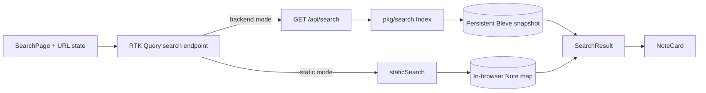
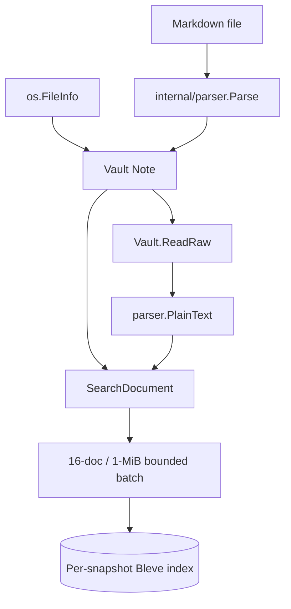
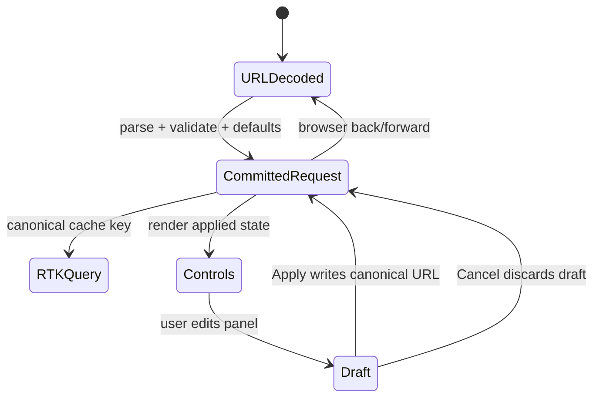

# Current search and metadata architecture map

## 1. Two runtime modes must implement one product contract

publish-vault has two search implementations behind one React query hook:

1. **Backend mode** loads Markdown in Go, builds a Bleve v2 index, and serves `/api/search`.
2. **Static mode** imports bundled Markdown through Vite, constructs an in-browser vault, and scans notes in TypeScript.

`web/src/store/vaultApi.ts:143-154` selects between these implementations at build/runtime configuration time. Both return `web/src/types/index.ts:48-54` `SearchResult[]`. A design that changes only Bleve will pass backend tests while static builds silently retain old behavior. A design that parses filters only in React can produce a third semantic implementation and leave non-React API consumers without a stable contract.



The final design must define one typed `SearchRequest` and one `SearchResponse` semantics, then implement adapters for Bleve and static mode.

## 2. Source metadata and the Go note model

`pkg/vault/vault.go:38-51` defines `Note`. It already contains:

- `Slug`, `Title`, and vault-relative `Path`;
- arbitrary `Frontmatter map[string]interface{}`;
- normalized `Tags`;
- `Excerpt` and rendered `HTML`;
- links and backlinks;
- filesystem `ModTime time.Time`;
- publication eligibility.

`internal/parser/parser.go:31-39` defines `ParsedNote`. Goldmark-meta supplies arbitrary frontmatter, while explicit parser helpers derive title, tags, excerpt, HTML, and wiki links. There is no canonical created/updated date type in the parser or vault packages.

`pkg/vault/vault.go:359-411` reads `os.FileInfo.ModTime()` and stores it directly as `Note.ModTime`. The dynamic API therefore exposes a filesystem timestamp. In Git-backed production, this value describes the checked-out file's filesystem metadata, not necessarily when the author created or edited the note. Git does not preserve original filesystem modification times on checkout.

The frontmatter parser normalizes YAML values into JSON-encodable structures but does not interpret date semantics. Depending on YAML decoding, a date-looking scalar may become a string or another normalized scalar. Any date contract should be implemented in one dedicated resolver after parsing, rather than by scattered type assertions in search and HTTP handlers.

## 3. Dynamic note-to-search transformation

`pkg/vault/vault.go:100-107` defines the current `SearchDocument`:

```go
type SearchDocument struct {
    Slug    string
    Title   string
    Body    string
    Tags    []string
    Excerpt string
}
```

It intentionally omits `Path`, `ModTime`, and arbitrary frontmatter. `Vault.SearchDocument` at `pkg/vault/vault.go:1134-1148` reads raw Markdown, derives plain text, and copies title, tags, and excerpt. `ForEachSearchDocument` streams one document at a time so indexing does not retain a full-vault plaintext slice.

PV-MEM-002 added persistent batches bounded by 16 documents and 1 MiB. New filter fields increase each staged document's estimated bytes and persistent index size. The date/filter design must update `searchDocumentBytes` and rerun memory/index-size evidence rather than assuming metadata is free.



## 4. Bleve representation

The repository pins `github.com/blevesearch/bleve/v2 v2.6.0` in `go.mod:9`.

`pkg/search/search.go:62-68` defines the stored `noteDoc` with title, body, a single flattened tags string, and excerpt. `toNoteDoc` joins tags with spaces. The current mapping at `pkg/search/search.go:422-448` uses:

| Field | Mapping | Stored | Current purpose |
|---|---|---:|---|
| `title` | text, standard analyzer | yes | full-text match and result display |
| `body` | text, standard analyzer | no | full-text match |
| `tags` | text, standard analyzer | yes | fuzzy/prefix tag search and result display |
| `excerpt` | text default analyzer | yes | result display |

There is no exact keyword field for tags, no path field, no date field, and no sortable stored timestamp.

The existing `tags` representation creates two constraints:

- It supports current tokenized fuzzy/prefix behavior.
- It cannot express an exact multi-value keyword contract cleanly because all tags are flattened into one analyzed string.

An advanced filter should not silently redefine current `#tag` behavior. The design should preserve the analyzed `tags` field and add a separate exact/filter field such as `tags_kw`, provided Bleve v2's keyword analyzer and multi-value indexing contract are verified in Phase 2/3. This is a migration-by-rebuild because indexes are derived snapshots.

## 5. Dynamic query behavior

`pkg/search/search.go:264-404` owns the complete query semantics.

### General text search

- Empty tokens return no results.
- One token of three or fewer characters uses `PrefixQuery`.
- Longer or multiple tokens use fuzzy `MatchQuery` with fuzziness 1.
- Multiple words are combined with `ConjunctionQuery`; every word must match.
- The search request returns at most the caller-supplied limit and currently starts at offset zero.
- Stored fields are title, excerpt, and tags.
- Bleve score order is returned without an explicit deterministic secondary sort.

### Tag-prefixed search

`extractTagQuery` recognizes leading `#` and case-insensitive `tag:`. `searchByTag` scopes the query to the analyzed `tags` field. Short tags use prefix matching; longer tags use fuzzy matching. This is discovery behavior, not exact metadata filtering.

The current public method is:

```go
func (si *Index) Search(query string, limit int) ([]SearchResult, error)
```

It cannot receive paths, date ranges, tag conjunction mode, sort, pagination, or field-presence filters without adding positional arguments or introducing a request object.

## 6. HTTP API behavior

`pkg/api/api.go:221-237` serves `GET /api/search?q=...`.

Current behavior:

- `q` is trimmed.
- Empty `q` returns `[]`.
- The handler always requests 30 results.
- Search failures return HTTP 500 and a hard-coded JSON-looking string through `http.Error`.
- The response body is a bare array, not an envelope.
- Unknown query parameters are ignored.
- There is no validation distinction between invalid input and backend failure.
- There is no total result count, applied-filter echo, facets, pagination metadata, or index revision.

The handler obtains `v, si := provider.Snapshot()` but discards the vault. Snapshot pairing is still preserved because the index comes from one active snapshot. If future facets or date display are resolved from `Vault` after search, they must use that same `v` rather than a second provider call.

A proper advanced contract should not overload free-form `q` with an undocumented parser. It should parse typed query parameters into a request, validate once, and pass the request to both backend implementations.

## 7. Search result transport and rendering

The Go `SearchResult` at `pkg/search/search.go:22-29` and TypeScript `SearchResult` at `web/src/types/index.ts:48-54` contain slug, title, excerpt, tags, and score. No path or date is transported.

`NoteCard` already accepts optional `modTime` (`web/src/components/molecules/NoteCard/NoteCard.tsx:11-21`) and renders it next to a clock icon. `SearchPage` does not pass `modTime` (`SearchPage.tsx:141-151`), because `SearchResult` does not have it. The rendering primitive therefore exists, but its property name and formatting imply filesystem modification time rather than a resolved note date.

The final design should decide whether the card receives:

```ts
date?: {
  value: string;      // canonical ISO date/timestamp
  kind: "created" | "updated" | "filesystem";
  precision: "date" | "timestamp";
}
```

or a simpler stable projection. Passing an unlabelled `modTime` would hide source semantics and make future created/updated display ambiguous.

## 8. URL and Redux state

`SearchPage` uses both React Router search parameters and Redux:

- `useSearchParams()` reads `q`.
- an effect copies URL `q` into `ui.searchQuery`;
- every keystroke updates Redux immediately;
- `SearchBar` debounces the call that writes URL state;
- `setSearchParams(..., {replace: true})` replaces history rather than pushing each query;
- RTK Query uses the Redux value, not the URL object directly.

`web/src/store/uiSlice.ts:3-17` stores only a string `searchQuery`. Advanced filters would either multiply Redux fields and synchronization effects or introduce a typed search-state object. Two mutable sources create loop and stale-state risks, especially on back/forward navigation.

The URL must be canonical because it is shareable, survives reload, and is available to SSR/static routes. Redux may hold draft UI state while a panel is open, but the committed search request should derive from a pure URL codec.



## 9. SearchPage behavior

`web/src/components/pages/SearchPage/SearchPage.tsx` currently:

- shows a search header, result-count badge, and debounced search bar;
- skips RTK search when trimmed query length is below two;
- shows the tag cloud when the query is shorter than two characters;
- shows one shared loading state;
- displays `NoteCard` results;
- replaces the query with `#tag` when a result tag or cloud tag is clicked;
- reports only “No results for …” for an empty response;
- does not render RTK Query's error state;
- does not distinguish an empty text query with active filters;
- has no sort, filter summary, removable chips, advanced panel, pagination, or result path/date.

The `query.length < 2` rule is incompatible with filter-only searches unless it changes from “text is long enough” to “request has any effective criterion.”

## 10. Static-mode divergence

`web/src/vault/staticVault.ts` independently parses frontmatter with `js-yaml`, renders Markdown with `marked`, builds links, and searches notes.

The current static date behavior is especially important:

```ts
if (fm.created instanceof Date) {
  modTime = fm.created.toISOString().slice(0, 10);
} else if (typeof fm.created === "string") {
  modTime = fm.created.slice(0, 10);
} else {
  modTime = new Date().toISOString().slice(0, 10);
}
```

Static `modTime` is therefore a resolved `created` frontmatter value when present and **today's build/runtime date** when absent. Dynamic `modTime` is filesystem modification time. The same `Note.modTime` property has different authority and fallback semantics in the two modes.

`staticSearch` scans every note, uses substring tests over title, normalized tags, and excerpt, and sorts by a hand-built score. It does not search the full body, does not use fuzzy matching, and reproduces `#`/`tag:` handling separately. Exact backend/static ranking parity does not exist today, but result/filter inclusion parity is achievable and should be tested.

Phase 2 must replace both date implementations with one documented resolver contract and mode-specific source inputs. A missing date must remain missing; using the current date creates unstable sorting and false metadata.

## 11. Existing tests and missing test layers

### Existing backend coverage

- `pkg/search/search_test.go` covers tag prefix parsing, tag search, regular search compatibility, persistent reopen/deletion, close behavior, bounded batches, and batch/single result equivalence.
- `pkg/api/api_test.go` covers basic search transport and other API endpoints.
- `pkg/server/runtime_test.go` covers persistent publication, stale-note deletion, reload serialization, rollback, reopening, and delayed cleanup.
- `pkg/vault/vault_test.go` covers search-document plaintext, exclusions, publication flags, reloads, and note JSON shape.
- `pkg/watcher/watcher_test.go` covers incremental in-memory update/delete behavior.

### Existing frontend coverage

- `entry-server.test.tsx` asserts that the search route renders an SSR placeholder.
- `NoteCard` and `SearchBar` have Storybook stories but no direct interaction tests.
- There is no `SearchPage` test.
- There is no static-search behavior test around date or filter parity.
- There is no URL codec unit test because no codec exists.

### Required additions

The design must add contract tests at the resolver, request codec, Bleve query builder, static predicate, HTTP validation, SearchPage interaction, accessibility, and browser-history layers. Golden/equivalence fixtures should be generated and public, not copied from the private vault.

## 12. Architecture gap matrix

| Capability | Current state | Required design action |
|---|---|---|
| Result date | `Note` has dynamic filesystem `ModTime`; static mode substitutes `created` or today; search result omits both | Define canonical date fields, source labels, normalization, absence, and result projection |
| Exact tags | analyzed flattened string | Preserve current field; add exact multi-value filter representation |
| Path/folder | `Note.Path` exists; search document/index omit it | Normalize vault-relative slash path and exact/prefix filter fields |
| Date range | no indexed date | Add typed date field and inclusive interval semantics |
| Sorting | Bleve score only | Define relevance/newest/oldest with deterministic slug tie-break |
| Filter-only search | API requires non-empty `q`; UI skips short text | Treat any effective filter as a valid request |
| Pagination | hard-coded 30 | Add bounded limit and offset/cursor decision |
| Response metadata | bare array | Add versioned envelope or preserve array via explicit compatibility route/parameter decision |
| URL | only `q` | Add canonical repeated params and pure codec |
| Advanced UI | none | Add applied chips plus responsive dialog/drawer with draft/apply/cancel |
| Errors | generic 500; frontend ignores error | Add field-level 400 errors and rendered recovery state |
| Static mode | independent subset semantics | Share request types/date resolver rules and test inclusion parity |
| Snapshot safety | already strong | Keep all indexed fields inside derived snapshot; no side lookup against another revision |
| Memory/index size | bounded persistent construction | Update byte accounting and rerun generated/representative budgets |

## 13. Phase 1 conclusions

1. Date display is not merely a frontend wiring task. The current property means different things in dynamic and static modes.
2. `NoteCard` can render a date, but the search result contract cannot supply one.
3. Advanced filters require a typed request object; extending `Search(string, limit)` will not remain maintainable.
4. The analyzed tag field must remain for current fuzzy/prefix `#tag` behavior, while exact filtering needs a separate representation.
5. URL state should become the committed source of truth, with a pure codec and optional draft UI state.
6. Static mode is a first-class implementation target and requires explicit inclusion-parity tests.
7. Persistent indexes are derived and rebuilt per snapshot, so mapping evolution does not require an in-place migration; it does require memory, duration, and index-size revalidation.
