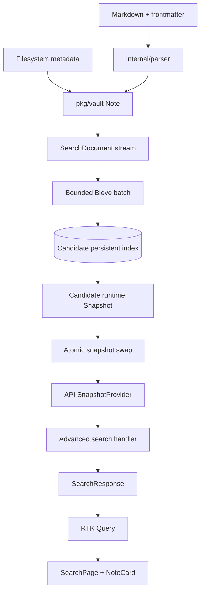
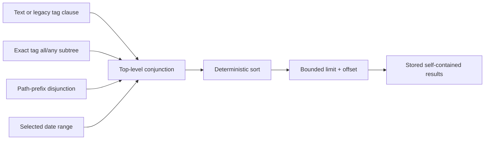

# Date-aware advanced search architecture and implementation guide

## Executive summary

publish-vault currently supports text search and special `#tag`/`tag:` discovery. Search results contain title, excerpt, tags, slug, and score. They do not contain path or authored date information. The search API accepts one free-text parameter, returns a bare array capped at 30 results, and cannot express structured metadata constraints.

The note model already contains arbitrary frontmatter and filesystem modification time, but the existing date property is not safe to reuse. Backend mode calls filesystem `ModTime` the note's modification time. Static mode calls `created` frontmatter—or today's date when absent—`modTime`. Git checkout timestamps do not represent authored note dates, and a build-time fallback changes whenever the application is rebuilt.

PV-SEARCH-027 introduces a canonical authored-date model and a typed advanced-search request. Created and updated dates come from strict frontmatter aliases. Results display updated date when present, otherwise created date, and omit the date when neither exists. Advanced search composes free text, exact tags, folder prefixes, date ranges, sorting, and bounded pagination. The browser URL is the committed request state. Both the persistent Bleve backend and static in-browser search implement the same inclusion and ordering contract.

> **Accepted design direction**
>
> - Keep current analyzed text and `#tag` discovery behavior.
> - Add exact keyword fields for metadata filters.
> - Add created, updated, and display datetime fields.
> - Add a typed `/api/search/advanced` response envelope backed by one search implementation.
> - Keep the current bare-array endpoint as a temporary adapter.
> - Use canonical URL query parameters, not an embedded advanced grammar.
> - Treat static search as a supported implementation with shared contract fixtures.
> - Revalidate persistent-index memory, duration, and size after adding fields.

## 1. What an intern should understand first

The feature is not confined to the search page. A date begins as frontmatter text, becomes domain metadata on a vault note, enters a streamed search document, is encoded into a per-snapshot Bleve index, is selected by a query, crosses an HTTP or static adapter, is represented in the URL and RTK Query cache, and is finally rendered by a result card.

The system also has two correctness properties that are more important than a particular filter UI:

1. Every request observes a vault and search index from the same source revision.
2. A failed reload leaves the previous complete snapshot available.

Do not add a side database, global metadata cache, or post-hit lookup that can cross revisions. The new fields belong in the same derived search snapshot as title, body, and tags.



## 2. Repository orientation

### Backend

| File | Symbols | Responsibility |
|---|---|---|
| `internal/parser/parser.go` | `ParsedNote`, `Parse`, `normalizeFrontmatter` | Parse frontmatter and Markdown into normalized note inputs |
| `pkg/vault/vault.go` | `Note`, `SearchDocument`, `loadNote`, `SearchDocument`, `ForEachSearchDocument` | Own canonical note semantics and stream index documents |
| `pkg/search/search.go` | `Options`, `noteDoc`, `buildMapping`, `Search`, `searchByTag` | Map documents, construct queries, execute Bleve, build result projections |
| `pkg/api/api.go` | `SnapshotProvider`, `searchNotes`, `jsonResponse` | Parse HTTP requests against one active snapshot |
| `pkg/server/runtime.go` | `Snapshot`, `Reload`, `buildSearchIndex`, `persistentSearchOptions` | Build/publish persistent index atomically and clean old snapshots |
| `pkg/watcher/` | incremental update/delete | Keep development in-memory search synchronized |

### Frontend

| File | Symbols | Responsibility |
|---|---|---|
| `web/src/types/index.ts` | `Note`, `NoteListItem`, `SearchResult` | Shared transport/view types |
| `web/src/store/vaultApi.ts` | `search`, generated hooks | Backend/static transport and RTK cache |
| `web/src/components/pages/SearchPage/SearchPage.tsx` | `SearchPage` | URL state, request execution, loading/results/empty UI |
| `web/src/components/molecules/SearchBar/SearchBar.tsx` | `SearchBar` | Controlled input, debounce, focus shortcut |
| `web/src/components/molecules/NoteCard/NoteCard.tsx` | `NoteCard` | Result metadata and navigation |
| `web/src/vault/staticVault.ts` | `buildVault`, `staticSearch` | Static-mode metadata and search implementation |
| `web/src/components/ui/dialog.tsx` | Dialog primitives | Accessible advanced-search panel foundation |
| `web/src/store/uiSlice.ts` | `searchQuery` | Current duplicate committed query state to retire/refine |

### Existing design evidence

- `analysis/01-scope-evidence-map-and-acceptance-gates.md`
- `analysis/02-current-search-and-metadata-architecture-map.md`
- `design-doc/02-canonical-note-date-model-and-bleve-date-contract.md`
- `design-doc/03-advanced-search-request-index-url-and-interaction-design.md`
- `reference/01-investigation-diary.md`

Read those for complete alternatives, probe output, and failure history. This primary guide is the implementation sequence.

## 3. Current behavior and gaps

### 3.1 Dates

Dynamic `loadNote` stores `info.ModTime()`. Static `buildVault` stores `frontmatter.created` or today's date. Search documents omit all dates, and search results omit dates. `NoteCard` has an optional `modTime` property but SearchPage cannot supply it.

### 3.2 Metadata filters

The Bleve document contains analyzed title/body/tags/excerpt only. Tags are joined into one space-separated string. This supports existing fuzzy/prefix tag discovery but cannot provide exact independent tag values. Path exists on `Note` but not in the index.

### 3.3 API

`GET /api/search?q=` trims text, returns `[]` when empty, calls `Search(q, 30)`, and emits a bare array. Invalid structured input, totals, sort, pagination, and field errors do not exist.

### 3.4 URL and state

SearchPage copies URL `q` into Redux and executes from Redux. Text input changes Redux immediately; debounce writes URL with replacement history. Advanced state would make this two-source synchronization fragile.

### 3.5 Static mode

Static mode scans title, tags, and excerpt. It does not search full body and does not rank like Bleve. Exact score parity is not a current guarantee. New metadata inclusion and deterministic sort parity can and should be guaranteed.

## 4. Target domain model

### 4.1 Canonical authored dates

Accepted frontmatter aliases:

```text
created: created, then date
updated: updated, then modified, then last_updated
```

Accepted values:

```text
YYYY-MM-DD
RFC3339 with explicit timezone
```

Missing or invalid values remain absent. Do not fall back to filesystem `ModTime`, Git history, or the current date.

```go
type DatePrecision string
const (
    DatePrecisionDate DatePrecision = "date"
    DatePrecisionTimestamp DatePrecision = "timestamp"
)

type NoteDate struct {
    Value     time.Time
    Precision DatePrecision
    SourceKey string
}

type NoteDates struct {
    Created *NoteDate
    Updated *NoteDate
}
```

Display precedence is updated, then created, then absent.

### 4.2 Search request

```go
type SearchRequest struct {
    Query        string
    Tags         []string
    TagMode      TagMode
    PathPrefixes []string
    DateField    DateField
    DateFrom     *DateOnly
    DateTo       *DateOnly
    Sort         SearchSort
    Limit        int
    Offset       int
}
```

Defaults:

```text
tag_mode: all
date_field: display when a range exists
sort: relevance when q exists; newest for filter-only
limit: 30
offset: 0
```

### 4.3 Search result

```go
type SearchResultDate struct {
    Value     string `json:"value"`
    Kind      string `json:"kind"`
    Precision string `json:"precision"`
}

type SearchResult struct {
    Slug    string            `json:"slug"`
    Title   string            `json:"title"`
    Excerpt string            `json:"excerpt"`
    Tags    []string          `json:"tags"`
    Path    string            `json:"path"`
    Score   float64           `json:"score"`
    Date    *SearchResultDate `json:"date,omitempty"`
}
```

The advanced response adds total, limit, offset, and effective sort.

### 4.4 Concrete request lifecycle

Consider a user who searches for `memory`, selects exact tags `go` and `performance` with “match all,” selects folder `Research/`, chooses a 2024 display-date range, and sorts newest first. The filter panel does not send a query while each control changes. Apply canonicalizes the draft, writes one URL, and closes the dialog. SearchPage decodes that URL into a `SearchRequest`; RTK Query uses the canonical encoding as its cache identity.

Backend mode parses the same parameters independently and rejects unknown or malformed fields. The search package builds a fuzzy text clause, two exact keyword term clauses under a conjunction, one normalized path-prefix clause, and one half-open datetime range. Those category clauses enter a top-level conjunction. The request sorts by descending `display_at` and ascending document ID, requests at most 30 hits from offset zero, and asks Bleve for stored title, excerpt, tags, path, date kind, date precision, and date values.

Each hit is self-contained. The API does not call `SnapshotProvider` again or look up the slug in a later vault snapshot. It formats the stored date according to retained precision, returns the response envelope, and reports the total. The frontend renders path, tags, and a labelled `<time>` element. Removing one tag chip creates a new canonical URL and a new request. Browser Back restores the previous all-tags request directly from URL state.

Static mode receives the same normalized request. It applies equivalent exact metadata predicates and deterministic sorting to its note map, then slices offset and limit. Its text score may differ from Bleve, but every metadata constraint and newest/oldest ordering follows the same fixture-backed contract.

## 5. Index design

### 5.1 Preserve discovery fields

Do not alter current title, body, tags, or excerpt behavior. Current `#tag` and `tag:` queries continue to target analyzed `tags`.

### 5.2 Add filter fields

```text
tags_kw        keyword array, not stored
path           keyword, stored display value
path_kw        keyword, normalized lowercase prefix value
created_at     datetime, stored
updated_at     datetime, stored
display_at     datetime, stored
date_kind      keyword, stored
date_precision keyword, stored
```

### 5.3 Mapping sketch

```go
keyword := bleve.NewKeywordFieldMapping()
keyword.Store = true

tagsKeyword := bleve.NewKeywordFieldMapping()
tagsKeyword.Store = false

date := bleve.NewDateTimeFieldMapping()
date.Store = true

dm.AddFieldMappingsAt("tags_kw", tagsKeyword)
dm.AddFieldMappingsAt("path", keyword)
dm.AddFieldMappingsAt("path_kw", tagsKeyword)
dm.AddFieldMappingsAt("created_at", date)
dm.AddFieldMappingsAt("updated_at", date)
dm.AddFieldMappingsAt("display_at", date)
dm.AddFieldMappingsAt("date_kind", keyword)
dm.AddFieldMappingsAt("date_precision", keyword)
```

Avoid sharing one mutable `FieldMapping` pointer if Bleve mapping construction mutates it; create helpers returning fresh mappings when uncertain.

### 5.4 Batch accounting

Update `searchDocumentBytes` to count:

- path display and normalized path;
- every exact tag value if not already counted separately;
- created/updated/display serialized bytes;
- kind and precision.

Run PV-MEM-002 generated fixture and representative measurements after the mapping changes. The 16-document/1 MiB production bounds remain until new evidence justifies another value.

## 6. Query composition

Build typed Bleve objects; never interpolate user values into query-string syntax.

```text
clauses = []

text clause:
    current #tag/tag: discovery OR current text builder

exact tags:
    all -> conjunction(term(tags_kw, t) for t)
    any -> disjunction(term(tags_kw, t) for t)

paths:
    disjunction(prefix(path_kw, p) for p)

dates:
    DateRangeInclusiveQuery(
        from 00:00Z inclusive,
        dayAfter(to) 00:00Z exclusive
    ).field(selected date field)

final:
    no clauses -> MatchAll
    one clause -> clause
    many -> Conjunction
```

Categories combine with AND. Path choices combine with OR. Tag mode is explicit.



Sort orders:

```go
relevance: []string{"-_score", "_id"}
newest:    []string{"-display_at", "_id"}
oldest:    []string{"display_at", "_id"}
```

Add a test that proves missing display dates sort last. Do not assume it.

## 7. HTTP contract

### 7.1 Advanced route

```http
GET /api/search/advanced
```

Example:

```http
/api/search/advanced?q=memory&tag=go&tag=performance&tag_mode=all&path=Research%2F&date_field=display&date_from=2024-01-01&date_to=2024-12-31&sort=newest
```

Response:

```json
{
  "results": [
    {
      "slug": "research/memory",
      "title": "Memory Research",
      "excerpt": "...",
      "tags": ["go", "performance"],
      "path": "Research/Memory.md",
      "score": 2.13,
      "date": {
        "value": "2024-08-10",
        "kind": "updated",
        "precision": "date"
      }
    }
  ],
  "total": 1,
  "limit": 30,
  "offset": 0,
  "sort": "newest"
}
```

### 7.2 Legacy adapter

`GET /api/search?q=...` calls the same `SearchAdvanced` with a simple request and returns only `.Results`. Mark it deprecated in API docs and create a follow-up removal task after all known clients migrate.

### 7.3 Validation

Reject:

- repeated singleton parameters;
- unknown parameters;
- invalid enum values;
- malformed or reversed dates;
- traversal paths;
- empty exact filters;
- values/counts beyond limits;
- offsets above 10,000;
- limits outside 1–100.

Return stable 400 field errors. Keep raw search values out of metrics/log attributes.

## 8. Canonical browser state

The URL is the committed request. Implement a pure codec in a new file such as:

```text
web/src/search/searchParams.ts
```

Functions:

```ts
decodeSearchParams(params: URLSearchParams): DecodeResult<SearchRequest>
encodeSearchParams(request: SearchRequest): URLSearchParams
canonicalizeSearchRequest(request: SearchRequest): SearchRequest
hasEffectiveCriteria(request: SearchRequest): boolean
```

The encoder emits a fixed parameter order, normalized sorted repeated values, explicit effective sort, and no default limit/offset. Any query/filter/sort change resets offset.

Remove `searchQuery` as a second committed source or constrain it to component-local draft behavior. Back/forward must decode URL directly and must not be overwritten by a Redux effect.

History policy:

- debounced text edits use replace;
- Apply filters uses push;
- sort changes use push;
- chip removal uses push;
- pagination uses push;
- panel draft changes do not touch history.

## 9. Frontend component design

### 9.1 New components

Suggested files:

```text
web/src/components/organisms/AdvancedSearchPanel/AdvancedSearchPanel.tsx
web/src/components/organisms/AdvancedSearchPanel/AdvancedSearchPanel.stories.tsx
web/src/components/molecules/SearchFilterChips/SearchFilterChips.tsx
web/src/components/molecules/SearchFilterChips/SearchFilterChips.stories.tsx
web/src/search/searchParams.ts
web/src/search/searchParams.test.ts
```

Avoid creating many one-use components before the panel stabilizes. Extract tag/folder selectors only when their behavior is independently testable or reused.

### 9.2 Panel

Use the existing Dialog primitive. On narrow screens, style Dialog content to fill the viewport or behave as a bottom sheet. Required sections:

- searchable tag multi-select;
- all/any radio group;
- folder tree multi-select;
- date field, from, and to;
- sort;
- Reset draft, Cancel, Apply.

Opening copies committed request to local draft. Cancel and Escape discard. Apply validates and writes one canonical URL.

### 9.3 Chips

Render human-readable applied filters with individual remove buttons. “Clear filters” preserves text; “Clear search” clears everything.

### 9.4 Result cards

Extend `NoteCardProps` with `path` and typed `date`; do not overload `modTime`. Render `<time dateTime>` with Created/Updated label. Omit missing date rather than displaying invented metadata.

### 9.5 State table

| Condition | UI |
|---|---|
| no criteria | tag cloud and filter invitation |
| filter only | execute immediately |
| loading first page | labelled loading region |
| fetching new criteria | retain previous list with pending indicator |
| results | total, cards, sort, pagination |
| empty | explain active criteria; edit/clear actions |
| invalid URL | field errors and reset action |
| backend failure | retry while preserving URL |
| page beyond total | reset/canonicalize offset |

## 10. Static mode

Implement:

```ts
staticSearchAdvanced(request: SearchRequest): SearchResponse
```

It must share expected IDs/order fixtures with Go for:

- date alias resolution;
- missing and invalid dates;
- exact tags all/any;
- path prefixes;
- date ranges;
- filter-only requests;
- newest/oldest and tie order;
- limit/offset/total.

Do not promise Bleve score parity. Preserve current static free-text behavior unless a separate ticket aligns text ranking. Legacy `#tag` inclusion is narrower than ranking: pin the current dynamic contract (prefix for normalized queries of at most three characters, fuzziness one for longer terms) in Go, migrate static exact-only legacy tag matching to that contract, and share expected-ID fixtures. Exact structured `tag=` filters remain exact.

Before resolving dates, configure `parseFrontmatter` with `js-yaml` `JSON_SCHEMA`. The default schema converts unquoted RFC3339 scalars to `Date`, and the current `serializeFrontmatter` truncates them to `YYYY-MM-DD`. Remove that lossy `Date` path from authored-date processing, preserve quoted and unquoted date scalars as strings, and test through the real `buildVault` path. Also remove static fallback `new Date()` for missing created metadata.

## 11. Implementation sequence

Each phase should be a reviewable commit or small PR slice. Do not implement UI before the domain and transport contracts have tests.

### Implementation Phase A: shared date fixtures and Go domain

Files:

- add `pkg/vault/date.go` and `date_test.go`;
- update `pkg/vault/vault.go` `Note`, `loadNote`, `SearchDocument`;
- add `web/src/search/noteDate.ts` and tests;
- add shared JSON fixture under `testdata/search-date-cases.json` at a location both Go and web tests can load.

Work:

1. Implement case-insensitive alias selection.
2. Implement strict date-only and RFC3339 parsing.
3. Preserve precision and source key.
4. Add created/updated/display resolution.
5. Add finite invalid-reason counters/log behavior.
6. Make Go and TypeScript consume the same fixture cases.
7. Parse static frontmatter with `JSON_SCHEMA` so unquoted date and RFC3339 scalars remain strings.
8. Add a static `buildVault` integration fixture proving quoted/unquoted RFC3339 instants retain timestamp precision after serialization and note construction.

Gate:

```text
all date fixture cases pass in Go and TypeScript
no ModTime/current-date fallback in search date path
existing note JSON compatibility tests pass
```

### Implementation Phase B: request model and Bleve mapping

Files:

- add `pkg/search/request.go`, `request_test.go`;
- update `pkg/search/search.go` mapping, `noteDoc`, result extraction;
- update `pkg/search/search_test.go`;
- update `pkg/server/runtime_test.go` if stored fields affect reopen/equivalence;
- update memory fixture accounting/budget only after measurement.

Work:

1. Define enums, defaults, limits, normalization, and validation.
2. Add keyword/date/path fields.
3. Add query builder with independent clauses.
4. Add deterministic sorts.
5. Pin legacy dynamic `#tag` inclusion behind tested normalized prefix/fuzziness helpers so TypeScript can reproduce expected IDs.
6. Return total and pagination metadata.
7. Preserve `Search(query, limit)` as a thin adapter only if required by current internal call sites; do not duplicate query logic.
8. Update batch byte accounting.

Gate:

```text
legacy search result equivalence passes
exact tag/path/date contract tests pass
persistent reopen/deletion/rollback tests pass
missing date sort is explicit
```

### Implementation Phase C: advanced HTTP API

Files:

- update `pkg/api/api.go`;
- add focused request parser helpers, preferably `pkg/api/search_request.go`;
- update `pkg/api/api_test.go`;
- update README/API help.

Work:

1. Register `/api/search/advanced`.
2. Parse repeated/singleton parameters with unknown-key detection.
3. Return stable field errors.
4. Use one `SnapshotProvider.Snapshot()` call.
5. Return envelope and preserve legacy adapter.
6. Test content type, empty results as `[]`, totals, defaults, limits, and errors.

Gate:

```text
HTTP contract table has one test per validation rule
legacy endpoint remains covered
no raw query values added to logs/metrics
```

### Implementation Phase D: shared TypeScript types, URL codec, static mode

Files:

- update `web/src/types/index.ts`;
- add `web/src/search/searchParams.ts` and tests;
- update `web/src/store/vaultApi.ts`;
- update `web/src/vault/staticVault.ts` and add tests.

Work:

1. Add request/response/date types.
2. Implement pure decode/encode/canonicalize functions.
3. Add RTK Query advanced endpoint with canonical cache key.
4. Implement static filters, sort, total, and pagination.
5. Migrate static exact-only `#tag` matching to the pinned dynamic prefix/fuzziness inclusion contract.
6. Consume shared date/filter/legacy-tag fixtures.

Gate:

```text
URL round-trip/property cases pass
backend and static expected ID/order fixtures pass
quoted/unquoted RFC3339 static build fixture preserves instant and precision
legacy `#go`/fuzzy expected-ID fixtures match in backend and static modes
invalid URL remains visible to UI
filter-only request executes
```

### Implementation Phase E: advanced-search UI

Files:

- add panel and chip components/stories/tests;
- update `SearchPage.tsx`;
- update `NoteCard.tsx` and stories;
- update/remove committed query handling in `uiSlice.ts`;
- update styles/tokens only when existing utilities cannot express states.

Work:

1. Render typed committed request from URL.
2. Add local draft panel.
3. Add controls and field validation.
4. Add chips and clear behavior.
5. Add date/path result metadata.
6. Add loading, fetching, empty, invalid, error, and pagination states.
7. Validate narrow layout and keyboard/focus behavior.

Gate:

```text
SearchPage interaction tests pass
Storybook covers default, active filters, invalid, loading, empty, error, narrow
keyboard and screen-reader labels reviewed
back/forward restores exact request
```

### Implementation Phase F: performance, security, and rollout evidence

Work:

1. Rerun generated fixture memory budgets.
2. Compare representative index bytes, search build duration, heap/RSS/cgroup peak.
3. Benchmark filter-only, exact tags, date range, path prefix, and combined query latency.
4. Run content/privacy audit on traces and logs.
5. Build Docker/Compose and static mode.
6. Deploy behind normal image/GitOps workflow.
7. Verify old index is replaced by a fresh mapped snapshot.
8. Verify public URL simple search, advanced URL, date display, filter-only, and reload.

Do not lower memory limits because this feature adds fields. Accept the mapping only if it remains inside current budgets or update budgets with repeated evidence.

## 12. Test plan

### Date resolver

- each alias and precedence pair;
- invalid high-priority alias does not fall through;
- wrong type;
- leap date;
- invalid calendar date;
- timezone normalization;
- date-only precision;
- missing value.

### Request validation

- defaults and canonical normalization;
- all enum errors;
- repeated singleton params;
- unknown params;
- count and byte limits;
- path traversal/control characters;
- reversed/open date ranges;
- filter-only effectiveness;
- offset reset.

### Search engine

- exact single tag;
- all/any tags;
- path one/many prefixes;
- display/created/updated ranges;
- text plus every filter category;
- dynamic legacy `#`/`tag:` inclusion unchanged and static mode migrated to the same pinned contract;
- relevance/newest/oldest deterministic ties;
- missing dates last;
- total, offset, limit;
- no matches returns non-nil empty slice;
- persistent close/reopen;
- deleted note absent after rebuild;
- batch/single equivalence.

### API

- success envelope;
- field errors;
- unavailable index;
- legacy bare array;
- content type/status;
- one snapshot provider call per request;
- hidden notes never returned.

### Frontend

- URL codec golden and round-trip cases;
- browser back/forward;
- debounce replacement versus deliberate push;
- Apply/Cancel/Escape;
- chip removal and clear filters;
- tag all/any;
- folder selection;
- date validation;
- filter-only request;
- error/retry;
- pagination;
- date/path card markup;
- focus return, labels, live regions, keyboard activation;
- narrow layout.

### Static parity

Expected ordered IDs for all metadata-only requests must match backend fixtures. Text score parity is excluded and documented.

## 13. Validation commands

During implementation:

```bash
gofmt -w <changed-go-files>
GOWORK=off go test ./pkg/vault ./pkg/search ./pkg/api ./pkg/server ./pkg/watcher -count=1
pnpm --dir web check
pnpm --dir web exec vitest run
pnpm --dir web storybook
```

Before PR:

```bash
go generate ./...
make ci-check
GOWORK=off go test -race ./... -count=1
GOWORK=off go test ./pkg/search -count=50
pnpm --dir web build:all
docker compose config
docker build -t publish-vault:pv-search-027 .
git diff --check
docmgr doctor --ticket PV-SEARCH-027 --stale-after 30
```

Also verify Linux/Darwin builds, GoSec, govulncheck, frontend production build, Docker private metrics separation, and PR CI/security checks according to current repository gates.

## 14. Performance acceptance

Capture before/after on the same pinned representative vault and generated fixtures:

| Metric | Required interpretation |
|---|---|
| Index bytes | quantify cost of exact/path/date stored fields |
| Search-index duration | detect mapping/analyzer regression |
| Peak heap/RSS/cgroup | preserve bounded construction outcome |
| Total allocations/GC | detect accidental corpus materialization |
| Query p50/p95 | separately measure text, filter-only, date, path, combined |
| Result total latency | include total-count cost |
| Static build/browser time | ensure scans remain responsive at sample size |

No private query, tag, path, or date value should appear in committed traces. Use content-free request classes and counts.

## 15. Rollout and rollback

Persistent indexes are derived per snapshot. Deployment of the new image builds a fresh mapped index before readiness. There is no on-disk migration tool.

Rollout sequence:

1. Merge implementation after all local/PR gates.
2. Publish image.
3. Update GitOps image reference.
4. Observe startup search-index memory/duration/index bytes.
5. Verify health and representative simple/advanced requests.
6. Verify a content-changing reload, old-snapshot release, and post-cleanup memory.
7. Confirm static build separately.

Rollback is an image rollback. The older image builds its own fresh index with the older mapping in a new pod. Do not reuse a mapped index directory across incompatible process revisions; current per-snapshot directories already prevent that.

## 16. Observability

Safe finite dimensions:

```text
sort: relevance|newest|oldest
date_field: none|display|created|updated
tag_mode: none|all|any
has_text: true|false
has_tags: true|false
has_paths: true|false
has_date_range: true|false
result: success|invalid|error
```

Unsafe labels:

```text
query text
tag values
path values
date literals
note slug/title
raw error containing input
```

Log invalid request codes and bounded counts. Keep private values out of public traces and dashboards.

## 17. Common implementation mistakes

- Reusing `ModTime` as the authored display date.
- Keeping static `new Date()` fallback.
- Joining `tags_kw` into one keyword string.
- Treating path alternatives as AND.
- Parsing Bleve query-string syntax from user input.
- Updating progress before a batch succeeds.
- Looking up date/path from a second snapshot after search.
- Letting Redux overwrite URL back/forward state.
- Skipping filter-only requests due short text.
- Exposing opaque `hit.Sort` values as date or cursor without versioning.
- Adding unbounded values to Prometheus labels.
- Changing memory budgets without repeated measurements.
- Implementing UI before shared request/date fixtures.

## 18. Review checklist

### Domain and index

- [ ] Authored aliases and precedence match the decision doc.
- [ ] Date-only precision survives round trip.
- [ ] Missing dates stay absent.
- [ ] Exact tags are separate array values.
- [ ] Paths reject traversal and canonicalize separators.
- [ ] Query categories combine with documented operators.
- [ ] Sort has deterministic ID tie-break.
- [ ] Batch byte accounting includes new fields.

### API

- [ ] Advanced route rejects unknown/repeated singleton parameters.
- [ ] Stable field codes have tests.
- [ ] Legacy route delegates; no duplicate query builder.
- [ ] Response arrays are never `null`.
- [ ] One snapshot supplies the whole request.

### Frontend/static

- [ ] URL is committed source of truth.
- [ ] Round-trip codec tests pass.
- [ ] Filter draft can cancel without mutation.
- [ ] Filter-only search works.
- [ ] Invalid/backend errors render distinctly.
- [ ] Date uses `<time>` and kind label.
- [ ] Static inclusion/order fixtures match.
- [ ] Keyboard, focus, and narrow layout pass.

### Operations

- [ ] Index size and memory evidence reviewed.
- [ ] Persistent reload/deletion/rollback pass.
- [ ] Privacy audit passes.
- [ ] Docker/static artifacts build.
- [ ] Rollout and rollback are documented.

## 19. Definition of done

The feature is complete only when a user can share a URL containing text and structured filters; another browser reconstructs the same request; backend and static modes include the same notes for metadata filters; result cards show truthful labelled authored dates; simple and tag discovery remain compatible; persistent snapshot and rollback tests pass; and memory/index/query evidence supports deployment.

The implementation should remain decomposable: date resolution belongs to the vault domain, request validation to a pure search/API boundary, query construction to the search package, URL coding to pure frontend functions, and interaction draft state to the advanced panel. Keeping those responsibilities explicit is what makes the feature maintainable after the first version.
