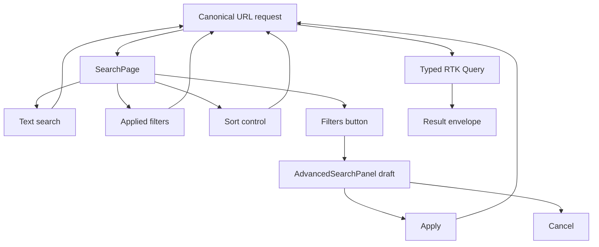

# Advanced search request, index, URL, and interaction design

## 1. Product contract

Advanced search combines one optional discovery query with zero or more structured constraints:

- free text using current prefix/fuzzy behavior;
- current legacy `#tag` or `tag:` discovery syntax;
- exact tag filters with explicit `all` or `any` semantics;
- one or more vault-relative folder prefixes;
- an inclusive date range over display, created, or updated date;
- relevance, newest, or oldest sorting;
- bounded offset pagination.

A request is effective when it has non-empty text or at least one structured filter. Filter-only requests are valid.

Version 1 does not include arbitrary frontmatter key/value filters, query-language parentheses, user-defined field names, saved searches, or facets. These can extend the typed request later without making the first implementation a general expression parser.

## 2. One typed request across layers

The Go search package should replace positional growth with a request object:

```go
type TagMode string
const (
    TagModeAll TagMode = "all"
    TagModeAny TagMode = "any"
)

type DateField string
const (
    DateFieldDisplay DateField = "display"
    DateFieldCreated DateField = "created"
    DateFieldUpdated DateField = "updated"
)

type SearchSort string
const (
    SearchSortRelevance SearchSort = "relevance"
    SearchSortNewest    SearchSort = "newest"
    SearchSortOldest    SearchSort = "oldest"
)

type SearchRequest struct {
    Query        string
    Tags         []string
    TagMode      TagMode
    PathPrefixes []string
    DateField    DateField
    DateFrom     *civil.Date
    DateTo       *civil.Date
    Sort         SearchSort
    Limit        int
    Offset       int
}

type SearchResponse struct {
    Results []SearchResult `json:"results"`
    Total   uint64         `json:"total"`
    Limit   int            `json:"limit"`
    Offset  int            `json:"offset"`
    Sort    SearchSort     `json:"sort"`
}
```

The exact date-only type may be a local `DateOnly` rather than a new dependency. It must parse, validate, add one calendar day, and format `YYYY-MM-DD` without inheriting local timezone behavior.

Validation and normalization belong in pure functions before Bleve query construction:

```go
func NormalizeSearchRequest(raw SearchRequest) (SearchRequest, []FieldError)
func (si *Index) SearchAdvanced(request SearchRequest) (SearchResponse, error)
```

The static implementation should use a structurally equivalent TypeScript type generated manually or from a future schema. Version 1 can keep manual types if cross-language JSON fixtures pin the contract.

## 3. HTTP endpoint strategy

Keep `GET /api/search?q=...` as the documented legacy endpoint during one compatibility window. It continues to return a bare `SearchResult[]` and delegates to `SearchAdvanced` with the current limit of 30.

Add:

```http
GET /api/search/advanced
```

It returns the envelope and accepts:

| Parameter | Cardinality | Default | Validation |
|---|---:|---|---|
| `q` | one | empty | trim; bounded UTF-8 length |
| `tag` | repeated | none | normalized exact tags; bounded count/length |
| `tag_mode` | one | `all` | `all` or `any` |
| `path` | repeated | none | normalized vault-relative folder prefix |
| `date_field` | one | `display` when range exists | display/created/updated |
| `date_from` | one | open | strict `YYYY-MM-DD` |
| `date_to` | one | open | strict `YYYY-MM-DD`; must be >= from |
| `sort` | one | relevance if q exists, otherwise newest | relevance/newest/oldest |
| `limit` | one | 30 | 1–100 |
| `offset` | one | 0 | 0–10,000 |

Repeated singleton parameters are rejected rather than taking first or last. Unknown parameters should be rejected in advanced mode so misspelled filters do not produce unexpectedly broad results.

### Why a second endpoint

Changing the existing route from a bare array to an envelope would break current frontend bundles, scripts, and untracked clients during deployment order differences. The second route is not a second search implementation: both handlers call the same typed search method. It creates an explicit contract boundary and a removable legacy adapter.

The primary guide should require a follow-up deprecation decision rather than leaving both routes indefinitely.

## 4. Error contract

Invalid requests return HTTP 400:

```json
{
  "error": {
    "code": "invalid_search_request",
    "message": "One or more search parameters are invalid.",
    "fields": [
      {
        "field": "date_to",
        "code": "before_date_from",
        "message": "date_to must be on or after date_from"
      }
    ]
  }
}
```

Rules:

- field names and finite codes are stable;
- messages are suitable for users but are not the machine contract;
- values are not echoed when they could expose private queries to logs;
- backend/index failures return 500 with `search_unavailable`;
- canceled requests do not log as server errors;
- the frontend renders invalid URL filters and offers “Reset filters” rather than silently deleting them.

## 5. Field representation

Preserve current analyzed discovery fields and add exact metadata fields:

| Field | Type | Stored | Purpose |
|---|---|---:|---|
| `title` | analyzed text | yes | existing text search/display |
| `body` | analyzed text | no | existing text search |
| `tags` | analyzed text | yes | existing `#tag` prefix/fuzzy discovery |
| `excerpt` | text | yes | result display |
| `tags_kw` | keyword array | no | exact all/any tag filters |
| `path` | keyword | yes | result breadcrumb/display |
| `path_kw` | keyword lowercase slash path | no | exact prefix filtering |
| `created_at` | datetime | yes | created range and result reconstruction |
| `updated_at` | datetime | yes | updated range and result reconstruction |
| `display_at` | datetime | yes | default range and date sorts |
| `date_kind` | keyword | yes | created/updated result label |
| `date_precision` | keyword | yes | date/timestamp formatting |

`tags_kw` should contain normalized exact values as an array; do not join it into one string. `path_kw` uses `/` separators, strips a leading `./` or `/`, rejects traversal, collapses duplicate separators, and case-folds consistently with slug behavior. `path` preserves display spelling.

The local filter-composition probe proves Bleve v2.6.0 behavior for:

- exact term query against a keyword array;
- conjunction of two exact tags;
- disjunction of exact tags;
- prefix query over a keyword path;
- conjunction of exact tag and datetime range.

Expected IDs are retained in `artifacts/date-probe/bleve-filter-composition.json`.

## 6. Query construction

Build one query tree from independent clauses.

```text
buildSearchQuery(request):
    clauses = []

    if request.query is legacy #tag or tag: syntax:
        clauses += current analyzed tag discovery query
    else if request.query is not empty:
        clauses += current text query builder

    if request.tags is not empty:
        exactTagQueries = TermQuery(tag).field(tags_kw) for each tag
        if tag_mode == all:
            clauses += Conjunction(exactTagQueries)
        else:
            clauses += Disjunction(exactTagQueries)

    if request.pathPrefixes is not empty:
        pathQueries = PrefixQuery(path).field(path_kw) for each path
        clauses += Disjunction(pathQueries)

    if request has date range:
        clauses += DateRange(fieldFor(date_field), inclusive start, exclusive next-day end)

    if clauses is empty:
        return MatchAllQuery
    if clauses has one item:
        return clauses[0]
    return Conjunction(clauses)
```

Categories combine with AND. Multiple path prefixes combine with OR because one file cannot normally live under two distinct folder prefixes. Tags use explicit all/any mode.

### Examples

```text
q=memory
AND tag=go
AND (path=research/ OR path=projects/)
AND display_at in [2024-01-01, 2025-01-01)
```

```text
(tag=go OR tag=rust)
AND created_at >= 2024-01-01
```

Filter-only requests use `MatchAllQuery` plus structured clauses; they are not blocked by the current two-character frontend threshold.

## 7. Exact tag normalization

Exact filter values should normalize as follows:

```text
trim surrounding whitespace
remove one optional leading #
Unicode-aware lower-case/case-fold according to existing tag policy
reject empty
reject control characters
preserve slash and hyphen used by Obsidian tags
stable de-duplicate while preserving first occurrence
```

The design must not reuse fuzzy matching for exact filters. A selected `go` chip must not match `golang`. Current `#go` discovery may continue to use prefix behavior for compatibility.

Limits recommended for version 1:

```text
maximum tags: 20
maximum tag UTF-8 bytes: 128
maximum path prefixes: 10
maximum path UTF-8 bytes: 512
maximum q UTF-8 bytes: 1024
```

These limits bound query tree size and error surfaces. They are API limits, not Prometheus labels.

## 8. Path semantics

A path filter represents a folder prefix, not an arbitrary glob.

Canonical URL examples:

```text
path=Research/KB/
path=Projects/2026/
```

Normalization:

```text
"Research\\KB" -> "research/kb/"
"/Research/KB/" -> "research/kb/"
"Research/../Private" -> invalid
```

The trailing slash is required in the canonical internal prefix to prevent `research/go` from matching `research/golang-notes.md` when the user selected folder `Research/Go/`.

The UI obtains available folders from the existing file tree. It sends canonical vault-relative prefixes, not localized labels. Multiple selected folders are OR alternatives.

## 9. Sorting and pagination

### Relevance

Use explicit sort order:

```go
req.SortBy([]string{"-_score", "_id"})
```

This pins deterministic ordering for equal scores.

### Newest and oldest

```go
newest: []string{"-display_at", "_id"}
oldest: []string{"display_at", "_id"}
```

Missing dates sort last. If Bleve's default missing-field order does not satisfy this in the implementation experiment, split dated and undated retrieval or use a stored presence field; do not leave behavior implicit.

### Pagination

Version 1 uses bounded offset pagination because the endpoint and result set are small and Bleve already accepts size/from. The response returns `total`, `limit`, and `offset`. The UI shows Load More or Previous/Next; it does not render thousands of cards at once.

Offset is capped at 10,000. A future cursor can encode internal sort values, but those values are opaque and require versioning/signing before becoming public.

## 10. Canonical URL

The browser URL is the committed search source of truth.

Example:

```text
/search?q=memory&tag=go&tag=performance&tag_mode=all&path=Research%2F&date_field=display&date_from=2024-01-01&date_to=2024-12-31&sort=newest
```

Canonicalization rules:

1. Emit parameters in fixed key order.
2. Emit repeated tags and paths sorted after normalization.
3. Omit empty values.
4. Omit `tag_mode=all` when tags are absent; include it when tags are present for shareable explicitness.
5. Emit `date_field` only when a range is present.
6. Emit effective sort explicitly so a shared URL does not change if defaults evolve.
7. Omit default `limit=30` and `offset=0`.
8. Reset offset to zero whenever query/filter/sort changes.
9. Use `URLSearchParams`; never hand-concatenate `#` or raw path values.

Pure functions:

```ts
export function decodeSearchParams(params: URLSearchParams): DecodeResult<SearchRequest>;
export function encodeSearchParams(request: SearchRequest): URLSearchParams;
export function canonicalizeSearchRequest(request: SearchRequest): SearchRequest;
```

Round-trip invariant:

```text
decode(encode(canonical(request))) == canonical(request)
```

The frontend should remove committed `searchQuery` from Redux or stop treating it as an independent source. A component-local draft string is sufficient for debounce; the committed request comes from URL decoding.

## 11. RTK Query contract

Replace `builder.query<SearchResult[], string>` for the advanced page with:

```ts
searchAdvanced: builder.query<SearchResponse, SearchRequest>({
  query: (request) => ({
    url: `/api/search/advanced?${encodeSearchParams(request)}`,
  }),
  serializeQueryArgs: ({ endpointName, queryArgs }) =>
    `${endpointName}:${encodeSearchParams(canonicalizeSearchRequest(queryArgs))}`,
})
```

Static mode calls `staticSearchAdvanced(request)` and returns the same envelope. Canonical arguments prevent equivalent tag orderings from creating duplicate cache entries.

Keep the old `useSearchQuery(string)` only for legacy consumers during the compatibility window. `SearchPage` migrates fully to the typed hook.

## 12. Static search semantics

Static mode cannot reproduce Bleve score exactly. It must reproduce:

- date resolution;
- exact tag all/any inclusion;
- path prefix inclusion;
- date range inclusion;
- filter-only requests;
- newest/oldest ordering and ID tie-break;
- limits, offsets, and total count;
- legacy `#tag` inclusion behavior as currently documented.

Text ranking may remain implementation-specific. The response should not promise score comparability between modes.

Shared JSON fixtures should contain normalized notes and requests with expected ordered IDs for all filter/sort cases. Go and TypeScript tests consume the same fixtures.

## 13. Interaction model

The SearchPage header gains:

- existing search field;
- **Filters** button with active count;
- sort select;
- applied-filter chip row;
- result count and pagination state.



### Advanced panel fields

1. **Tags**: searchable multi-select populated from `/api/tags`; mode control “Match all” / “Match any.”
2. **Folders**: tree-backed multi-select; selected folders are OR alternatives.
3. **Date**: field select (Display/Created/Updated), From and To native date inputs.
4. **Sort**: Relevance/Newest/Oldest, mirrored in header.
5. **Reset**: clears draft filters but does not commit until Apply.

Desktop uses the existing Dialog primitive at a bounded width. Narrow screens use the same accessible Dialog content styled as full viewport/bottom sheet; avoid introducing a second semantic component until the design system has a Drawer primitive.

## 14. Draft, apply, cancel, and browser history

Opening the panel copies the committed request into local draft state.

- Editing fields changes only the draft.
- Apply validates, writes the canonical URL, resets offset, and closes.
- Cancel discards the draft and closes.
- Escape is equivalent to Cancel.
- Reset changes the draft; “Clear all” outside the dialog commits immediately after confirmation is unnecessary because filters are visible chips.
- Removing a chip commits immediately with `replace: false` so Back restores the prior search.

Text typing may use `replace: true` after debounce to avoid one history entry per keystroke. Applying filters and changing sort should use `push` (`replace: false`) because those are deliberate navigable states.

Back/forward causes URL decode and request execution; no effect should copy stale Redux state over the URL.

## 15. Applied filter chips

Each chip states its meaning:

```text
Tag: go
Tag: performance
Tags: match all
Folder: Research/KB
Display date: 2024-01-01 – 2024-12-31
Sort: newest
```

Chips are buttons with accessible remove labels such as `Remove tag filter go`. The tag-mode chip is shown only when two or more tags make the mode meaningful. Date endpoints can be one combined chip so removing it clears field/from/to together.

An always-visible “Clear filters” control appears when any structured filter is active. It preserves text query unless labeled “Clear search.”

## 16. Result cards

Search results pass:

```tsx
<NoteCard
  slug={result.slug}
  title={result.title}
  excerpt={result.excerpt}
  tags={result.tags}
  path={result.path}
  date={result.date}
/>
```

Recommended card metadata order:

1. title;
2. excerpt;
3. path breadcrumb, when useful;
4. up to three tags;
5. labelled created/updated date aligned consistently.

Date markup:

```tsx
{date && (
  <span>
    {date.kind === "updated" ? "Updated" : "Created"}{" "}
    <time dateTime={date.value}>{formatCanonicalDate(date)}</time>
  </span>
)}
```

Do not format a missing date as “Unknown” on every card; omission reduces noise. The advanced filter UI can explain that notes without authored dates are excluded from ranges.

## 17. UI states

The page must render distinct states:

| State | Behavior |
|---|---|
| No text, no filters | Existing tag discovery plus invitation to open filters |
| Filter-only request | Execute immediately; do not require two text characters |
| Debouncing text | Keep prior results and show subtle pending state |
| Initial loading | Labelled progress region; no false empty state |
| Success with results | Cards, total, sort, pagination |
| Success empty | Explain active criteria and offer clear/edit actions |
| Invalid URL | Field errors, retain URL, Reset filters action |
| Backend unavailable | Error message and Retry; preserve criteria |
| Partial page beyond total | Canonicalize/reset offset or show no-page recovery |

RTK Query's `isLoading`, `isFetching`, and `error` should not collapse into one spinner.

## 18. Accessibility and keyboard behavior

- Filters button exposes `aria-haspopup="dialog"` and active count in accessible text.
- Dialog has visible title and description.
- Tag mode is a fieldset with legend and radio controls.
- Every date input has an explicit label; errors use `aria-describedby`.
- Focus moves into the dialog and returns to the opener.
- Escape cancels draft changes.
- Applied chips are keyboard buttons, not clickable spans.
- Result cards remain keyboard activatable; tag child buttons must stop propagation.
- Loading and result counts use restrained `aria-live="polite"` regions.
- Error summary receives focus after failed Apply.
- Do not rely on color to distinguish active filters or invalid fields.

## 19. Responsive behavior

Desktop:

```text
[ Search input                         ] [Filters 3] [Newest]
[Tag: go ×] [Folder: Research ×] [Date: 2024 ×] [Clear filters]
----------------------------------------------------------------
results
```

Narrow screens:

```text
[ Search input                            ]
[Filters 3] [Newest]
[ horizontally wrapping chips ]
------------------------------------------
results
```

The advanced dialog uses full available width and scrollable content. Apply/Cancel actions remain sticky at the bottom. The result list must not be horizontally displaced by a permanent filter sidebar.

## 20. Security, privacy, and observability

- Reject path traversal and control characters before query construction.
- Bound counts, lengths, limits, and offsets.
- Never interpolate user input into Bleve query-string syntax; construct typed query objects.
- Do not log raw query, tag, or path values in production metrics.
- Metrics may count result class, finite sort value, finite date-field value, filter presence booleans, and latency.
- Avoid labels for tags, paths, dates, or query strings.
- Trace annotations may include `tag_count`, `path_count`, `has_date_range`, `limit`, and result count if cardinality remains bounded/quantized.
- The response must not expose hidden notes because only published notes enter the snapshot index.

## 21. Decision records

### DR-3: typed query parameters over a free-form advanced grammar

**Context.** Advanced search needs composition and shareable URLs.

**Options.** Extend free text with operators; accept structured query parameters; accept POST JSON only.

**Decision.** Use typed repeated GET parameters and a typed request object. Preserve existing `#tag` discovery syntax as text behavior.

**Rationale.** Parameters are inspectable, URL-shareable, independently validated, and straightforward in static mode. A grammar introduces quoting, precedence, escaping, error-location, and parser security work beyond requested filters.

**Consequences.** URLs can be longer but remain bounded. A future grammar can compile into the same request object.

**Status.** Proposed.

### DR-4: exact metadata fields beside analyzed discovery fields

**Context.** Current tags are analyzed and fuzzy/prefix searched.

**Decision.** Keep `tags`; add `tags_kw` and `path_kw` keyword fields.

**Rationale.** Discovery and filtering have different semantics. One mapping cannot provide both without ambiguity.

**Consequences.** Index size increases and must be measured. Current `#tag` behavior remains stable.

**Status.** Proposed.

### DR-5: versioned advanced endpoint with one search implementation

**Context.** Existing GET returns a bare array.

**Decision.** Add `/api/search/advanced` envelope; make legacy `/api/search` an adapter to the same typed method for a documented compatibility window.

**Rationale.** Enables total, pagination, and errors without deployment-order breakage.

**Consequences.** Two HTTP routes exist temporarily; tests must prove they share query behavior.

**Status.** Proposed.

## 22. Acceptance examples

### Text plus exact tags and date

```http
GET /api/search/advanced?q=memory&tag=go&tag=performance&tag_mode=all&date_from=2024-01-01&date_to=2024-12-31&sort=newest
```

### Filter-only folder search

```http
GET /api/search/advanced?path=Research%2FKB%2F&sort=newest
```

### Exact any-tag search

```http
GET /api/search/advanced?tag=go&tag=rust&tag_mode=any&sort=newest
```

### Legacy discovery preserved

```http
GET /api/search?q=%23phi
```

continues to use current analyzed tag prefix behavior.

## 23. Review risks

- Do not parse user parameters with Bleve's query-string parser.
- Do not index exact tags as one joined keyword string.
- Do not treat multiple folder prefixes as AND.
- Do not let Redux overwrite browser back/forward URL state.
- Do not silently drop invalid shared-URL parameters.
- Do not let filter-only searches trigger the old “type two characters” branch.
- Do not expose opaque Bleve sort bytes as public cursor/date values.
- Do not promise score parity between Bleve and static search.
- Do not add unbounded facets before measuring their query/index cost.
